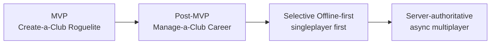

# MVP Scope

This is the canonical MVP scope definition. If another current note makes the
MVP sound broader, prefer this note and the linked successor decisions.

## MVP thesis

The MVP proves that a mobile-first, IP-clean football manager can deliver an
addictive **Create-a-Club Roguelite** loop with credible match, squad, economy
and narrative foundations. It is **hybrid-online and offline-ready**, not a
fully offline-first domain system.

The long-term product goal remains larger: selective offline-first singleplayer,
Manage-a-Club Career, server-authoritative async multiplayer, export/import and
long-save depth. The MVP must not block those futures.

## Included in MVP

| Area | MVP decision |
|---|---|
| First playable mode | **Create-a-Club Roguelite** only. |
| Career mode | Visible as **"comes later"**; not playable in MVP. |
| Runtime authority | Server-confirmed / online-authoritative progression. |
| Local persistence | Dexie / IndexedDB for app-shell metadata, read caches, drafts, UI state and future export/sync staging. |
| Offline behavior | App shell, static assets, safe cached read models and local drafts. |
| Online-required behavior | Save creation/commit, day/week advancement, match resolution, finance/economy mutations and any competitive or authoritative effect. |
| Core systems | Weekly heartbeat, fictional club creation, basic squad, tactics, first match loop, Club Economy MVP pillar, feed-card guidance. |
| Future seams | Versioned contracts, precondition-aware commands, freshness metadata, save-envelope design and storage abstractions. |

## Explicitly out of MVP

| Area | Timing |
|---|---|
| Full offline-first gameplay / local-authoritative domain model | Phase 2+ selective offline, singleplayer first. |
| Manage-a-Club Career | Post-MVP, first-class mode on the same simulation core. |
| Async multiplayer private groups | Post-MVP, always server-authoritative. |
| Watch parties and P2P transfer negotiation | Post-MVP multiplayer/social layers. |
| User-facing save export/import | Post-MVP, but contract and data boundaries are reserved from day one. |
| Complex sync conflict engine | Post-MVP, only after real flows justify it. |
| Community pack marketplace / hosted sharing | Post-MVP. |

## Mode sequencing

- The simulation core is shared across modes.
- Create-a-Club Roguelite drives the first playable because it gives a strong
  repeatable loop, natural failure stakes and staged teaching.
- Manage-a-Club Career remains visible in onboarding as "comes later" so the
  long-term promise is clear without expanding MVP scope.

## Offline-ready scope matrix

| Capability | MVP offline behavior | Future path |
|---|---|---|
| App launch / shell | Cached and usable. | Keep improving update and install UX. |
| Static rules/help/copy | Cached where safe. | Versioned content caches. |
| Read-only dashboards | Last confirmed data may be shown as stale. | Richer read-model cache + refresh policy. |
| Tactics/training/lineup drafts | Draft saved locally; not final. | Queued intents with server/local validation. |
| Day/week advancement | Requires connection. | Local-authoritative singleplayer adapter. |
| Match resolution | Requires server-confirmed command in MVP. | Client Worker local authority for singleplayer. |
| Economy week / ledger | Requires server-confirmed command in MVP. | Future local-authoritative singleplayer adapter with replayable ledger checks. |
| Save export/import | Not user-facing. | Use reserved envelope/versioning contract. |
| Multiplayer effects | Not in MVP; future server-confirmed only. | Draft/intents only; never offline-finalised. |

## Future-proofing invariants

- Domain commands, queries, events and save snapshots stay JSON-serialisable and
  versioned.
- Server command handlers are idempotent and precondition-aware so queued
  intents can be added later.
- Read models carry freshness/sync metadata where relevant:
  `fetchedAt`, `version`/`etag`, `isStale`, `lastConfirmedAt`.
- Draft records have explicit status: `draft`, `submitting`, `confirmed`,
  `rejected`.
- Repository and query-gateway contracts must not assume "server-only forever";
  singleplayer can gain a local-authoritative adapter later.
- Dexie / IndexedDB remains the only browser persistence primitive. Do not use
  `localStorage` for game state, caches or drafts.
- Export/import envelope and migration expectations are designed from the
  beginning even though the user-facing feature ships later.

## Acceptance criteria for implementation beats

A future implementation beat is MVP-aligned only if it:

- advances the Create-a-Club Roguelite first playable;
- keeps Career, multiplayer and full offline-first as future-ready seams rather
  than hidden dependencies;
- distinguishes cached/draft state from confirmed authoritative state in UX;
- updates the relevant ADR/GDDR/feature note in the same PR; and
- does not introduce one-way storage, contract or UI choices that block
  selective offline, export/import or server-authoritative multiplayer later.

## Related

- [[Current-State]] — active hot-memory summary
- [[Project-Goals]] · [[Vision]] · [[Non-Goals]] — product boundaries
- [[Decision-Log]] · [[../10-Architecture/09-Decisions/ADR-0020-hybrid-online-mvp-offline-ready]] — architecture decision
- [[../50-Game-Design/GD-0017-mvp-scope-and-mode-sequencing]] — game-design sequencing
- [[../20-Features/feature-roguelite-mvp-first-playable]] — first playable feature slice
- [[../20-Features/feature-club-economy-mvp-pillar]] — draft Economy MVP pillar
