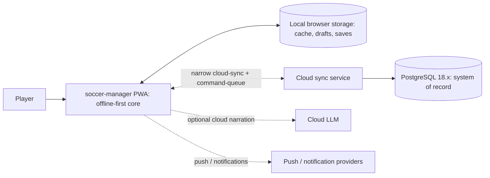

# Context

The system context is intentionally narrow: the **offline-first PWA client is the
core**, and every external touchpoint is a deliberately scoped, optional seam —
not a runtime dependency.

## External touchpoints

- **Cloud sync** — a narrow save-sync + command-queue seam, not full replication;
  scope and conflict resolution are fixed by
  [[09-Decisions/ADR-0090-offline-sync-scope-and-conflict-strategy]]. The client
  remains fully playable offline when this is unavailable.
- **Cloud LLM (optional)** — used only for flavour narration and kept **out of
  authoritative game state**
  ([[09-Decisions/ADR-0030-llm-out-of-authoritative-state]]). A deterministic,
  template-based offline narration floor guarantees narration without the cloud
  ([[../50-Game-Design/GD-0037-offline-narration-tier-on-device-webgpu]]).
- **Push / notification providers** — external delivery only, with an
  offline-delivery clause so notifications degrade gracefully without
  connectivity
  ([[09-Decisions/ADR-0102-notification-platform-re-ratification-offline-delivery-clause]]).

This is a context view (system boundary and external actors), not a building-block
view; the internal 28-context decomposition lives in
[[bounded-context-map]] and [[05-Building-Blocks]].

## Related

- [[09-Decisions/ADR-0090-offline-sync-scope-and-conflict-strategy]] — narrow cloud-sync seam · [[09-Decisions/ADR-0030-llm-out-of-authoritative-state]] — LLM boundary · [[09-Decisions/ADR-0102-notification-platform-re-ratification-offline-delivery-clause]] — notification delivery
- [[../50-Game-Design/GD-0037-offline-narration-tier-on-device-webgpu]] — offline narration floor · [[09-Decisions/ADR-0027-postgres-data-model]] — PostgreSQL data model
- [[06-Runtime]] — runtime view · [[01-Introduction]] · [[04-Solution-Strategy]] — arc42 siblings
- [[modules/db-schema]] — schema package
