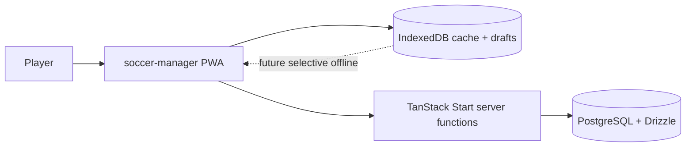

# Context

```mermaid
flowchart LR
  Player[Player] --> PWA[soccer-manager PWA]
  PWA --> IndexedDB[(IndexedDB cache + drafts)]
  PWA --> Start[TanStack Start server functions]
  Start --> Postgres[(PostgreSQL + Drizzle)]
  IndexedDB -. future selective offline .-> PWA
```
## Related

- [[01-Introduction]]
- [[04-Solution-Strategy]]
- [[06-Runtime]]
- [[09-Decisions/ADR-0020-hybrid-online-mvp-offline-ready]]
