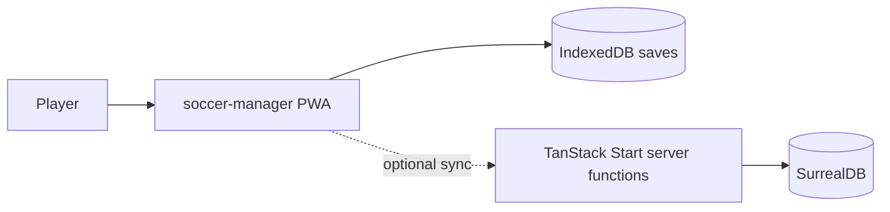

# Context

## Related

- [[09-Decisions/ADR-0002-offline-first]] — IndexedDB-first decision · [[09-Decisions/ADR-0004-data-model]] — SurrealDB model
- [[06-Runtime]] — runtime view · [[01-Introduction]] · [[04-Solution-Strategy]] — arc42 siblings
- [[modules/db-schema]] — schema package
