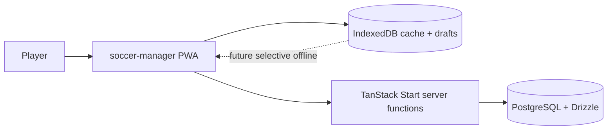

# Context

## Related

- [[09-Decisions/ADR-0020-hybrid-online-mvp-offline-ready]] — hybrid-online MVP · [[09-Decisions/ADR-0027-postgres-data-model]] — PostgreSQL data model
- [[06-Runtime]] — runtime view · [[01-Introduction]] · [[04-Solution-Strategy]] — arc42 siblings
- [[modules/db-schema]] — schema package
