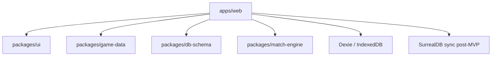

# Building Blocks

## Modules

Each module has a note with Purpose / Owns / Inputs / Outputs / Invariants /
Dependencies. A new module requires a `module.md`
([[../90-Meta/templates/module]]); architecture-relevant changes update it
(see [[../90-Meta/vault-governance]]).

- [[modules/web]] — TanStack Start PWA shell
- [[modules/ui]] — shared React components
- [[modules/game-data]] — IP-clean generated content
- [[modules/db-schema]] — schema + Zod mirrors
- [[modules/match-engine]] — deterministic simulation
