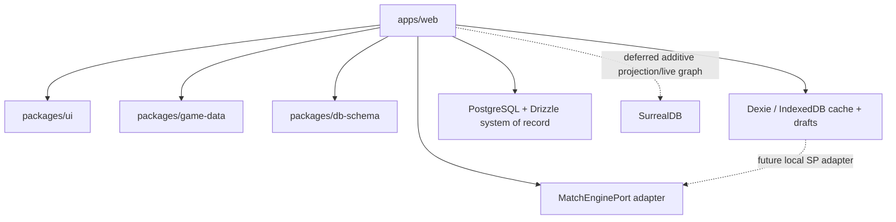

# Building Blocks

The application is a **modular monolith** with eleven bounded contexts,
primarily implemented in TypeScript. Each context owns its domain logic, state
machine(s), storage isolation, and contracts (commands / queries / domain
events). The match engine is deliberately behind a runtime-neutral port so it
can move to Rust without changing caller contracts.

FMX-13 adds a second load-bearing domain port: Club Management owns the
accounting ledger and economy read models behind
[[09-Decisions/ADR-0050-club-economy-accounting-ledger]]. Finance remains inside
Club Management, not a shared utility package.

FMX-16 proposes a future twelfth bounded context, **Manager & Legacy**, behind
[[09-Decisions/ADR-0051-manager-and-legacy-context]]. Until that ADR is accepted,
it is planning context only: the MVP should preserve run-analysis hooks without
shipping the full meta-progression system.

> Authority: [[09-Decisions/ADR-0019-modular-monolith-ddd]]. Full map at
> [[bounded-context-map]].

## High-level package layout



## Bounded context layout

```mermaid
flowchart TB
  subgraph Identity[Identity & Access]
  end
  subgraph Orch[League Orchestration]
  end
  subgraph Club[Club Management]
  end
  subgraph Squad[Squad & Player]
  end
  subgraph Training[Training]
  end
  subgraph Transfer[Transfer]
  end
  subgraph Match[Match]
  end
  subgraph WP[Watch Party]
  end
  subgraph Notif[Notification]
  end
  subgraph Sync[Offline Sync]
  end
  subgraph Audit[Audit & Security]
  end
  subgraph ManagerLegacy[Manager & Legacy (draft)]
  end

  Identity --> Orch
  Identity --> Club
  Orch --> Match
  Orch --> Transfer
  Orch --> WP
  Club --> Squad
  Squad --> Training
  Squad --> Transfer
  Squad --> Match
  Match --> WP
  Match --> Notif
  Transfer --> Notif
  Orch --> Notif
  Sync --> Identity
  Sync --> Club
  Sync --> Squad
  Sync --> Transfer
  Sync --> Match
  Audit --> Identity
  Audit --> Transfer
  Audit --> Match
  Audit --> Orch
  Orch -. run ended .-> ManagerLegacy
  Club -. economy summary .-> ManagerLegacy
  Match -. style summary .-> ManagerLegacy
```

## Source folder convention

```text
src/domain/
  identity/
  league/
  club/
  squad/
  training/
  transfer/
  match/
  watch-party/
  notifications/
  sync/
  audit/
```

Each folder owns `commands.ts`, `events.ts`, `queries.ts`,
`state-machine.ts` (if applicable), `policies.ts`, `repository.ts` and
`index.ts` (public exports only).

## Cross-cutting infrastructure

- **Transactional outbox** ([[09-Decisions/ADR-0028-postgres-transactional-outbox]])
  for same-Postgres-transaction domain-event publication.
- **Club Economy accounting ledger**
  ([[09-Decisions/ADR-0050-club-economy-accounting-ledger]]) for weekly finance
  facts, accounting projections, budget envelopes, country economy profiles and
  insolvency state.
- **Job queue + scheduler** for timers, reminders, escalation,
  auto-resolves.
- **Realtime channel** ([[09-Decisions/ADR-0023-realtime-transport]])
  for league status, notifications and watch-party signals: SSE first,
  Centrifugo when scale/presence/recovery requires it.
- **Notification platform** ([[09-Decisions/ADR-0043-notification-and-messaging-platform]])
  for inbox, preferences, delivery attempts, email, push preparation and
  offline notification projections.
- **Match worker** for server-authoritative simulation behind
  `MatchEnginePort` ([[09-Decisions/ADR-0011-server-authoritative-multiplayer]],
  [[09-Decisions/ADR-0049-swappable-spatial-event-match-engine]]).
- **Spectator service** for watch parties
  ([[09-Decisions/ADR-0015-spectator-snapshot-streaming]]).
- **Hybrid-online PWA seam** ([[09-Decisions/ADR-0020-hybrid-online-mvp-offline-ready]])
  keeps Dexie scoped to caches/drafts/staging in MVP while preserving a future
  local-authoritative singleplayer adapter.
