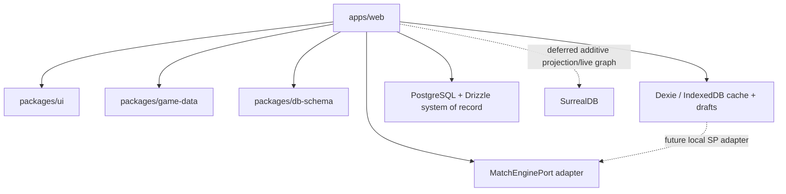

# Building Blocks

The application is a **modular monolith** with sixteen bounded contexts,
primarily implemented in TypeScript. Each context owns its domain logic, state
machine(s), storage isolation, and contracts (commands / queries / domain
events). The match engine is deliberately behind a runtime-neutral port so it
can move to Rust without changing caller contracts.

FMX-13 adds a load-bearing domain port: Club Management owns the
accounting ledger and economy read models behind
[[09-Decisions/ADR-0050-club-economy-accounting-ledger]]. Finance remains inside
Club Management, not a shared utility package.

FMX-25 / FMX-35 ratified the twelfth bounded context, **Manager & Legacy**,
on 2026-05-28 via [[09-Decisions/ADR-0051-manager-and-legacy-context]].
It owns cross-run manager identity, run analysis snapshots, style signals,
archetype candidates, legacy unlock catalog and prestige profile. The MVP
scope stays hooks-only (RunAnalysisSnapshot, ManagerStyleSignals,
PostRunReflection); full perks, legacy carry selection and prestige ladders
remain post-MVP per
[[../50-Game-Design/GD-0019-manager-archetype-roguelite-progression]].
Determinism rule: a running save must never read mutable cross-save meta
after creation.

FMX-26 / FMX-36 ratified the thirteenth bounded context, **Staff
Operations**, on 2026-05-28 via
[[09-Decisions/ADR-0053-staff-operations-context]]. It owns staff
contract lifecycle (offered → signed → active → expiring →
expired/terminated/renewed), role assignment (slot + free-role overflow),
pipeline-coverage read model spanning Recruitment / Development /
Training / Medical / Tactics / Match-Day, wage schedule and
specialisation metadata. Wage events emit to Club Management's ledger via
the canonical Customer-Supplier + Anti-Corruption Layer pattern
([[09-Decisions/ADR-0050-club-economy-accounting-ledger]]); no ADR-0050
amendment is required. Consumes People queries (ADR-0052, draft) for
actor identity when ratified; until then sources identity from own staff
roster.

FMX-28 / FMX-37 ratified the fourteenth bounded context, **Tactics**, on
2026-05-28 via [[09-Decisions/ADR-0055-tactics-context]]. It owns the
persistent tactics library: tactic presets (saved → active → archived
FSM), set-piece routine variants (drafted → published → retired FSM),
opposition templates (three-layer archetype + sub-archetype +
manager-signature model), role/duty configurations (5-layer tactical
model) and tactical-style signal aggregation. Match consumes a
`TacticSnapshot` at `lineup_locked` (canonical Reference + Snapshot
pattern - the live preset may be edited after lock without affecting the
in-flight match, mirroring Vaughn Vernon's Product Catalog vs Ordering
analogue). Training and Transfer read `RoleProfileForPosition`; Manager
& Legacy consumes `TacticalIdentityFingerprint` for archetype-style
signal aggregation per GD-0019 §MVP hook model; Staff Operations
publishes `SetPieceCoachReadinessUpdated` for routine-quality
multipliers. Cross-save preset sharing stays scoped to the FMX-33
Community Overlay Pipeline territory per
[[09-Decisions/ADR-0016-community-dataset-overrides]].

FMX-34 / FMX-40 ratified the sixteenth bounded context, **Rivalry
System**, on 2026-05-28 via
[[09-Decisions/ADR-0057-rivalry-system-context]]. It owns the
rivalry-edge graph (club pair × sub-score history × threshold-tier
FSM), the 5-sub-score emergent formula (regional + historical +
sporting + fan-incident + transfer-tension, per
[[../50-Game-Design/rivalry-system]]), deterministic per-season decay
and threshold-tier classification (None / Mild / Strong / High /
Volatile). Consumes Match `MatchResolved` for sporting sub-score,
Transfer `TransferCompleted` for transfer-tension sub-score, Fan
Ecology `FanIncidentLogged` for fan-incident sub-score, Club
Management `ClubFoundedInLocation` / `ClubRelocatedToLocation` for
regional base, and League Orchestration `SeasonAdvanced` for the
deterministic per-season decay batch. Publishes `RivalryScore` /
`IsDerbyFixture` / `TopRivalsForClub` / `RivalryIncidentTimeline` /
`RivalryGraphSnapshot` / `DerbyContext` read models +
`RivalryTierTransitioned` events to Fan Ecology (atmosphere
multiplier), Matchday-Event-Engine via Club Management (Pyro-incident
trigger), Watch Party (auto-proposal), Manager & Legacy (future
"derby specialist" archetype signal), Notification (derby copy),
Match (derby classification marker at `lineup_locked`), Tactics
(future derby-specific opposition awareness) and Regulations &
Compliance (downstream sanction chain via matchday-event-engine).
Consumers treat rivalry as external fact and apply their own policies
in their own contexts - **canonical Vaughn Vernon scoring-context
pattern** analogous to credit rating + customer affinity +
recommendation + supplier-score real-world DDD precedents (CQRS read
models + Process Manager / Saga + Domain Service). Cross-save rivalry
pre-population (era profiles + community overlays) flows through
ADR-0051 Manager & Legacy legacy seeds + ADR-0016 community overlay
surface per FMX-33 Community Overlay Pipeline; Rivalry BC owns schema
+ semantic validation per Vernon.

FMX-30 / FMX-39 ratified the fifteenth bounded context, **Regulations &
Compliance**, on 2026-05-28 via
[[09-Decisions/ADR-0056-regulations-compliance-context]]. It owns the
versioned multi-regulator rule catalog (UEFA-analogue + national
league analogue + national association analogue per regulator scope ×
competition profile × effective date), the transfer-window FSM (open
→ countdown → closing → closed), the work-permit catalog, the
sanction catalog and licence-tier facility requirements. Stock
catalogs live in `packages/game-data`; per-save active rule set is
copied into the save snapshot at creation per ADR-0051 determinism
rule (no live reading of mutable global catalog during a save).
Multi-context eligibility chains (transfer completion, squad
registration, promotion compliance) run as **Vernon's Process Manager
/ Saga** in the consuming BC: Transfer for signings, Squad & Player
for registration, League Orchestration for promotion. Regulations owns
the rule; each consumer owns its enforcement via Anticorruption Layer
(canonical Stripe Tax / Avalara Tax-catalog pattern). Community-pack
rule overrides flow through the FMX-33 Community Overlay Pipeline per
[[09-Decisions/ADR-0016-community-dataset-overrides]]; Regulations BC
owns schema + semantic validation per Vernon. IP-clean rule
terminology hardline contained in one context per
[[../50-Game-Design/GD-0015-ip-clean-data]] +
[[09-Decisions/ADR-0007-naming-schema]]; `risk:legal` discipline
applies.

FMX-23 proposes **People / Persona & Skills** behind
[[09-Decisions/ADR-0052-people-persona-and-skills-context]], and FMX-3 proposes
**Narrative** behind
[[09-Decisions/ADR-0054-narrative-context-and-ai-narration-framework]]. Both are
planning context only until ratified. People owns actor/persona truth;
Narrative owns scene/context-card assembly, fallback templates, validation,
provenance, evals and provider adapter boundaries.

> Authority: [[09-Decisions/ADR-0019-modular-monolith-ddd]]. Full map at
> [[bounded-context-map]].

## High-level package layout



## Bounded context layout

```mermaid
flowchart TB
  subgraph Identity[Identity & Access]
  end
  subgraph Orch[League Orchestration]
  end
  subgraph Club[Club Management]
  end
  subgraph Squad[Squad & Player]
  end
  subgraph Training[Training]
  end
  subgraph Transfer[Transfer]
  end
  subgraph Match[Match]
  end
  subgraph WP[Watch Party]
  end
  subgraph Notif[Notification]
  end
  subgraph Sync[Offline Sync]
  end
  subgraph Audit[Audit & Security]
  end
  subgraph ManagerLegacy[Manager & Legacy (draft)]
  end
  subgraph People[People / Persona & Skills (draft)]
  end
  subgraph Narrative[Narrative (draft)]
  end

  Identity --> Orch
  Identity --> Club
  Orch --> Match
  Orch --> Transfer
  Orch --> WP
  Club --> Squad
  Squad --> Training
  Squad --> Transfer
  Squad --> Match
  Match --> WP
  Match --> Notif
  Transfer --> Notif
  Orch --> Notif
  Sync --> Identity
  Sync --> Club
  Sync --> Squad
  Sync --> Transfer
  Sync --> Match
  Audit --> Identity
  Audit --> Transfer
  Audit --> Match
  Audit --> Orch
  Orch -. run ended .-> ManagerLegacy
  Club -. economy summary .-> ManagerLegacy
  Match -. style summary .-> ManagerLegacy
  Squad -. actor facts .-> People
  Club -. board/fan facts .-> People
  People -. actor cards .-> Narrative
  Match -. committed key events .-> Narrative
  Club -. authoritative facts .-> Narrative
  Transfer -. fixed transfer facts .-> Narrative
  Narrative -. display snapshots .-> Notif
```

## Source folder convention

```text
src/domain/
  identity/
  league/
  club/
  squad/
  training/
  transfer/
  match/
  watch-party/
  notifications/
  sync/
  audit/
  people/          # draft if ADR-0052 is accepted
  narrative/       # draft if ADR-0054 is accepted
```

Each folder owns `commands.ts`, `events.ts`, `queries.ts`,
`state-machine.ts` (if applicable), `policies.ts`, `repository.ts` and
`index.ts` (public exports only).

## Cross-cutting infrastructure

- **Transactional outbox** ([[09-Decisions/ADR-0028-postgres-transactional-outbox]])
  for same-Postgres-transaction domain-event publication.
- **Club Economy accounting ledger**
  ([[09-Decisions/ADR-0050-club-economy-accounting-ledger]]) for weekly finance
  facts, accounting projections, budget envelopes, country economy profiles and
  insolvency state.
- **Job queue + scheduler** for timers, reminders, escalation,
  auto-resolves.
- **Realtime channel** ([[09-Decisions/ADR-0023-realtime-transport]])
  for league status, notifications and watch-party signals: SSE first,
  Centrifugo when scale/presence/recovery requires it.
- **Notification platform** ([[09-Decisions/ADR-0043-notification-and-messaging-platform]])
  for inbox, preferences, delivery attempts, email, push preparation and
  offline notification projections.
- **Match worker** for server-authoritative simulation behind
  `MatchEnginePort` ([[09-Decisions/ADR-0011-server-authoritative-multiplayer]],
  [[09-Decisions/ADR-0049-swappable-spatial-event-match-engine]]).
- **Spectator service** for watch parties
  ([[09-Decisions/ADR-0015-spectator-snapshot-streaming]]).
- **Hybrid-online PWA seam** ([[09-Decisions/ADR-0020-hybrid-online-mvp-offline-ready]])
  keeps Dexie scoped to caches/drafts/staging in MVP while preserving a future
  local-authoritative singleplayer adapter.
