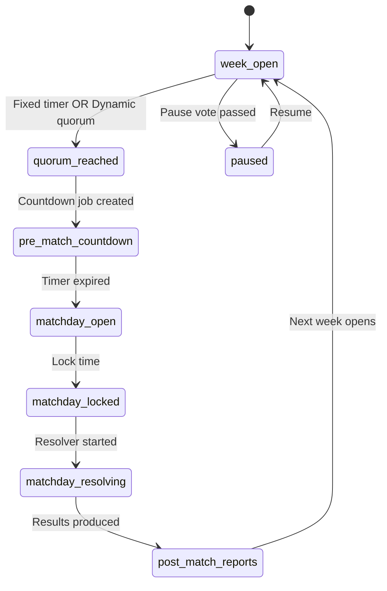
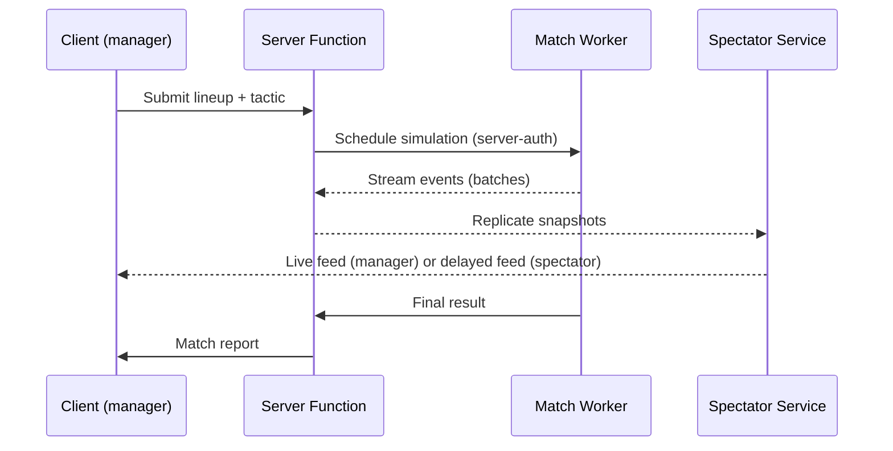
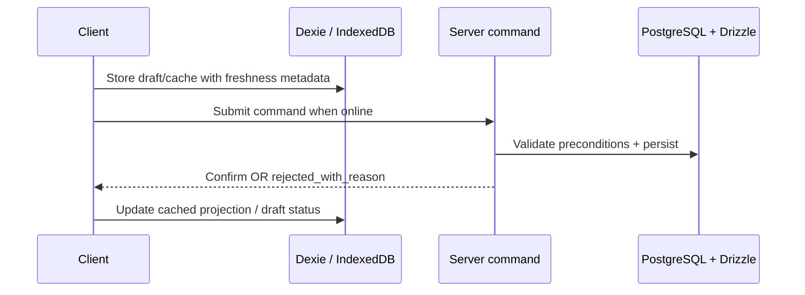

# Runtime

The MVP runtime is a **hybrid-online PWA** for the Create-a-Club Roguelite
first playable. TanStack Start handles SSR, server routes, and server
functions; PostgreSQL + Drizzle-backed server commands confirm authoritative
progression. Dexie / IndexedDB stores cached read models, drafts and local UI
state. Future
selective offline-first singleplayer can add a local-authoritative adapter
without changing public bounded-context contracts.

> Authority: [[09-Decisions/ADR-0020-hybrid-online-mvp-offline-ready]],
> [[09-Decisions/ADR-0011-server-authoritative-multiplayer]],
> [[09-Decisions/ADR-0014-state-machines]],
> [[09-Decisions/ADR-0049-swappable-spatial-event-match-engine]].

## Async week progression

Detail: [[state-machines/league-week]].

## Transfer escalation

Drives the human-to-human transfer flow with timeouts + escalation. See
[[state-machines/transfer]] and [[09-Decisions/ADR-0011-server-authoritative-multiplayer]].

## Match-day

Detail: [[state-machines/match]] and
[[09-Decisions/ADR-0015-spectator-snapshot-streaming]].

## Match worker runtime modes

FMX-10 reopens the old client-Web-Worker authority model. The match contract
must support multiple runtimes, but MVP canonical match resolution is planned as
server-authoritative unless ADR-0049 is superseded before implementation.

| Mode | Runtime | Authority | Output depth |
|---|---|---|---|
| MVP singleplayer active match | Server Match Worker behind `MatchEnginePort` | Server | `competitive-full` or `interactive-standard` by device/profile |
| MVP singleplayer background fixtures | Server Match Worker batch | Server | `background-detailed` / `background-fast` |
| Async multiplayer human-involving match | Server Match Worker | Server | `competitive-full` |
| Async multiplayer AI-vs-AI fixture | Server Match Worker batch | Server | Summary by default; deterministic full replay on demand |
| Future local preview / what-if | Client Web Worker or WASM adapter behind the same port | Non-authoritative unless future ADR/GDDR promotes it | Same event/spatial contract |
| Future selective-offline singleplayer | Local adapter behind the same port | Future decision only | Must pass replay/parity/migration gates |

The authoritative runtime is decided by the ADR-0049 TS-vs-Rust spike. A
pragmatic TypeScript implementation is allowed as a spike/reference adapter, but
the public contract must force a later engine swap. Rust-native is the default
production candidate if the spike finds no clear disadvantage. WASM remains a
future replay/sandbox adapter, not the default MVP authority.

Interactive human matches are not required to know the full result at kickoff.
They may buffer deterministic event chunks and apply substitutions, tactics and
shouts at ordered intervention points. Batch/replay paths may still simulate to
completion before playback.

## Offline-first

MVP offline behavior is app shell, cached reads and local drafts. Client writes
drafts to **Dexie / IndexedDB** but authoritative commands require network and
server confirmation. The UI must not present a draft/cache write as final.

Detail: [[09-Decisions/ADR-0020-hybrid-online-mvp-offline-ready]] +
[[09-Decisions/ADR-0013-transactional-outbox]].

Multiplayer conflicts are hard-rejected at MVP per
[[09-Decisions/ADR-0011-server-authoritative-multiplayer]]. The client shows
the new state and a redo affordance; it does not auto-rebase gameplay actions.

## Storage

- **PostgreSQL + Drizzle** (server) - canonical MVP system of record
  (schema-per-save isolation, transactional outbox). SurrealDB is deferred and
  may return only as an additive realtime/graph projection engine behind the
  [[09-Decisions/ADR-0023-realtime-transport]] interface.
- **Dexie / IndexedDB** (client) - read caches, drafts, onboarding/local UI
  state, and future local-save/export staging.

Per [[09-Decisions/ADR-0027-postgres-data-model]] and
[[09-Decisions/ADR-0005-save-format]].

## Deployment

PWA installed via Workbox manifest. Future native packaging via Capacitor
(per [[09-Decisions/ADR-0008-mobile-first-ui]]).
