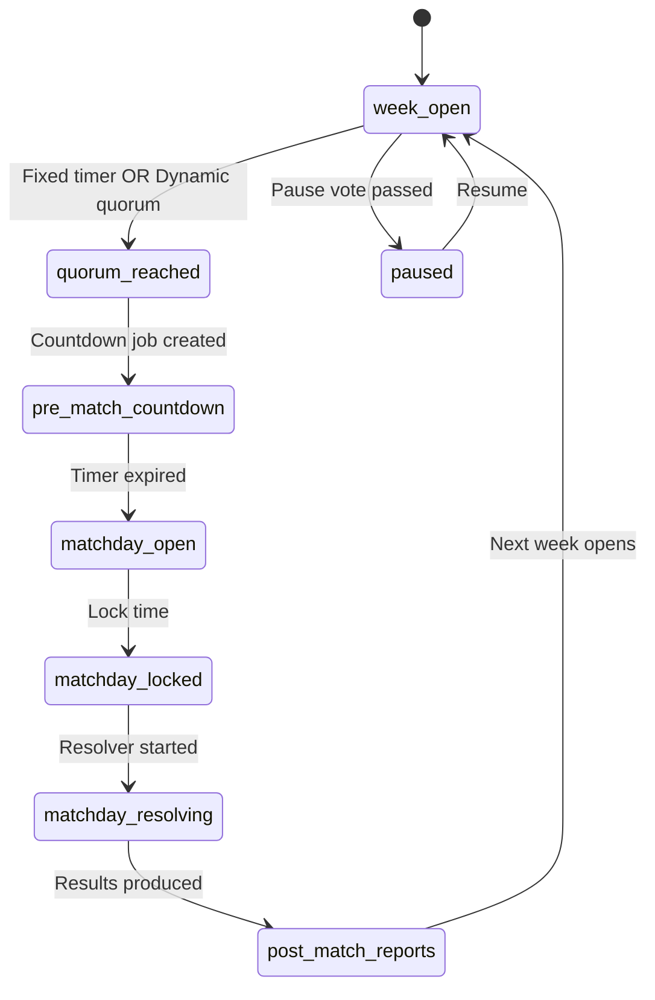
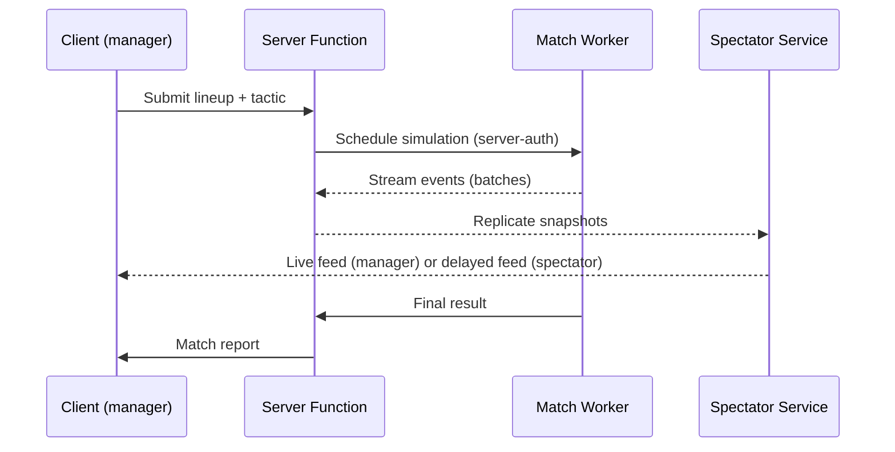
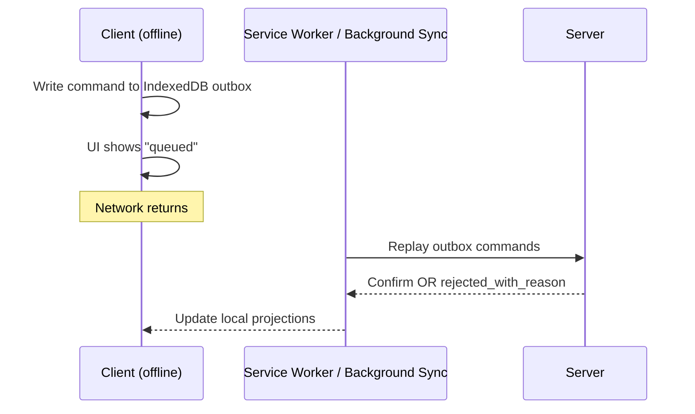

# Runtime

The runtime is an **offline-first PWA** for singleplayer, with a
**server-authoritative** backbone for async multiplayer. TanStack Start
handles SSR, server routes, and server functions; the match engine and
match-day workflows run as state-machine-driven server jobs.

> Authority: [[09-Decisions/ADR-0002-offline-first]],
> [[09-Decisions/ADR-0011-server-authoritative-multiplayer]],
> [[09-Decisions/ADR-0014-state-machines]].

## Async week progression

Detail: [[state-machines/league-week]].

## Transfer escalation

Drives the human-to-human transfer flow with timeouts + escalation. See
[[state-machines/transfer]] and [[09-Decisions/ADR-0011-server-authoritative-multiplayer]].

## Match-day

Detail: [[state-machines/match]] and
[[09-Decisions/ADR-0015-spectator-snapshot-streaming]].

## Offline-first

Client writes commands to a **local IndexedDB outbox**. On reconnect,
commands replay against the server, which validates and confirms.
Multi-state conflicts are surfaced as `rejected_with_reason` and the
client rebases.

Detail: [[09-Decisions/ADR-0002-offline-first]] +
[[09-Decisions/ADR-0013-transactional-outbox]].

## Storage

- **SurrealDB** (server) - canonical store, projections, live queries.
- **Dexie / IndexedDB** (client) - local game state, outbox, drafts.

Per [[09-Decisions/ADR-0004-data-model]] and
[[09-Decisions/ADR-0005-save-format]].

## Deployment

PWA installed via Workbox manifest. Future native packaging via Capacitor
(per [[09-Decisions/ADR-0008-mobile-first-ui]]).
