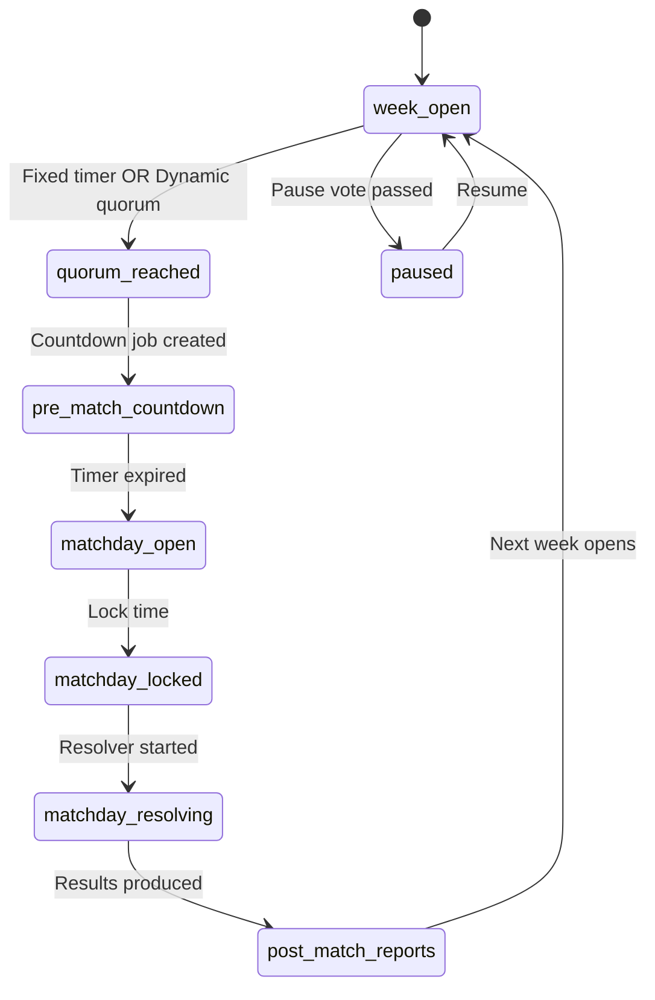
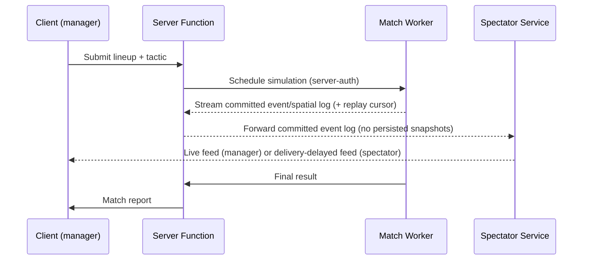
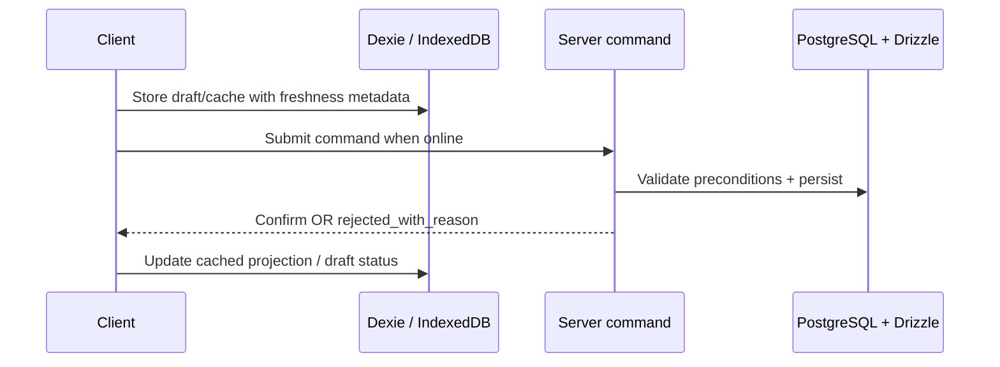

# Runtime

The MVP runtime is a **hybrid-online PWA** for the Create-a-Club Roguelite
first playable. TanStack Start handles SSR, server routes, and server
functions; PostgreSQL + Drizzle-backed server commands confirm authoritative
progression. Dexie / IndexedDB stores cached read models, drafts and local UI
state. Future
selective offline-first singleplayer can add a local-authoritative adapter
without changing public bounded-context contracts.

> Authority: [[09-Decisions/ADR-0020-hybrid-online-mvp-offline-ready]],
> [[09-Decisions/ADR-0011-server-authoritative-multiplayer]],
> [[09-Decisions/ADR-0014-state-machines]],
> [[09-Decisions/ADR-0096-match-engine-cross-runtime-determinism-numeric-surface]],
> [[09-Decisions/ADR-0090-offline-sync-scope-and-conflict-strategy]].

## Async week progression

Detail: [[state-machines/league-week]]. Both cadence modes (fixed timer and
dynamic quorum) emit the same `MatchdayOpened`
([[09-Decisions/ADR-0012-async-cadence-models]]). When a fixture has a scheduled
watch party, the matchday deadline anchor is resolved **at schedule time** from
the watch-party `broadcast_at` (a single `MatchTiming{anchorType, anchorAt}`),
and the per-fixture locks are a pure derivation of it; the anchor is immutable
once `MatchdayOpened` fires, so no mid-cycle deadline mutation occurs
([[09-Decisions/ADR-0088-async-escalation-fsm-and-watch-party-deadline-source-of-truth]]
DL1–DL4). League Orchestration owns the matchday lifecycle and lock enforcement.

## Transfer escalation

Drives the human-to-human transfer flow with timeouts + escalation. The single
`escalated` lump is replaced by a Transfer-owned **5-stage escalation FSM**
(`expired_ignored → registered_interest → unrest_requested → media_strike_threat
→ public_unrest`) driven by a hybrid pressure-accumulator with leaky-bucket
per-stage-sticky decay + hysteresis; bounded seeded variance is drawn from the
existing `TransferRng` (stream #7) with seed + draw indices persisted in
provenance, so the trajectory replays byte-identically and the no-strike-from-one-
offer gate is structural
([[09-Decisions/ADR-0088-async-escalation-fsm-and-watch-party-deadline-source-of-truth]]
ES1–ES5). See [[state-machines/transfer]] and
[[09-Decisions/ADR-0011-server-authoritative-multiplayer]].

## Match-day

The spectator service carries only **committed** `MatchEventLog` + `SpatialSample`
packets with replay cursors; it never persists or streams a `MatchFrame` or any
intermediate snapshot (`MatchFrame` stays derived-on-demand). Mid-match join is
replay/resim from the event log up to the current cursor, then live forward; the
per-viewer delay is a delivery-time transform that never enters the seeded engine.
Live spectating / watch-party is **online-only**; offline replay of one's own
completed matches is the separate resim-from-log path. Per
[[09-Decisions/ADR-0099-spectator-watch-party-streaming-over-committed-event-log]]
(SP1–SP6).

Detail: [[state-machines/match]] and
[[09-Decisions/ADR-0099-spectator-watch-party-streaming-over-committed-event-log]].

## Match worker runtime modes

FMX-10 reopens the old client-Web-Worker authority model. The match contract
must support multiple runtimes, but MVP canonical match resolution is planned as
server-authoritative. The cross-runtime determinism contract is fixed by
[[09-Decisions/ADR-0096-match-engine-cross-runtime-determinism-numeric-surface]]:
every value a committed event, summary statistic, RNG branch or replay decision
depends on is computed in **integers / fixed-point** (basis points, integer
millimetres, integer mm/s, integer cents); floating point is permitted only
downstream of the committed event log (the derived `MatchFrame` projection and
render interpolation, which are not replay-bearing). The RNG surface is the
canonical **9 streams** (not 8).

| Mode | Runtime | Authority | Output depth |
|---|---|---|---|
| MVP singleplayer active match | Server Match Worker behind `MatchEnginePort` | Server | `competitive-full` or `interactive-standard` by device/profile (byte-identical golden replay) |
| MVP singleplayer background fixtures | Server Match Worker batch | Server | `background-detailed` (statistical-envelope gate) / `background-fast` (statistical-only, never a byte-exact replay source) |
| Async multiplayer human-involving match | Server Match Worker | Server | `competitive-full` |
| Async multiplayer AI-vs-AI fixture | Server Match Worker batch | Server | Summary by default; deterministic full replay on demand |
| Future local preview / what-if | Client Web Worker or WASM adapter behind the same port | Non-authoritative unless future ADR/GDDR promotes it | Same event/spatial contract |
| Future selective-offline singleplayer | Local adapter behind the same port | Future decision only | Must pass replay/parity/migration gates |

The **per-quality-profile determinism precedence** rule applies: byte-identical
event-log golden replay is mandatory for `competitive-full` and
`interactive-standard`; `background-detailed` keeps byte parity where cheap but a
statistical envelope is the binding gate; `background-fast` is statistical-envelope
only and is never used as a byte-exact replay source. Anti-cheat, audit and
watch-party replays run only against byte-exact profiles
([[09-Decisions/ADR-0096-match-engine-cross-runtime-determinism-numeric-surface]]
D2-A).

The authoritative runtime (Rust-native + Rust→WASM replay vs single-WASM-everywhere
vs TS-first MVP) is the **open D1 fork left to Nico** in ADR-0096, resolved by the
runtime spike; the mandatory integer/fixed-point surface keeps all three swappable,
and the inconclusive-spike MVP fallback is TS-first behind the `MatchEnginePort`. A
pragmatic TypeScript implementation is allowed as a spike/reference adapter, but the
public contract must force a later engine swap. WASM remains a future replay/sandbox
adapter, not the default MVP authority.

Interactive human matches are not required to know the full result at kickoff.
They buffer deterministic event chunks and apply substitutions, tactics and shouts
at ordered intervention points. The acceptance buffer is bounded per acceptance
point by a Match-owned `InterventionBufferPolicy` value object (global cap + per-type
caps; deterministic order over `(boundaryIndex, commandId)`; subs dedup,
tactics/shouts last-write-wins); overflow or impossible commands produce a typed,
self-contained `InterventionRejected` (`BufferFull | WindowClosed |
DuplicateSuperseded | Illegal | NotExecutedInTime`) — never a silent auto-defer.
A watch-party pause stops the simulation advancing: while paused no ticks advance
and no interventions process, so the next deterministic acceptance point only
suspends; `PauseMatch`/`ResumeMatch` are fed at the same command-stream positions
on replay, never by real-time gap, and no wall-clock ever enters the seeded engine
([[09-Decisions/ADR-0087-live-match-intervention-buffer-and-pause-vote]] IB1–IB7,
PV7; pause-vote governance is owned by the Watch Party context, see
[[state-machines/watch-party]]). Batch/replay paths may still simulate to completion
before playback.

A `background-fast` fixture's matchday operating cost is settled by a
CommercialPortfolio **lightweight stateless path** that computes a coarse parametric
cost vector (collapsing the 12 cost families) with bounded seeded variance from the
existing `WorldRng:venue:<clubId>:<week>:opcost:v1` sub-label (no new top-level
stream; seed + draw indices persisted in provenance), emits exactly one
`MatchdayOperatingCostSummary` settlement fact, and Club Management posts it to the
ledger (sole writer). A later `background-detailed` re-sim with a different total
reconciles via reversal + compensating repost under a distinct upgrade idempotency
key — never mutate, never supersede-by-version
([[09-Decisions/ADR-0086-background-fast-matchday-cost-settlement]] BF1–BF11). The
settlement envelope keeps a `MoneyBand` for classification only; the exact
`amountMinor` that reaches the ledger is the collapsed/exact value, never the band
re-interpreted at post time, and the canonical four quality profiles map to a typed
`settlementPath`
([[09-Decisions/ADR-0101-settlement-value-collapse-quality-profile-insolvency-ledger-contract]]).

## Offline-first

MVP offline behavior is app shell, cached reads and local drafts. Client writes
drafts to **Dexie / IndexedDB** but authoritative commands require network and
server confirmation. The UI must not present a draft/cache write as final.

Offline Sync stays a **thin context at MVP** (Service-Worker cache + Dexie drafts +
synchronous commands) behind a mandated migration seam: a `CommandQueue` interface
between UI and transport (MVP impl sends immediately), every command carrying
`commandId` + `expectedVersion` and every projection carrying `lastSeenVersion`, a
command-oriented server API, and clients always able to rehydrate projections from
server events. The post-MVP durable outbox + conflict loop is then purely additive.
Conflict resolution for queued core game commands is **server-authoritative
re-validation + rebase**; CRDTs are confined to watch-party collaborative overlays
(separate sync channel) and last-write-wins only to cosmetic local preferences
([[09-Decisions/ADR-0090-offline-sync-scope-and-conflict-strategy]] D1-A/D2-A).

Detail: [[09-Decisions/ADR-0020-hybrid-online-mvp-offline-ready]] +
[[09-Decisions/ADR-0028-postgres-transactional-outbox]] +
[[09-Decisions/ADR-0090-offline-sync-scope-and-conflict-strategy]].

Multiplayer conflicts are hard-rejected at MVP per
[[09-Decisions/ADR-0011-server-authoritative-multiplayer]]. The client shows
the new state and a redo affordance; it does not auto-rebase gameplay actions.

## Storage

- **PostgreSQL + Drizzle** (server) - canonical MVP system of record
  (schema-per-save isolation, transactional outbox). SurrealDB is deferred and
  may return only as an additive realtime/graph projection engine behind the
  [[09-Decisions/ADR-0023-realtime-transport]] interface.
- **Dexie / IndexedDB** (client) - read caches, drafts, onboarding/local UI
  state, and future local-save/export staging.

Per [[09-Decisions/ADR-0097-postgres-scale-envelope-and-audit-canonicalisation]] and
[[09-Decisions/ADR-0098-save-format-kdf-argon2id-and-active-pack-refs]].

## Deployment

PWA installed via Workbox manifest. Future native packaging via Capacitor
(per [[09-Decisions/ADR-0008-mobile-first-ui]]).
