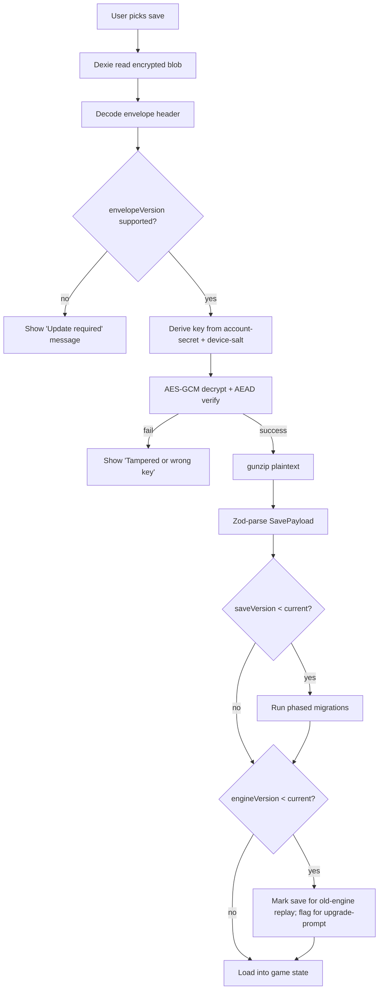
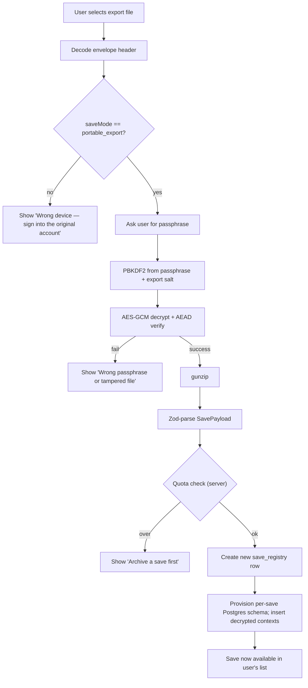

# ADR-0005: Save Format and Versioning

> **MVP SCOPE AMENDED on 2026-05-18 by
> [[ADR-0020-hybrid-online-mvp-offline-ready]].** The envelope, encryption,
> compression, versioning and migration decisions below remain the future
> save/export contract. User-facing export/import and canonical local
> save-authority implementation move after MVP. MVP code must still avoid
> storage or schema choices that block this contract.

## Status

accepted

> Ratified `accepted` 2026-06-08 in the vault-wide ratification sweep
> ([[decision-queue-2026-06-08-ratified|ledger]], PR #153); body previously read "Accepted
> (2026-05-16, gap A5 of [[../../95-Archive/gap-reports/wave-3-gap-analysis]]). MVP timing amended
> by [[ADR-0020-hybrid-online-mvp-offline-ready]].". Body status reconciled to the frontmatter
> SSOT (ADR-0092) on 2026-06-11 (FMX-143).

## Context

Saves are the user's persistent investment in the game (potentially
hundreds of in-game hours). They must be:

- **Durable** on the device (IndexedDB via Dexie, per ADR-0002).
- **Encrypted at rest** (per gap B2 of [[ADR-0011-server-authoritative-multiplayer]]).
- **Deterministically replayable** across browsers and game versions
  (per gap D8, [[../../60-Research/determinism-and-replay]]).
- **Exportable** to a file the user can email to themselves or
  upload to iCloud / Google Drive for backup.
- **Importable** with strong integrity guarantees (no silent
  tampering).
- **Versioned** so a save written in v1.0 can be loaded in v1.5
  after schema and engine evolution.

Wave-1 ADR-0005 was a 17-line stub. Wave-3 has now locked the
foundation in five upstream gaps:

- **B2** — encryption mandatory (AES-GCM 256, AEAD tag).
- **D8** — RNG state schema, integer numeric model, 12 save-
  determinism rules, engine-version pinning.
- **D14** — schema source of truth (now Drizzle `pgTable`,
  [[ADR-0027-postgres-data-model]] §3), per-save Postgres schema
  isolation.
- **A4** — soft 10 / hard 50 save quota, archive state machine,
  envelope shape sketch, Phase-2 hybrid cloud-sync direction.
- **B4** — Transactional outbox stays in the platform DB (not in
  per-save state).

Gap A5 Q&A (2026-05-16) settled the two remaining open questions:
export-passphrase model and compression algorithm.

## Decision

The save format has eleven decision rules.

### 1. Two export modes

There are exactly two ways to export a save to a file:

| Mode | Encryption key source | Use case |
|---|---|---|
| **Device backup** | Account-secret + device-salt (existing at-rest key) | Quick auto-restoring backup when signed into the same account |
| **Portable export** | User-supplied **passphrase** + per-export random salt | Shareable file (email, iCloud, give to a friend); account-independent |

UI surfaces a single "Export save" dialog with two clearly-labelled
options. The Portable export confirms with a strong warning:
*"This export is protected by a passphrase. We cannot recover it if
you forget. Share this save by sending the file and the passphrase
to your friend."*

Internal at-rest saves (in IndexedDB) always use the Device-key
scheme. Exports are an extra step on top.

### 2. Encryption — AES-GCM 256

- Algorithm: **AES-GCM 256** via Web Crypto `crypto.subtle`.
- 96-bit IV per encryption (random, per Web Crypto guidance).
- AEAD tag = integrity check. Tampering invalidates the save.
- Additional authenticated data (AAD): the envelope header bytes
  (schemaVersion, saveVersion, engineVersion, createdAt, saveMode,
  compression). This binds the header to the ciphertext.

### 3. Key derivation — PBKDF2

Two derivations, depending on mode:

**Device backup key**:

```text
deviceBackupKey = PBKDF2-SHA256(
  password   = accountSecret,
  salt       = deviceSalt,           // per-device, stored in platform DB
  iterations = 600_000,              // OWASP 2026 minimum
  keyLen     = 256 bits
)
```

**Portable export key**:

```text
portableExportKey = PBKDF2-SHA256(
  password   = userPassphrase,
  salt       = exportSalt,           // 32-byte random, stored in envelope header
  iterations = 600_000,
  keyLen     = 256 bits
)
```

Rejected alternatives:

- **Argon2id via WASM** — stronger against GPU brute force but adds
  ~30-50 KB WASM bundle for marginal gain on save files (an attacker
  needs the file *and* the cloud account or a leaked passphrase to
  attempt brute force; PBKDF2 at 600 k iterations is sufficient
  defence in 2026).
- **scrypt** — not natively supported by Web Crypto.
- **PBKDF2 at < 600 000 iterations** — below 2026 OWASP minimum.

### 4. Compression — `CompressionStream('gzip')`

Pipeline:

```text
encode:  payload(JSON) → gzip → AES-GCM-encrypt → envelope
decode:  envelope → AES-GCM-decrypt → gunzip → payload(JSON)
```

- Uses native `CompressionStream` / `DecompressionStream` (zero
  bundle cost; available cross-browser in 2026).
- Runs in a **Web Worker** to avoid blocking the UI on multi-MB
  saves.
- Expected reduction: ~70-80 % size on JSON game-state.

Envelope carries `compression: 'gzip'` so future saves can use a
different algorithm (e.g. native `CompressionStream('zstd')` when
cross-browser support arrives) without breaking old saves.

Rejected alternatives:

- **Brotli (`CompressionStream('br')`)** — unreliable Safari support
  in 2026; 5-15 % ratio gain is not worth the polyfill / detection
  complexity.
- **zstd via WASM** — best ratio + speed but 50-100 KB WASM bundle;
  gzip is enough for our payload sizes.
- **No compression** — wastes IndexedDB quota + slows export upload.

**Important**: compress THEN encrypt. The reverse leaks structure
through ciphertext entropy and is universally rejected.

### 5. Envelope shape

```ts
type SaveEnvelope = {
  // ---- Plain header (authenticated, not encrypted) ----
  envelopeVersion: 1                    // this format itself
  saveVersion: number                   // save-data schema version
  engineVersion: string                 // for deterministic replay (D8)
  saveMode: 'device_backup' | 'portable_export'
  saveId: string                        // UUIDv7
  createdAt: string                     // ISO 8601 datetime
  compression: 'gzip' | 'none'          // future: 'zstd', 'br'

  // ---- Encryption metadata (authenticated) ----
  kdfAlgo: 'pbkdf2-sha256'
  kdfIterations: 600_000
  // Only one of these two salt fields is present:
  deviceBackup?: { deviceId: string }   // for 'device_backup' mode
  portableExport?: { salt: bytes(32) }  // for 'portable_export' mode

  // ---- Encryption payload ----
  iv: bytes(12)                          // 96-bit IV (random per encrypt)
  ciphertext: bytes                      // AES-GCM(gzip(payloadJson))
  authTag: bytes(16)                     // AEAD tag (128-bit)
}
```

On the wire (export file): serialised as a single binary `.smsave`
file or base64-encoded JSON wrapper for email-friendliness (decision
deferred to E18; both forms wrap the same envelope).

### 6. Payload contents

The decrypted plaintext is a JSON object representing a single save
snapshot. Structure mirrors the per-save Postgres schema
([[ADR-0027-postgres-data-model]]):

```ts
type SavePayload = {
  manifest: {
    saveId: string                       // UUIDv7
    name: string
    leagueId: string
    mode: 'singleplayer' | 'hotseat' | 'mp_member'
    state: 'active' | 'archived'         // see §10
    seasonNumber: number
    simClock: number                     // integer seconds
  }
  rng: RngStateSnapshot                  // see §7
  identityRefs: {                        // platform-DB refs used by this save
    ownerUserId: string
    mpGroupId?: string
  }
  contexts: {
    league: LeagueContextSnapshot
    club: ClubContextSnapshot
    squad: SquadContextSnapshot
    training: TrainingContextSnapshot
    transfer: TransferContextSnapshot
    match: MatchContextSnapshot          // includes per-match events for human matches
    watchParty: WatchPartyContextSnapshot
    notifications: NotificationContextSnapshot
  }
  // Note: outbox + audit are NOT inside the save (they live in
  // platform DB `public`, per ADR-0028 + [[ADR-0027-postgres-data-model]] §1).
}
```

Each context's `*Snapshot` is the union of its typed-column
(SCHEMAFULL-governance) + `jsonb`-payload (SCHEMALESS-governance) table
rows scoped to this save ([[ADR-0027-postgres-data-model]] §4). Per
D14 §1 the platform DB's outbox/audit are explicitly excluded.

### 7. RNG state in save (per D8)

Every active RNG stream's state is part of the snapshot:

```ts
type RngStateSnapshot = {
  masterSeed: number                     // u32
  worldRng:          { stateLo, stateHi, incLo, incHi: number }
  worldAiMgmtRng:    { stateLo, stateHi, incLo, incHi: number }
  weatherRng:        { stateLo, stateHi, incLo, incHi: number }
  injuryRng:         { stateLo, stateHi, incLo, incHi: number }
  transferRng:       { stateLo, stateHi, incLo, incHi: number }
  newsRng:           { stateLo, stateHi, incLo, incHi: number }
  // Per-match streams: only present for matches in `simulating` /
  // `halftime` / `matchday_resolving` state. Completed matches have
  // their seeds in the `match` row directly (per ADR-0011 §AI policy).
  activeMatchRngs: Record<matchId, {
    coreRng: { stateLo, stateHi, incLo, incHi: number }
    aiRng:   { stateLo, stateHi, incLo, incHi: number }
  }>
}
```

This satisfies D8's "saves persist all mutable state needed to
resume deterministically" rule.

### 8. Versioning model — three independent version fields

| Field | What it versions | Bump policy |
|---|---|---|
| `envelopeVersion` | The envelope format itself (header layout, encryption metadata, AAD binding) | Bump on any envelope-shape change (rare; long-lived) |
| `saveVersion` | The save-payload data shape (context snapshots, manifest fields) | Bump on any non-additive change to SavePayload (Zod schema breaking change) |
| `engineVersion` | The match-engine simulation rules (per D8 §3.6) | Bump on any deterministic-behaviour change |

Each bump triggers its own migration path. A save with
`(envelope=1, save=14, engine=2.3.0)` is loadable by a build that
supports envelope 1 + can migrate save 14 → current + can dynamic-
import engine-v2 module for replays.

### 9. Forward-only phased migration

When `saveVersion` increases, migrations follow A4 §6.3:

1. Add the new field (migration N).
2. Backfill the new field for all loaded saves (migration N+1).
3. Switch reads + writes to the new field (code release).
4. Drop the old field (migration N+M, several releases later).

Destructive migrations live in their own forward-only numbered SQL
migration file (drizzle-kit `generate`) with a
`-- WARNING: DESTRUCTIVE` header ([[ADR-0027-postgres-data-model]] §12).

When `envelopeVersion` increases, the loader has explicit per-
version decoders. An envelope-v1 save loaded into a v2-aware build
is rewritten to v2 on next save.

When `engineVersion` mismatches the current build, replays of past
matches inside the save dynamic-import the corresponding engine
module (per D8 §3.6). No silent re-simulation under a new engine.

### 10. Save lifecycle (locked from A4 §6.1)

- States: `active` | `archived` | `deleted`.
- **Soft UX limit**: 10 active saves. UI shows
  *"You have 10 active saves. Archive one to create a new save."*
- **Server-side hard cap**: 50 saves total per user (active +
  archived).
- **Archive** is reversible (just a state flip in `save_registry`).
- **Delete** is one-way with a 30-day grace period before the per-
  save Postgres schema is dropped (`DROP SCHEMA … CASCADE`,
  [[ADR-0027-postgres-data-model]] §1). During grace the user can
  restore.

The encrypted at-rest save in IndexedDB stays as long as the
`save_registry` row references it. Drop is irreversible.

### 11. Restore flow

Loading a save:



Importing a Portable export file:



## Consequences

### Positive

- Saves are tamper-resistant by default (AEAD tag binds header to
  ciphertext).
- Two-mode export matches user mental model: "back up" vs "share".
- Industry-standard encryption parameters (AES-GCM 256, PBKDF2 600 k)
  pass any reasonable 2026 security audit.
- Compression via native API has zero bundle cost; runs in a Web
  Worker.
- Three independent version fields make migrations targeted: change
  the engine without re-encoding every save.
- Phased rename pattern survives multi-year save longevity.
- Old saves remain replayable by dynamic-importing old engine
  modules (per D8 §3.6).

### Negative

- Forgot-passphrase = lost-save for portable exports. UX must make
  this unambiguous before the user clicks "Export".
- Three version fields require disciplined bump policy and clear
  migration ownership per context.
- Multi-MB saves take some time to compress + encrypt on low-end
  Android (mitigated by Web Worker; expected ≤ 500 ms per save on
  CX22-class hardware).
- Dynamic-importing old engine modules grows the PWA bundle over
  time. Mitigation: stash old engine modules under a versioned
  cache; lazy-load only when a save needs them.

### Future

- Phase-2 cloud-sync uses the same envelope shape; the wire protocol
  adds incremental ops + checkpoint snapshots on top (per A4 §6.4).
- Argon2id can replace PBKDF2 in a later envelope-v2 if
  computational hardness becomes a real concern.
- `CompressionStream('zstd')` swap-in is trivial when cross-browser
  support arrives (header flag is already there).
- A separate "redacted export" mode for community sharing (strips
  identifying data) could be added as a third saveMode.

## Design source

Implements the approved save/career design record [[../../50-Game-Design/GD-0014-save-career-model]] and current save/offline rules in [[../../50-Game-Design/README]].

## Compliance

The following rules apply across `packages/save-format`, `src/domain/sync`,
`apps/web` save-UI components, and every command handler that touches saves:

- Saves on disk MUST be encrypted (no plaintext IndexedDB rows for
  save data).
- Encryption MUST be AES-GCM 256 via Web Crypto.
- KDF MUST be PBKDF2-SHA256 at ≥ 600 000 iterations.
- Compression MUST be `CompressionStream('gzip')` (until the
  envelope grows a new option).
- Compression MUST happen BEFORE encryption.
- The envelope's plain header bytes MUST be passed as AEAD AAD to
  AES-GCM (binds header to ciphertext).
- Every save MUST include the full RNG state snapshot for all
  active streams (per D8 §5 rule 8).
- `envelopeVersion`, `saveVersion`, `engineVersion` MUST be set
  correctly on every encode.
- Portable exports MUST require user passphrase confirmation +
  display the "forgot = lost" warning.
- The compression + encryption pipeline MUST run in a Web Worker
  (no UI thread blocking).
- All file I/O for saves MUST go through the save-format library,
  not ad-hoc JSON.parse / Dexie reads.

CI enforcement:

- Lint rule blocks `JSON.parse` of save blobs in any module outside
  `packages/save-format`.
- Test rule: every saveVersion bump has a regression test that loads
  the previous version via the migration chain and asserts state
  equality post-load.
- Test rule: a "golden saves" suite of ≥ 5 canned saves at each
  saveVersion ≥ 1 must round-trip (encode → decode → encode =
  byte-identical, modulo random IV).
- Cross-browser CI gate (Chromium-only at MVP per D8 §6) for
  encrypt/decrypt + gzip/gunzip Web Worker code paths.

## Sources

- [[ADR-0004-data-model]] → substrate now [[ADR-0027-postgres-data-model]]
  (gap A4) — envelope shape sketch, save lifecycle, Phase-2 cloud-sync
  direction.
- [[ADR-0011-server-authoritative-multiplayer]] (gap B2) —
  encryption mandate, hotseat → MP handoff, AI vs AI seed-only
  storage.
- [[../../60-Research/determinism-and-replay]] (gap D8) — RNG state
  schema, engine-version pinning, 12 save-determinism rules.
- [[../../60-Research/surrealdb-schema-patterns]] (gap D14, original
  research; substrate reworked to Postgres in
  [[ADR-0027-postgres-data-model]]) — per-save isolation, schema source
  of truth, phased rename pattern.
- [[ADR-0013-transactional-outbox]] (gap B4) — outbox lives in
  platform DB, NOT inside saves.
- Perplexity research, 2026-05-16 (gap A5). Two-question Q&A:
  export passphrase model + compression algorithm.
- OWASP 2026 password-storage cheat-sheet — PBKDF2 minimum 600 000
  iterations.
- Industry references: Bitwarden + 1Password + Obsidian Sync +
  Standard Notes + Cryptee export models.
- Wave 3 gap A5 Q&A with Nico (2026-05-16): all four
  recommendations accepted as-is.
