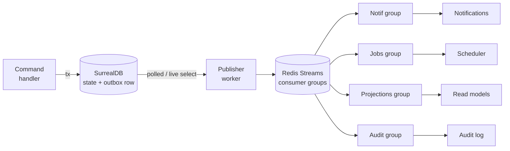

# ADR-0013: Transactional Outbox for Domain Events

> **SUPERSEDED on 2026-05-19 by [[ADR-0028-postgres-transactional-outbox]].**
> Old way: SurrealDB outbox table + Redis Streams fan-out (atomic in DB,
> at-least-once to Redis). New way: PostgreSQL outbox written in the **same
> Postgres transaction** as the domain change (strictly stronger guarantee);
> publisher learns of new rows via a **polling-floor + `LISTEN/NOTIFY` hybrid**
> (polling is the correctness floor, NOTIFY a latency hint); cold archive via
> **native declarative range partitioning** by month; fan-out via the
> [[ADR-0023-realtime-transport]] interface (SSE now, Centrifugo planned).
> The transactional-outbox *pattern* (UUIDv7 event IDs, idempotent consumers
> via `consumer_event_offset` UNIQUE, hot 60d + cold archive forever,
> outbox-is-audit-trail, lag SLOs warn>60s/>1000 + crit>300s/>10000) is
> **preserved** in [[ADR-0028-postgres-transactional-outbox]]. Kept for
> history — do not implement the SurrealDB/Redis-Streams substrate here.

## Status

Superseded (2026-05-19 by [[ADR-0028-postgres-transactional-outbox]]).
Accepted historically on 2026-05-16, gap B4 of
[[../../95-Archive/gap-reports/wave-3-gap-analysis]].

## Context

The application emits many domain events that must reach notifications,
projection updaters, scheduled jobs, the audit trail and future
extracted services (match worker, spectator service, notifications
service). Publishing events *outside* the same transaction that
changes the underlying state eventually produces the classic failure
"state changed, event lost" - missing notifications, stuck state
machines, unhappy users.

The **transactional outbox** pattern is the standard 2026 fix: write
the event row inside the same DB transaction as the state change, then
publish the event row out-of-band with retry. Cross-database 2-phase
commit is not viable on our stack (and nobody does it in 2026); the
outbox makes "atomic" hold within one DB and "at-least-once" hold
across consumers.

Gap B4 (2026-05-16) added five concrete decisions via research +
Nico's confirmation: storage backend, retention, idempotency-key
strategy, schema-versioning policy, backpressure thresholds.

## Decision

### 1. Pattern

All multi-step, multiplayer-relevant domain events are published via a
**transactional outbox** with the following pipeline:

1. Server command handler opens a SurrealDB transaction.
2. State change rows + outbox row written atomically inside that
   transaction.
3. Transaction commits.
4. A **publisher worker** reads `status='pending'` rows from the
   SurrealDB outbox table and pushes them onto **Redis Streams**.
5. **Consumer groups** on each Redis Stream fan-out to:
   - Notification service.
   - Scheduled-job service (timers, reminders, countdowns).
   - In-process projection updaters (read models).
   - Audit subscribers.
   - Future extracted services (match worker, spectator, etc.).
6. Each consumer ACKs by writing to its own
   `consumer_event_offset(consumer_name, event_id)` table; duplicates
   are skipped idempotently.
7. Publisher marks the SurrealDB outbox row `status='published'` after
   the Redis Stream write returns success.



### 2. Storage backend - SurrealDB outbox + Redis Streams (Option 2)

The outbox table lives in SurrealDB so the state-change ↔ event-write
remain atomic within a single DB transaction. Redis Streams acts as a
**rebuildable hot fan-out buffer**: if Redis is wiped, the publisher
worker replays from the SurrealDB outbox to restore the streams.

Rationale (Perplexity research, 2026-05-16):

- Cross-DB atomicity is impossible without 2-phase commit; SurrealDB
  outbox + Redis Streams gives "atomic in SurrealDB, at-least-once to
  Redis", which is the genre-standard.
- Redis Streams + consumer groups is the lightest-weight 2026 fan-out
  mechanism with mature TS libraries (`ioredis`, `@redis/client`).
- NATS JetStream is operationally heavier and overkill for our scale
  (~100 events / second peak).
- Pure SurrealDB outbox forces us to reinvent consumer-group semantics
  and replay logic ourselves.

Acceptable fallback if Redis Streams proves problematic: pure
SurrealDB outbox (drop the Redis layer, write a simple multi-worker
SurrealDB consumer with claim-by-CAS semantics).

### 3. Idempotency - UUIDv7

Every event has a globally unique `event_id` of type **UUIDv7**:

- Time-ordered → index-friendly in SurrealDB.
- Globally unique → safe as Redis Stream message ID + consumer offset
  key.
- Mainstream in 2026 (`uuid` npm v9+ has built-in v7 support).

Each event also carries a `correlation_id` (the originating request
ID, propagated for tracing) and a `causation_id` (the event that
caused this one, optional).

Consumer-side idempotency table:

```text
consumer_event_offset {
  consumer_name: string,
  event_id: string,          # UUIDv7
  processed_at: datetime,
  status: enum(processed | skipped | failed_terminal)
}
# UNIQUE INDEX (consumer_name, event_id)
```

Retention of `consumer_event_offset` rows: **60 days**, then prune in
batches via a scheduled job. (Replay-window guard against stale
deliveries.)

### 4. Outbox table schema

```text
outbox_event {
  id: record(outbox_event),
  event_id: string,          # UUIDv7; globally unique
  correlation_id: string,    # request-id from origin command
  causation_id: string?,     # event that caused this one (optional)
  event_type: string,        # e.g. "MatchResolved"
  schema_version: int,       # defaults to 1; consumers handle forward-compat
  aggregate_type: string,    # e.g. "match"
  aggregate_id: string,      # e.g. "match:01J..."
  payload: object,           # JSON; Zod-validated at producer
  emitted_at: datetime,
  status: enum(pending | publishing | published | failed),
  retry_count: int,
  last_error: string?,
  published_at: datetime?
}
# INDEX (status, emitted_at)
# INDEX (event_type, emitted_at)
# INDEX (aggregate_type, aggregate_id)
```

### 5. Retention - tiered hot + cold archive forever

The outbox **is** the audit trail. Retention is therefore tiered:

- **Hot table** (`outbox_event`): last **60 days** of rows.
- **Cold archive** (`outbox_event_archive_YYYY_MM`): monthly-partitioned;
  kept **forever**.
- A nightly archiver moves `status='published'` rows older than 60 days
  from hot to the relevant monthly cold partition.

Storage projection: ~1.1 M events/year × ~3 KB = ~3.3 GB/year raw, ~7-
10 GB/year with indexes. Trivial on Hetzner.

For deep-history queries (audit, compliance, retro) the archive tables
are queryable via the same Audit context query layer. Hot queries
stay fast because the hot table is bounded.

### 6. Schema versioning - JSON + Zod forward-compat

Event payloads are JSON, validated by Zod schemas at the producer.
Consumers ignore unknown fields (Zod default with `.passthrough()` or
explicit field projection). When an event evolves (e.g. add
`attendance` to `MatchResolved`), bump the optional `schema_version`
in metadata; old consumers keep working.

- **No** Avro / Protobuf / schema registry at this scale.
- **No** per-version handler functions (`handleMatchResolvedV1`).
- **No** separate event types per version (`MatchResolved.v2`).
- **Yes** to shared upcaster utilities in a `@/contracts` package when
  a consumer genuinely needs to see the old shape (rare).

Event envelope shape:

```ts
export const EventEnvelope = z.object({
  event_id: z.string().uuid(),
  correlation_id: z.string().uuid(),
  causation_id: z.string().uuid().optional(),
  event_type: z.string(),
  schema_version: z.number().int().default(1),
  aggregate_type: z.string(),
  aggregate_id: z.string(),
  payload: z.record(z.unknown()),
  emitted_at: z.string().datetime()
})
```

Each event type defines its own payload schema (e.g.
`MatchResolvedPayloadV1`, `MatchResolvedPayloadV2`); the envelope
remains the same.

### 7. Backpressure & alerts - time-based lag

Operational thresholds:

| Metric | Warning | Critical |
|---|---|---|
| Oldest unprocessed event age (`outbox_oldest_age_seconds`) | > 60 s | > 300 s |
| Pending count (`outbox_pending_count`) | > 1 000 | > 10 000 |
| Publish failure rate (`relay_publish_failures_rate_5m`) | > 1 % | > 5 % |

Phase 1 (MVP): monitoring only. Producers always accept commands;
publisher / outbox absorbs spikes.

Phase 2 (only if real overload observed): soft backpressure. Non-
critical endpoints return 429 / 503 when `outbox_oldest_age_seconds >
critical`. Core commands (match resolution, transfer-accept) stay
unthrottled. Clients implement exponential backoff.

Hard backpressure (refuse all commands) is reserved for emergency DB
trouble, not normal queue growth.

## Consequences

### Positive

- State change ↔ event publication is atomic from every consumer's
  perspective.
- Retries are safe (idempotency by `event_id`).
- Replay is possible: re-publish from outbox if a downstream consumer
  rebuilt or Redis was wiped.
- Audit trail is automatically the outbox table (+ archive).
- Service extraction (match worker, scheduler, spectator, notifications)
  is trivial: each new process connects to Redis Streams with its own
  consumer group.
- Schema evolution stays cheap (just add optional fields; bump
  `schema_version`).

### Negative

- Extra storage cost (every important event is durable in SurrealDB +
  archived monthly). Manageable per the projection above.
- Publisher worker must be supervised; backlog handling required.
- Redis adds one more container to operate (acceptable on Dokploy
  single-node).
- Consumer-side idempotency table grows; pruning job required.

### Future

- Move publisher to a separate worker / pod when load demands (already
  service-extraction-ready per [[ADR-0019-modular-monolith-ddd]]).
- Add tier-3 archival to S3-compatible object storage when monthly
  partition count exceeds N (say > 36 months).
- Swap Redis Streams for NATS JetStream or Kafka if we outgrow Redis
  Streams. The pipeline stays the same; only the fan-out buffer
  changes.

## Implementation

### Publisher worker

- Long-running Node process; on host shutdown stops accepting new
  pickups and finishes in-flight rows.
- Polling: jittered interval; batch size 100-1000 rows per pickup;
  `FOR UPDATE SKIP LOCKED`-style claim semantics in SurrealDB to allow
  multiple publishers in the future.
- Each row: write to Redis Stream `events:<aggregate_type>` (one
  stream per aggregate type or a single stream `events:all` -
  decision deferred to E14).
- On success: mark row `status='published'`.
- On transient failure: increment `retry_count`, exponential backoff,
  cap at `retry_count = 20` → `status='failed'` and emit alert.

### Idempotency contract

- Producers MUST generate `event_id` as UUIDv7 before the SurrealDB
  transaction commits.
- Consumers MUST check `consumer_event_offset(consumer_name, event_id)`
  before executing side effects; on duplicate, skip and ACK.
- Consumers MUST be deterministic given the same event (no clock-based
  branching that breaks replay).

### Observability

- Prometheus metrics:
  - `outbox_pending_count` (gauge)
  - `outbox_oldest_age_seconds` (gauge)
  - `outbox_publish_total` (counter)
  - `outbox_publish_failures_total` (counter)
  - `redis_stream_lag_per_consumer_group` (gauge per group)
- Grafana dashboard with the four alerts from §7 above.

Detail goes into Wave 3 gap **E14 - Job queue + scheduler architecture**.

## Compliance

- Every domain event emitted by `domain/*` MUST be written to the
  outbox inside the same transaction as its causing state change.
- Direct event publication (skipping the outbox) is **forbidden**.
- Downstream consumers MUST be idempotent (check
  `consumer_event_offset`).
- `event_id` MUST be UUIDv7.
- `payload` MUST be JSON-serialisable and validated by a Zod schema at
  the producer.
- Consumers MUST tolerate unknown fields (forward-compatibility).
- The archiver MUST run nightly and move `status='published'` rows
  older than 60 days to the monthly cold partition.

CI enforcement:

- Lint rule blocks `redisClient.publish` / `bus.emit` outside of the
  publisher worker.
- Test rule requires every event type to have:
  - A Zod schema in the producing context's `events.ts`.
  - An idempotency test (replay with same `event_id` is a no-op).
- Schema-evolution test: a v2 payload validated against a v1 consumer
  schema must succeed (with v2 unknown fields ignored).

## Sources

- microservices.io transactional-outbox.
- AWS prescriptive cloud-design transactional-outbox.
- AWS Builder, "Reliable Event-Driven Systems with AWS Outbox Pattern"
  (2024).
- event-driven.io outbox/inbox semantics.
- James Carr, "Transactional outbox pattern" (2026-01-15).
- SoftwareCraftsperson, "Transactional outbox pattern" (2025-10-08).
- Jeremy D Miller, "Wolverine transactional outbox" (2024-12-08).
- Streamkap, "Outbox Pattern Explained".
- TxMinds, "SRE strategies for enterprise apps" (2026).
- Perplexity research, 2026-05-16 (gap B4): two separate calls -
  storage-backend comparison and cross-cutting policy
  (idempotency / retention / versioning / backpressure).
- Wave 3 gap B4 Q&A with Nico (2026-05-16): all five recommendations
  accepted as-is.
