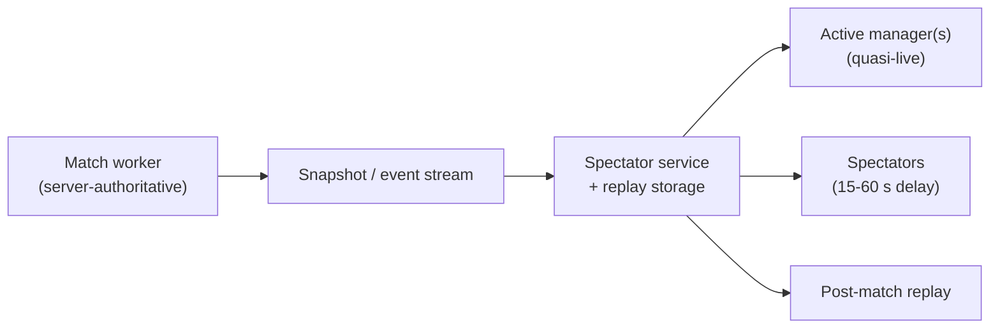

# ADR-0015: Watch-Party via Spectator Snapshot Streaming

## Status

Proposed (2026-05-16). Needs Nico's review before acceptance.

## Context

Watch parties and conference mode require *many* simultaneous viewers
attached to a live match. Naïvely attaching each viewer as a real
client of the match worker burns CPU + bandwidth and forces the match
worker to do per-viewer state replication. Game-spectator literature
(Unity discussions, Unreal forums) recommends **snapshot / event-frame
streaming with delay** as the standard, scalable pattern.

## Decision

Watch parties use a **separate spectator service** that consumes the
match worker's snapshot / event stream and broadcasts it to viewers
with a **configurable delay**.

## Consequences

### Positive

- Match worker is unaffected by spectator count.
- Replay is "almost free" (just keep the snapshot log).
- Spectator delay neutralises voice/chat coaching edge.
- Conference mode is straightforward (subscribe to many feeds).

### Negative

- Spectator service is a separate concern to operate.
- Snapshot storage adds disk usage; archive policy needed.

### Future

- Snapshot service can be extracted to its own process / pod when load
  demands.
- Live commentary AI could subscribe to the stream as another consumer.

## Implementation

- Match worker emits a **snapshot per virtual minute** plus per-event
  frames between snapshots.
- Snapshot + event log persisted to the match record.
- Spectator service reads from the persistent log + a Redis-style pub
  /sub for low-latency forwarding.
- Per-viewer delay computed at delivery time.
- Conference subscribes to multiple feeds and switches by event
  priority (goal > red card > penalty > lead change > table swing).

## Compliance

- Match worker MUST NOT serve spectators directly.
- Spectator delay configuration is part of the watch-party state row.
- All viewers connect through the spectator service, not the match
  worker.

## Sources

- Unity discussions on spectator + streaming.
- Unreal Engine forums on replay / spectator delay.
- League of Legends spectator delay context.
- [[../../60-Research/async-multiplayer-research]] §5-§6.
