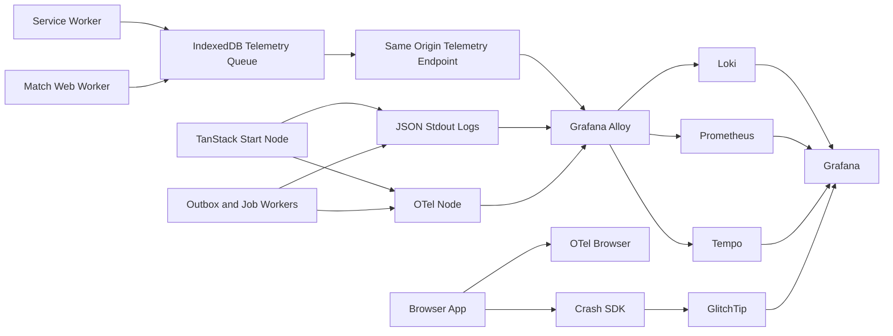

# ADR-0017: Self-hosted Observability and Logging

> **AMENDED 2026-05-19 by [[ADR-0021-revised-tech-stack]] (MVP scope trim, not a
> supersede).** The decision (self-hosted EU observability, GDPR/no-third-country)
> is unchanged and still binding. MVP profile is trimmed to **Loki + Prometheus
> + Grafana + Alloy + GlitchTip + Cosign**. **Tempo and Mimir are deferred** —
> they add ~3–5 GB RAM and upgrade/2am surface for zero pre-scale payoff, and
> Alloy already future-proofs re-adding them as a collector-config + container
> change. Re-add trigger: multiple deployed services with cross-service latency
> not explainable from logs+metrics (Tempo), or Prometheus local TSDB outgrowing
> the node (Mimir). GlitchTip is confirmed over self-hosted Sentry (~16 GB / 40+
> containers — rejected at this scale). Substrate note: references to "SurrealDB"
> as a log/metric *source* now mean Postgres per [[ADR-0021-revised-tech-stack]].

## Status

Accepted (2026-05-17, gap D11 / C6 / E3 planning pass).
MVP-scope amended 2026-05-19 (Tempo/Mimir deferred) — see banner.

## Context

`soccer-manager` needs active monitoring before it reaches beta:

- client crashes and service worker failures must be visible even when
  they happen during offline-first flows;
- server functions, workers, SurrealDB, Redis Streams and Dokploy
  containers need structured logs;
- match simulation, sync replay, outbox publishing and multiplayer
  workflows need metrics and later traces;
- operations must support incident response, release regression
  detection, performance budgets and stability monitoring;
- privacy must be designed in from the beginning because the product is
  EU-hosted, offline-first and stores encrypted user saves.

The stack baseline is Docker/Dokploy on Hetzner, TanStack Start/React,
service workers, Dexie/IndexedDB, SurrealDB, Redis Streams and a
service-ready modular monolith. SaaS observability is not the default.

## Decision

Adopt a **self-hosted/open-source observability strategy** with
OpenTelemetry as the instrumentation contract, Grafana LGTM as the
primary observability backend and GlitchTip-compatible Sentry SDKs for
crash/error reporting in v1.

### 1. Stack

| Concern | Decision | Role |
|---|---|---|
| Structured logs | Grafana Loki | Store app, worker, container, SurrealDB, Redis and reverse-proxy logs |
| Metrics | Prometheus | Store service health, latency, queue, sync, worker and resource metrics |
| Traces | Grafana Tempo | Store sampled distributed traces after v1 logs/metrics are stable |
| Collector / agent | Grafana Alloy | Receive OTLP, collect logs, scrape/forward metrics, ship to LGTM |
| Dashboards / alerting | Grafana | Dashboards, alert rules, incident triage |
| Crash/error reporting | GlitchTip with Sentry-compatible SDKs | Browser/Node errors, releases, source maps, crash grouping |
| Instrumentation contract | OpenTelemetry JS | Vendor-neutral traces/metrics/log context across browser, Node and workers |

Sentry self-hosted is the approved upgrade path if GlitchTip lacks
needed release, source-map, workflow or performance features. It is not
the v1 default because the self-hosted Sentry stack has materially higher
operational cost.

### 2. Data classes

Operational data is split into five classes:

1. **Operational logs**: JSON logs from server functions, workers,
   service worker reporting endpoint, Docker containers, SurrealDB,
   Redis and reverse proxy. Stored in Loki for short retention.
2. **Crash/error reports**: scrubbed exceptions, stack traces,
   release/build id, route/screen id, feature area, correlation id and
   minimal browser/device context. Stored in GlitchTip.
3. **Metrics**: availability, latency, error rates, outbox lag, queue
   depth, sync failures, IndexedDB quota warnings, PWA update failures,
   worker restarts and resource usage. Stored in Prometheus.
4. **Traces**: sampled workflows spanning browser fetch, TanStack server
   functions, SurrealDB queries, Redis stream publication and background
   workers. Stored in Tempo.
5. **Domain audit events**: authoritative business/audit history via
   ADR-0013 SurrealDB outbox and archive tables. These are not stored in
   Loki and have their own retention policy.

### 3. Client crash and offline diagnostics

Client telemetry must capture:

- `window.error` and `unhandledrejection`;
- React / TanStack Router error boundaries;
- service worker registration and runtime failures;
- Web Worker and match-engine crashes;
- Dexie / IndexedDB transaction and quota failures;
- failed outbox replay diagnostics;
- failed PWA update diagnostics;
- Web Vitals and long tasks only under the sampling/consent rules in
  [[../../60-Research/telemetry-privacy]].

Offline crash queues are allowed only for high-value diagnostics. They
must be capped by count, age and byte size, and must redact before
writing to IndexedDB. Product analytics and verbose spans are not stored
offline until H7/F6 explicitly approve the consent model.

### 4. Redaction and PII rules

Every telemetry path has two redaction points:

1. before local client queue storage or SDK send;
2. at the same-origin telemetry endpoint / backend ingest layer.

Never log credentials, auth tokens, emails, names, free-text user input,
raw request bodies, query strings with identifiers, save payloads,
encrypted save blobs or full IndexedDB records.

Allowed correlation fields are release/build id, route/screen id,
feature area, pseudonymous telemetry subject id, request/correlation id
and non-user-entered aggregate ids when operationally necessary.

### 5. Ingestion topology

Browser OpenTelemetry export must use HTTP and must go through a
same-origin endpoint or protected reverse proxy. A public collector must
not be exposed directly.

### 6. Retention

Initial retention policy:

| Data set | Retention |
|---|---:|
| Raw Loki logs | 14 days |
| GlitchTip crash reports | 30 days |
| Prometheus metrics | 15 months |
| Tempo traces | 7 days |
| Client offline telemetry queue | max 24 hours |
| Domain audit events | ADR-0013: hot 60 days, archive forever |

Incident legal hold can freeze a narrow time window, but legal hold must
be documented in the incident record and reviewed after closure.

### 7. Alerts

The initial alert set is symptom-first:

- `/healthz` failures and container restarts;
- client crash/error spike per release;
- service worker registration failure spike;
- IndexedDB quota or transaction error spike;
- server 5xx rate and p95/p99 latency;
- outbox lag and publish failures per ADR-0013;
- Redis consumer group lag;
- telemetry ingest failure, disk pressure and alert-delivery failure.

Noisy debug alerts are rejected until real production data proves they
are useful.

## Alternatives Considered

### Sentry self-hosted as the only observability platform

Rejected for v1. It has mature SDKs and strong error/performance
features, but the self-hosted stack is operationally heavier than
GlitchTip plus LGTM. It remains the upgrade path for crash reporting if
GlitchTip becomes limiting.

### Grafana LGTM plus Grafana Faro only

Rejected as the only client crash strategy. Faro fits the Grafana
ecosystem, but Sentry-compatible crash grouping and source-map workflows
are more mature for browser/Node exceptions. Faro can be reconsidered
later for RUM if H7 requires it.

### OpenObserve

Rejected for the default. It is attractive as a lower-component
all-in-one platform, but Grafana/Loki/Prometheus/Tempo/Alloy is more
standard, easier to hire for and aligns with ADR-0013's Prometheus /
Grafana outbox metrics.

### PostHog / Umami / Plausible in v1

Deferred. They are product analytics tools, not operational logging. H7
and G3 will decide analytics events and success metrics after F6 defines
privacy/consent.

### Raw file logs only

Rejected. Local file logs do not support crash grouping, dashboards,
alerts, retention enforcement, cross-container search or incident
triage.

## Consequences

### Positive

- Self-hosted by default on the existing Dokploy/Hetzner direction.
- Client crashes, service worker failures and IndexedDB issues become
  visible instead of hidden in user devices.
- OpenTelemetry keeps instrumentation backend-neutral.
- ADR-0013 outbox metrics fit naturally into Prometheus/Grafana.
- Domain audit remains separate from noisy operational logs.
- Privacy rules are explicit before SDKs are introduced.

### Negative

- LGTM + GlitchTip adds several containers and backup/upgrade work.
- Grafana/Prometheus/Loki/Tempo/Alloy query languages and operations
  need learning time.
- Client telemetry needs careful sampling and queue limits to avoid
  reconnect spikes.
- GlitchTip may be less feature-rich than Sentry self-hosted.

### Follow-up

- E3/C5: document the Dokploy deployment topology and protected access.
- C6: expand crosscutting logging and error rules.
- F6: finalise GDPR compliance and privacy/consent implementation.
- H1: add incident response and legal hold workflow.
- H7/G3: decide product analytics separately.

## Compliance

- Production logs MUST be structured JSON.
- Logs MUST include `service`, `environment`, `release`, `level`,
  `message`, `timestamp`, and where applicable `correlation_id`,
  `request_id`, `user_telemetry_id`, `aggregate_type` and
  `aggregate_id`.
- Browser telemetry MUST pass through a same-origin endpoint or protected
  reverse proxy before reaching collectors.
- The OpenTelemetry collector endpoint MUST NOT be directly exposed to
  the public internet.
- SDK-side and server-side scrubbing MUST be enabled before production
  telemetry is accepted.
- Product analytics MUST NOT be mixed into operational logs.
- Operational logs MUST NOT be used as the domain audit trail.
- Grafana, Loki, Prometheus, Tempo and GlitchTip dashboards MUST be
  admin-only, never public anonymous dashboards.

## Links

- Related research: [[../../60-Research/telemetry-privacy]]
- Related architecture: [[../08-Crosscutting]], [[ADR-0002-offline-first]], [[ADR-0013-transactional-outbox]]
- Related implementation: [[../../30-Implementation/observability-runbook]], [[../../30-Implementation/client-telemetry]], [[../../30-Implementation/deployment-dokploy]]
