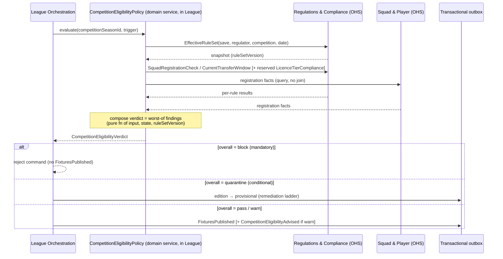

# ADR-0069: League↔Regulations fixture/competition eligibility hand-off

## Status

accepted

> Ratified `accepted` 2026-06-08 in the vault-wide ratification sweep
> ([[decision-queue-2026-06-08-ratified|ledger]], PR #153); body previously read `proposed`. Body
> status reconciled to the frontmatter SSOT (ADR-0092) on 2026-06-11 (FMX-143).

> **History (pre-ratification banner, demoted 2026-06-11 per ADR-0092 / FMX-143):**
> **D1–D4 answered live by Nico 2026-06-03** (ask-first gate, before drafting):
> **D1 = A** (stateless Eligibility **Policy** in League + reuse the Pyramid-rollover
> Process Manager for promotion — *not* a new Saga), **D2 = B** (`EffectiveRuleSet`
> snapshot wiring **+ `SquadRegistrationCheck` mandatory** at MVP; licence-tier / FFP
> / promotion-compliance reserved), **D3 = A** (severity-tagged: block / warn /
> quarantine), **D4 = A** (promotion routes through Regulations `LicenceTierCompliance`,
> reserved at MVP). Authored `proposed` / `binding: false` per the standing
> "never self-accept" rule; the `accepted` flip is Nico's on merge (HITL gate).
> Closes the **eligibility** half of audit gap **G1**; builds on ADR-0056 / 0066 / 0068.

## Date

- Proposed (D1–D4 answered live by Nico): 2026-06-03

## Context

ADR-0056 (accepted, `risk:legal`) makes **Regulations & Compliance** the sole owner of
the versioned rule catalog, the transfer-window FSM and the `EffectiveRuleSet`
snapshot, exposed via **Open Host Service + Published Language**. ADR-0066 gave
**League Orchestration** a Competition & Season registry (`LeagueCompetitionSeason`
edition with `status: registering→active→completed`; `PyramidConfiguration`; a stateful
**Pyramid-rollover Process Manager**); ADR-0068 made competitions **schedulable**
(`ScheduleCompetition` / `GenerateFixtures` / `FixturesPublished`) and named
**Regulations via FMX-74** as a consumer.

What is missing — and what this ADR specifies — is **how a scheduled competition
invokes the rules**: which Regulations queries fire, at which lifecycle points, with
what failure semantics, **without a cross-context join** (the binding communication
rule, map L164-170), and how the verdict stays **replay-safe** against the immutable
per-save snapshot. Without it a competition could be scheduled, or a squad
registered, in violation of the `EffectiveRuleSet` — a `risk:legal`-adjacent
correctness hole (gap **G1**).

Grounding: [[../../60-Research/league-regulations-eligibility-handoff-2026-06-03]]
(real-world 5-gate timing; FM's competition-rule-layer precedent; the DDD
Saga-vs-policy distinction — Vernon IDDD + vault precedent; raw capture, incl. a
flagged unusable-citation caveat on the DDD query).

**Real-world framing.** Five regulatory gates fire at different times: (1) club
admission/licensing and (2) promotion compliance — *pre-season, before the draw*;
(3) squad registration — *around season start + mid-season windows*; (4) transfer
windows; (5) matchday eligibility — *per fixture*. This hand-off owns **gates 1–3** at
*scheduling/lifecycle* time. Gate 5 stays **Match**-owned (ADR-0056
`MatchLineupLocking`); gate 4 stays **Transfer**-owned.

## Decision (proposed — Nico D1–D4 = A,B,A,A live 2026-06-03)

### 1. Orchestration: a stateless Eligibility Policy in League (D1=A)

The scheduling-time gate is a **stateless `CompetitionEligibilityPolicy` (domain
service) inside League Orchestration** — *not* a Saga. It reads the immutable
`EffectiveRuleSet` snapshot, fans out **synchronous queries** to Regulations' OHS (and
to Squad & Player for registration facts), and returns a **composite verdict**. There
is no durable intermediate state and no compensating action, so per Vernon a Saga /
Process Manager would be an overreach (a synchronous fan-out-and-decide flow is a
**domain service / policy**). This **refines the issue's "Saga" wording** on
DDD-correctness grounds; it does not change ADR-0056's "eligibility chain runs in the
consuming BC" intent — the policy *is* the consumer-side enforcement.

The one genuinely stateful flow — **promotion compliance at season rollover** — folds
into ADR-0066's already-ratified **Pyramid-rollover Process Manager** (§4), which has
real cross-time state. "Saga / Process Manager" is reserved for that.

### 2. Hand-off contract: queries × lifecycle trigger points (D2=B)

League invokes these **read-model queries** (no commands mutate Regulations; no
cross-context join). Each is named with the **single lifecycle point** at which it
fires:

| Regulations / Squad query | Fires at (League lifecycle) | MVP? | On failure |
|---|---|---|---|
| `EffectiveRuleSet(save, regulator, competition, date)` | `ScheduleCompetition` — resolve the snapshot scope for this edition | ✅ mandatory | hard-block if unresolvable |
| `SquadRegistrationCheck(club, registrationList, competition)` | at the **squad-registration window** (edition `registering`, after transfer-window close) | ✅ **mandatory** | severity-tagged (§3) |
| `CurrentTransferWindow(competition, date)` / window-FSM state | read at the registration-window trigger (window-open gate; **G25 hook**, §5) | ✅ mandatory (read-only) | advisory |
| `LicenceTierCompliance(club, targetTier)` | at **season-rollover / promotion** (via Pyramid-rollover PM, §4) | ⏸ reserved hook | quarantine/refuse (§3) |
| `FfpRatioCheck(club, regulator, periodEnd)` | competition-level financial gate | ⏸ reserved hook | advisory→block (post-MVP) |

**Verdict shape** (Zod-describable; self-contained; no join):

```ts
EligibilitySeverity = enum('mandatory' | 'advisory' | 'conditional')
EligibilityOutcome  = enum('pass' | 'block' | 'warn' | 'quarantine')

EligibilityFinding = {
  ruleRef: RuleRef,                 // opaque ref into Regulations' catalog (no rule text)
  severity: EligibilitySeverity,
  outcome: EligibilityOutcome,
  remediation?: RemediationRef      // e.g. crash-build | special-permit | ground-share | refuse
}

CompetitionEligibilityVerdict = {
  competitionSeasonId: CompetitionSeasonId,
  ruleSetVersion: RuleSetVersion,   // the snapshot version the verdict was computed against
  inputHash: Hash,                  // hash of (command input + queried facts) — audit/replay
  overall: EligibilityOutcome,      // worst-of the findings under the severity model (§3)
  findings: ReadonlyArray<EligibilityFinding>
}
```

`ruleRef` / `RemediationRef` are **opaque references** into Regulations' catalog —
**no rule terminology crosses the boundary** (IP / `risk:legal`; GD-0015 + ADR-0007).

### 3. Failure semantics: severity-tagged (D3=A)

The verdict's `overall` is the **worst-of** its findings under a per-check severity:

- **mandatory** breach → `block`: the triggering command (`GenerateFixtures` /
  squad-registration confirm) is **rejected**; no `FixturesPublished` / no registration
  commit. A guard that prevents the transition (replay-safe; no durable side effect).
- **advisory** breach → `warn`: the transition proceeds and an **advisory event**
  (`CompetitionEligibilityAdvised`) is emitted (idempotent — derived from edition
  state, emitted once via the outbox).
- **conditional** breach → `quarantine`: the edition (or the promotion candidacy)
  enters a **provisional** state pending resolution. This maps the GDDR
  `LicenceTierCompliance` remediation ladder (**crash-build / special-permit /
  ground-share / refuse**) onto an explicit pending state with idempotent re-processing
  — not an overloaded "warning".

### 4. Promotion compliance via the Pyramid-rollover PM (D4=A)

Promotion/relegation resolution **routes through Regulations `LicenceTierCompliance`**:
the ADR-0066 Pyramid-rollover Process Manager, before confirming a club into its
next-season higher-tier edition, calls `LicenceTierCompliance(club, targetTier)`; a
`mandatory` fail **blocks** the promotion, a `conditional` fail **quarantines** it
(remediation ladder), an advisory passes with a warning. League owns the promotion
decision; Regulations is queried (ADR-0056 lines 310-312). **Reserved at MVP**: with
single-tier data (GD-0009 / ADR-0066 D4) there is no promotion to gate, so the hook is
specified-and-inert — no re-model when tiers ship.

### 5. Determinism + the G25 reserved hook

- The policy reads the **immutable save-creation `EffectiveRuleSet` snapshot** (ADR-0056
  + ADR-0051); **no live read** of the mutable global catalog. Each verdict is a **pure
  function of (command input, aggregate state, `ruleSetVersion`)** → replay-safe by
  **recomputation**. A persisted verdict carries `ruleSetVersion` + `inputHash`;
  caching is a perf optimization only, never the source of truth. **No RNG.**
- **G25 hook:** the registration-window trigger reads the regulatory window
  (`CurrentTransferWindow` / window-FSM) as the source-of-truth for *eligibility
  timing*. The deadline-source contradiction (regulatory window vs watch-party
  `broadcast_at`) is **acknowledged and reserved** here, not resolved — a named seam for
  the G25 issue, not silently ignored.

### 6. Sequence



## Invariants (checkable policies)

| # | Invariant | Where enforced |
|---|---|---|
| **E1** | Every Regulations/Squad call is a **query** (read model); no command mutates another context and **no cross-context join** is implied at any step. | contract review |
| **E2** | Each query is bound to **exactly one** lifecycle trigger point (table §2); a check never fires "ambiently". | policy + review |
| **E3** | The verdict is a **pure function of (command input, aggregate state, `ruleSetVersion`)**; no wall-clock, no RNG, no live catalog read → byte-identical on replay. | policy + golden-replay test |
| **E4** | A `mandatory` finding ⇒ `overall = block` ⇒ the triggering command is rejected (no `FixturesPublished`, no registration commit). | League command guard |
| **E5** | A `conditional` finding ⇒ `quarantine` ⇒ the edition/promotion enters an explicit **provisional** state; re-processing the gate is idempotent. | edition AR + PM |
| **E6** | Promotion confirmation calls `LicenceTierCompliance` **before** committing the higher-tier participant (reserved/inert at single-tier MVP). | Pyramid-rollover PM |
| **E7** | `SquadRegistrationCheck` is **mandatory at MVP**; `LicenceTierCompliance` / `FfpRatioCheck` are reserved hooks (named, not enforced at MVP). | scope review |
| **E8** | No rule **terminology** crosses the boundary — only opaque `ruleRef` / `RemediationRef`. (IP / `risk:legal`.) | contract review + IP audit |
| **E9** | The G25 interaction is represented by a **named reserved hook**, not omitted. | review |

## Verification

- **Golden-replay (E3):** a fixed `(snapshot, edition, trigger)` recomputes a
  byte-identical `CompetitionEligibilityVerdict` on re-run; verdict independent of
  wall-clock and of any RNG stream.
- **Block guard (E4):** a `mandatory` failing `SquadRegistrationCheck` rejects the
  registration/schedule command and emits **no** `FixturesPublished`.
- **Quarantine (E5):** a `conditional` `LicenceTierCompliance` fail (post-MVP fixture)
  drives the edition/promotion into `provisional`; re-running the gate is a no-op.
- **No-join (E1) + IP (E8):** contract review confirms every step is a query and the
  payloads carry only opaque refs (no rule text).
- **Acceptance criteria (issue FMX-74):** mapped 1:1 — every query named with a trigger
  (§2); policy in League with block-on-failure (§1, §3); immutable-snapshot replay-safety
  (§5); promotion routes through a compliance check (§4); G25 reserved hook (§5);
  `risk:legal` / no terminology leak (E8).

## Consequences

**Positive**
- Closes the **eligibility** half of gap G1: scheduled competitions + squad
  registrations are now gated against the `EffectiveRuleSet` with no cross-context join.
- DDD-correct: a stateless **policy** for the synchronous gate; the stateful promotion
  check reuses an **existing** PM — no redundant Saga machinery.
- Replay-safe by construction (pure verdict over a versioned snapshot; no new RNG).
- Future-proof: licence-tier / FFP / promotion checks are **named reserved hooks**,
  inert at single-tier MVP, activated without re-model when tiers/cups/continental ship.

**Negative / constraints**
- Pulls **Squad & Player** into the MVP contract surface as the registration-fact
  source (queried, never joined).
- The quarantine/remediation ladder needs an explicit provisional state in the edition
  AR — small added lifecycle surface (justified by D3).
- G25 is only *reserved* here; the deadline-source contradiction is resolved elsewhere.
- Reserved-hook checks must be honoured (not silently extended) when promotion data
  arrives — a future ADR, per vault governance.

## HITL gate

`proposed` / `binding: false`. Nico answered **D1–D4 = A, B, A, A** live on 2026-06-03
(ask-first gate; `needs:nico-decision`). Authored `proposed` per the standing
"never self-accept" rule — the `accepted` / `binding: true` flip is Nico's on merge.
**No edit to ADR-0056** (cross-reference only). A `proposed` Decision-Log row is added
in this PR (planning context). The **binding bounded-context-map is not edited** from a
proposed ADR (ratify-gate pattern, per ADR-0065): the cross-reference touch-ups (League
supply clause L96-101 + the eligibility-chain communication rule L164-170) are applied
**on ratification, in the apply-PR**. Merge stays Nico's.
