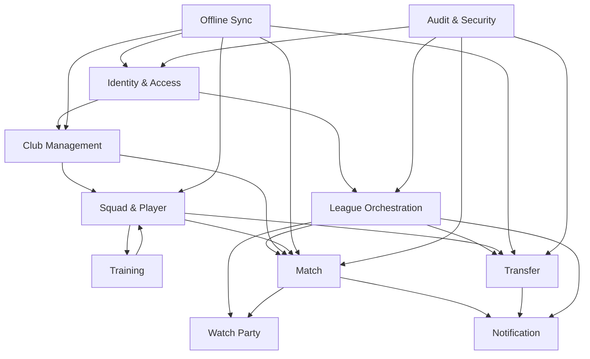

# Bounded Context Map

The application is structured as a **service-ready modular monolith with
DDD bounded contexts** in TypeScript. Each context owns its domain logic,
its state machine(s), its database tables, and a thin public contract
(commands + queries + domain events) that is JSON-serialisable and
network-transparent.

> Decision authority: [[09-Decisions/ADR-0010-modular-monolith-ddd]] —
> accepted 2026-05-16.

**Service-ready** means: although MVP ships as one process, every
context's contract is designed as if it could be running on its own
process / pod / region. Splitting a context out later is a deployment
change, not a refactor.

## 1. Eleven bounded contexts

| Context | Core elements | Exposed outputs |
|---|---|---|
| **Identity & Access** | User, sessions, roles, device state | Auth claims, membership context |
| **League Orchestration** | Season, week, match-day, mode, pause, quorum | League status, deadlines, lifecycle events |
| **Club Management** | Finances, infrastructure, sponsors, board, fans | Club state, board pressure, facility modifiers |
| **Squad & Player** | Player base data, fitness, morale, contracts, injuries | Squad projections, player state |
| **Training** | Training plan, load, development signals | Training outcomes, fatigue signals, growth deltas |
| **Transfer** | Offers, counter-offers, deadlines, escalation | Transfer state, pressure signals |
| **Match** | Line-up, tactic lock, simulation, results | Result, match events, replay stream |
| **Watch Party** | Polls, scheduling, broadcast, conference | Watch-party status, event timeline |
| **Notification** | Inbox, push, reminder, digest | User-facing message projections |
| **Offline Sync** | Local outbox, command replay, conflict logic | Sync status, retry status |
| **Audit & Security** | Command log, replay protection, abuse detection | Audit trail, anomaly flags |

## 2. Context map (high-level)



## 3. Communication rules

Contexts may communicate ONLY via three contract types, all of them
JSON-serialisable (Zod schemas) and routed through a transport
abstraction (`Bus` for commands + events, `QueryGateway` for queries).
In MVP the transport is in-process; the same call site works against a
network implementation later.

- **Commands** - explicit change requests (`SubmitTrainingPlan`,
  `CompleteWeek`, `SendTransferOffer`).
- **Queries / Read Models** - UI-friendly read views without mutation.
- **Domain Events** - facts (`WeekCompleted`, `QuorumReached`,
  `TrainingWeekProcessed`, `TransferOfferExpired`, `MatchResolved`).
  Published via the transactional outbox
  ([[09-Decisions/ADR-0013-transactional-outbox]]).

No context reads another context's internal tables or document fields.
No JOIN across context boundaries. No shared lookup tables that bypass
the rule.

## 4. Source mapping

The TypeScript code lives under `src/domain/` with one folder per context:

```text
src/domain/
  identity/
  league/
  club/
  squad/
  training/
  transfer/
  match/
  watch-party/
  notifications/
  sync/
  audit/
```

Each folder owns:

- `commands.ts` - command type definitions + handlers.
- `events.ts` - domain event type definitions.
- `queries.ts` - read-model definitions.
- `state-machine.ts` (if applicable) - FSM definition.
- `policies.ts` - domain rules.
- `repository.ts` - persistence interface.
- `index.ts` - public exports (commands + queries + events only).

## 5. Swap-ability and service extraction

Each context can be replaced (e.g. swap Training for a new model)
provided it keeps its commands + queries + domain events contracts. The
rest of the system doesn't know which implementation is running.

Service extraction (moving a context out of the monolith into its own
process / pod) is a **deployment change, not a refactor**, because:

- All inter-context calls already go through `Bus` + `QueryGateway`.
- All contracts are already JSON-serialisable.
- Each context already owns its own storage (no shared tables to split).
- Domain events already publish through the transactional outbox.

Anticipated extraction order when scaling demands it:

1. **Match worker** - heaviest CPU + needs anti-cheat isolation.
2. **Job scheduler / Outbox publisher** - long-running supervisor.
3. **Spectator service** - high fan-out per
   [[09-Decisions/ADR-0015-spectator-snapshot-streaming]].
4. **Notification service** - independent scaling per push volume.

The remaining seven contexts likely stay co-located unless a real
scaling signal forces a split.

This is the explicit user requirement that drove this map: maximum
service-architecture readiness so individual systems can be
re-developed independently and scaled independently. See ADR-0010
§Decision.

## 6. Storage isolation

Each context owns its own SurrealDB tables (per
[[09-Decisions/ADR-0004-data-model]]). The rule is **strict**:

- Cross-context reads happen via the public query layer of the other
  context, not by querying their tables directly.
- No JOIN across context boundaries.
- No shared lookup tables that bypass the rule.
- No "convenience" cross-context reads for performance - if a query is
  too slow, the owning context publishes a read-model.

Accepted in gap B1 Q&A (2026-05-16) at the strict level so service
extraction stays a deployment change rather than a data-migration.

## 7. Open questions

- Should Match Engine be a separately deployable service in MVP? No -
  modular monolith. Extraction is allowed post-MVP if perf demands it.
- Where do "AI manager" decisions sit? In the League context (for
  league-wide AI decisions + structural events) and in Club + Transfer
  (for per-club AI behaviour). Locked in
  [[../60-Research/ai-manager-behaviour]] (gap D4, 2026-05-17):
  utility-AI core + FSM situation classifier + heuristic constraints;
  `packages/ai-manager/` framework-agnostic; uses pre-allocated
  `WorldAiMgmtRng` + `MatchAiRng` from D8.
- Spectator stream: own context or in Match? Own context (Watch Party)
  because it has independent state machine and scheduling.
