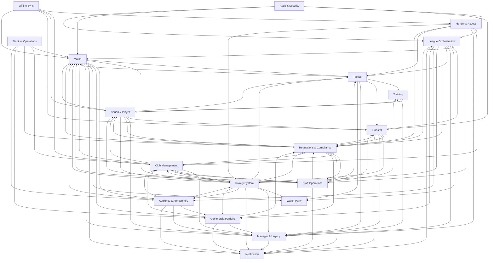

# Bounded Context Map

The application is structured as a **service-ready modular monolith with
DDD bounded contexts** in TypeScript. Each context owns its domain logic,
its state machine(s), its database tables, and a thin public contract
(commands + queries + domain events) that is JSON-serialisable and
network-transparent.

> Decision authority: [[09-Decisions/ADR-0019-modular-monolith-ddd]] —
> accepted 2026-05-16.

Per-context public contracts and code paths (`context-contracts/`, planned).
MVP build order:
[[../30-Implementation/mvp-implementation-roadmap]].

**Service-ready** means: although MVP ships as one process, every
context's contract is designed as if it could be running on its own
process / pod / region. Splitting a context out later is a deployment
change, not a refactor.

## 1. Nineteen bounded contexts

| Context | Core elements | Exposed outputs |
|---|---|---|
| **Identity & Access** | User, sessions, roles, device state | Auth claims, membership context |
| **League Orchestration** | Season, week, match-day, mode, pause, quorum | League status, deadlines, lifecycle events |
| **Club Management** | Finance ledger (sole writer), accounting projections, budget envelopes, board pressure, insolvency state | Club state, economy snapshots, board pressure |
| **Squad & Player** | Player base data, fitness, morale, contracts, injuries | Impact Lens projections, squad projections, player state |
| **Training** | Training plan, load, development signals | Training outcomes, fatigue signals, growth deltas |
| **Transfer** | Market valuation, opportunities, offers, clause packages, negotiation cases, deadlines, escalation | Transfer state, valuation bands, pressure signals, completed deals |
| **Match** | Line-up, tactic lock, simulation, results | Result, match events, replay stream |
| **Watch Party** | Polls, scheduling, broadcast, conference | Watch-party status, event timeline |
| **Notification** | Durable notifications, inbox, preferences, subscriptions, schedules, delivery attempts, provider adapters, push preparation, digests | User-facing message projections, unread counters, delivery/audit events |
| **Manager & Legacy** | Manager profile, run analysis snapshots, manager style signals, archetype candidates, legacy unlock catalog, prestige profile | Post-run reflection projections, legacy/prestige configuration for new-save creation, archetype candidate board |
| **Staff Operations** | Staff contract lifecycle, role assignment, pipeline coverage, wage schedule, specialisation metadata | Staff roster + role-assignment board projections, pipeline-coverage snapshots, wage events for the Club Management ledger |
| **Tactics** | Tactic presets, set-piece routine variants, opposition templates, role/duty configurations, tactical-style signal aggregation | TacticSnapshot at lock-time, RoleProfileForPosition queries, OppositionTemplate lookups, SetPieceRoutineCatalog, TacticalIdentityFingerprint for Manager & Legacy |
| **Regulations & Compliance** | Regulatory profiles per regulator + competition + tier (versioned by effective date), transfer-window FSM, work-permit catalog, sanction catalog, licence-tier facility requirements, community-pack rule-override validation policy | EligibilityForTransfer / SquadRegistrationCheck / LicenceTierCompliance / FfpRatioCheck queries, CurrentTransferWindow status, EffectiveRuleSet snapshot at save creation, sanction escalation chain |
| **Rivalry System** | RivalryEdge graph (club pair × sub-score history × threshold-tier FSM), 5-sub-score formula (regional + historical + sporting + fan-incident + transfer-tension), deterministic per-season decay, threshold-tier classification | RivalryScore / IsDerbyFixture / TopRivalsForClub / RivalryIncidentTimeline / RivalryGraphSnapshot / DerbyContext queries; RivalryTierTransitioned events to Audience & Atmosphere + Matchday-Event-Engine + Watch Party + Manager & Legacy + Notification + Match + Tactics + Regulations consumers |
| **Stadium Operations** | `Stadium` Aggregate (matchday FSM: Preparing → DoorsOpen → InPlay / Kickoff → Halftime → SettlementPending → Reset), `FacilityCondition` (age + decay + maintenance project lifecycle), `VenueEventCalendar` (non-matchday event bookings), `SeatClassInventory` (capacity by class: standing, seating, family, premium, suites, accessibility, away allocation), `HospitalityInventory` (suite + box physical inventory), Process Manager / Saga for weekly facility decay + maintenance lifecycle | `StadiumCommercialSnapshot` / `StadiumCapacitySnapshot` / `MatchdayTimelineBoard` / `FacilityComplianceSnapshot` / `VenueEventCalendarBoard` / `PitchQualitySnapshot` / `HospitalityInventorySnapshot` queries; `MatchdayTimelineAdvanced` / `MatchdayEventTriggered` / `PitchConditionChanged` / `VenueEventBooked` / `VenueEventCompleted` / `MaintenanceProjectScheduled` / `MaintenanceProjectCompleted` / `SeatClassInventoryRebalanced` / `FacilityComplianceChecked` events |
| **Audience & Atmosphere** | `SupporterSegment` Aggregate (per-segment loyalty + mood + volatility + attendance probability + season-ticket renewal probability + price sensitivity + propensity), `AtmosphereSnapshot` (per-fixture multiplier from rivalry × table × utilisation × form × weather × security × choreo participation), `FanIncident` (choreo + protest banner + ticket boycott + ouster-call threshold-triggered FSM), `TicketingTrustLedger` (persistent 3-season shock memory), `NamedSupporterGroup` (FMX-54-gated opt-in overlay) | `FanDemandForecast` / `AtmosphereSnapshot` / `SegmentMoodBoard` / `TicketingTrustStateSnapshot` / `FanIncidentTimeline` / `NamedSupporterGroupRoster` / `OusterCallEscalationBoard` / `FanPipelineQualitySnapshot` queries; `FanDemandForecasted` / `FanIncidentLogged` / `AtmosphereSnapshotPublished` / `SegmentRenewalProbabilityUpdated` / `TicketingTrustStateChanged` / `OusterCallEscalated` / `BoycottThresholdConfirmed` / `ChoreoCampaignRegistered` / `FanPipelineQualityUpdated` events |
| **CommercialPortfolio** | `CommercialContract` Aggregate (unified shell across sponsorship + catering + merchandise + hospitality + season-ticket bundles; Available → Negotiating → Active → Renewing → Terminated + Cool-down FSM), `AssetInventory` (asset taxonomy + slot allocation), `ExclusivityGraph` (category-exclusivity edges), `SeasonTicketCampaign` (8-state FSM), `FixtureSettlement` (per-fixture settlement Saga), `AccrualSchedule` (IFRS 15 5-step model), `CreditLiabilityPool` (refund + no-show + postponement liability), `InstalmentReceivable` (payment-plan state + IFRS 9 ECL), `CommercialFairValueAssessment` (UEFA FSR + PL APT + La Liga PSR documentation), `FanEventCampaign` (paid fan-service campaigns) | `CommercialContractPortfolio` / `CommercialForecastSnapshot` / `AssetInventoryDashboard` / `ExclusivityGraphSnapshot` / `SeasonTicketCampaignBoard` / `MatchdayCommercialSettlement` / `RefundLiabilitySnapshot` / `InstalmentReceivableAging` / `FairValueEvidencePack` / `FanEventCampaignCalendar` / `CommercialKpiBoard` queries; `CommercialContractActivated` / `CommercialContractRenewalDue` / `CommercialContractRenewed` / `CommercialBreachOpened` / `CommercialBreachResolved` / `CommercialContractTerminated` / `SeasonTicketCampaignAdvanced` / `SeasonTicketCampaignClosed` / `TicketingPolicyChanged` / `MatchdayCommercialSettlementPosted` / `InvestorCashGrantPosted` / `FanEventCampaignScheduled` / `CommercialFairValueAssessed` / `RefundLiabilityRecognised` / `RefundLiabilityReleased` / `DeferredRevenueRecognised` events; Customer-Supplier + ACL to Club Management ledger per ADR-0050 |
| **Offline Sync** | MVP: cache/draft status and freshness metadata. Future: local outbox, command replay, conflict logic | Draft/cache status now; sync status later |
| **Audit & Security** | Command log, replay protection, abuse detection | Audit trail, anomaly flags |

Player lifecycle and systemic world events are specialised by
[[09-Decisions/ADR-0018-systemic-events-and-player-lifecycle]]. They do not
add a thirteenth bounded context. The `WorldEventDirector` is an orchestration
policy over the existing contexts.

FMX-41 commercial economy planning was originally captured in
[[09-Decisions/ADR-0058-club-economy-commercial-impact-boundary]]
as a Club Management commercial sub-aggregate (no new BC). The
FMX-32 boundary audit (ADR-0061 + ADR-0062) refined that
recommendation 2026-05-28: Nico ratified the best-practice landing
in which **commercial policy + commercial contract lifecycle +
commercial settlement + Investor entitlement grant posting** are
owned by the new **CommercialPortfolio** bounded context (17th /
18th / 19th depending on counting order — see §1 table above);
**stadium economics** moved to the new **Stadium Operations**
bounded context; **fan signals** (segment demand + atmosphere +
trust state + politics events) moved to the new **Audience &
Atmosphere** bounded context. Club Management remains the sole
writer of finance ledger entries per ADR-0050; CommercialPortfolio
emits settlement events consumed via Customer-Supplier + ACL.
Audience & Atmosphere supplies `FanDemandForecast`,
`AtmosphereSnapshot`, `TicketingTrustState`, `FanIncidentLogged`,
`FanPipelineQualityUpdated` and `OusterCallEscalated`. Stadium
Operations supplies `StadiumCommercialSnapshot`,
`StadiumCapacitySnapshot`, `MatchdayTimelineAdvanced`,
`PitchConditionChanged`, `VenueEventBooked` and
`FacilityComplianceChecked`. League / Competition supplies
`FixtureCommercialProfile` + `CompetitionRevenueProfile` +
`SeasonAdvanced`. Rivalry supplies `RivalryTierTransitioned` +
`RivalryCommercialSignal`. Regulations supplies `EffectiveRuleSet`
(UEFA FSR + PL APT + La Liga PSR + GDPR + DSA + CRA + Late
Payment Directive + CEN-EN 17210 obligations). No context writes
Club ledger rows directly.

Manager & Legacy was ratified 2026-05-28 via
[[09-Decisions/ADR-0051-manager-and-legacy-context]] (FMX-25 dossier +
FMX-35 apply) and is the twelfth context. It owns cross-run manager
identity, run analysis, style signals, archetype candidates, legacy setup
and prestige selection. League, Club Management, Match, Transfer, Squad &
Player and Training provide facts through public contracts; Notification
renders Manager & Legacy projections.

Staff Operations was ratified 2026-05-28 via
[[09-Decisions/ADR-0053-staff-operations-context]] (FMX-26 dossier +
FMX-36 apply) and is the thirteenth context. It owns staff contract
lifecycle, role assignment, pipeline coverage, wage schedule and
specialisation metadata. Staff Operations consumes People (ADR-0052,
draft) actor identity and skill-profile snapshots via query; it does not
own persona, OCEAN substrate or the relationship graph. Wage events flow
to Club Management per [[09-Decisions/ADR-0050-club-economy-accounting-ledger]];
effect-readiness and role-assignment events are consumed by Training,
Transfer, Squad & Player and Match.

Rivalry System was ratified 2026-05-28 via
[[09-Decisions/ADR-0057-rivalry-system-context]] (FMX-34 dossier +
FMX-40 apply) and is the sixteenth context. It owns the rivalry-edge
graph (club pair × sub-score history × threshold-tier FSM), the 5-
sub-score emergent formula (regional + historical + sporting + fan-
incident + transfer-tension, per
[[../50-Game-Design/rivalry-system]]), deterministic per-season decay
and threshold-tier classification (None / Mild / Strong / High /
Volatile). Rivalry consumes Match `MatchResolved` for sporting sub-
score, Transfer `TransferCompleted` for transfer-tension sub-score,
Fan Ecology `FanIncidentLogged` for fan-incident sub-score, Club
Management `ClubFoundedInLocation` / `ClubRelocatedToLocation` for
regional base, and League Orchestration `SeasonAdvanced` for the
deterministic decay batch. It publishes `RivalryScore` /
`IsDerbyFixture` / `TopRivalsForClub` / `RivalryIncidentTimeline` /
`RivalryGraphSnapshot` / `DerbyContext` read models + `Rivalry
TierTransitioned` events to Fan Ecology (atmosphere multiplier),
Matchday-Event-Engine via Club Management (Pyro-incident trigger),
Watch Party (auto-proposal), Manager & Legacy (future archetype
signal), Notification (derby copy), Match (derby classification at
`lineup_locked`), Tactics (future derby-specific opposition awareness)
and Regulations & Compliance (downstream sanction chain via
matchday-event-engine). Consumers treat rivalry as external fact and
apply their own policies in their own contexts - canonical Vernon
scoring-context pattern (analogous to credit rating + customer
affinity + recommendation + supplier-score real-world DDD precedents).
Cross-save rivalry pre-population (era profiles + community overlays)
flows through ADR-0051 Manager & Legacy legacy seeds + ADR-0016
Community Overlay surface per FMX-33 Community Overlay Pipeline;
Rivalry BC owns schema + semantic validation per Vernon.

Regulations & Compliance was ratified 2026-05-28 via
[[09-Decisions/ADR-0056-regulations-compliance-context]] (FMX-30
dossier + FMX-39 apply) and is the fifteenth context. It owns the
versioned multi-regulator rule catalog (UEFA-analogue + national
league analogue + national association analogue per regulator scope ×
competition profile × effective date), the transfer-window FSM, the
work-permit catalog, the sanction catalog and licence-tier facility
requirements. Stock catalogs live in `packages/game-data` per
ADR-0021/0027 conventions; per-save active rule set + community
overrides are copied into the save snapshot at creation per ADR-0051
determinism rule. Multi-context eligibility chains (transfer
completion, squad registration, promotion compliance) run as Process
Manager / Saga inside the BC owning the overall business process -
Transfer for signings, Squad & Player for registration, League
Orchestration for promotion. Regulations owns the rule; each consumer
owns its enforcement via Anticorruption Layer per Vernon's canonical
Tax-catalog pattern. IP-clean rule terminology hardline applies to the
entire Regulations BC per [[../50-Game-Design/GD-0015-ip-clean-data]]
+ [[09-Decisions/ADR-0007-naming-schema]]. Cross-save preset sharing
of community rule overrides flows through FMX-33 Community Overlay
Pipeline per [[09-Decisions/ADR-0016-community-dataset-overrides]];
Regulations BC owns schema + semantic validation per Vernon.

Tactics was ratified 2026-05-28 via
[[09-Decisions/ADR-0055-tactics-context]] (FMX-28 dossier + FMX-37
apply) and is the fourteenth context. It owns the persistent tactics
library: tactic presets (saved → active → archived FSM), set-piece
routine variants (drafted → published → retired FSM), opposition
templates (three-layer model: archetype + sub-archetype +
manager-signature), role/duty configurations (5-layer tactical model)
and tactical-style signal aggregation. Match consumes a `TacticSnapshot`
at `lineup_locked` (canonical Reference + Snapshot pattern - the live
preset may be edited after lock without affecting the in-flight match).
Training and Transfer read `RoleProfileForPosition`; Manager & Legacy
consumes `TacticalIdentityFingerprint` for archetype-style signal
aggregation per GD-0019 §MVP hook model; Staff Operations publishes
`SetPieceCoachReadinessUpdated` for routine-quality multipliers.
Cross-save preset sharing stays scoped to the FMX-33 Community Overlay
Pipeline territory per [[09-Decisions/ADR-0016-community-dataset-overrides]].

Stadium Operations was ratified 2026-05-28 via
[[09-Decisions/ADR-0061-club-management-sub-aggregate-audit]]
(FMX-32 dossier + apply) and is one of the three new bounded
contexts added by the FMX-32 audit. It owns the matchday FSM
(Preparing → DoorsOpen → InPlay / Kickoff → Halftime →
SettlementPending → Reset), the facility-decay sub-FSM + weekly
maintenance Process Manager, the venue-event calendar
(non-matchday concerts + community days + conferences), the
seat-class inventory (standing + seating + family + premium +
suites + accessibility + away allocation per
[[../50-Game-Design/stadium-and-campus]] §1-4) and the
hospitality-suite physical inventory. Match consumes
`StadiumCapacitySnapshot` + `PitchConditionChanged` at
`lineup_locked` (canonical Reference + Snapshot pattern);
Matchday-Event-Engine consumes `MatchdayEventTriggered` for Pyro
/ weather / catering / medical / security event policies;
Regulations & Compliance consumes `FacilityComplianceChecked` +
`StadiumCapacitySnapshot` for UEFA Stadium Infrastructure
Regulations + DFL Lizenzhandbuch + Premier League Ground
Regulations + FA EPPP + SGSA Green Guide + CEN-EN 17210
compliance; CommercialPortfolio consumes `StadiumCommercialSnapshot`
+ `HospitalityInventorySnapshot` for matchday + hospitality
commercial settlement and non-matchday venue-event revenue
booking; Club Management consumes facility-cost + matchday OPEX
events via Customer-Supplier + ACL for ledger posting per
ADR-0050. Audience & Atmosphere consumes
`StadiumCapacitySnapshot` for utilisation computation. Pattern
follows Vernon canonical Hotel PMS / CMMS / Theme Park
operations-subdomain analogue; real-world organisational
separation evidence (separate-legal-entity / dedicated-division
model documented at top-tier European clubs per FMX-32 synthesis
§F5.1) supported Option C over the dossier's working
Recommendation B.

Audience & Atmosphere was ratified 2026-05-28 via
[[09-Decisions/ADR-0062-audience-and-atmosphere-context]] (spin-
off of ADR-0061 FMX-32 audit). Renamed from Fan Ecology per the
audit's locked naming direction. It owns the per-segment cohort
model (Ultras / Hardcore + Core + Family + Fair-weather +
Corporate + Casual per
[[../50-Game-Design/audience-and-atmosphere]] §1), the weekly
atmosphere engine (multi-input scoring: rivalry × table ×
utilisation × form × weather × security × choreo participation),
the persistent ticketing-trust state with three-season shock
memory and the politics-event triggers (choreo + protest banner
+ ticket boycott + ouster-call threshold-triggered FSM).
CommercialPortfolio consumes `FanDemandForecast` as a Snapshot at
season-ticket campaign opening + per-fixture pricing decision;
Rivalry System consumes `FanIncidentLogged` as the fan-incident
sub-score per ADR-0057; Matchday-Event-Engine consumes
`AtmosphereSnapshot` for atmosphere + security risk input;
Manager & Legacy consumes `FanPipelineQualityUpdated` for the
archetype hook aggregation per GD-0019; Notification renders
`OusterCallEscalated` per ADR-0043; Club Management consumes
`OusterCallEscalated` as a board-pressure signal. Cross-save
legacy fan-base seeds flow through ADR-0051 Manager & Legacy at
save creation only; cross-save community pack overrides (segment
names, atmosphere-multiplier tweaks, named-group archetype
templates) flow through ADR-0059 Community Overlay Pipeline
(proposed) at save creation only; Audience & Atmosphere BC owns
schema + semantic validation per Vernon. `NamedSupporterGroup`
Aggregate is FMX-54-gated (Fan Ecology persona privacy &
creative-IP-safe-naming review). UEFA SLO + DFB-DFL SLO-Konzept +
Premier League Independent Fan Advisory Board posture exposed via
`SLOLiaisonContact` read model consumed by Regulations &
Compliance. `risk:legal` hardline applies per
[[../50-Game-Design/GD-0015-ip-clean-data]] +
[[09-Decisions/ADR-0007-naming-schema]] (no real club /
supporter-group / fan-incident / person names embedded as
samples). Pattern follows Vernon canonical scoring-context +
customer-loyalty pattern (Salesforce Marketing Cloud + Schufa +
Spotify + Tesco Clubcard real-world DDD analogues); cross-genre
precedent CK3 vassal opinion + Civ VI Loyalty + Cities Skylines
districts + TW Three Kingdoms public order all separate
segmented audience / loyalty.

CommercialPortfolio was ratified 2026-05-28 via
[[09-Decisions/ADR-0061-club-management-sub-aggregate-audit]]
(FMX-32 dossier + apply). It owns the unified `CommercialContract`
shell across sponsorship + catering + merchandise + hospitality +
season-ticket bundles per FMX-44, the contract lifecycle FSM
(Available → Negotiating → Active → Renewing → Terminated +
Cool-down), the side-condition catalog with breach detection
(youth-focus + family-friendly + continental qualification +
player-conduct + kit-sponsor visibility), the asset inventory
taxonomy (jersey front / sleeve / shorts / training /
stadium-name / stand-naming / VIP-suites / LED-boards /
app-banner / fan-zone-activation / catering-exclusivity), the
multi-input valuation formula (reach × brand safety × utilisation
× fan profile × media resonance × exclusivity premium), the
exclusivity graph (category-exclusivity edges: no two breweries /
no two energy drinks / no two telecoms), the 8-state
season-ticket campaign FSM (planning → renewalWindow →
seatRelocation → memberPresale → waitlistAllocation → publicSale
→ closed → inSeasonAdjustment → renewalReview), the per-fixture
settlement Saga (gate count × class price − discounts + catering
+ merchandise share + hospitality), the IFRS 15 accrual schedule
(cash receipt → contract liability → match-by-match recognition),
the credit / refund liability pool (away allocation refunds +
postponed match refunds), the instalment receivable tracker with
IFRS 9 ECL (Klarna + PayPal Pay Later + club-own financing), the
`CommercialFairValueAssessment` documentation for UEFA FSR + PL
APT + La Liga PSR + Bundesliga 50+1 related-party scrutiny, and
the paid fan-service campaigns (away trains + family / summer
events + choreo support + beer-per-goal activations) per
[[../60-Research/club-economy-impact-map-and-commercial-contracts-2026-05-28]].
Club Management consumes settlement + ledger-posting events via
Customer-Supplier + ACL per ADR-0050; CommercialPortfolio never
writes finance tables directly. Audience & Atmosphere supplies
`FanDemandForecast` + `TicketingTrustState` consumed at campaign
opening + per-fixture pricing decision per FMX-42. Stadium
Operations supplies `StadiumCommercialSnapshot` +
`StadiumCapacitySnapshot` + `HospitalityInventorySnapshot`
consumed for matchday + hospitality settlement per FMX-32.
Rivalry System supplies `RivalryTierTransitioned` (consumed for
top-match pricing + sponsor-fit risk per ADR-0058). League
Orchestration supplies `FixtureCommercialProfile` +
`CompetitionRevenueProfile` + `SeasonAdvanced`. Regulations &
Compliance supplies `EffectiveRuleSet` for IFRS 15 obligation
interpretation + UEFA FSR matchday-segregation + UK CRA 2015
Schedule 2 refund-policy + DSA secondary-market + CEN-EN 17210
accessibility + Late Payment Directive + GDPR Art. 6 / 9
ticket-buyer data. Match supplies `MatchResolved` (final
settlement input). Manager & Legacy consumes `CommercialKpiBoard`
for archetype hook aggregation per GD-0019. Notification renders
sponsor activation + renewal-due + breach alerts per ADR-0043.
Cross-save legacy commercial seeds (sponsor-archetype templates,
Investor entitlement state, pricing-strategy preferences) flow
through ADR-0051 Manager & Legacy at save creation only;
cross-save community pack overrides (sponsor brand catalogues,
asset taxonomies, fan-event campaign templates) flow through
ADR-0059 Community Overlay Pipeline (proposed) at save creation
only; CommercialPortfolio BC owns schema + semantic validation
per Vernon. `risk:legal` hardline applies per GD-0015 + ADR-0007
(no real-world sponsor names, no real-world club names embedded
as samples; UEFA / DFL / FA / La Liga / Premier League regulatory
references kept abstract via the Regulations & Compliance catalog
per ADR-0056). Pattern follows Vernon canonical Contract
Lifecycle Management + Process Manager / Saga + Open Host Service
+ Published Language (Salesforce Sales Cloud + CPQ + SAP S/4HANA
Sales Contract + Stripe Connect platform + Guidewire PolicyCenter
+ Amdocs / Netcracker subscription lifecycle real-world DDD
analogues); the settlement sub-Aggregate landing follows Vernon
Customer-Supplier with ACL (airline yield management + revenue
accounting + Stripe Billing-vs-Ledger + concert promoter
ticketing-vs-settlement industry pattern).

### 1.1 Proposed FMX-23 context

[[09-Decisions/ADR-0052-people-persona-and-skills-context]] proposes an
additional bounded context, **People / Persona & Skills**, for actor personas,
the relationship graph, player/staff skill profiles and deterministic dialogue
context cards.

This is not accepted yet. Until ratified, the existing thirteen-context
map (eleven ratified 2026-05-16 + Manager & Legacy ratified 2026-05-28 +
Staff Operations ratified 2026-05-28) remains the baseline and
implementation may only preserve planning hooks. If ADR-0052 is accepted,
People owns personhood and skill/profile projections while Squad &
Player, Training, Match, Club Management, Transfer, Notification, Manager
& Legacy and Staff Operations keep their own authoritative facts. Staff
Operations (accepted via ADR-0053) consumes People queries for actor
identity and skill-profile snapshots when ADR-0052 is accepted; until
then, Staff Operations sources identity from its own staff roster and
treats skill-profile data as stub.

### 1.3 Proposed FMX-3 context

[[09-Decisions/ADR-0054-narrative-context-and-ai-narration-framework]] proposes
an additional bounded context, **Narrative**, for scene/storylet selection,
`NarrativeContextCard` assembly, fallback templates, optional LLM adapter
boundary, validation, provenance, evaluation corpus, playtest evidence and
narrative telemetry.

This is not accepted yet. Until ratified, the existing eleven-context map
remains the baseline and implementation may only preserve planning hooks. If
ADR-0054 is accepted, Narrative becomes the owner of the narration framework.
People remains the source of actor/persona truth, Notification remains the
delivery owner, and Match/Squad/Club/Fan/Transfer contexts remain the
authoritative fact owners.

## 2. Context map (high-level)



## 3. Communication rules

Contexts may communicate ONLY via three contract types, all of them
JSON-serialisable (Zod schemas) and routed through a transport
abstraction (`Bus` for commands + events, `QueryGateway` for queries).
In MVP the transport is in-process; the same call site works against a
network implementation later.

- **Commands** - explicit change requests (`SubmitTrainingPlan`,
  `CompleteWeek`, `SendTransferOffer`).
- **Queries / Read Models** - UI-friendly read views without mutation.
- **Domain Events** - facts (`WeekCompleted`, `QuorumReached`,
  `TrainingWeekProcessed`, `TransferOfferExpired`, `MatchResolved`).
  Published via the transactional outbox
  ([[09-Decisions/ADR-0013-transactional-outbox]]).

No context reads another context's internal tables or document fields.
No JOIN across context boundaries. No shared lookup tables that bypass
the rule.

Systemic event rules follow the same contract discipline. For example,
Training may emit `TrainingWeekProcessed` and `InjuryRiskUpdated`, Squad &
Player may emit `PlayerDevelopmentDeltaApplied` and `TrainingInjuryOccurred`,
Club Management may emit `VenueEventBooked` and `MatchdayEventTriggered`,
and Notification may render deterministic projections from those facts.

FMX-13 adds the Club Economy accounting boundary
([[09-Decisions/ADR-0050-club-economy-accounting-ledger]]),
refined by the FMX-32 audit
([[09-Decisions/ADR-0061-club-management-sub-aggregate-audit]] +
[[09-Decisions/ADR-0062-audience-and-atmosphere-context]]):
Transfer, Match, League, Squad, Staff Operations, Stadium
Operations, Audience & Atmosphere and CommercialPortfolio may
produce facts that affect money, but **only Club Management posts
ledger entries** and exposes finance read models. CommercialPortfolio
emits settlement events (`MatchdayCommercialSettlementPosted`,
`CommercialContractActivated`, `InvestorCashGrantPosted`,
`DeferredRevenueRecognised`, `RefundLiabilityRecognised`) consumed
by Club Management via Customer-Supplier + ACL; the same pattern
applies for Stadium Operations facility costs and Staff Operations
wage events. No other context writes finance tables or recalculates
accounting state.

FMX-23 proposes the People / Persona & Skills boundary
([[09-Decisions/ADR-0052-people-persona-and-skills-context]]): Squad, Training,
Match, Club, Transfer, Notification and Manager & Legacy may emit facts about
people, but People owns persona projections, relationship edges, skill-profile
snapshots and dialogue context cards. People does not write player attributes,
match facts, finance state or notification delivery records.

FMX-3 proposes the Narrative boundary
([[09-Decisions/ADR-0054-narrative-context-and-ai-narration-framework]]):
owning domains publish facts and read models; Narrative assembles
`NarrativeContextCard`, renders fallbacks, optionally enhances presentation
copy, validates output and emits display snapshots/provenance for
Notification/UI delivery. Narrative does not mutate domain state and generated
prose is never parsed into commands or facts.

### 3.1 Impact Lens projection

Per [[../60-Research/player-strength-presentation]], `ImpactLensProjection`
is a **Squad & Player** read model exposed via the squad `queryGateway`.

It may combine facts from tactics, training, match and scouting only through:

- public queries,
- published domain events,
- or denormalised projection inputs already copied into Squad-owned storage.

It MUST NOT query another context's internal tables. The projection is
read-only: it can rank UI recommendations and Auto-Coach proposals, but command
handlers and workflow transitions must re-read authoritative state from the
owning context.

## 4. Source mapping

The TypeScript code lives under `src/domain/` with one folder per context:

```text
src/domain/
  identity/
  league/
  club/
  squad/
  training/
  transfer/
  match/
  watch-party/
  notifications/
  manager-legacy/
  staff-operations/
  tactics/
  regulations/
  rivalry/
  stadium-operations/
  audience-and-atmosphere/
  commercial-portfolio/
  sync/
  audit/
```

Each folder owns:

- `commands.ts` - command type definitions + handlers.
- `events.ts` - domain event type definitions.
- `queries.ts` - read-model definitions.
- `state-machine.ts` (if applicable) - FSM definition.
- `policies.ts` - domain rules.
- `repository.ts` - persistence interface.
- `index.ts` - public exports (commands + queries + events only).

## 5. Swap-ability and service extraction

Each context can be replaced (e.g. swap Training for a new model)
provided it keeps its commands + queries + domain events contracts. The
rest of the system doesn't know which implementation is running.

Service extraction (moving a context out of the monolith into its own
process / pod) is a **deployment change, not a refactor**, because:

- All inter-context calls already go through `Bus` + `QueryGateway`.
- All contracts are already JSON-serialisable.
- Each context already owns its own storage (no shared tables to split).
- Domain events already publish through the transactional outbox.

Anticipated extraction order when scaling demands it:

1. **Match worker** - heaviest CPU + needs anti-cheat isolation.
2. **Job scheduler / Outbox publisher** - long-running supervisor.
3. **Spectator service** - high fan-out per
   [[09-Decisions/ADR-0015-spectator-snapshot-streaming]].
4. **Notification service** - independent scaling per push volume.

Notification extraction follows
[[09-Decisions/ADR-0043-notification-and-messaging-platform]]: Postgres
notification records remain the durable source of truth; SurrealDB projections,
Dexie mirrors, email/push providers and Centrifugo are adapters around that
context, not owners of notification state.

The remaining contexts likely stay co-located unless a real
scaling signal forces a split. Among the FMX-32-added contexts,
**CommercialPortfolio** carries the highest service-extraction
priority due to its 40-60% revenue share at top-tier clubs per
Deloitte Money League 2026 (FMX-32 synthesis §F5.3); Stadium
Operations and Audience & Atmosphere remain co-located until
operations + activation team scale demands their independent
deployment.

This is the explicit user requirement that drove this map: maximum
service-architecture readiness so individual systems can be
re-developed independently and scaled independently. See ADR-0019
§Decision.

## 6. Storage isolation

Each context owns its own PostgreSQL tables (per
[[09-Decisions/ADR-0027-postgres-data-model]] — supersedes the SurrealDB
mechanics in [[09-Decisions/ADR-0004-data-model]]). Tables live in
`public` (platform contexts) or in a `save_<uuidv7hex>` schema (per-save
contexts); access is routed through `QueryGateway.withPlatform` /
`withSave(saveId)` (`@soccer-manager/db`), which sets a `LOCAL search_path`
so a wrong scope yields **relation-not-found**, never a silent cross-tenant
read. The rule is **strict**:

- Cross-context reads happen via the public query layer of the other
  context, not by querying their tables directly.
- No JOIN across context boundaries.
- No shared lookup tables that bypass the rule.
- No "convenience" cross-context reads for performance - if a query is
  too slow, the owning context publishes a read-model.

Accepted in gap B1 Q&A (2026-05-16) at the strict level so service
extraction stays a deployment change rather than a data-migration.

## 7. Future-scope notes (classified future-scope)

MVP staging per [[09-Decisions/ADR-0020-hybrid-online-mvp-offline-ready]]:
Offline Sync is intentionally narrow in the first playable. It owns cache
freshness, draft status and "requires connection" surfaces. Queued domain
mutation replay and conflict resolution are preserved as future responsibilities,
not MVP requirements.

- Should Match Engine be a separately deployable service in MVP? No -
  modular monolith. Extraction is allowed post-MVP if perf demands it.
- Where do "AI manager" decisions sit? In the League context (for
  league-wide AI decisions + structural events) and in Club + Transfer
  (for per-club AI behaviour). Locked in
  [[../60-Research/ai-manager-behaviour]] (gap D4, 2026-05-17):
  utility-AI core + FSM situation classifier + heuristic constraints;
  `packages/ai-manager/` framework-agnostic; uses pre-allocated
  `WorldAiMgmtRng` + `MatchAiRng` from D8. Transfer-specific valuation,
  sell pressure, clause pricing and negotiation ownership are detailed in
  [[transfer-market-architecture]] and
  [[../60-Research/transfer-market-simulation]].
- Where do player development, injuries, venue events and narrative events
  sit? Locked in
  [[09-Decisions/ADR-0018-systemic-events-and-player-lifecycle]]:
  domain-owned policies inside Training, Squad & Player, Club Management,
  Match, League and Notification, coordinated by deterministic event
  orchestration. No generic random-event bounded context.
- Spectator stream: own context or in Match? Own context (Watch Party)
  because it has independent state machine and scheduling.
- 3D Presentation Layer (post-MVP, iso-stadium / cutscenes /
  backdrops) is **not** a bounded context. It is a UI/presentation
  adapter that consumes existing read-models and domain events
  ([[09-Decisions/ADR-0029-3d-presentation-layer]],
  [[../30-Implementation/3d-presentation-architecture]]). Renderer
  inputs cross the boundary only as immutable JSON `SceneDescriptor`
  objects produced by `apps/web/src/lib/scene-mapper/*` adapters; no
  domain command, query, event or storage is owned by the renderer.
  The match renderer itself is governed by [[09-Decisions/ADR-0024-match-renderer-abstraction]] (Canvas 2D first behind [[09-Decisions/ADR-0026-match-frame-contract]]; PixiJS no longer planned per [[09-Decisions/ADR-0041-presentation-renderer-strategy]]) — not by ADR-0029.
