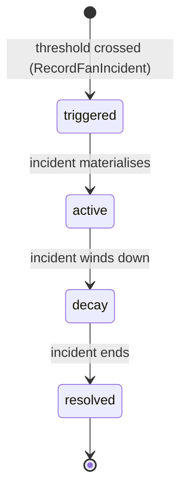
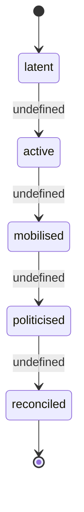

# State Machine - Audience & Atmosphere (draft)

> **Draft transcription.** This note transcribes only the state-machine surface
> that [[../09-Decisions/ADR-0062-audience-and-atmosphere-context]] (accepted /
> binding) and its referenced research actually define. The project is in the
> research / architecture phase, so this FSM note is `binding: false` until the
> development phase. Where the ADR names states but does **not** define the
> transitions, guards, thresholds, timers or decay constants between them, those
> gaps are listed verbatim under [§9 Open decisions](#9-open-decisions) and are
> **not** invented here.

> **Maturity caveat (from the source).** The FMX-32 audit synthesis
> [[../../60-Research/club-management-sub-aggregate-audit-2026-05-28]] §F4.2
> records the "own FSM" criterion as a **partial fire**: Audience & Atmosphere
> "does not yet have a single canonical aggregate FSM in `state-machines/`;
> sub-FSMs (mood, politics-event, campaign-participation) are inline in
> `fan-ecology.md` §2-5." This note therefore captures the **one fully-defined
> lifecycle** (`FanIncident`) plus the **named-but-undefined** cohort, politics
> and trust state surfaces, rather than asserting a transition matrix the source
> does not contain.

Per [[../09-Decisions/ADR-0062-audience-and-atmosphere-context]] §Decision,
Audience & Atmosphere owns five aggregates — `SupporterSegment`,
`AtmosphereSnapshot`, `FanIncident`, `TicketingTrustLedger`,
`NamedSupporterGroup` — plus a **Process Manager / Saga** for the weekly
atmosphere loop + season-ticket campaign cohort feedback + politics-event
escalation + ticketing-trust-shock evaluation. Of these, only `FanIncident`
carries an explicit per-instance lifecycle FSM in the ADR; the remaining
stateful surfaces are named but not yet specified as transition matrices
(see [§9](#9-open-decisions)).

The candidate state machines this context owns:

1. `FanIncident` — per-club, per-incident threshold-triggered politics lifecycle. **Fully defined** (4 states).
2. `SupporterSegment` cohort state — per-club, per-segment mobilisation cohort. **States named, transitions undefined.**
3. Politics-event trigger family — choreo / protest / boycott / ouster-call. **Threshold-triggered; thresholds undefined.**
4. `TicketingTrustLedger` shock-memory state — per-club, per-segment, three-season memory. **Behaviour described, FSM undefined.**

## 1. `FanIncident` states (defined)

ADR-0062 §Decision (`FanIncident` aggregate):

> "threshold-triggered FSM for choreo / protest banner / ticket boycott /
> ouster-call / scarf-down. Each incident has lifecycle (triggered → active →
> decay → resolved). Consumed by Rivalry System as fan-incident sub-score input
> per ADR-0057."

### State definitions

| State | Meaning (per ADR-0062 §Decision) |
|---|---|
| `triggered` | A politics threshold has been crossed; incident created via `RecordFanIncident` (external trigger: ticketing shock, sporting result, sponsor-misalignment event) |
| `active` | Incident is live and exerting its effect (atmosphere / attendance / board-pressure / media) |
| `decay` | Incident is winding down; effect tapering |
| `resolved` | Incident ended; retained in `FanIncidentTimeline` log (terminal) |

`resolved` is the terminal state. Each incident's `type` is one of the
politics-event kinds in §3 (choreo / protest banner / ticket boycott /
ouster-call / scarf-down).

> **Undefined:** the guard/timer that advances `triggered → active`,
> `active → decay` and `decay → resolved`, plus the decay-rate constant and any
> per-type duration, are **not** specified by the ADR. See [§9](#9-open-decisions).

## 2. `SupporterSegment` cohort state (states named; transitions undefined)

ADR-0062 §Context F4.2(2) and §F4.2 of
[[../../60-Research/club-management-sub-aggregate-audit-2026-05-28]] name a
**per-segment cohort FSM**:

> "Per-segment cohort FSM (latent → active → mobilised → politicised →
> reconciled)."

### State definitions

| State | Meaning (inferred from ubiquitous-language list only; ADR gives no formal definition) |
|---|---|
| `latent` | Segment demand/mood present but not organised or expressed |
| `active` | Segment engaged / expressing (the source provides no formal boundary vs `latent`) |
| `mobilised` | Segment organised into collective action (e.g. choreo / banner / boycott organising) |
| `politicised` | Segment action has acquired a political / board-pressure dimension (e.g. ouster-call territory) |
| `reconciled` | Segment grievance defused / trust restored |

> **Undefined (load-bearing):** the ADR enumerates these five states but defines
> **no** transition triggers, guards, threshold values, ordering guarantees,
> reversibility (can a segment de-escalate `politicised → reconciled` directly?
> can it skip states?) or whether `reconciled` is terminal or re-enterable. The
> audit explicitly flags this as a partial fire. Treat the arrows above as the
> as-written enumeration order, **not** a ratified transition matrix. See
> [§9](#9-open-decisions).

## 3. Politics-event trigger family (threshold-triggered; thresholds undefined)

ADR-0062 §Context F4.2(2) names a "politics-event FSM (choreo / protest /
boycott / ouster-call threshold-triggered)". `fan-ecology.md` §5 lists the same
family plus `scarf-down`. These events are realised as `FanIncident` instances
(§1); the trigger family is the set of incident `type`s and their commands:

| Politics event | Trigger condition (per `fan-ecology.md` §5, qualitative only) | Command (ADR-0062 §Public contract) |
|---|---|---|
| Choreo | Ultras mood very high | `RegisterChoreoCampaign` |
| Protest banner | Core mood very low | (via `RecordFanIncident`) |
| Ticket boycott | Ultras + Core mood very low | `ConfirmBoycottThreshold` |
| Ouster-call (owner ouster) | Sustained very-low mood / trust collapse (chain event) | `EscalateOusterCall` |
| Scarf-down | (listed in `fan-ecology.md` §5/§5a as a mobilisation style; condition not stated) | (via `RecordFanIncident`) |

Politics events surface as Notification inbox cards with Accept / Decline /
Defer actions (`fan-ecology.md` §5; consumed via
[[../09-Decisions/ADR-0043-notification-and-messaging-platform]]).
`EscalateOusterCall` emits `OusterCallEscalated`, consumed by Club Management as
a board-pressure signal and by Manager & Legacy for the archetype hook.

> **Undefined:** the concrete mood / loyalty / volatility threshold values that
> fire each event (the source says only "very high" / "very low"), and any
> ouster-call escalation **tiers** (the `OusterCallEscalationBoard` read model
> exposes a "current ouster-call escalation tier" but the tier set is not
> enumerated). See [§9](#9-open-decisions).

## 4. `TicketingTrustLedger` shock-memory state (behaviour described; FSM undefined)

ADR-0062 §Decision (`TicketingTrustLedger` aggregate):

> "persistent trust state per segment with three-season shock memory ... Trust
> shocks fire on aggressive-pricing detection, sponsor-misalignment events,
> fan-engagement scandals; decay rate per segment varies."

The research source
[[../../60-Research/fan-demand-price-elasticity-2026-05-28]] §"Fan trust and
fairness state" describes `ticketingTrustState` as a **persistent memory** whose
signals raise or lower trust, primarily affecting *future* behaviour
(season-ticket renewal, boycott risk, protests, atmosphere, sponsor-fit). It is
modelled there as accumulated signal memory, **not** an enumerated discrete-state
machine.

| Trust signal (source: elasticity research) | Effect |
|---|---|
| Price jump above profile guardrail | immediate mood drop, future renewal risk (shock) |
| Opaque dynamic pricing | trust drop, press/supporter event risk (shock) |
| Repeated top-match surcharges | long-term trust erosion (shock) |
| Sponsor-misalignment event | trust shock (ADR-0062) |
| Fan-engagement scandal | trust shock (ADR-0062) |
| Season-ticket value preserved / fan-first inventory protected | renewal support, lower backlash (recovery) |
| Transparent communication / phased change | reduced backlash (recovery) |
| Reconciliation event (`ResetTicketingTrustShock`) | clears trust-shock memory |

Lifecycle as described (no enumerated state names in the source): a **shock**
enters the per-segment ledger, persists with a **three-season memory window**,
**decays** at a per-segment rate, and can be **cleared** by an explicit
reconciliation event via the `ResetTicketingTrustShock` command. State changes
emit `TicketingTrustStateChanged`, consumed by CommercialPortfolio for pricing
per [[../09-Decisions/ADR-0058-club-economy-commercial-impact-boundary]].

> **Undefined (load-bearing):** the discrete trust states (if any), the
> per-segment decay constants, the magnitude of each shock, the exact mechanics
> of the "three-season" expiry boundary, and the definition of a qualifying
> "reconciliation event". These are **not** specified by the ADR or the cited
> research. See [§9](#9-open-decisions).

## 5. Trigger sources

| Trigger / command | Source |
|---|---|
| `RecordFanIncident` | External trigger — ticketing shock, sporting result (`MatchResolved` from Match), sponsor-misalignment (`CommercialContractActivated` / `CommercialBreachOpened` from CommercialPortfolio) |
| `RegisterChoreoCampaign` | Player / fan-organised choreo planning command |
| `ConfirmBoycottThreshold` | Boycott threshold crossed for one or more segments |
| `EscalateOusterCall` | Ouster-call chain escalation → board-pressure signal |
| `ResetTicketingTrustShock` | Reconciliation event clears trust-shock memory |
| `OnboardNamedSupporterGroup` | Opt-in/default-off onboarding at save/scenario setup or local/P2P overlay import |
| `UpdateSegmentDemand` | Internal command — weekly atmosphere tick |
| `ApplyAtmosphereSnapshot` | Internal command — per-fixture atmosphere computation |
| `SeasonAdvanced` (consumed) | League Orchestration — schedules weekly atmosphere tick + segment population evolution |
| `RivalryTierTransitioned` (consumed) | Rivalry System — atmosphere multiplier + fan-incident probability uplift |
| `StadiumCapacitySnapshot` (consumed) | Club Management StadiumOperations — utilisation input |
| `SeasonTicketCampaignClosed` (consumed) | CommercialPortfolio — renewal-cohort feedback |
| `EffectiveRuleSet` (consumed) | Regulations & Compliance — UEFA SLO + GDPR Art. 6/9 + DSA Art. 16 obligations |

Per ADR-0062 §Determinism and storage rules: the weekly atmosphere tick uses
`AtmosphereRng(saveId, clubId, week)`; politics-event triggers use
`PoliticsRng(saveId, clubId, week)`; trust-shock evaluation uses
`TrustRng(saveId, clubId, week)` — all sub-labels of `WorldRng` per
[[../09-Decisions/ADR-0018-systemic-events-and-player-lifecycle]] §3. No
cross-RNG draws; no `Math.random` / `Date.now` in simulation paths;
deterministic clocks only.

## 6. Effect on other contexts

ADR-0062 §Public contract direction — draft events and their consumers:

| Event | Consumer | Effect |
|---|---|---|
| `FanDemandForecasted` | CommercialPortfolio | Season-ticket campaign + per-fixture pricing input (Snapshot) per ADR-0061 |
| `FanIncidentLogged` | Rivalry System | Fan-incident sub-score input per [[../09-Decisions/ADR-0057-rivalry-system-context]] |
| `FanIncidentLogged` | Notification | Storylet copy per [[../09-Decisions/ADR-0043-notification-and-messaging-platform]] |
| `AtmosphereSnapshotPublished` | Matchday-Event-Engine | Atmosphere multiplier + security risk per [[../../50-Game-Design/matchday-event-engine]] |
| `AtmosphereSnapshotPublished` | Match | Home-advantage multiplier |
| `AtmosphereSnapshotPublished` | Notification | Matchday narrative copy |
| `SegmentRenewalProbabilityUpdated` | CommercialPortfolio | Season-ticket campaign waitlist allocation (FMX-43) |
| `TicketingTrustStateChanged` | CommercialPortfolio | Pricing decisions per [[../09-Decisions/ADR-0058-club-economy-commercial-impact-boundary]] |
| `OusterCallEscalated` | Club Management | Board-pressure signal |
| `OusterCallEscalated` | Manager & Legacy | Archetype hook per [[../09-Decisions/ADR-0051-manager-and-legacy-context]] |
| `OusterCallEscalated` | Notification | Narrative copy |
| `BoycottThresholdConfirmed` / `ChoreoCampaignRegistered` | (politics-event log + Notification) | Inbox cards |
| `FanPipelineQualityUpdated` | Manager & Legacy | Archetype-hook aggregation |
| `NamedSupporterGroupOnboarded` | (overlay roster) | Opt-in/default-off fictional group facts + optional opaque People actor ref |
| `SegmentMoodUpdated` | (internal projection) | Drives `SegmentMoodBoard` read model (consumed by Notification + Narrative) |

All events are emitted through the [[../09-Decisions/ADR-0028-postgres-transactional-outbox]]
transactional outbox; consumers attach via ACL. A&A writes no money facts —
the ledger is owned by Club Management per
[[../09-Decisions/ADR-0050-club-economy-accounting-ledger]].

## 7. Persistence model

Per-save schema (`save_<uuidv7hex>`) per
[[../09-Decisions/ADR-0027-postgres-data-model]]; no platform-scope cross-save
state. ADR-0062 §Decision + §Determinism and storage rules name the following
stored surfaces (concrete Drizzle table shapes are **not** specified by the ADR
and are left to implementation):

- Per-segment state (`SupporterSegment`): population, loyalty floor, mood,
  volatility, attendance probability, renewal probability, price sensitivity,
  propensity (catering / merch / hospitality / sponsor-fit), reference-price
  memory, and the cohort state of §2.
- Atmosphere history (`AtmosphereSnapshot`): per-fixture atmosphere multiplier.
- Fan-incident log (`FanIncident`): the §1 lifecycle + politics-event log,
  surfaced as `FanIncidentTimeline`.
- Ticketing-trust state (`TicketingTrustLedger`): per-segment trust state with
  three-season shock memory (§4).
- Named-group overlay (`NamedSupporterGroup`): opt-in/default-off fictional
  group facts + optional opaque People actor ref per
  [[../09-Decisions/ADR-0052-people-persona-and-skills-context]].

**GDPR / DSA posture (ADR-0062):** segment-level aggregate state only; no
individual fan records inside `SupporterSegment`. `NamedSupporterGroup` stores
fictional group facts only; any representative is an optional opaque People
actor/persona ref. A&A stores no People internals, real fan/member records,
handles, photos, account profiles or special-category labels. MVP Community
Overlay (segment-name / atmosphere-multiplier / named-group archetype packs per
[[../09-Decisions/ADR-0059-community-overlay-pipeline-context]]) remains
local/P2P; hosted UGC is future-scope behind a DSA/privacy/moderation/legal
gate. New-save legacy + community-overlay seeds are copied into the save
snapshot at creation only and never re-read during a running save.

## 8. Test strategy

Transcribed / implied from ADR-0062 §Determinism and storage rules (the ADR
does not give an explicit test plan; the following follow the house pattern in
[[../09-Decisions/ADR-0014-state-machines]] and the determinism rules):

- **Determinism tests:** replaying the same save snapshot + same world ticks
  reproduces identical segment cohort, atmosphere, fan-incident and
  trust-shock state, using the `AtmosphereRng` / `PoliticsRng` / `TrustRng`
  sub-labels with no cross-RNG draws.
- **FSM property tests (`FanIncident`):** every reachable state has a path to
  `resolved`; no transitions outside the §1 matrix; no orphan states.
- **Cross-context contract tests:** `FanDemandForecasted` consumed by
  CommercialPortfolio; `FanIncidentLogged` consumed by Rivalry; `AtmosphereSnapshotPublished`
  consumed by Matchday-Event-Engine + Match; `TicketingTrustStateChanged`
  consumed by CommercialPortfolio — each matches its published contract.
- **Privacy/IP fitness checks:** no individual fan records in `SupporterSegment`;
  `NamedSupporterGroup` holds only fictional facts + an opaque People ref; sample
  group / chant / banner names are evocative-but-clearly-not-real per GD-0015 /
  ADR-0007.

> Cohort-FSM, politics-threshold and trust-shock property tests cannot be fully
> specified until the open decisions in §9 are resolved.

## 9. Open decisions

The following are **named but not defined** by ADR-0062 or its referenced
research. They are recorded here (not invented) and must be resolved before this
FSM note can become `binding: true`.

1. **Cohort FSM transitions undefined.** ADR-0062 §F4.2 names the five cohort
   states (`latent → active → mobilised → politicised → reconciled`) but defines
   no triggers, guards, threshold values, ordering guarantees, reversibility, or
   terminal/re-enterable status. The FMX-32 audit explicitly records this as a
   *partial fire* (no single canonical aggregate FSM yet).
2. **Politics-event thresholds undefined.** Choreo / protest / boycott /
   ouster-call / scarf-down are "threshold-triggered", but the actual mood /
   loyalty / volatility values ("very high" / "very low") that fire each event
   are not specified. Ouster-call escalation **tiers** (`OusterCallEscalationBoard`)
   are referenced but not enumerated.
3. **`FanIncident` decay mechanics undefined.** The 4-state lifecycle is defined,
   but the decay-rate constant, the active-duration timer, and the guards for
   `triggered → active`, `active → decay` and `decay → resolved` are not.
4. **`TicketingTrustLedger` FSM undefined.** "Three-season shock memory" with
   per-segment decay is described qualitatively, but the discrete trust states
   (if any), per-segment decay constants, shock magnitudes, the exact
   three-season expiry boundary, and the definition of a qualifying
   "reconciliation event" (for `ResetTicketingTrustShock`) are not specified.
5. **Segment mood: signal vs banded FSM.** `fan-ecology.md` §2-3 models mood as
   a continuous scalar (-100..+100) with loyalty lag, volatility and
   attendance-floor thresholds. Whether `SegmentMood` should be modelled as
   discrete banded states (e.g. green/amber/red per `fan-ecology.md` §8 UI) or
   remain a pure signal is undecided.
6. **Season-ticket campaign sub-state ownership.** The 8-state campaign lifecycle
   (FMX-43) is owned by CommercialPortfolio / Ticketing & Settlement per
   [[../09-Decisions/ADR-0061-club-management-sub-aggregate-audit]], not A&A.
   Which cohort-feedback sub-states (if any) A&A itself owns is referenced but
   not enumerated.
7. **`NamedSupporterGroup` lifecycle.** The aggregate has identity archetype /
   red lines / mobilisation style / influence band / visibility tier / policy
   version, but no onboarding/enabled/retired FSM is defined; whether it needs
   its own state machine is open.
8. **Saga / Process Manager state model.** ADR-0062 names a Process Manager
   orchestrating weekly atmosphere tick → cohort update → campaign-cohort
   feedback → politics-event evaluation → trust-shock decay, but does not specify
   the saga's own state model or the ordering guarantees between the sub-FSMs.
