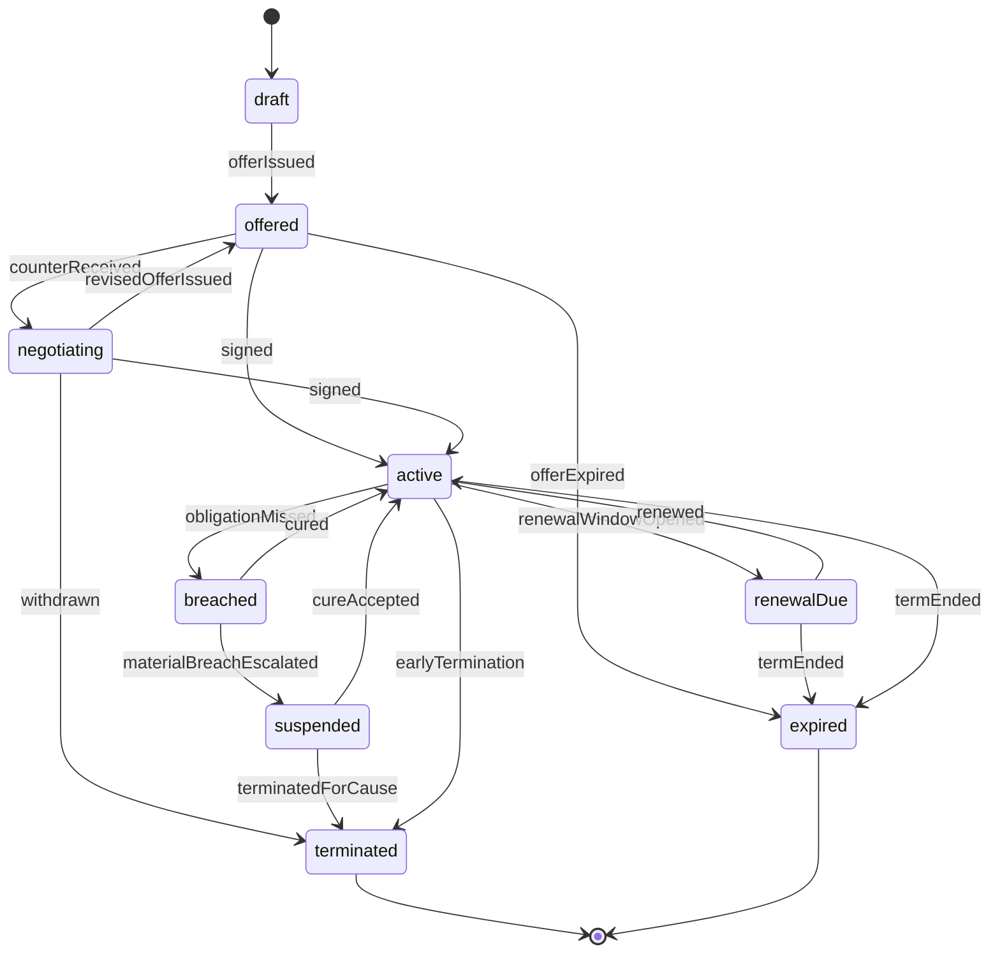
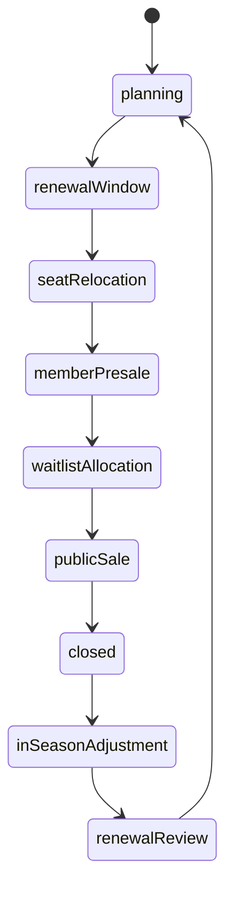
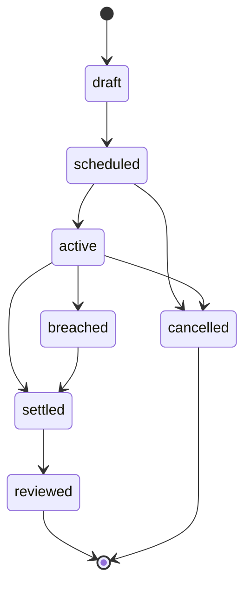
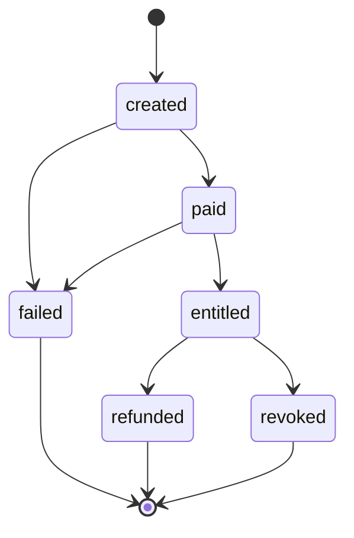

# State Machine - CommercialPortfolio

> **Source-faithful transcription.** This note transcribes only the lifecycles
> defined by [[../09-Decisions/ADR-0058-club-economy-commercial-impact-boundary]]
> (accepted/binding) and the research + implementation notes it references
> ([[../../60-Research/commercial-contract-lifecycle-and-breach-model-2026-05-28]],
> [[../../60-Research/season-ticket-lifecycle-and-accounting-2026-05-28]],
> [[../../30-Implementation/club-economy-commercial-contracts]]). Guard
> thresholds, cure-window lengths, cooldown timers, decay constants and renewal
> windows are **calibration inputs only** in the source and are listed under
> [§Open decisions](#open-decisions); they are **not** invented here. This note
> is `binding: false` and becomes binding only when the project enters the
> development phase per [[../09-Decisions/ADR-0014-state-machines]].

CommercialPortfolio (FMX-32 bounded context, ADR-0058 §Ratification note;
ownership per ADR-0061) owns commercial policy, the commercial contract
lifecycle, accrual schedules and per-fixture settlement. Club Management remains
the sole finance-ledger writer (ADR-0050) and posts ledger entries from the
settlement events emitted here via Customer-Supplier + ACL.

The context owns these coordinated state machines as defined by the source notes:

1. `CommercialContract` — shared lifecycle for sponsorship, catering,
   merchandise, hospitality, supplier and venue-activation deals (FMX-44).
2. `SeasonTicketCampaign` — per-club per-season campaign lifecycle, operating on
   fan-group cohorts (FMX-42/43).
3. `FanEventCampaign` — per fan-service campaign lifecycle (FMX-48).
4. `InvestorEntitlement` — server-authoritative singleplayer entitlement grant
   state machine (FMX-50; ADR-0058 §FMX-50 boundary note).

Per ADR-0058 §FMX-44, all commercial contract families share **one** lifecycle
shell and add family-specific schedules rather than separate state machines
(Option B "separate lifecycle per family" was rejected). The non-contract
ticketing/operating settlement surfaces (`MatchdayOperatingCostProfile`,
`CompetitionRevenueProfile` settlement) are per-fixture settlement Sagas /
profiles, not standalone aggregate FSMs in the source, and are therefore not
modelled here as state machines.

## 1. `CommercialContract` states

Transcribed from
[[../../60-Research/commercial-contract-lifecycle-and-breach-model-2026-05-28]]
§Recommended lifecycle (canonical diagram) and confirmed in
[[../../30-Implementation/club-economy-commercial-contracts]] §`CommercialContract`.

> `renewed` is **not** a long-lived state. Per source, it is an event that
> creates a new `contractVersion` linked to the previous one and returns the
> contract to `active`.

### State definitions

| State | Meaning |
|---|---|
| `draft` | Club or counterparty has created a draft offer; not yet visible to the counterparty |
| `offered` | Offer is visible to the counterparty; awaiting acceptance, counter or expiry |
| `negotiating` | Counterparty has proposed changed terms; revised offers loop back to `offered` |
| `active` | Signed contract is effective; obligations, cash schedule and recognition schedule run |
| `renewalDue` | Renewal / first-refusal window is open per `renewalPolicy` |
| `breached` | A curable/material/critical breach case is open against an active contract |
| `suspended` | Rights/operation temporarily paused after a material breach escalated |
| `terminated` | Contract ended early — by cause, convenience or mutual agreement (**terminal**) |
| `expired` | Term ended with no renewal, or an offer lapsed before signature (**terminal**) |

Terminal states: `terminated`, `expired`. (`breached` and `suspended` are
recoverable back to `active`; they are not terminal.)

### Transition triggers

| From | To | Trigger / event |
|---|---|---|
| `draft` | `offered` | `offerIssued` (`CommercialOfferIssued`) |
| `offered` | `negotiating` | `counterReceived` (`CommercialCounterReceived`) |
| `negotiating` | `offered` | `revisedOfferIssued` |
| `offered` | `active` | `signed` (`CommercialContractActivated`) |
| `negotiating` | `active` | `signed` (`CommercialContractActivated`) |
| `offered` | `expired` | `offerExpired` (`CommercialContractExpired`) |
| `negotiating` | `terminated` | `withdrawn` (`CommercialOfferWithdrawn`) |
| `active` | `renewalDue` | `renewalWindowOpened` (`CommercialRenewalWindowOpened`) |
| `renewalDue` | `active` | `renewed` (`CommercialContractRenewed`; new `contractVersion`) |
| `renewalDue` | `expired` | `termEnded` (`CommercialContractExpired`) |
| `active` | `breached` | `obligationMissed` (`CommercialObligationMissed` → `CommercialBreachOpened`) |
| `breached` | `active` | `cured` (`CommercialBreachCured`) |
| `breached` | `suspended` | `materialBreachEscalated` (`CommercialContractSuspended`) |
| `suspended` | `active` | `cureAccepted` |
| `suspended` | `terminated` | `terminatedForCause` (`CommercialContractTerminated`) |
| `active` | `terminated` | `earlyTermination` (`CommercialContractTerminated`) |
| `active` | `expired` | `termEnded` (`CommercialContractExpired`) |

### Breach severity tiers

Breach handling uses game-level severity tiers (ADR-0058 §FMX-44; research
§Breach severity model). Severity selects the post-`breached` path but is a
contract-policy attribute, not a separate state:

| Severity | Default consequence (source-described) |
|---|---|
| `curable` | Cure timer + make-good option; small fan/service hit; returns to `active` on `cured` |
| `material` | Penalty / fee reduction / suspended rights / renegotiation; may escalate to `suspended` |
| `critical` | Termination for cause; damages/repayment; reputation shock and **category cooldown** |

> The "category cooldown" after a critical breach (and the `breached` repeat
> threshold that escalates cured breaches) is described in the source but its
> duration / threshold values are calibration inputs only — see
> [§Open decisions](#open-decisions). Cooldown is a blocked-category policy
> consequence, **not** a distinct `CommercialContract` lifecycle state in the
> source.

## 2. `SeasonTicketCampaign` states

Transcribed from
[[../../60-Research/season-ticket-lifecycle-and-accounting-2026-05-28]] §Lifecycle
(canonical diagram + state table) and confirmed in
[[../../30-Implementation/club-economy-commercial-contracts]]
§`SeasonTicketCampaign`. The source diagram defines **nine** ordered campaign
states forming one season-scoped cycle (the FMX-149 task brief referenced an
"8-state" campaign; the authoritative source lists nine — see
[§Open decisions](#open-decisions)).

### State definitions

| State | Meaning |
|---|---|
| `planning` | Board/finance sets share targets, discount bands, package rules and seat-class quotas; draft `TicketingPolicy`, campaign forecast, trust warnings |
| `renewalWindow` | Existing holders / cohorts renew or churn based on price, form, trust and package value |
| `seatRelocation` | Renewed holders may move seat class or block if inventory allows; accessibility/family/premium exceptions |
| `memberPresale` | Members / loyalty tiers / fan groups buy before public sale |
| `waitlistAllocation` | Scarce clubs allocate remaining seats from waitlist rules; waitlist pressure + unmet demand |
| `publicSale` | If inventory remains, sell packages publicly; weaker-loyalty cohort mix |
| `closed` | Campaign finalised before season start; accounting schedule frozen except defined adjustments |
| `inSeasonAdjustment` | No-show, seat-release, compensation and cup add-on flows update liabilities and utilisation |
| `renewalReview` | End-of-season eligibility and trust evaluation; renewal base + price-hike memory for next campaign |

> The source notes the cycle is "deterministic and season-scoped". The diagram
> shows a single linear progression with `renewalReview --> planning` closing
> the cycle into the next season's campaign; no explicit skip/early-exit
> transitions are defined. Cancelled / inaccessible included matches are modelled
> as **events inside `inSeasonAdjustment`**, not as separate campaign states
> (source §Lifecycle implementation note).

### Transition triggers

The source diagram does **not** label per-edge triggers for the
`SeasonTicketCampaign` cycle (unlike the `CommercialContract` lifecycle). The
window fields on the campaign (`renewalWindow`, `seatRelocationWindow`,
`memberPresaleWindow`, `earlyBirdWindow`) and the season clock imply
deterministic window-driven transitions, but the exact trigger commands/events
per edge are not enumerated in the source — see [§Open decisions](#open-decisions).

## 3. `FanEventCampaign` states

Transcribed from [[../../30-Implementation/club-economy-commercial-contracts]]
§`FanEventCampaign` (lifecycle block + `lifecycleState` field), aligned with
ADR-0058 §FMX-48.

### State definitions

| State | Meaning |
|---|---|
| `draft` | Campaign drafted (kind, budget, sponsor contribution, eligibility, KPIs) |
| `scheduled` | Campaign scheduled (`FanEventCampaignScheduled`); cost commitment pending |
| `active` | Campaign running; cost committed, sponsor contribution recognised, segment effects published |
| `breached` | Obligation/fulfilment miss during the active campaign; resolves into `settled` |
| `settled` | Costs, sponsor contributions, refunds and make-goods posted (`FanEventCampaignSettled`) |
| `reviewed` | KPI/make-good review complete; cooldown applied (`FanEventCooldownApplied`) (**terminal**) |
| `cancelled` | Campaign cancelled before completion (`FanEventCampaignCancelled`); make-good rules may apply (**terminal**) |

Terminal states: `reviewed`, `cancelled`. The `cooldownPolicy` /
`FanEventCooldownApplied` bounds campaign frequency by kind, segment and sponsor
category (ADR-0058 §FMX-48); its minimum-gap values are calibration inputs — see
[§Open decisions](#open-decisions).

## 4. `InvestorEntitlement` states

Transcribed from ADR-0058 §FMX-50 boundary note and
[[../../30-Implementation/club-economy-commercial-contracts]]
§`InvestorEntitlementGrant` (`lifecycleState` field). This is a
server-authoritative, idempotent, **account-bound** (not save-bound) state
machine for the singleplayer Investor cash purchase; CommercialPortfolio owns
the entitlement grant policy, Club Management posts the single
`investor_entitlement_cash_grant` ledger entry (ADR-0050).

### State definitions

| State | Meaning |
|---|---|
| `created` | Purchase initiated (`InitiateInvestorPurchase`); awaiting payment confirmation |
| `paid` | Payment confirmed by provider (`apple-iap` / `google-iap` / `web-psp` behind `PaymentProviderPort`) |
| `entitled` | Cash grant applied in SP (`ConfirmInvestorEntitlement`, idempotent by `storeTransactionRef`); `paid → entitled` may fire **only once** |
| `refunded` | Refund processed; cash reversed/flagged per policy in SP (**terminal**) |
| `revoked` | Entitlement revoked / charged back; cash reversed/flagged per policy in SP (**terminal**) |
| `failed` | Payment failed (`InvestorPaymentFailed`) (**terminal**) |

Terminal states: `refunded`, `revoked`, `failed`. Invariants from source:
SP-only (multiplayer/leaderboard/shared-state surfaces hard-denied), offline
grants deferred until server-confirmed SP application, two-layer idempotency
(provider delivery/event id dedupe at the ADR-0128 receiver + entitlement dedupe
by `storeTransactionRef`), and no mutation of ownership/board/fan/sponsor/debt/
compliance state.

## 5. Trigger sources

| Trigger source | Drives |
|---|---|
| Player commands | `IssueCommercialOffer`, `CounterCommercialOffer`, `AmendCommercialContract`, `RenewCommercialContract`, `TerminateCommercialContract`, `OpenSeasonTicketCampaign`, `ScheduleFanEventCampaign`, `InitiateInvestorPurchase` (ADR-0058 §Public contract direction) |
| World/season clock | Renewal-window open, term end, season-ticket window progression (deterministic, season-scoped) |
| Obligation evaluation | `obligationMissed` → breach opening/escalation per `breachPolicy` |
| Provider webhooks | `paid` / `entitled` / `refunded` / `revoked` transitions, accepted only after ADR-0128 receiver verification + replay/dedupe |
| Consumed facts | `FanDemandForecast` (Audience & Atmosphere, ADR-0062), `StadiumCommercialSnapshot` (Stadium Operations, ADR-0061), `FixtureCommercialProfile` / `CompetitionRevenueProfile` (League), `RivalryCommercialSignal` (Rivalry), `EffectiveRuleSet` (Regulations) — these influence transitions but do not own them |

## 6. Emitted events (lifecycle-relevant)

Per ADR-0058 §Public contract direction and
[[../../30-Implementation/club-economy-commercial-contracts]]. Settlement-only
and cup/matchday-operating-cost events (e.g. `MatchdayStewardingCostPosted`,
`CupGateShareSettled`) are emitted by the per-fixture settlement Sagas and are
not lifecycle transitions of the FSMs above; they are listed in the ADR/impl
note, not duplicated here.

- **CommercialContract:** `CommercialOfferCreated`, `CommercialOfferIssued`,
  `CommercialCounterReceived`, `CommercialOfferWithdrawn`,
  `CommercialContractActivated`, `CommercialContractAmended`,
  `CommercialRenewalWindowOpened`, `CommercialContractRenewed`,
  `CommercialContractExpired`, `CommercialObligationMissed`,
  `CommercialExclusivityConflictDetected`, `CommercialBreachOpened`,
  `CommercialBreachCured`, `CommercialMakeGoodGranted`,
  `CommercialPenaltyApplied`, `CommercialContractSuspended`,
  `CommercialContractTerminated`, `CommercialContractSuperseded`.
- **SeasonTicketCampaign:** `TicketingPolicyChanged`,
  `SeasonTicketCampaignClosed` (other per-state events are not enumerated in the
  source — see [§Open decisions](#open-decisions)).
- **FanEventCampaign:** `FanEventCampaignScheduled`,
  `FanEventCampaignCostCommitted`, `FanEventSponsorContributionRecognised`,
  `FanEventCampaignCancelled`, `FanEventMakeGoodGranted`,
  `FanEventCampaignSettled`, `FanEventLowUptakeRecorded`,
  `FanEventSegmentEffectPublished`, `FanEventCooldownApplied`.
- **InvestorEntitlement:** `InvestorCashGrantPosted`,
  `InvestorEntitlementRevoked`, `InvestorPaymentFailed`,
  `InvestorDisclosureAcknowledged`.

## 7. Persistence model

Per [[../09-Decisions/ADR-0027-postgres-data-model]]: per-save schema, opaque
branded UUIDv7 cross-context references (no cross-context `references()`),
embedded read-together objects as `jsonb`, lifecycle `state` columns with
`CHECK IN (state_names)`. Lifecycle/effect events flow via the transactional
outbox per [[../09-Decisions/ADR-0028-postgres-transactional-outbox]]. The exact
Drizzle table set (e.g. `commercial_contract`, `commercial_contract_version`,
`season_ticket_campaign`, `fan_event_campaign`, `investor_entitlement`) is not
fixed by the source ADR and is left to the implementation ADR — see
[§Open decisions](#open-decisions). The amendment/renewal model keeps prior
`contractVersion` rows as history (`CommercialContractSuperseded`).

## 8. Relationship to the player-contract FSM

The `CommercialContract` lifecycle is a sibling pattern to the player-contract
FSM in [[../09-Decisions/ADR-0073-player-contract-lifecycle-fsm]] (different
aggregate, different context) and is governed by the same state-machine
conventions in [[../09-Decisions/ADR-0014-state-machines]]. They are not shared
code in the source; the cross-reference is for convention consistency only.

## Open decisions

The following are **not pinned by ADR-0058 or its referenced research** and must
not be invented in code. Each is a calibration input or an unspecified rule in
the source:

- **CommercialContract breach guards:** cure-window length, material-breach
  repeat threshold, and the duration of post-critical-breach **category
  cooldown** are calibration profile data only (research §Breach severity model:
  "Cure windows are profile data, not hard-coded legal values").
- **CommercialContract "cooldown" as a state:** the FMX-149 task brief expected
  an explicit "+ cooldown" on the contract FSM. The source models cooldown as a
  **blocked-category policy consequence** of a critical breach (and as
  `FanEventCooldownApplied` for fan-service campaigns), **not** as a distinct
  `CommercialContract` lifecycle state. Whether cooldown should be promoted to a
  modelled state is undecided.
- **SeasonTicketCampaign state count:** the task brief referenced an "8-state"
  campaign FSM, but the authoritative source diagram defines **nine** ordered
  states. The discrepancy needs confirmation (which state, if any, should be
  merged/dropped).
- **SeasonTicketCampaign per-edge triggers:** the source diagram shows the
  ordered cycle but does not label trigger commands/events per transition, nor
  per-state emitted events beyond `TicketingPolicyChanged` /
  `SeasonTicketCampaignClosed`. Whether window-clock ticks or explicit player
  commands drive each transition is unspecified.
- **SeasonTicketCampaign skip/early-exit edges:** only the linear cycle is
  defined; whether campaigns can skip stages (e.g. no waitlist for non-scarce
  clubs) or abort is not stated.
- **Window/timer values:** renewal-window, early-bird, seat-relocation,
  member-presale lengths and fan-event cooldown minimum gaps are calibration
  ranges, never final constants (ADR-0058 §FMX-44/§FMX-48).
- **Numeric calibration bands** (cogs/waste/returns/markdown/perCapita,
  discount bands, risk-tier cost multipliers) are explicitly "calibration ranges,
  not constants" and are out of scope for the FSM.
- **Persistence table set + state-column CHECK names** are left to the
  implementation ADR; only the per-save / outbox / versioned-history pattern is
  fixed by ADR-0027/0028.
- **InvestorEntitlement final gates:** payment vendor (MoR vs direct),
  refund-of-spent-cash policy and activation timing remain HITL/legal gates
  (ADR-0058 §FMX-50; ADR-0063 proposed).
