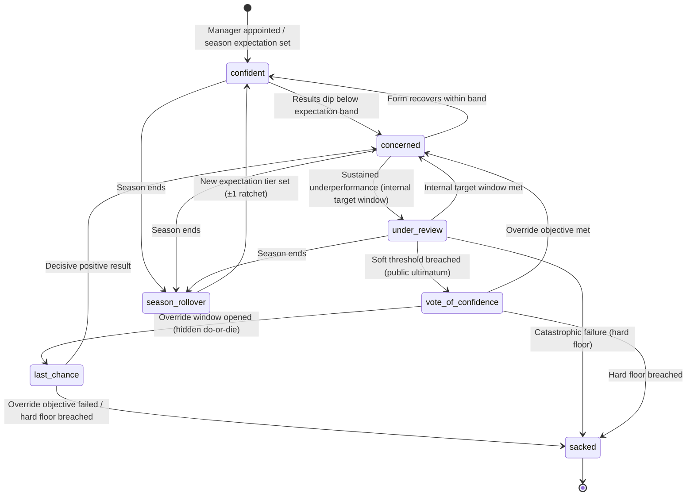

# State Machine - Dynasty Board & Ownership

Three interlocking state machines for the late-game dynasty arc. Owning context:
**Club Management** (ADR-0079 proposed), as a **Board & Ownership** sub-aggregate
set alongside the existing finance ledger / board-pressure / insolvency-stage
ownership (ADR-0050). **Manager & Legacy** consumes emitted facts (`ManagerSacked`,
run-end outcomes) for run analysis only. **AI World Simulation** (ADR-0071)
supplies `GiantCollapseTriggered` / `RisingRivalTriggered` as ownership-transition
triggers. All numeric magnitudes are **FMX-52 calibration** behind
`dynastyModelVersion`.

Determinism (ADR-0079 §D3): board-ambition + confidence + sacking are **pure
deterministic** (no RNG); ownership-transition + insolvency stochastic draws use
**`WorldAiMgmtRng`** sub-labels, resolved on a **season-end structural pass**.

## 1. BoardRelationship FSM (deterministic)

Per club, per manager tenure. The expectation **tier** (1-8) is set
deterministically at season start; the **confidence state** drives the 2-phase
sacking loop within the season.



### State definitions

| State | Meaning |
|---|---|
| `confident` | Position within the expectation band; board supportive. |
| `concerned` | Below band or a poor run; informal internal checkpoint. |
| `under_review` | Sustained underperformance; explicit internal target window ("X points from Y games"). |
| `vote_of_confidence` | Soft threshold breached; public backing + ultimatum (board-confidence meeting → temporary override objective). |
| `last_chance` | Hidden do-or-die window; one bad result triggers sacking. |
| `sacked` | Run-ending dismissal; emitted to Manager & Legacy. |
| `season_rollover` | End-of-season transient; recompute next tier with the ±1 ratchet. |

### Expectation tier ladder (set at `season_rollover`)

Tier 1 Avoid relegation · 2 Lower mid-table · 3 Mid-table · 4 Top half ·
5 Europe/continental qualification · 6 Title challenge · 7 Win the title ·
8 Win title + deep continental run. Tier = f(wage/squad-value rank, prior finish,
owner ambition). **Ratchet:** finish ≥ target+2 → +1 tier; finish ≤ target−2 →
−1 tier (+ confidence penalty); bounded to ±1/season (DB8).

## 2. OwnershipTransition FSM (stochastic; WorldAiMgmtRng)

Per club. Resolved on the season-end structural pass.

```mermaid
stateDiagram-v2
    [*] --> stable
    stable --> takeover_candidate: instability_score >= threshold OR GiantCollapse/RisingRival consumed
    takeover_candidate --> stable: No qualified buyer this pass (cooldown set)
    takeover_candidate --> sale_in_progress: Buyer emerges (archetype draw)
    sale_in_progress --> stable: Withdrawn / blocked by Owners'-&-Directors' test
    sale_in_progress --> new_owner: Completion (fit-and-proper passed)
    new_owner --> stable: Effect vector applied (budget + expectation reset); cooldown set
    new_owner --> user_decision: Manager decision point
    user_decision --> new_owner: align | resist_publicly | leave_gracefully
```



### State definitions

| State | Meaning |
|---|---|
| `stable` | Ownership settled; no active transition (default). |
| `takeover_candidate` | `instability_score ≥ threshold` (or a consumed drift fact); eligible for a takeover this pass. |
| `sale_in_progress` | Buyer emerged; archetype drawn; fit-and-proper / Owners'-&-Directors' check pending. |
| `new_owner` | Completion; new `OwnerProfile` assigned, budget philosophy + expectations reset. |
| `user_decision` | Manager decision point: align / resist publicly / leave gracefully (job-security & reputation consequences). |

`instability_score` (from late-game-systems §6.3): financial_stress + performance +
ownership-tenure/satisfaction factors; ≥ threshold → candidate (threshold = calibration).
Caps/cooldowns (DB6): ≤1 takeover/league/(5-7 seasons), ≤2 globally/season,
per-club cooldown.

## 3. InsolvencyCase FSM (stochastic; WorldAiMgmtRng) — core MVP

`InsolvencyCaseStage` is the shared ADR-0079/GD-0030 enum consumed by ADR-0050:
`stable`, `stressed`, `cash_flow_crisis`, `under_embargo`, `administration`, `rescued`,
reserved `liquidated`. Older finance labels (`healthy`, `watch`, `overdraft`, `freeze`,
`arrears`, `licence_review`, `recovery`, `run_end`) are read-model/UI aliases only, not a
second ledger FSM.

Per club. Extends ADR-0050's "staged insolvency state". Reserved tail dashed.

```mermaid
stateDiagram-v2
    [*] --> stable
    stable --> stressed: Wages/revenue high; rising debt
    stressed --> stable: Finances recover
    stressed --> cash_flow_crisis: Late payments; arrears
    cash_flow_crisis --> stressed: Cash restored
    cash_flow_crisis --> under_embargo: Rule breach (registration restriction)
    under_embargo --> stressed: Breach cured
    under_embargo --> administration: Annual insolvency audit fails (no rescue this pass)
    cash_flow_crisis --> administration: Winding-up pressure
    administration --> rescued: New-owner / White-Knight rescue (creditor write-off)
    rescued --> stable: Post-admin legacy penalty applied
    administration --> liquidated: RESERVED (post-MVP)
    liquidated --> [*]: RESERVED -> PhoenixClubFounded
```



### State definitions

| State | Meaning |
|---|---|
| `stable` | Solvent; no distress. |
| `stressed` | Wage/revenue ratio high, debt rising. |
| `cash_flow_crisis` | Late payments / arrears; embargo risk. |
| `under_embargo` | Registration restricted (free/low-wage signings only). |
| `administration` | Insolvency event: **points deduction** + transfer embargo + administrator **fire-sale** + enforced wage cap + reputation hit. |
| `rescued` | New-owner / White-Knight rescue; creditors partially written off; lasting reputation damage; **"Saved the Club"** legacy credit if the manager stayed. |
| `liquidated` | **RESERVED (post-MVP):** assets/IP sold → `PhoenixClubFounded`; touches league registration + save structure. |

Player paths (GD-0030 §5): **heroic save** (`rescued` + survival → legacy credit),
**abandon** (`ManagerAbandonedClub` before administration → light legacy penalty),
**inside administration** (expectations flip to "fight for survival", underdog bonus).

Ledger posture (ADR-0101 D4 / FMX-146): stage changes, administration entry, points
deductions, embargoes, wage-cap policy and fire-sale opening are policy/state facts with no
immediate ledger posting. Completed fire sales reuse ADR-0105 registration disposal/write-off
postings with `insolvencyCaseId` provenance. Creditor haircut/forgiveness on rescue creates
ADR-0050 `InsolvencyCreditorWriteOffPosted`.

## 4. Transition triggers

| FSM | From → To | Trigger source |
|---|---|---|
| Board | `confident → concerned` | Deterministic: results dip below expectation band. |
| Board | `under_review → vote_of_confidence` | Deterministic soft-threshold breach → opens a board-confidence meeting. |
| Board | `vote_of_confidence → last_chance` | Override objective window opened. |
| Board | `last_chance → sacked` | Override objective failed / hard floor breached. |
| Board | `season_rollover → confident` | New season: expectation tier set (±1 ratchet). |
| Ownership | `stable → takeover_candidate` | `instability_score ≥ threshold` **or** consumed `GiantCollapseTriggered`/`RisingRivalTriggered` (ADR-0071). |
| Ownership | `takeover_candidate → sale_in_progress` | Buyer emerges; archetype draw `worldAiMgmt:structural:year:<y>:ownership:<clubId>:archetype-pick`. |
| Ownership | `sale_in_progress → {new_owner \| stable}` | Fit-and-proper / Owners'-&-Directors' verdict (pass → completion; fail → blocked). |
| Insolvency | `under_embargo → administration` | Annual audit `worldAiMgmt:structural:year:<y>:insolvency:<clubId>:audit` fails, no rescue. |
| Insolvency | `administration → rescued` | Rescue-bid draw `...:insolvency:<clubId>:rescue` succeeds (OADT passes). |

## 5. Effect on other contexts

| Event | Consumer | Effect |
|---|---|---|
| `ManagerSacked` | Manager & Legacy | Run ends; consumed for run analysis (no alternate truth). |
| `BoardConfidenceChanged` | Notification / Narrative | Surface board mood + top helping/hurting factors. |
| `OwnershipTransitionResolved` / `OwnerProfileAssigned` | Club Management (self) | Budget policy + expectation reset; ledger budget envelopes updated **inside Club Management** (no external ledger write). |
| `OwnershipTransitionTriggered` | Narrative / Notification | Takeover storyline. |
| `AdministrationEntered` | League Orchestration | Apply points deduction to the table; transfer embargo flag. |
| `AdministratorFireSaleOpened` | Transfer / Squad & Player | Players flagged must-sell; AI buyers get a valuation discount; no posting until disposal/write-off settles. |
| `ClubRescued` / `ManagerAbandonedClub` | Manager & Legacy | Legacy credit / penalty tag; creditor haircut, if present, posts through Club Management. |
| `GiantCollapseTriggered` / `RisingRivalTriggered` (consumed) | This FSM | Ownership-transition triggers (ADR-0071, via ACL/events). |

All finance effects are posted **inside Club Management** (the sub-aggregates' own
context); consumed external drift arrives via ACL/events, never cross-context joins
(DB5). FMX-146 constrains this to actual economic events: policy/state facts do not
move ledger balances by themselves.

## 6. Event schemas (Zod/JSON direction)

Self-contained payloads, `schemaVersion`, `rngLabel` where stochastic, provenance
matching ADR-0071's `WorldDriftEventBase` shape. Sketch:

```ts
type DynastyEventBase = {
  eventId: EventId
  schemaVersion: 1
  idempotencyKey: string
  worldId: SaveId
  clubId: ClubId
  seasonId: SeasonId
  dynastyModelVersion: int
}

// --- BoardRelationship (deterministic; no rngLabel) ---
type BoardExpectationSet = DynastyEventBase & {
  type: 'BoardExpectationSet'
  tier: 1|2|3|4|5|6|7|8
  primaryTarget: string
  cupTargets: string[]
  strategyGoals: string[]
  minimumAcceptableBand: RangeInt
}
type BoardConfidenceChanged = DynastyEventBase & {
  type: 'BoardConfidenceChanged'
  managerTenureId: TenureId
  state: 'confident'|'concerned'|'under_review'|'vote_of_confidence'|'last_chance'|'sacked'
  scoreBand: RangeInt
  topHelpingFactors: string[]
  topHurtingFactors: string[]
}
type ManagerSacked = DynastyEventBase & {
  type: 'ManagerSacked'
  managerTenureId: TenureId
  reason: 'results'|'finance'|'relationship'|'ownership-change'
  finalScoreBand: RangeInt
}

// --- OwnerProfile / OwnershipTransition (stochastic; WorldAiMgmtRng) ---
type OwnerProfile = {
  ownerProfileId: OwnerProfileId
  archetypePreset: 'foundation'|'sugar-daddy'|'asset-stripper'|'petrol-state'|'murky'|'foreign-business'
  traitVector: {
    ambition: number; patience: number; financialPrudence: number
    riskAppetite: number; interference: number; identityRigidity: number   // 0..1
  }
  budgetPolicy: { wageCapMultiplierBand: RangeBp; transferBudgetMultiplierBand: RangeBp; cashInjectionBand: RangeInt | null }
  narrativeFlags: string[]
}
type OwnershipTransitionTriggered = DynastyEventBase & {
  type: 'OwnershipTransitionTriggered'
  cause: 'instability'|'giant-collapse'|'rising-rival'|'owner-fatigue'
  instabilityScoreSnapshot: int
  rngLabel: string   // worldAiMgmt:structural:year:<y>:takeover:<clubId>
}
type OwnershipTransitionResolved = DynastyEventBase & {
  type: 'OwnershipTransitionResolved'
  outcome: 'completed'|'blocked-by-odt'|'withdrawn'
  newOwnerProfileId?: OwnerProfileId
  fitAndProperVerdict: 'pass'|'fail'
  rngLabel: string
}

// --- InsolvencyCase (stochastic; WorldAiMgmtRng) — core MVP ---
type AdministrationEntered = DynastyEventBase & {
  type: 'AdministrationEntered'
  pointsDeductionBand: RangeInt   // e.g. [-15,-9]; EFL anchor -12 (calibration)
  embargoScope: 'free-and-low-wage-only'
  wageCapPct: RangeBp
  rngLabel: string                // ...:insolvency:<clubId>:audit
}
type InsolvencyWageCapPolicySet = DynastyEventBase & {
  type: 'InsolvencyWageCapPolicySet'
  insolvencyCaseId: InsolvencyCaseId
  wageCapPct: RangeBp
  effectiveWeekId: WeekId
}
type ClubRescued = DynastyEventBase & {
  type: 'ClubRescued'
  insolvencyCaseId: InsolvencyCaseId
  rescueOwnerProfileId: OwnerProfileId
  creditorWriteoffBand: RangeBp
  reputationPenaltyBand: RangeBp
  legacyCredit: 'saved-the-club'
  writeoffRngLabel?: string       // ...:insolvency:<clubId>:writeoff:<creditorClass>:v1
}
// Reserved (post-MVP, named only): ClubLiquidated, PhoenixClubFounded, CvaProposed, CvaAccepted
```

## 7. Persistence

Per ADR-0027, per-save schema; cross-context references are opaque branded UUIDs.

```text
board_relationship { club_id uuid, manager_tenure_id uuid, season_id uuid,
  expectation_tier int, primary_target text, cup_targets jsonb, strategy_goals jsonb,
  confidence_score int, confidence_state text, override_objective jsonb?, history jsonb }

owner_profile { club_id uuid, owner_profile_id uuid, archetype_preset text,
  trait_vector jsonb, budget_policy jsonb, narrative_flags jsonb, since_season int }

ownership_transition { id uuid, club_id uuid, season_id uuid, cause text, state text,
  instability_score int, fit_and_proper_verdict text, new_owner_profile_id uuid?, rng_label text }

insolvency_case { club_id uuid, season_id uuid, state text, points_deduction int,
  embargo_scope text, wage_cap_pct int, fire_sale jsonb, resolution text, rng_label text }
```

Outbox (ADR-0028) for all emitted events.

## 8. Failure / recovery cases

- **Missed structural pass:** recompute board tier / insolvency state from save
  date + finance snapshot + `dynastyModelVersion`; emit idempotent catch-up events.
- **Duplicate takeover trigger:** per-club cooldown + monotonic transition guard;
  stale commands reject deterministically.
- **Buyer fails OADT after Heads-of-Terms:** `sale_in_progress → stable`, cooldown
  set; no archetype assigned.
- **Rescue and liquidation both eligible (MVP):** liquidation is reserved →
  unreachable; case stays `administration` until a rescue resolves or the reserved
  tail ships.
- **Owner archetype assigned but budget not yet applied:** effect vector is applied
  transactionally with `OwnerProfileAssigned`; replay reconstructs from the event.

## 9. Test strategy

- **Property-based:** every state has a terminal/return path; no orphan state;
  reserved liquidation/CVA transitions are unreachable in MVP.
- **Determinism:** same `worldSeed` + fixtures → byte-identical board/ownership/
  insolvency event streams; the board ladder transitions with **no** RNG draw.
- **Ratchet bound:** expectation tier never moves > ±1/season.
- **Caps/cooldown:** forced probability spikes cannot exceed takeover caps; cooldown
  fields gate re-entry.
- **Boundary:** no ledger write outside Club Management; no `WorldAiMgmtRng` draw
  outside the declared labels; OADT gate blocks disqualified buyers.
- **Contract:** AI World Simulation drift facts trigger ownership transitions;
  Manager & Legacy consumes `ManagerSacked`/run-end facts; League applies points
  deduction; Transfer applies fire-sale discounts.

## 10. Future-scope notes

- **Liquidation → phoenix club** + **creditor-CVA negotiation** (reserved; league
  registration + save-structure impact) — a later E5/League issue.
- Board-meeting **dialogue surfaces** + ownership **news UI** (gaps G4-G6).
- Owner archetype **evolution over time** (aging owner → more risk-averse;
  successor → more ambitious).

## Related

- [[../09-Decisions/ADR-0079-dynasty-board-ownership-and-bankruptcy]]
- [[../../50-Game-Design/GD-0030-dynasty-board-and-ownership]]
- [[../../60-Research/dynasty-board-ownership-bankruptcy-2026-06-05]]
- [[../09-Decisions/ADR-0071-ai-world-simulation-context-and-drift-contract]]
- [[../09-Decisions/ADR-0050-club-economy-accounting-ledger]]
