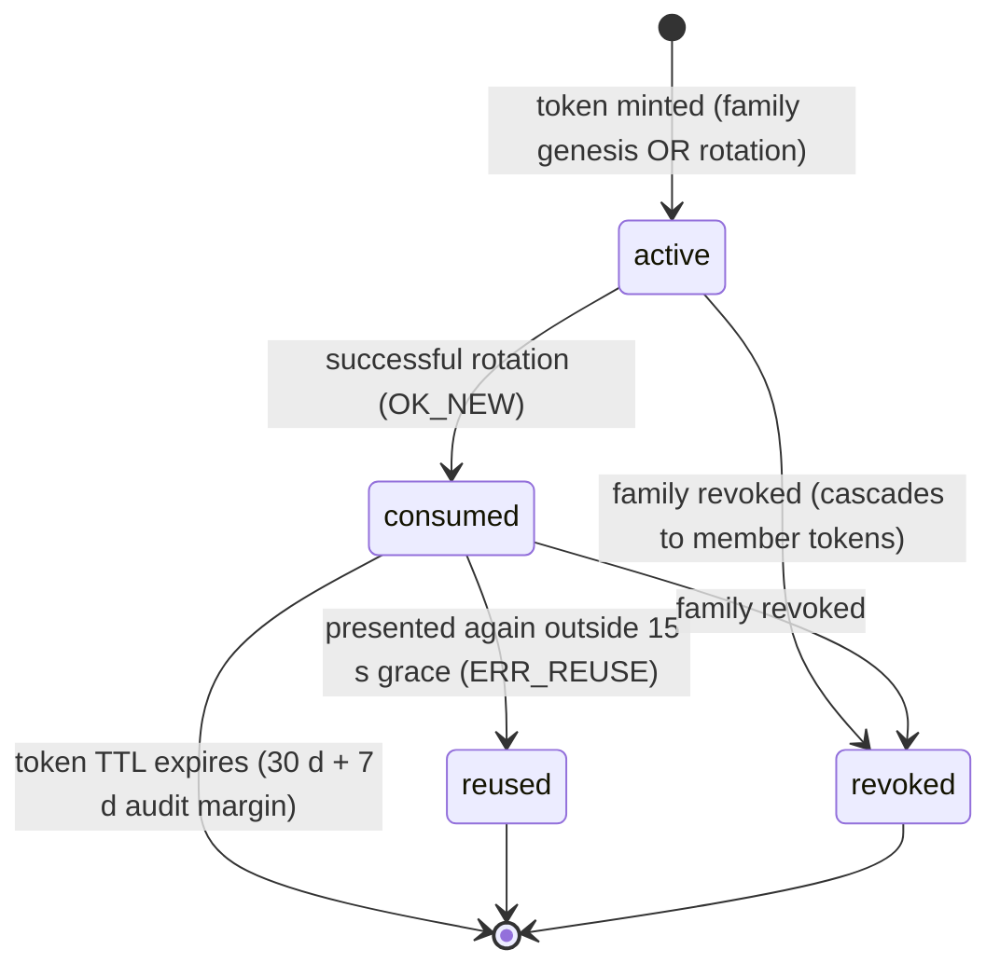
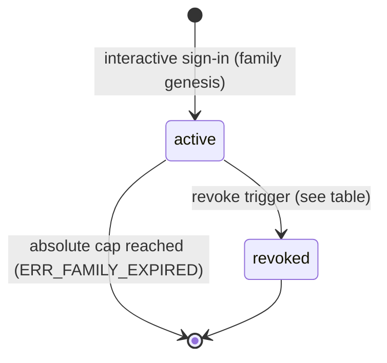
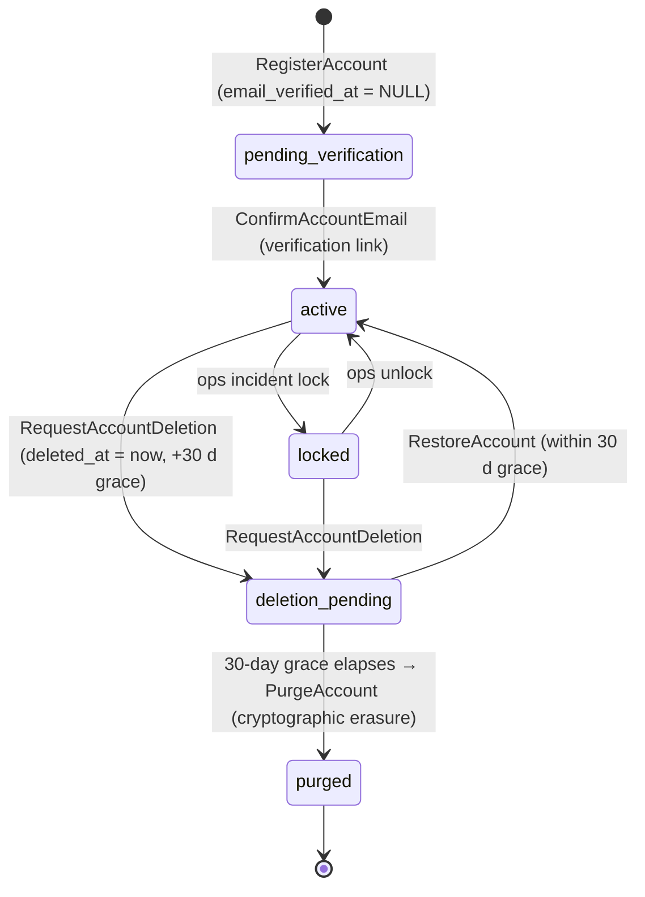
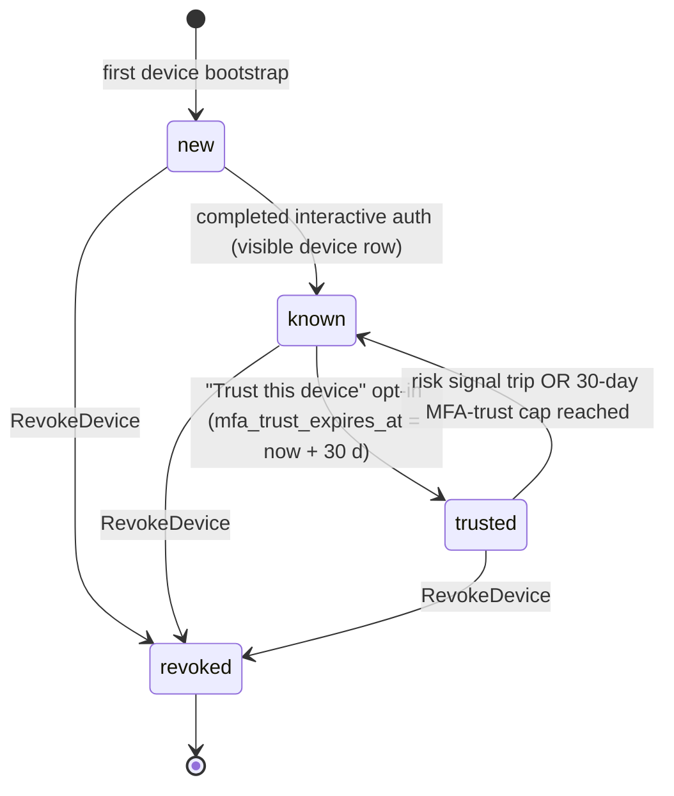

# State Machine - Identity & Access (draft)

> **Draft.** Transcribes the stateful lifecycles named by
> [[../09-Decisions/ADR-0123-identity-access-context-definition]] (FMX-163;
> accepted 2026-06-15) and the binding implementation-detail notes ADR-0123 §7
> declares as the spec layer beneath it: [[../../30-Implementation/auth-flows]]
> (F2), [[../../30-Implementation/session-management]] (F3) and
> [[../../30-Implementation/privacy-and-consent]] (F6). It becomes binding for
> implementation when the project enters the development phase
> (`binding: true`).
>
> **Source-of-truth split.** ADR-0123 owns the bounded-context boundary and
> public contract (commands, events, queries, opaque IDs). The concrete *state
> names*, *transitions* and *guards* below are transcribed from the F2/F3/F6
> implementation notes, which carry `binding: true`. ADR-0123 §7 explicitly does
> **not** ratify "exact token/session/device retention numerics not already
> binding elsewhere"; the numerics in this note (15 s grace, 30 min / 12 h / 30 d
> windows, 30-day deletion grace) are taken from F2/F3/F6 as the current binding
> spec and are flagged in [[#Open decisions]] as ADR-0123-deferred.

Identity & Access owns the product's platform principal and authentication
surface per ADR-0123 §1. Within that surface it owns four coordinated state
machines:

1. `RefreshTokenFamily` + `RefreshToken` — per `(account, device)` refresh-token
   lineage and rotation/reuse lifecycle (F3 §4.3–§5).
2. `DeviceRegistration` (`device.trust_level`) — per-device trust/revocation
   lifecycle (F3 §9.2 / §9.4 / §9.5).
3. `AccountStatus` — account lifecycle from active through lock, soft-delete
   grace and cryptographic purge (F2 §2.1, F3 §8.1, F6 §8).

`Session` (`sess:<id>`) is, per F3 §6.3, a passively-expiring Redis record whose
validity is enforced by TTL and by the family/account state above rather than by
an independent multi-state FSM; it is summarised in §4 but is not modelled as a
separate diagram (see [[#Open decisions]]).

The Identity & Access public contract — commands, events, queries and opaque IDs
(`AccountId`, `SessionId`, `DeviceId`, `CredentialId`, `GlobalRoleAssignmentId`,
`PrincipalContext`) — is owned by ADR-0123 §3–§4 and is the contract surface these
FSMs emit through.

## 1. `RefreshToken` states (per-token)

A refresh token (`rt:<token_id>`, F3 §4.4) is the rotating credential the client
presents at `POST /api/auth/refresh`. Its `status` field is one of four values
(F3 §4.4 schema).

### State definitions

| State | Meaning |
|---|---|
| `active` | Current token the client holds; the one stored in `rtfam.current_token_id` (F3 §4.3/§4.4) |
| `consumed` | Token already exchanged in a successful rotation; `rotated_to` points at the successor (F3 §5.3 happy path) |
| `revoked` | Member of a family whose `status` flipped to `revoked` (cascade, not an independent per-token revoke trigger) |
| `reused` | A `consumed` (or revoked) token presented again outside the grace; sets `rtfam.status=revoked, revoke_reason=reuse_detected` (F3 §5.3 reuse path) |

### Transition triggers

| From | To | Trigger / guard |
|---|---|---|
| `[*]` | `active` | Token minted on interactive sign-in (family genesis) or on each successful rotation (F3 §5.1) |
| `active` | `consumed` | `RefreshSession` rotation succeeds; Lua returns `OK_NEW`; old token `HSET status=consumed` (F3 §5.3) |
| `active` | `revoked` | Owning family revoked (any §2 family-revoke trigger) |
| `consumed` | `reused` | Same `consumed` token presented again with `now - last_rotation_ts > rotation_grace (15 s)` and no matching idempotency key → `ERR_REUSE` (F3 §5.3) |
| `consumed` | `revoked` | Owning family revoked |
| `consumed` | `[*]` | Redis key TTL fires (`refresh_per_token = 30 d` + 7 d audit margin, F3 §4.4) |

### Grace-window nuance (F3 §5.2 / §5.4)

A duplicate presentation of a just-`consumed` token **within** the
`rotation_grace = 15 s` window does **not** transition to `reused`: the Lua
script returns `OK_GRACE_RETURN` (or `OK_GRACE_IDEMPOTENT` when an
`X-Idempotency-Key` matches) and the family's existing `current_token_id` is
returned. This is the benign multi-tab / network-retry path and is replay-safe;
only presentation **outside** the grace (or of an already-revoked/reused token)
trips `reused` + family revoke.

## 2. `RefreshTokenFamily` states (per `(account, device)` lineage)

A family (`rtfam:<family_id>`, F3 §4.3) is created on every interactive sign-in
and owns one token lineage for one `(user_id, device_id)` pair. Its `status`
field has two values (F3 §4.3 schema).

### State definitions

| State | Meaning |
|---|---|
| `active` | Family is rotating normally; `current_token_id` advances on each refresh (F3 §4.3) |
| `revoked` | Family terminated; `revoke_reason` recorded; all member sessions invalidated on next request (F3 §4.3, §8.1) |

> ADR-0123 §6 (GDPR erasure seam) explicitly lists "revoke sessions and refresh
> families" as an Identity-owned purge step; the family-revoke action below is the
> mechanism.

### Transition triggers (family-revoke catalogue, F3 §8.1)

| From | To | Trigger | `revoke_reason` |
|---|---|---|---|
| `active` | `revoked` | Explicit "Sign out" (this session) | `user_logout` |
| `active` | `revoked` | "Sign out everywhere" (`RevokeAllSessions`) | (token_version bump + family iterate) |
| `active` | `revoked` | "Sign out from device X" (`RevokeDevice`) | `device_logout` |
| `active` | `revoked` | Password change / reset, MFA add/remove, recovery-code use, `accountSecret` rotation, primary-email change | per row (F3 §8.1 #4–#10) |
| `active` | `revoked` | Account locked by ops | `account_locked` (see §3) |
| `active` | `revoked` | Account deletion request | (see §3) |
| `active` | `revoked` | Refresh-token reuse detected (§1) | `reuse_detected` |
| `active` | `revoked` | Operator emergency revoke | `operator_revoke` |
| `active` | `[*]` | Absolute cap exceeded: `now > absolute_expires_at` (= last interactive auth + `refresh_family_absolute = 30 d`) → Lua `ERR_FAMILY_EXPIRED`, soft revoke (F3 §5.3/§5.4/§6.3) |

`ERR_FAMILY_EXPIRED` is a soft/passive expiry (normal re-login), distinct from the
security-driven `revoked` state. Both are terminal for the family.

## 3. `AccountStatus` states

The account (`user` row, F2 §2.1) carries `deleted_at` (soft-delete; "30-day
grace" per the column comment) and an ops-set `account_status = locked` (F3 §8.1
#11), plus `deletion_status` (`pending`) and the purge terminus (F6 §8.1).
ADR-0123 §1 lists "account status" and "account deletion/recovery lifecycle
initiation" as Identity-owned; §6 names the `AccountDeletionRequested` /
`AccountRestored` / `AccountPurged` events emitted across this lifecycle.

### State definitions

| State | Meaning |
|---|---|
| `pending_verification` | `RegisterAccount` created a pending user; `email_verified_at = NULL`; cannot sync / join MP until confirmed (F2 §3.1 sequence) |
| `active` | Email confirmed; normal authenticated account; `accountSecret` generated (F2 §3.2) |
| `locked` | Ops/incident lock: `user.account_status = locked`; all sessions revoked; authed requests fail `account_locked` (F3 §8.1 #11) |
| `deletion_pending` | `deleted_at = now`, `deletion_status = pending`; all sessions + families revoked; 30-day grace running; restorable (F6 §8.1) |
| `purged` | Grace elapsed; cryptographic erasure ran (burn `accountSecret` / `Env_user` / credentials / device rows; pseudonymise audit per ADR-0091); `auth.account_purged` emitted (F6 §8.1–§8.2). Terminal |

### Transition triggers

| From | To | Trigger (command / event) | Guard |
|---|---|---|---|
| `[*]` | `pending_verification` | `RegisterAccount` → `AccountRegistered` | 16+ age attestation passed (ADR-0112; F6 §3.2) |
| `pending_verification` | `active` | `ConfirmAccountEmail` → `AccountEmailConfirmed` | single-use verify token valid + not expired (F2 §3.2; TTL — see Open decisions) |
| `active` | `locked` | Ops incident lock → `AccountStatusChanged` (`account_locked`) | actor = admin/ops (F3 §8.1 #11) |
| `locked` | `active` | Ops unlock → `AccountStatusChanged` | actor = admin/ops (transition implied by §8.1 #11 "locked"; unlock guard not numerically specified — see Open decisions) |
| `active` / `locked` | `deletion_pending` | `RequestAccountDeletion` → `AccountDeletionRequested` (`auth.account_deleted`) | step-up MFA per F2 §7.1; not already pending (else `409 deletion_already_pending`, F6 §6.9) |
| `deletion_pending` | `active` | `RestoreAccount` → `AccountRestored` (`auth.account_restored`) | login within 30-day grace + step-up MFA (F6 §8.1) |
| `deletion_pending` | `purged` | `PurgeAccount` → `AccountPurged` (`auth.account_purged`) | `deleted_at + account_delete_grace (30 d) ≤ now`; scheduled background job (F6 §8.1) |

> **Note on `pending_verification`.** ADR-0123 §4 lists `RegisterAccount` and
> `ConfirmAccountEmail` as separate commands and `AccountRegistered` /
> `AccountEmailConfirmed` as separate events, and F2 §3.2 models the verify step
> as a distinct pre-`active` stage. It is transcribed here as an explicit pre-active
> state. ADR-0123 does not name a single canonical state vocabulary for the account
> aggregate (see [[#Open decisions]]).

## 4. `DeviceRegistration` states (`device.trust_level`)

The `device` table `trust_level` column has a hard `CHECK IN
('new','known','trusted','revoked')` (F3 §9.2). A device is `(user ×
browser-profile)` keyed by a 128-bit client-generated `device_id` (F3 §9.1).

### State definitions

| State | Meaning |
|---|---|
| `new` | Device seen but not yet through a full interactive auth; may not yet have a user-visible row (F3 §9.2/§9.3) |
| `known` | Completed ≥ 1 interactive auth; appears in the "Active devices" Settings list; default trust (F3 §9.3) |
| `trusted` | User opted into "Reduce MFA prompts for 30 days"; `mfa_trust_expires_at = now + device_mfa_trust (30 d)` (F3 §9.4) |
| `revoked` | `RevokeDevice` ran; `revoked_at = now`, `mfa_trust_expires_at = NULL`; families for `(user, device)` revoked (F3 §9.5) |

### Transition triggers

| From | To | Trigger / guard |
|---|---|---|
| `[*]` | `new` | First device bootstrap; `device_id` minted client-side (F3 §9.1) |
| `new` | `known` | `RegisterDevice` → `DeviceRegistered`; device completes a full interactive auth (passkey OR password + MFA) (F3 §9.3) |
| `known` | `trusted` | "Trust this device" opt-in checkbox accepted post-auth; hard 30-day cap, no rolling extension at MVP (F3 §9.4) |
| `trusted` | `known` | Risk-signal trip (new country / impossible travel / new ASN) → immediate downgrade + `mfa_trust_expires_at` invalidated (F3 §9.4); OR `device_mfa_trust = 30 d` cap reached |
| `new` / `known` / `trusted` | `revoked` | `RevokeDevice` → `DeviceRevoked` ("Sign out from device X"); `accountSecret` not rotated by default (separate "revoke + rotate" path) (F3 §9.5) |

> **Trusted → known on cap expiry** is transcribed from the 30-day MFA-trust cap
> (F3 §9.4 "hard cap; no rolling extension"); F3 specifies the downgrade-on-risk
> trigger explicitly but does not state whether cap expiry flips `trust_level` back
> to `known` or merely nulls `mfa_trust_expires_at` while leaving the label — see
> [[#Open decisions]].

## 5. `Session` (passive-expiry record, not a multi-state FSM)

Per F3 §6.3, the session record (`sess:<session_id>`) is **not** modelled as an
independent multi-state machine: its absolute cap (`session_id_absolute = 12 h`)
is enforced by the Redis key TTL, its idle cap (`session_id_idle = 30 min`) by
the rate-limited slide script (F3 §6.1–§6.3), and its revocation is derived from
the owning family/account state plus the hybrid `tokenVersion` check (F3 §8.2).
Effectively `valid → expired | revoked → [*]`, where `expired` and `revoked` are
both lazily observed on the next request (`auth.session_expired` lazy emit, F3
§8.1 #15). `StartSession` / `RefreshSession` / `RevokeSession` / `RevokeAllSessions`
(ADR-0123 §4) are the commands acting on it.

## 6. Events emitted (per ADR-0123 §4 public contract)

The FSMs above transition by emitting the ADR-0123 §4 events. Mapping:

| FSM | Commands (ADR-0123 §4) | Events (ADR-0123 §4) |
|---|---|---|
| `AccountStatus` | `RegisterAccount`, `ConfirmAccountEmail`, `RequestAccountDeletion`, `RestoreAccount`, `PurgeAccount` | `AccountRegistered`, `AccountEmailConfirmed`, `AccountStatusChanged`, `AccountDeletionRequested`, `AccountRestored`, `AccountPurged` |
| `Session` / `RefreshTokenFamily` | `StartSession`, `RefreshSession`, `RevokeSession`, `RevokeAllSessions` | `SessionStarted`, `SessionRefreshed`, `SessionRevoked`, `AllSessionsRevoked` |
| `DeviceRegistration` | `RegisterDevice`, `RevokeDevice` | `DeviceRegistered`, `DeviceRevoked` |
| (credentials, referenced by trust/auth guards) | `AddCredential`, `RevokeCredential` | `CredentialAdded`, `CredentialRevoked` |

The F3 §8.1 outbox events (`auth.session_revoked`, `auth.logout_everywhere`,
`auth.device_logout`, `auth.refresh_reuse_detected`, `auth.account_locked`,
`auth.account_deleted`, …) are the implementation-detail audit fan-out beneath
these contract events, consumed by Audit & Security per ADR-0123 §6 / ADR-0091
(tamper-evident retention, pseudonymisation) and persisted via the outbox per
ADR-0013.

## 7. Persistence model

Per ADR-0027, Identity & Access tables live in the platform `public` schema
(not a per-save schema), Drizzle as source of truth, IDs app-generated UUIDv7:

- `user` — `id`, `primary_email[_lower]`, `email_verified_at`, `display_name`,
  `locale`, `timezone`, `deleted_at` (soft-delete + 30 d grace), `account_status`
  (`active` / `locked`), `deletion_status` (`pending`), `attested_age_band`
  (ADR-0112), `token_version` (F3 §8.2) (F2 §2.1, F3 §8.1).
- `user_credential` — `kind ∈ ('password','passkey','totp','recovery_code')`,
  schemaless `payload` jsonb, `enrolled_at`, `last_used_at`, `revoked_at` (F2 §2.1).
- `user_identity` — provisioned for future OAuth/OIDC linking (`provider ∈
  ('google','apple','discord')`), no rows at MVP (F2 §2.1; ADR-0123 §3 "optional
  external identity markers after a future approved provider decision").
- `device` — `trust_level CHECK IN ('new','known','trusted','revoked')`,
  `mfa_trust_expires_at`, `anomaly_flags` jsonb, `revoked_at` (F3 §9.2).
- Hot state (Redis, F3 §4): `sess:<id>` (HASH), `user_sess:<user_id>` (SET),
  `rtfam:<family_id>` (HASH with `status ∈ {active,revoked}`), `rt:<token_id>`
  (HASH with `status ∈ {active,consumed,revoked,reused}`), `user_dev:<user_id>`
  (SET). Redis is the live-validity authority; PostgreSQL is the cold audit
  mirror via the outbox and does not rehydrate Redis on cold start (F3 §3.2).

## 8. Failure / recovery cases

| Failure | Recovery |
|---|---|
| Two parallel refresh calls within 15 s | First → `OK_NEW`; second → `OK_GRACE_RETURN` with same new token; no reuse trip (F3 §5.4) |
| Refresh > 15 s after the legitimate rotation | `ERR_REUSE`: family `→ revoked`, all member sessions invalidated next request, `auth.anomaly.refresh_token_reuse` emitted + user emailed (F3 §5.4/§5.5) |
| Refresh token expired (TTL) | `ERR_EXPIRED`: no family-revoke; force re-login (F3 §5.4) |
| Family absolute cap exceeded | `ERR_FAMILY_EXPIRED`: soft revoke; normal sign-in flow (F3 §5.4) |
| Redis loses session state (cold start) | All sessions invalidated; next request from each user forces fresh sign-in; PostgreSQL does not rehydrate Redis (F3 §3.2) |
| Trusted device hits a risk signal | `trusted → known` immediately; `mfa_trust_expires_at` invalidated; step-up still enforced on sensitive ops (F3 §9.4) |
| Device revoked but offline IndexedDB saves remain | `accountSecret` not rotated by default; remote wipe is best-effort; separate "revoke + rotate" path for known-compromised devices (F3 §9.5) |
| Account purge after 30-day grace | Cryptographic erasure: keys burned, audit pseudonymised per ADR-0091/ADR-0127 finance-records exception; `purged` is terminal and unrecoverable (F6 §8.2) |

## 9. Open decisions

Items below are **not** pinned by ADR-0123 (or are pinned only in the binding
F2/F3/F6 implementation notes, which ADR-0123 §7 deliberately does not re-ratify
as ADR-level retention numerics). They are flagged, not invented:

- **ADR-0123 defers all retention numerics.** ADR-0123 §7 states it does not
  ratify "exact token/session/device retention numerics not already binding
  elsewhere". The values used in this note — `rotation_grace = 15 s`,
  `session_id_idle = 30 min`, `session_id_absolute = 12 h`, `refresh_per_token =
  30 d`, `refresh_family_absolute = 30 d`, `device_mfa_trust = 30 d`,
  `account_delete_grace = 30 d`, verify-token TTL `24 h` — are sourced from the
  binding F2/F3/F6 notes, not from ADR-0123. Whether ADR-0123 should pin or
  formally inherit these is an open ADR-level gate (ADR-0123 Follow-ups: "Re-check
  and pin exact … packages"; "session numeric decisions remain follow-up gates").
- **Canonical account-status vocabulary.** ADR-0123 §4 names the *commands/events*
  but not a single enumerated `account_status` state set. This note transcribes
  `pending_verification → active → {locked, deletion_pending} → purged` from
  F2/F3/F6; the authoritative state-name enum for the `Account` aggregate is not
  fixed by ADR-0123.
- **`locked → active` unlock guard.** F3 §8.1 #11 defines the lock transition and
  effects; neither ADR-0123 nor F3 specifies the unlock command, actor policy or
  any cool-down/guard for returning a `locked` account to `active`. Transition is
  shown but its guard is undefined.
- **`trusted → known` on MFA-trust cap expiry.** F3 §9.4 fixes the
  downgrade-on-risk trigger and the 30-day hard cap but does not state whether cap
  expiry flips `trust_level` back to `known` or only nulls `mfa_trust_expires_at`
  while leaving the label. Modelled as a downgrade here pending confirmation.
- **`Session` as FSM vs passive record.** F3 §6.3 treats the session as a
  TTL/derived-validity record rather than an independent multi-state machine. If a
  future ADR wants an explicit `valid/idle/expired/revoked` session FSM (e.g. for a
  cross-device SSE push, F3 FU-2), it must be added then; this note follows F3's
  current passive-expiry model.
- **`reused` vs `revoked` as distinct persisted token states.** F3 §4.4 lists both
  `revoked` and `reused` as `rt.status` values; the family-level effect is
  identical (`revoke_reason = reuse_detected`). Whether the per-token `reused`
  state is retained as a separate audit value or collapsed into `revoked` at the
  contract level is left to the code-phase `PrincipalContext`/event-schema work
  (ADR-0123 Follow-up).
