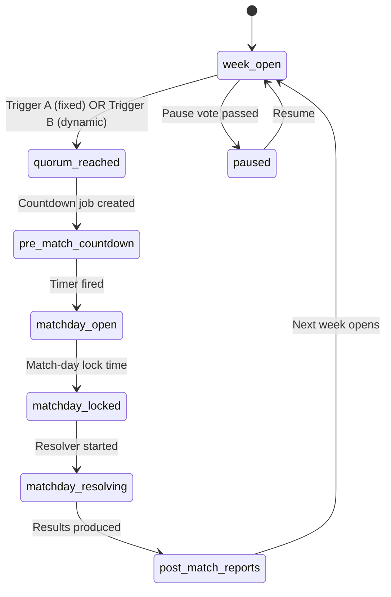

# State Machine - League Week

Owns the weekly lifecycle of an async private league. Identical for both
Fixed and Dynamic cadence rule sets; only the trigger for
`quorum_reached` differs.

## 1. States



## 2. State definitions

| State | Player actions allowed | Server jobs running |
|---|---|---|
| `week_open` | All async actions, draft transfers, training plan, complete week | Listeners for `CompleteWeek` |
| `quorum_reached` | Same as `week_open` + soft warning | Schedule `pre_match_countdown` job |
| `pre_match_countdown` | Last-minute draft submission, line-up lock approaching | Countdown job ticking |
| `matchday_open` | Submit line-up, view live match, optional live coaching | Match worker scheduled |
| `matchday_locked` | Read-only line-ups | Match worker about to start |
| `matchday_resolving` | View match in progress | Match worker simulating |
| `post_match_reports` | Read reports, finalise scouting, training prep for next week | Notification digest job |
| `paused` | No advancement, social features only | All advancement jobs frozen |

## 3. Transitions

| From | To | Trigger | Condition |
|---|---|---|---|
| `week_open` | `quorum_reached` | Fixed mode: scheduled timer | Specific weekday + time |
| `week_open` | `quorum_reached` | Dynamic mode: `CompleteWeek` events | `count(complete) ≥ quorum %` |
| `quorum_reached` | `pre_match_countdown` | System event | Countdown job created |
| `pre_match_countdown` | `matchday_open` | Timer event | Configured countdown elapsed |
| `matchday_open` | `matchday_locked` | Timer event | Match-day lock time reached |
| `matchday_locked` | `matchday_resolving` | System event | Resolver started by scheduler |
| `matchday_resolving` | `post_match_reports` | Match worker done | All matches simulated |
| `post_match_reports` | `week_open` | Reports complete | Reports digest sent |
| any | `paused` | Pause vote command | Quorum reached |
| `paused` | `week_open` | Resume vote / time / admin | - |

## 4. Persistence

```text
league_week {
  id: record(league_week),
  league: record(league),
  season: int,
  week_number: int,
  state: enum(state_names),
  quorum_pct: int,
  countdown_minutes: int,
  max_week_days: int,
  state_entered_at: datetime,
  next_state_at: datetime?,
  managers_complete: array<record(member)>,
  paused_until: datetime?
}
```

Stored in SurrealDB per [[../09-Decisions/ADR-0004-data-model]].

## 5. Events emitted

- `WeekOpened`
- `WeekQuorumReached`
- `PreMatchCountdownStarted`
- `MatchdayOpened`
- `MatchdayLocked`
- `MatchdayResolving`
- `MatchdayResolved`
- `PostMatchReportsReady`
- `WeekClosed`
- `LeaguePaused`
- `LeagueResumed`

All events route through the transactional outbox
([[../09-Decisions/ADR-0013-transactional-outbox]]).

## 6. Failure / recovery

| Failure | Recovery |
|---|---|
| Quorum never reached | Max-week-length timer forces `quorum_reached` with current count |
| Match worker crash | Idempotent retry; lock prevents double-execution |
| Lost timer | Scheduler reconciliation rebuilds from `state_entered_at` |
| Pause vote in mid-state | Vote queued; applied at safe boundary (next `post_match_reports` → `week_open`) |

## 7. Test strategy

- Property-based: state machine must never reach an undefined state.
- Golden trace: a canned week with 5 managers and known timings produces
  a deterministic state history.
- Failure injection: kill match worker mid-`matchday_resolving`; verify
  recovery.
- Quorum sweep: vary quorum % and complete-times; verify
  `quorum_reached` fires correctly.

## 8. Open questions

- Should `post_match_reports` automatically advance to the next week, or
  require a user-triggered "start next week" action? Auto-advance with a
  configurable delay (group setting) so groups can pause between weeks.
- Mid-state pause - currently queued. Better UX may be immediate pause
  with state preserved; needs concurrency model decision.
