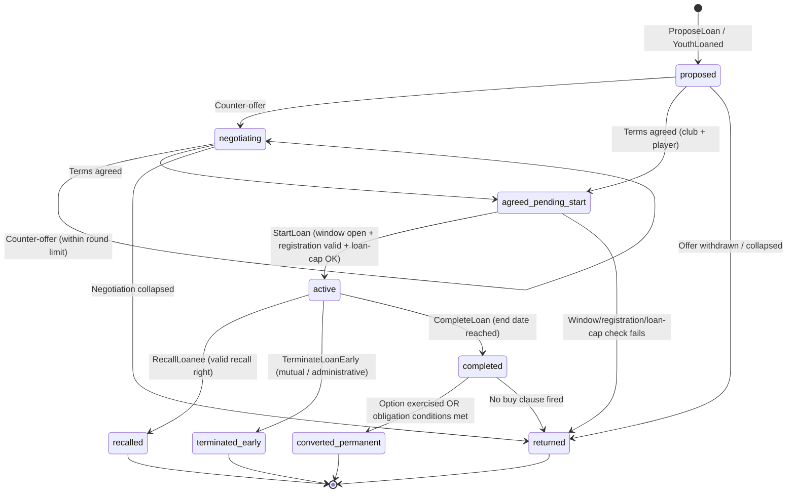
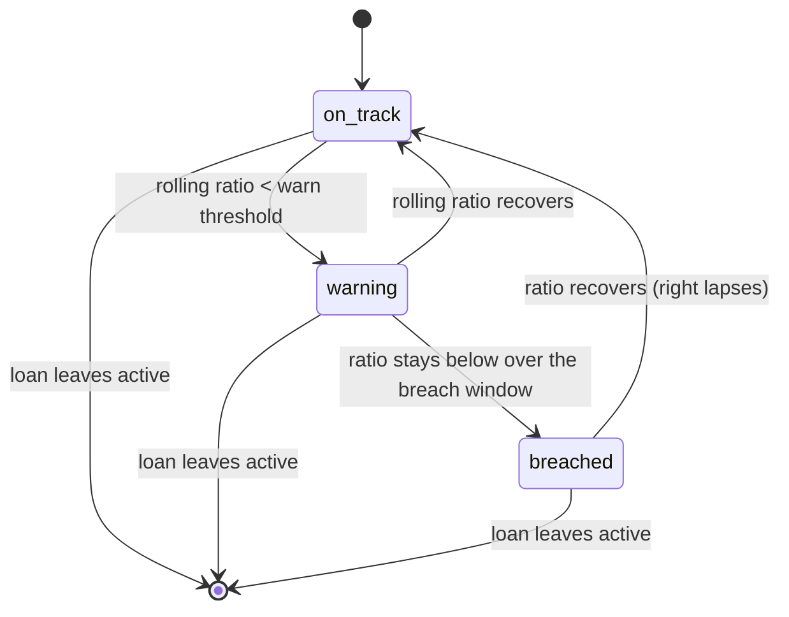

# State Machine - Loan Orchestration (proposed)

> **Ratified** alongside [[../09-Decisions/ADR-0075-loan-orchestration-process-manager]]
> (FMX-85; accepted 2026-06-08). This note is the **current** FSM surface the **Transfer-led
> Loan-Orchestration Process Manager** owns. It becomes binding for implementation when the
> project enters the development phase (`binding: true`).

Transfer hosts a **Loan-Orchestration Process Manager / Saga** (Vernon canonical
long-running-process pattern, same shape as the Youth Academy cohort coordinator) that owns:

1. `LoanAgreement` — per-loan deal + clause + lifecycle state machine.
2. `LoanPlayingTimeMonitor` — a sub-process layered over `LoanAgreement.active`.

It coordinates Squad & Player (availability/registration), Match (authoritative minutes),
Regulations (window/registration/work-permit/**loan-cap** verdicts), Club Management (ledger via
ACL) and Youth Academy (`YouthLoaned` entry point). It owns no foreign aggregate.

## 1. `LoanAgreement` states

### State definitions

| State | Meaning |
|---|---|
| `proposed` | A loan offer exists — user/AI `ProposeLoan`, or materialised from a consumed `YouthLoaned`; terms drafted, not yet agreed |
| `negotiating` | Club and player/agent terms being resolved; counter-offers within a round limit |
| `agreed_pending_start` | All parties agreed; loan start date / registration window not yet reached |
| `active` | Player registered at the loanee club; clauses in force; `LoanPlayingTimeMonitor` running |
| `recalled` | Parent exercised a valid recall right; early-termination consequences applied (terminal) |
| `terminated_early` | Loan ended before term by mutual agreement / administrative cause (terminal) |
| `completed` | Loan reached its end date; clause evaluation pending |
| `converted_permanent` | Option exercised or obligation conditions met → hand-off to permanent transfer-completion (terminal) |
| `returned` | Offer collapsed, start check failed, or loan ended with no buy clause; player at parent club (terminal) |

Every non-terminal state has a path to a terminal state; there are no orphan states.

## 2. Transition triggers

| From | To | Trigger |
|---|---|---|
| `proposed` | `negotiating` | First counter-offer submitted |
| `negotiating` | `negotiating` | Counter-offer within round limit |
| `proposed` / `negotiating` | `agreed_pending_start` | Club package + player/agent terms both agreed |
| `proposed` / `negotiating` | `returned` | Offer withdrawn / negotiation collapsed |
| `agreed_pending_start` | `active` | `StartLoan`: `CurrentTransferWindow` open AND `RegistrationEligibilityVerdict` valid AND `LoanCapVerdict` OK (both associations for international loans) |
| `agreed_pending_start` | `returned` | Any of window / registration / work-permit / loan-cap checks fail at start |
| `active` | `recalled` | `RecallLoanee` with a valid recall right (recall window reached, or monitor `breached`, or mutual) |
| `active` | `terminated_early` | `TerminateLoanEarly` by mutual agreement / administrative cause |
| `active` | `completed` | `CompleteLoan`: loan end date reached (deterministic clock) |
| `completed` | `converted_permanent` | Option exercised by deadline, OR obligation conditions evaluate true |
| `completed` | `returned` | No buy clause, or conditional obligation not met, or option not exercised |

**Duration / sub-loan guards (reject before any transition):** loan duration must be
window-to-window minimum and ≤ 1 year (renewal needs an explicit player-consent event); a
sub-loan (loanee → third club while `active`) is **rejected** — a move to a third club requires
reaching `recalled`/`terminated_early` first, then a new `proposed` loan from the parent.

## 3. `LoanPlayingTimeMonitor` sub-process (over `active`)

### Definitions

| State | Meaning |
|---|---|
| `on_track` | Rolling actual-vs-role-expected minutes ratio meets the promised squad-role target |
| `warning` | Ratio below the warning threshold; a `LoanPlayingTimeBreached`-precursor complaint may surface |
| `breached` | Ratio below threshold across the breach window → **parent gains a recall right + optional penalty intent** |

- **Input:** Match per-fixture minutes facts (authoritative). Spells unavailable through
  injury/suspension/international duty are excluded from `expected`.
- **Consequence:** `breached` emits `LoanPlayingTimeBreached` (grants recall right) and may emit a
  `LoanFinancialIntent { kind: breach_penalty }`. It **never forces team selection** (RSTP: the
  clause is contractual; mirrors FM's PlayingTimeMonitor).
- **Determinism:** the ratio + state are a pure function of logged minutes facts + a fixed
  threshold table (thresholds are FMX-52 calibration inputs). No RNG.

## 4. Trigger sources

| Trigger | Source |
|---|---|
| `ProposeLoan` | Player command (loan UI) OR AI counter-party (reuses Transfer's negotiation RNG sub-label) |
| `YouthLoaned` | Youth Academy Process Manager (`CohortMember.published_loaned`) — PM entry point |
| `CounterLoanOffer` / `AcceptLoan` | Player command / AI negotiation |
| `StartLoan` | World tick (loan start date reached) gated by Regulations window/registration/loan-cap queries |
| `RecordLoanMatchMinutes` | Consumed Match per-fixture minutes fact |
| `EvaluatePlayingTime` | Internal, on each consumed minutes fact |
| `RecallLoanee` | Player/AI command (valid recall right) |
| `TerminateLoanEarly` | Player/AI command / administrative cause |
| `CompleteLoan` | World tick (loan end date reached) |
| `ExerciseOptionToBuy` / `EvaluateObligationToBuy` | Player/AI command / internal conditions evaluator at `completed` |

## 5. Effect on other contexts

| Event | Consumer | Effect |
|---|---|---|
| `LoanStarted` | Squad & Player | Mark player out-on-loan: unavailable to parent, available to loanee; registration recorded |
| `LoanStarted` | Club Management | `LoanFinancialIntent` (loan fee + wage-contribution schedule) posted via ACL per ADR-0050 |
| `LoanPlayingTimeBreached` | Transfer (self) / Notification | Grants parent recall right; inbox card; optional `breach_penalty` intent to Club Management |
| `LoanRecalled` / `LoanTerminatedEarly` | Squad & Player | Restore parent availability; **reinstate parent contract** (RSTP) from reintegration date |
| `LoanRecalled` / `LoanTerminatedEarly` | Club Management | Wage obligation reverts to parent; settle outstanding fee schedule via ACL |
| `LoanCompleted` | Transfer (self) | Trigger clause evaluation (option / obligation conditions) |
| `LoanConvertedToPermanent` | Transfer permanent-completion path | Hand off the pre-agreed permanent transfer (executed in window via the existing FSM) |
| `LoanReturned` | Squad & Player | Restore parent availability at term end |
| `LoanQualityAssessed` | Training | Development-delta input (numeric model per GD-0021) |
| `LoanQualityAssessed` | Squad & Player | Market-value / morale signal |
| `LoanFinancialIntent` | Club Management | Ledger entry per ADR-0050 (Customer-Supplier + ACL); PM never writes ledger rows |

Queries (read-only, no joins): `CurrentTransferWindow`, `RegistrationEligibilityVerdict`,
`WorkPermitVerdict`, `LoanCapVerdict(parentClubId, loaneeClubId, season, playerAge, clubTrainedFlag)`
against Regulations (ADR-0056).

## 6. Persistence model

Per-save schema (`save_<uuidv7hex>`) per ADR-0027; intra-Transfer tables. See
[[../09-Decisions/ADR-0075-loan-orchestration-process-manager]] §Persistence for the
`loan_agreement` and `loan_playing_time_monitor` table sketches. Cross-context refs (`player_id`,
`parent_club_id`, `loanee_club_id`, `last_recomputed_fixture_id`) are opaque branded UUIDv7
columns (no cross-context `references()`); money is integer cents; embedded lists are `jsonb`.
All emitted events + financial intents go through the ADR-0028 transactional outbox. Suggested
indexes: `(parent_club_id, season_year)`, `(loanee_club_id, season_year)`, `(loan_agreement_id,
monitor_state)`.

## 7. Failure / recovery cases

| Failure | Recovery |
|---|---|
| `StartLoan` registration/window/loan-cap check fails | Saga aborts to `returned`; Notification surfaces the blocked reason; no availability change |
| Match minutes fact arrives out of order / duplicated | Monitor recompute is idempotent on `(loan_agreement_id, fixture_id)`; last-fixture cursor prevents double-count |
| `LoanConvertedToPermanent` hand-off to transfer-completion fails | PM keeps `completed`; retry via outbox per ADR-0028; no half-converted state |
| Club Management ACL rejects a `LoanFinancialIntent` | Outbox retry; PM does not advance financial state until ack |
| Obligation conditions ambiguous at `completed` | FMX-155 focused conditions evaluator returns `notTriggered` plus `needsReview`; no auto-buy fires from missing/ambiguous facts |
| RNG sub-label collision | Forbidden by ADR-0018 §3; the PM introduces no new `*Rng` (AI negotiation reuses Transfer's) |

## 8. Test strategy

- **FSM property tests:** every reachable `LoanAgreement` / monitor state has ≥1 path to a
  terminal; no transition outside the matrix; no orphan states.
- **Deterministic golden tests:** fixed save snapshot + fixed Match minutes facts → identical
  monitor states, identical `LoanQuality`, identical clause-evaluation outcome.
- **Saga compensation / retry tests:** start-check failure, conversion hand-off failure,
  financial-intent outbox failure.
- **Boundary tests:** sub-loan rejected; loan-cap exceeded rejected via Regulations verdict;
  window-to-window min + ≤1yr duration enforced; breach → recall right (not forced selection);
  parent-contract reinstatement emitted on early end.
- **Cross-context contract tests:** `YouthLoaned` materialises a `proposed` loan; `LoanStarted` /
  `LoanFinancialIntent` consumed by Squad & Player / Club Management match schema; Regulations
  `LoanCapVerdict` + window queries match the agreed shape; Match minutes facts match.
