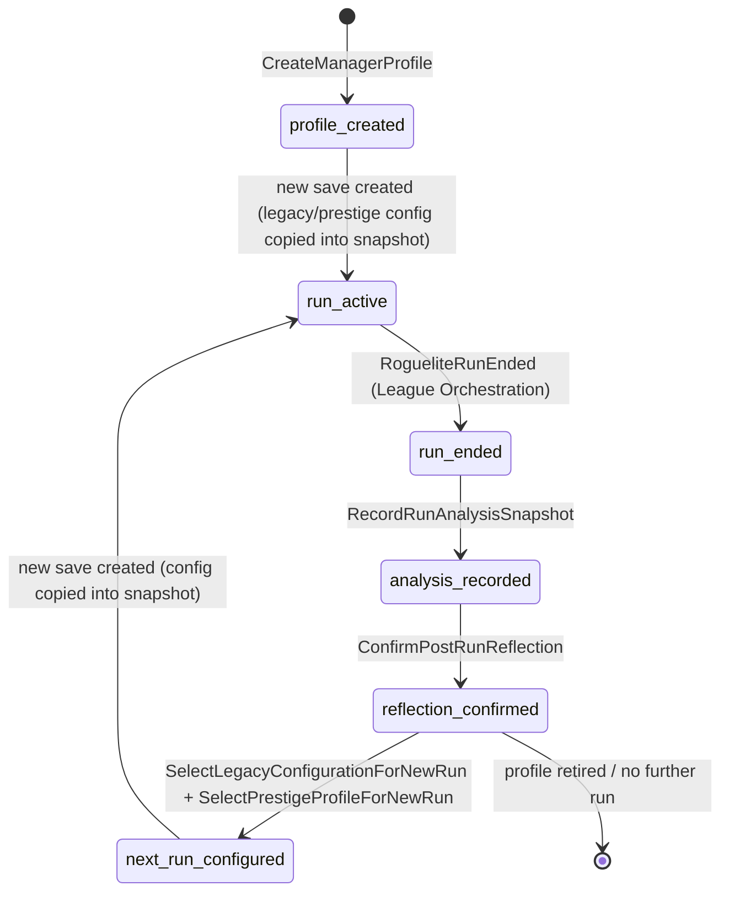
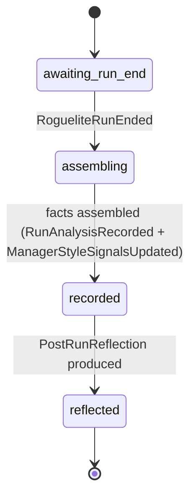
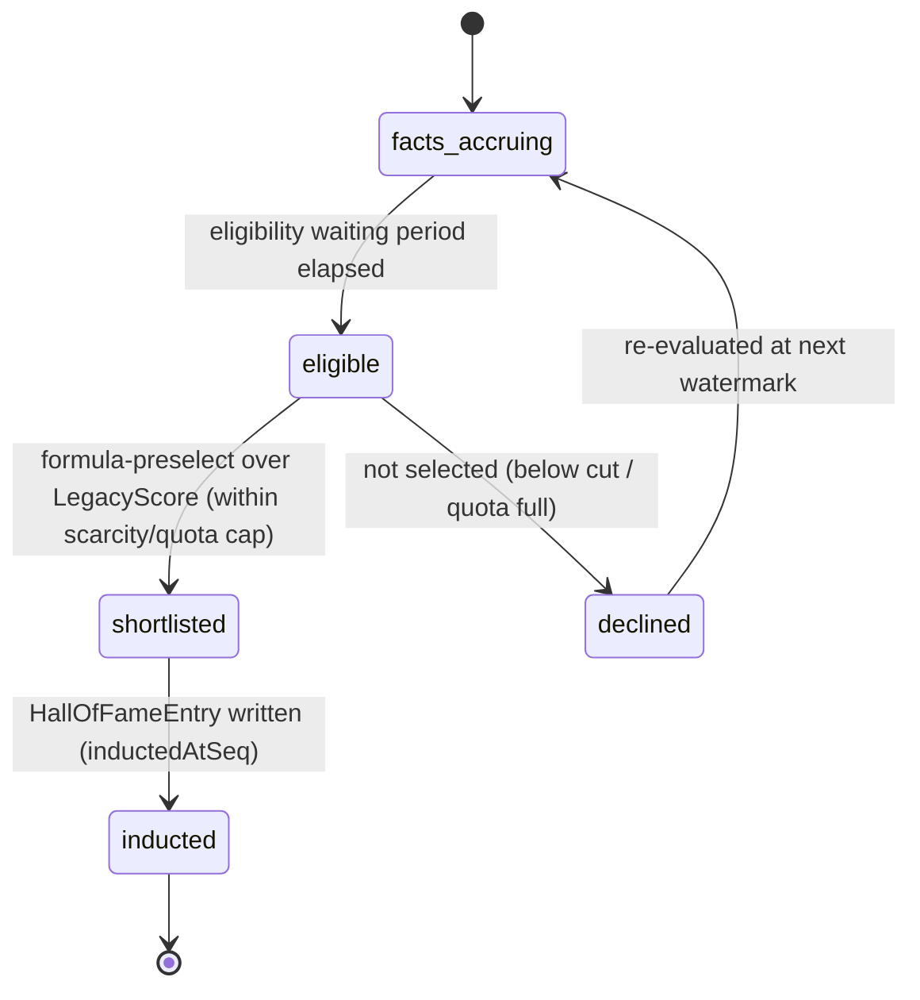

# State Machine - Manager & Legacy

> **Status note (draft).** This note transcribes the lifecycles that
> [[../09-Decisions/ADR-0051-manager-and-legacy-context]] (accepted/binding),
> [[../09-Decisions/ADR-0082-manager-style-signal-and-run-analysis-contract]] (accepted) and
> [[../09-Decisions/ADR-0083-awards-honours-records-and-hall-of-fame-contract]] (accepted) define.
> It is `binding: false` and becomes a binding implementation surface only when the project enters
> the development phase. It **invents no guard thresholds, timer values, eligibility windows,
> scarcity caps or scoring constants** — every such item the source ADRs leave open is listed under
> [§7 Open decisions](#7-open-decisions).

Manager & Legacy is the cross-run/cross-save meta context. Its core invariant
([[../09-Decisions/ADR-0051-manager-and-legacy-context]] §Determinism) governs every machine here:
**a running save never reads mutable cross-save meta after creation; a selected
legacy/prestige configuration is copied into the save snapshot at creation only, and replay/reload
use the copied value — never the current global meta.** All cross-context inputs arrive through
published events/read-models; the context performs **no cross-context table joins** and stores
analysis/legacy snapshots, not alternate truth.

The ADRs define the following coordinated lifecycles:

1. `ManagerRun` - per-save roguelite run lifecycle (profile → run-end analysis → reflection →
   next-run config), the spine of ADR-0051 + ADR-0082.
2. `RunAnalysisSnapshot` - per-run assembly of the run-end style-signal/run-analysis envelope
   (ADR-0082).
3. `HallOfFameInduction` - per-subject in-world HoF induction lifecycle (ADR-0083).

A note on scope: archetype **taxonomy/naming**, the **perk catalogue / perk caps** and the
**prestige-ladder shape** are explicitly deferred (G3 / post-MVP, Nico-gated; ADR-0082 M10,
ADR-0083). They are **not modelled here** because the sources define no states for them. What the
sources do define — signal capture, reflection, the determinism-bounded next-run config handoff, and
HoF induction — is transcribed below.

## 1. `ManagerRun` states

Per-save roguelite run lifecycle. The manager profile and the determinism-bounded handoff to the
next save are owned here; the in-run football simulation is owned by the other contexts. The run-end
boundary is the published `RogueliteRunEnded` fact from League Orchestration
([[../09-Decisions/ADR-0082-manager-style-signal-and-run-analysis-contract]] §3 / M3).

### State definitions

| State | Meaning |
|---|---|
| `profile_created` | `ManagerProfileCreated`; manager profile + starting background exist as cross-save meta (ADR-0051 §Decision) |
| `run_active` | A save is running for this manager; the legacy/prestige configuration was copied into the save snapshot at creation (ADR-0051 §Determinism). Manager & Legacy does **not** read mutable cross-save meta while in this state |
| `run_ended` | `RogueliteRunEnded` received from League Orchestration; run-end facts available for analysis |
| `analysis_recorded` | `RunAnalysisRecorded`; the `RunAnalysisSnapshot` was assembled from published facts (see §2) |
| `reflection_confirmed` | `PostRunReflection` produced/acknowledged (MVP-mandatory text readout — ADR-0082 D4=A / M8) |
| `next_run_configured` | `LegacyConfigurationSelected` + `PrestigeProfileSelected`; the configuration is ready to be passed as an explicit generation parameter to the next save creation |

### Transition triggers

| From | To | Trigger | Source |
|---|---|---|---|
| `[*]` | `profile_created` | `CreateManagerProfile` | Player command (ADR-0051 draft commands) |
| `profile_created` | `run_active` | New save created; selected config copied into the save snapshot | Save creation (ADR-0051 §Determinism) |
| `run_active` | `run_ended` | `RogueliteRunEnded` | League Orchestration published fact (ADR-0082 §3) |
| `run_ended` | `analysis_recorded` | `RecordRunAnalysisSnapshot` → `RunAnalysisRecorded` | Manager & Legacy (assembled from published facts; M2/M5) |
| `analysis_recorded` | `reflection_confirmed` | `ConfirmPostRunReflection` | Player command / read-model (ADR-0082 M8) |
| `reflection_confirmed` | `next_run_configured` | `SelectLegacyConfigurationForNewRun` + `SelectPrestigeProfileForNewRun` | Player command (ADR-0051 draft commands) |
| `next_run_configured` | `run_active` | New save created; selected config copied into the save snapshot | Save creation (ADR-0051 §Determinism) |
| `reflection_confirmed` | `[*]` | Manager retires / no further run started | (terminal; the ADR does not pin an explicit "retire" command — see §7) |

> **MVP scope note.** ADR-0051 / ADR-0082 fix MVP as **hooks-only**: capture run-end facts, derive
> coarse style signals, expose `PostRunReflection`. The `SelectLegacyConfigurationForNewRun` /
> `SelectPrestigeProfileForNewRun` commands and the `next_run_configured` state are **drafted by
> ADR-0051 but post-MVP** (full perk unlocks, legacy carry selection and prestige ladders remain
> post-MVP planning until Nico expands scope). They are transcribed here because ADR-0051 §Decision /
> §Public-contract direction names them as owned lifecycle steps; the **selection rules themselves
> are undefined** (see §7).

## 2. `RunAnalysisSnapshot` states

Per-run assembly of the run-end analysis envelope
([[../09-Decisions/ADR-0082-manager-style-signal-and-run-analysis-contract]]). Assembly is a **pure
deterministic projection** of committed facts ordered by `endedAtSeq`; it declares **no `*Rng`
sub-label** (M5) and performs **no cross-context joins** (M2).

### State definitions

| State | Meaning |
|---|---|
| `awaiting_run_end` | Run in progress; no run-end fact yet; snapshot not assembled |
| `assembling` | `RogueliteRunEnded` received; reading published facts once (tactical fingerprint from ADR-0074 read once at run-end — M3; five non-tactical coarse signals from §1 of ADR-0082) |
| `recorded` | `RunAnalysisSnapshot` assembled and persisted; `RunAnalysisRecorded` + `ManagerStyleSignalsUpdated` emitted. Carries `snapshotVersion` / `signalModelVersion` |
| `reflected` | `PostRunReflection` read model produced (outcome line + 2–3 strongest signal phrases; text-only, MVP-mandatory — M8) |

### Transition triggers

| From | To | Trigger |
|---|---|---|
| `awaiting_run_end` | `assembling` | `RogueliteRunEnded` (League Orchestration) |
| `assembling` | `recorded` | Snapshot assembled from published facts only; `RunAnalysisRecorded` + `ManagerStyleSignalsUpdated` emitted |
| `recorded` | `reflected` | `PostRunReflection` produced (`ConfirmPostRunReflection`) |

### Consumed facts (assembly inputs — events/read-models only, no joins)

| Source domain | Fact / read-model | Feeds signal |
|---|---|---|
| Tactics (ADR-0074) | `TacticalIdentityFingerprint` (read **once** at `RogueliteRunEnded`) | tactical sub-signals (consumed, never recomputed — M3) |
| Squad & Player / Training | youth-promotion + player-growth summaries; Youth Academy `ProductivityCounter` (when present) | `youth` coarse signal |
| Transfer | transfer profit / wage / scouting summaries | `transfer` coarse signal |
| Club Management | economy snapshots + `InsolvencyStageChanged` | `finance` + `resilience` |
| Stadium Operations / Audience & Atmosphere / CommercialPortfolio | `FanPipelineQualityUpdated` / `CommercialKpiBoard` (reserved hooks until those ADRs ratify) | `clubBuilding` coarse signal |
| League Orchestration | `RogueliteRunEnded` (end reason, run length) | `resilience` + outcome |

Confidence is a sample-based scalar `w_coarse = n / (n + k_band)` mapped to a 3-band label
(`provisional` / `emerging` / `established`) for the player-facing surface; numerics only in the
Expert UI tier (ADR-0082 §2–3). `k_band`, `t1`, `t2` and the coarse-signal baselines/weights are
**provisional calibration constants** versioned behind `signalModelVersion` (M9) — see §7.

## 3. `HallOfFameInduction` states

Per-subject (player / manager / contributor) in-world Hall-of-Fame induction lifecycle
([[../09-Decisions/ADR-0083-awards-honours-records-and-hall-of-fame-contract]] §6, D4=B —
full HoF is MVP-active in design). Induction is a **pure deterministic formula** (formula-preselect
over era-normalized, integer/fixed-point `LegacyScore`) and **declares no new `*Rng`** (HF9);
simulated "voting" is deterministic presentation flavour over the formula output. Per-save records
themselves stay **Statistics-owned** (ADR-0081 / HF1) — this machine governs only the legacy/HoF
layer Manager & Legacy owns.

### State definitions

| State | Meaning |
|---|---|
| `facts_accruing` | Raw in-save facts (`TrophyWin`, `AwardWin`, `RecordSet`, longevity/career milestones) being persisted immutably at watermarks, each carrying `legacyMetricInputVersion` + an achievement `contextSnapshot` (HF4) |
| `eligible` | Subject has passed the eligibility waiting period; enters the candidate pool for the current induction window |
| `shortlisted` | Formula-preselected over era-normalized `LegacyScore` (peak **and** longevity), within the scarcity / induction-quota cap (HF8); inspectable `reasons` recorded |
| `declined` | Eligible but not selected this window (below the cut or quota full); re-evaluated at a later watermark |
| `inducted` | `HallOfFameEntry` written (`inductedAtSeq`) with the `LegacyScore` under its recorded `legacyScoreFormulaVersion`; terminal in-world. May also surface in the cross-save top-N legend index (read-only-at-world-gen — HF3/HF7) |

### Transition triggers

| From | To | Trigger / guard | Source |
|---|---|---|---|
| `[*]` | `facts_accruing` | First raw legacy fact persisted at a watermark | ADR-0083 §3 / HF4 |
| `facts_accruing` | `eligible` | Eligibility waiting period elapsed | ADR-0083 §6 (window value undefined — see §7) |
| `eligible` | `shortlisted` | Formula-preselect places subject within the scarcity/quota cap | ADR-0083 §6 (formula + cap magnitudes undefined — §7) |
| `eligible` | `declined` | Below the formula cut / quota already full | ADR-0083 §6 |
| `shortlisted` | `inducted` | `HallOfFameEntry` written at the induction watermark | ADR-0083 §5–6 |
| `declined` | `facts_accruing` | Re-evaluation at a subsequent watermark (formula re-scores history from raw facts on a version change — HF5) | ADR-0083 §3 / HF5 |

## 4. Determinism contract (applies to all machines)

Per [[../09-Decisions/ADR-0051-manager-and-legacy-context]] §Determinism,
[[../09-Decisions/ADR-0082-manager-style-signal-and-run-analysis-contract]] (M2–M5) and
[[../09-Decisions/ADR-0083-awards-honours-records-and-hall-of-fame-contract]] (HF2–HF9):

- A running save **never reads mutable cross-save meta** after creation; the selected
  legacy/prestige configuration is an explicit generation parameter **copied into the save snapshot
  at creation only**. Replay/reload use the copied value, not the current global meta.
- `RunAnalysisSnapshot` assembly and in-world HoF induction are **pure deterministic projections** of
  committed facts ordered by `endedAtSeq` / written at watermarks; both **declare no new `*Rng`
  sub-label** (ADR-0018 §3). Any genuinely stochastic future voting needs a fresh Nico decision and a
  sub-label of an **existing** owner stream (HF9), not a new top-level `LegacyRng` / `HoFRng`.
- All inputs arrive via **published events / read-models** (incl. the immutable
  `SeasonAnalyticsHandoffSnapshot` from ADR-0081); **no cross-context table joins**; source contexts
  remain authoritative (no alternate truth).
- The scoring formula is a **versioned pure function over raw facts**, integer/fixed-point. A formula
  change **re-scores history from raw facts** rather than breaking saves; in-save derived scores are
  never recomputed in place (HF5). Cross-save aggregates (top-N legend index + manager prestige) may
  be rescored/pruned freely without touching save bytes.

## 5. Persistence model

Per [[../09-Decisions/ADR-0027-postgres-data-model]]: **two storage scopes** (ADR-0051 §Determinism).

- **Cross-save / profile-global** (platform `public` schema): manager profile + starting background;
  cross-save legacy/HoF top-N legend index + manager prestige (`ProfileLegacyEntry`,
  read-only-at-world-gen). Forward-additive reserved-stub schema (`schemaVersion` + reserved
  primitives + keyed `LegacyFact` buckets — HF6); unknown `factId`s ignored by old builds.
- **Per-save** (`save_<uuidv7hex>` schema): the copied legacy/prestige configuration snapshot;
  `RunAnalysisSnapshot` / `ManagerStyleSignals` / `PostRunReflection`; raw in-save legacy facts
  (`TrophyWin`, `AwardWin`, `RecordSet`) immutable at watermarks; in-world `HallOfFameEntry` rows.

> The exact Drizzle table/column layout is **not specified by the ADRs** (the contract appendices in
> ADR-0082 §4 / ADR-0083 §5 are TS/Zod-describable shapes, explicitly "illustrative"). The table
> design is deferred to the development phase under ADR-0027 conventions — see §7.

## 6. Effect on / from other contexts

| Direction | Event / read-model | Counterparty | Effect |
|---|---|---|---|
| in | `RogueliteRunEnded` | League Orchestration | Triggers run-end analysis (§2); `resilience`/outcome inputs |
| in | `TacticalIdentityFingerprint` | Tactics (ADR-0074) | Tactical sub-signals, read once at run-end (M3) |
| in | youth-promotion / player-growth summaries | Squad & Player / Training | `youth` coarse signal |
| in | transfer profit / wage / scouting summaries | Transfer | `transfer` coarse signal |
| in | economy snapshots + `InsolvencyStageChanged` | Club Management | `finance` + `resilience` |
| in | `SeasonAnalyticsHandoffSnapshot` (immutable) | Statistics & Analytics (ADR-0081) | season awards generation + records consumption (HF2) |
| in | competition outcomes → `TrophyWin` | League Orchestration | honours / prestige inputs |
| out | `ManagerProfileCreated` | (cross-save meta) | Manager profile established |
| out | `RunAnalysisRecorded` / `ManagerStyleSignalsUpdated` | (read models) | Run-end analysis available; M2/M5 |
| out | `ArchetypeCandidateDetected` | (read model) | Draft ADR-0051 event; archetype **names** deferred — signal-only (M1/M10) |
| out | `LegacyConfigurationSelected` / `PrestigeProfileSelected` | Save creation | Explicit generation parameter for next save (post-MVP; §7) |

## 7. Open decisions

The source ADRs deliberately leave the following undefined (calibration debt / post-MVP /
Nico-gated). They are **not invented here**:

1. **Run-end → next-run selection rules.** `SelectLegacyConfigurationForNewRun` /
   `SelectPrestigeProfileForNewRun` are named owned commands (ADR-0051) but the **legacy carry-over
   rules, perk catalogue, perk caps and prestige-ladder shape are post-MVP / Nico-gated** (ADR-0082
   M10). The `next_run_configured` transition exists; *what* may be selected and *under what guard* is
   undefined.
2. **Archetype taxonomy / naming.** No state models archetype assignment — `ManagerStyleSignals`
   carries raw signals + confidence only and **names no archetype** (M1); taxonomy is deferred to
   post-MVP playtest clustering (G3). `ArchetypeCandidateDetected` exists as a draft event with no
   defined classification rule.
3. **Coarse-signal confidence constants.** `k_band`, `t1` (default 0.33) and `t2` (default 0.66) and
   the coarse-signal normalisation baselines/weights are **provisional** calibration constants
   (GD-0043 `tactics.identity`), versioned behind `signalModelVersion` — values not finalised
   (ADR-0082 M9).
4. **HoF eligibility waiting period.** ADR-0083 §6 mandates an eligibility waiting period gating
   `facts_accruing → eligible` but specifies **no duration** (GD-0043 `legacy.hof` debt, HF10).
5. **HoF scarcity / induction-quota cap.** The quota that gates `eligible → shortlisted` vs
   `declined` is required (HF8) but its **magnitude is unspecified** (GD-0043 `legacy.hof`).
6. **Scoring-formula magnitudes + versions.** `LegacyScore` weights, era-normalization coefficients,
   `legacyScoreFormulaVersion` / `legacyMetricInputVersion` concrete values, and voting-presentation
   weights are all **GD-0043 `legacy.hof` calibration debt** behind the formula version (HF10).
7. **Watermark cadence.** "Watermarks" at which raw facts are written and induction is re-evaluated
   are named (ADR-0083 §3) but their exact triggering points (season-end? era boundary?) are not
   pinned.
8. **Explicit profile-retirement command.** The `reflection_confirmed → [*]` terminal path (no
   further run) is implied by lifecycle end but no explicit retire command/event is named in the
   ADRs.
9. **Drizzle table/column layout.** The ADR contract appendices are explicitly "illustrative"
   TS/Zod shapes; concrete per-save / cross-save table design is deferred to the development phase
   under ADR-0027.
10. **`clubBuilding` source contexts.** Inputs depend on Stadium Operations / Audience & Atmosphere /
    CommercialPortfolio facts owned by contexts still `proposed`; these are **reserved hooks** until
    those ADRs ratify (ADR-0082 §Consequences).
