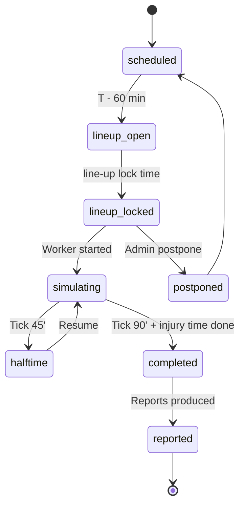

# State Machine - Match

Owns the lifecycle of an individual match from line-up lock to final
result. Server-authoritative in multiplayer; local in singleplayer.

## 1. States



## 2. State definitions

| State | Meaning |
|---|---|
| `scheduled` | Match exists with date and participants; no input yet |
| `lineup_open` | Managers can submit line-ups + tactics |
| `lineup_locked` | Line-up + tactic frozen for the match |
| `simulating` | Match worker is producing events |
| `halftime` | 45-minute pause; managers can apply halftime modal |
| `completed` | All ticks done; events finalised |
| `reported` | Reports + ratings + media events produced |
| `postponed` | Match moved to a later slot |

## 3. Transitions

| From | To | Trigger |
|---|---|---|
| `scheduled` | `lineup_open` | T - 60 min reached |
| `lineup_open` | `lineup_locked` | Lock time reached OR all line-ups submitted |
| `lineup_locked` | `simulating` | Match worker dispatched |
| `simulating` | `halftime` | Tick 45' reached |
| `halftime` | `simulating` | Resume timer fired |
| `simulating` | `completed` | Final whistle |
| `completed` | `reported` | Report worker done |
| `lineup_locked` | `postponed` | Admin command |
| `postponed` | `scheduled` | New date set |

## 4. Inputs accepted per state

| State | Allowed input |
|---|---|
| `scheduled` | None (match not yet open) |
| `lineup_open` | Line-up, tactic, set-piece routine, substitution priorities |
| `lineup_locked` | None (frozen) |
| `simulating` | Tactical changes, substitutions, shouts (per UI tier) |
| `halftime` | Halftime modal (3 controls minimum) |
| `completed` | Read-only |

## 5. Determinism contract

Per [[../09-Decisions/ADR-0003-match-engine]] and
[[../60-Research/research-wave-2-gaps]] R2-08:

- Match RNG seeded at `lineup_locked`.
- Tactical changes during `simulating` are events in the same stream;
  replays from the same seed + same intervention events reproduce the
  result.
- Watch party / replay consumes the same stream.

## 6. Persistence

```text
match {
  id: record(match),
  league: record(league),
  home_club: record(club),
  away_club: record(club),
  scheduled_at: datetime,
  lineup_open_at: datetime,
  lineup_lock_at: datetime,
  state: enum(state_names),
  seed: string,                  # set at lineup_locked
  engine_version: string,        # for deterministic re-sim
  home_lineup: object,
  away_lineup: object,
  home_tactic: object,
  away_tactic: object,
  match_type: enum(human_vs_human | human_vs_ai | ai_vs_ai),
  events: array<event>?,         # full log for human-involving; null until re-sim for AI vs AI
  summary: object,               # always present: result + key stats
  result: object?,
  reports: object?
}
```

### AI vs AI storage policy

Per [[../09-Decisions/ADR-0011-server-authoritative-multiplayer]] §AI vs AI
match policy:

- AI vs AI matches store `seed + lineups + tactics + summary` by default.
- `events` stays null until a watch-party / audit triggers re-simulation.
- Re-simulation runs the deterministic engine with the stored seed +
  `engine_version` to produce the full event log on demand.
- Engine upgrades that change determinism require a forward migration
  of stored matches (re-sim and re-store seeds).

## 7. Events emitted

- `MatchScheduled`
- `MatchLineupOpened`
- `MatchLineupLocked`
- `MatchSimulating`
- `MatchHalftime`
- `MatchEvent` (per-event during sim - high volume, batched)
- `MatchCompleted`
- `MatchReported`
- `MatchPostponed`

## 8. Failure / recovery

| Failure | Recovery |
|---|---|
| Match worker crash | Restart from last committed tick (snapshot every N events) |
| Player disconnects during live coaching | Last submitted state used; auto-coach proceeds |
| Race on lineup submission | Server-authoritative latest-wins until `lineup_locked` |

## 9. Open questions

- Tick rate of `MatchEvent` batches - tentative 1 batch per virtual
  minute, max 60 events / batch.
- Should AI-only matches use a faster code path? Yes - same engine,
  reduced narrative output, no spectator stream.
