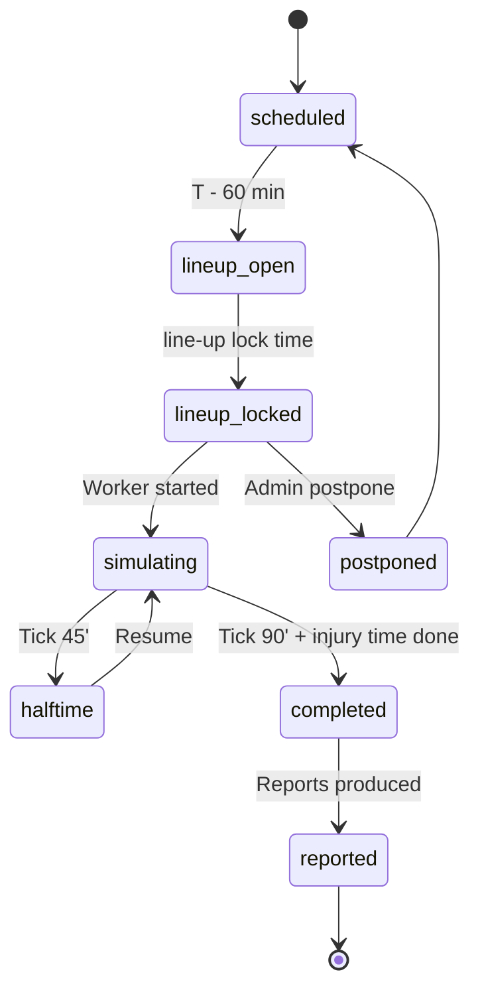

# State Machine - Match

Owns the lifecycle of an individual match from line-up lock to final
result. Server-authoritative in multiplayer; local in singleplayer.

## 1. States



## 2. State definitions

| State | Meaning |
|---|---|
| `scheduled` | Match exists with date and participants; no input yet |
| `lineup_open` | Managers can submit line-ups + tactics |
| `lineup_locked` | Line-up + tactic frozen for the match |
| `simulating` | Match worker is producing events |
| `halftime` | 45-minute pause; managers can apply halftime modal |
| `completed` | All ticks done; events finalised |
| `reported` | Reports + ratings + media events produced |
| `postponed` | Match moved to a later slot |

## 3. Transitions

| From | To | Trigger |
|---|---|---|
| `scheduled` | `lineup_open` | T - 60 min reached |
| `lineup_open` | `lineup_locked` | Lock time reached OR all line-ups submitted |
| `lineup_locked` | `simulating` | Match worker dispatched |
| `simulating` | `halftime` | Tick 45' reached |
| `halftime` | `simulating` | Resume timer fired |
| `simulating` | `completed` | Final whistle |
| `completed` | `reported` | Report worker done |
| `lineup_locked` | `postponed` | Admin command |
| `postponed` | `scheduled` | New date set |

## 4. Inputs accepted per state

| State | Allowed input |
|---|---|
| `scheduled` | None (match not yet open) |
| `lineup_open` | Line-up, tactic, set-piece routine, substitution priorities |
| `lineup_locked` | None (frozen) |
| `simulating` | Tactical changes, substitutions, shouts (per UI tier) |
| `halftime` | Halftime modal (3 controls minimum) |
| `completed` | Read-only |

## 5. Determinism contract

Per [[../09-Decisions/ADR-0003-match-engine]] and
[[../../60-Research/determinism-and-replay]]:

- Match RNG seeded at `lineup_locked`.
- Tactical changes during `simulating` are events in the same stream;
  replays from the same seed + same intervention events reproduce the
  result.
- Watch party / replay consumes the same stream.

## 6. Persistence

Per [[../09-Decisions/ADR-0027-postgres-data-model]]: a strongly-typed
`match` table in the per-save schema (typed Drizzle columns + `CHECK`),
cross-context references as opaque branded UUIDv7 columns (no cross-context
`references()`), embedded read-together objects as `jsonb`, and the
high-volume event log as a child table keyed by the parent match id.

```text
match {                          # strongly-typed (typed cols + CHECK)
  id: uuid (UUIDv7, app-generated, PK),
  league_id: uuid (LeagueId, opaque branded ref),
  home_club_id: uuid (ClubId, opaque branded ref),
  away_club_id: uuid (ClubId, opaque branded ref),
  scheduled_at: timestamptz,
  lineup_open_at: timestamptz,
  lineup_lock_at: timestamptz,
  state: text + CHECK IN (state_names),
  seed: text,                    # set at lineup_locked
  engine_version: text,          # for deterministic re-sim
  home_lineup: jsonb,
  away_lineup: jsonb,
  home_tactic: jsonb,
  away_tactic: jsonb,
  quality_profile: text + CHECK IN (competitive_full | interactive_standard | background_detailed | background_fast),
  match_type: text + CHECK IN (human_vs_human | human_vs_ai | ai_vs_ai),
  summary: jsonb,                # always present: result + key stats
  result: jsonb?,
  reports: jsonb?
}

match_event {                    # child table; high-volume event log
  id: uuid (UUIDv7, app-generated, PK),
  match_id: uuid (intra-context FK to match, indexed),
  payload: jsonb (per-event Zod at producer + consumer)
}
```

The full event log lives in `match_event` rows for human-involving matches;
for AI vs AI it stays unwritten until re-sim (see below).

### AI vs AI storage policy

Per [[../09-Decisions/ADR-0011-server-authoritative-multiplayer]] §AI vs AI
match policy:

- AI vs AI matches store `seed + lineups + tactics + quality_profile +
  summary` by default.
- No `match_event` rows are written until a watch-party / audit triggers
  re-simulation.
- Re-simulation runs the deterministic engine with the stored seed +
  `engine_version` + `quality_profile` to produce the full event log on
  demand.
- Engine upgrades that change determinism require a forward migration
  of stored matches (re-sim and re-store seeds).

## 7. Events emitted

- `MatchScheduled`
- `MatchLineupOpened`
- `MatchLineupLocked`
- `MatchSimulating`
- `MatchHalftime`
- `MatchEvent` (per-event during sim - high volume, batched)
- `MatchCompleted`
- `MatchReported`
- `MatchPostponed`

## 8. Failure / recovery

| Failure | Recovery |
|---|---|
| Match worker crash | Restart from last committed tick (snapshot every N events) |
| Player disconnects during live coaching | Last submitted state used; auto-coach proceeds |
| Race on lineup submission | Server-authoritative latest-wins until `lineup_locked` |

## 9. Future-scope notes (classified future-scope)

- Tick rate of `MatchEvent` batches - tentative 1 batch per virtual
  minute, max 60 events / batch.
- Should AI-only matches use a faster code path? Yes - same engine,
  reduced narrative output, no spectator stream.
## Related

- [[README]]
- [[../bounded-context-map]]
- [[../../50-Game-Design/match-engine]]
- [[../../60-Research/match-engine-runtime-strategy]]
- [[../09-Decisions/ADR-0011-server-authoritative-multiplayer]]
