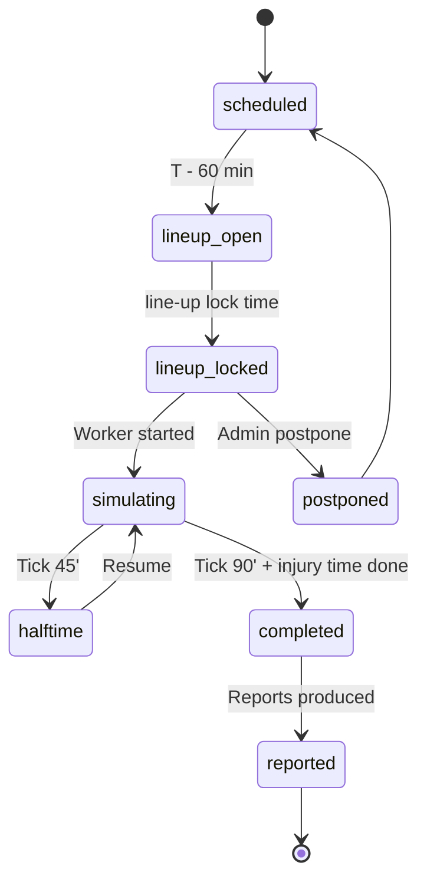

# State Machine - Match

Owns the lifecycle of an individual match from line-up lock to final result.
MVP canonical matches are server-authoritative. Future local/offline authority
requires a separate ADR/GDDR and must still use the same engine contract.

## 1. States



## 2. State definitions

| State | Meaning |
|---|---|
| `scheduled` | Match exists with date and participants; no input yet |
| `lineup_open` | Managers can submit line-ups + tactics |
| `lineup_locked` | Line-up + tactic frozen for the match |
| `simulating` | Match worker is producing events |
| `halftime` | 45-minute pause; managers can apply halftime modal |
| `completed` | All ticks done; events finalised |
| `reported` | Reports + ratings + media events produced |
| `postponed` | Match moved to a later slot |

## 3. Transitions

| From | To | Trigger |
|---|---|---|
| `scheduled` | `lineup_open` | T - 60 min reached |
| `lineup_open` | `lineup_locked` | Lock time reached OR all line-ups submitted |
| `lineup_locked` | `simulating` | Match worker dispatched |
| `simulating` | `halftime` | Tick 45' reached |
| `halftime` | `simulating` | Resume timer fired |
| `simulating` | `completed` | Final whistle |
| `completed` | `reported` | Report worker done |
| `lineup_locked` | `postponed` | Admin command |
| `postponed` | `scheduled` | New date set |

## 4. Inputs accepted per state

| State | Allowed input |
|---|---|
| `scheduled` | None (match not yet open) |
| `lineup_open` | Line-up, tactic, set-piece routine, substitution priorities |
| `lineup_locked` | None (frozen) |
| `simulating` | Tactical changes, substitutions, shouts (per UI tier; bounded by the §5.1 intervention-buffer policy) |
| `halftime` | Halftime modal (3 controls minimum) |
| `completed` | Read-only |

## 5. Determinism contract

Per [[../09-Decisions/ADR-0049-swappable-spatial-event-match-engine]] and
[[../../60-Research/determinism-and-replay]]:

- Match RNG seeded at `lineup_locked`.
- Tactical changes during `simulating` are events in the same stream;
  replays from the same seed + same intervention events reproduce the
  result.
- Watch party / replay consumes the same stream.

## 5.1 Intervention buffer policy (current — ADR-0087 / FMX-140)

> **Current amendment.** Fills the buffer state-machine that ADR-0072 (in-match control seam)
> explicitly deferred to G24. ADR-0087 is accepted/binding; FMX-140 confirmed this state-machine
> section as current on 2026-06-16.

ADR-0072 fixed *when* an accepted intervention applies (light → `immediateNextTick`; heavy →
`nextSemanticBoundary` ∈ {deadBall, restart, halftime}; atomic `TacticSnapshot` swap). The
`InterventionBufferPolicy` is a Match-aggregate **value object** that bounds *how many* land at
each deterministic acceptance point and how the rest are surfaced — a pure function of event
history + command payload (no wall-clock, no Watch-Party state; **no new `*Rng`**):

- **Per-point caps**: a global cap (~8) + per-type caps — substitutions ≤3, **one** tactical
  package (atomic multi-change), one shout. Magnitudes → FMX-52 (`interventionPolicyVersion`).
- **Deterministic ordering**: buffered interventions apply in ascending `(boundaryIndex,
  commandId)`; substitutions dedup (first kept); tactics/shouts last-write-wins (earlier
  superseded).
- **Rejection (self-contained, replay-safe)**: overflow/illegal/late cmds emit
  `InterventionRejected{reason}` with `reason ∈ {BufferFull, WindowClosed, DuplicateSuperseded,
  Illegal, NotExecutedInTime}` — consumable by UI/Notification with no cross-context join. Overflow
  rejects (no silent auto-defer); the ordinary legal-but-waiting path keeps ADR-0072's
  `pending → scheduled → applied`.
- **IFAB authority preserved**: substitution counts + windows stay rule-data-driven (competition
  data); the cap never overrides them.
- **Acceptance window** (`anyTime` vs `fixedWindowsOnly`) is set by the Watch-Party "Inputs at any
  time?" rule via an ACL command (`ConfigureMatchInterventionConstraints` →
  `MatchInterventionConstraintsConfigured`); Match only *enforces* it.

See [[../09-Decisions/ADR-0087-live-match-intervention-buffer-and-pause-vote]] (invariants IB1–IB7)
and [[../../50-Game-Design/GD-0035-live-coaching-intervention-and-pause-rules]].

## 6. Persistence

Per [[../09-Decisions/ADR-0027-postgres-data-model]]: a strongly-typed
`match` table in the per-save schema (typed Drizzle columns + `CHECK`),
cross-context references as opaque branded UUIDv7 columns (no cross-context
`references()`), embedded read-together objects as `jsonb`, and the
high-volume event log as a child table keyed by the parent match id.

```text
match {                          # strongly-typed (typed cols + CHECK)
  id: uuid (UUIDv7, app-generated, PK),
  league_id: uuid (LeagueId, opaque branded ref),
  home_club_id: uuid (ClubId, opaque branded ref),
  away_club_id: uuid (ClubId, opaque branded ref),
  scheduled_at: timestamptz,
  lineup_open_at: timestamptz,
  lineup_lock_at: timestamptz,
  state: text + CHECK IN (state_names),
  seed: text,                    # set at lineup_locked
  engine_id: text,               # concrete adapter/service used
  engine_version: text,          # for deterministic re-sim
  contract_version: text,        # MatchEnginePort DTO contract
  rng_version: text,             # PRNG algorithm/version
  home_lineup: jsonb,
  away_lineup: jsonb,
  home_tactic: jsonb,
  away_tactic: jsonb,
  quality_profile: text + CHECK IN (competitive_full | interactive_standard | background_detailed | background_fast),
  match_type: text + CHECK IN (human_vs_human | human_vs_ai | ai_vs_ai),
  summary: jsonb,                # always present: result + key stats
  result: jsonb?,
  reports: jsonb?
}

match_event {                    # child table; high-volume event log
  id: uuid (UUIDv7, app-generated, PK),
  match_id: uuid (intra-context FK to match, indexed),
  payload: jsonb (per-event Zod at producer + consumer)
}
```

The full event log lives in `match_event` rows for human-involving matches;
for AI vs AI it stays unwritten until re-sim (see below).

### AI vs AI storage policy

Per [[../09-Decisions/ADR-0011-server-authoritative-multiplayer]] §AI vs AI
match policy:

- AI vs AI matches store `seed + lineups + tactics + quality_profile +
  summary` by default.
- No `match_event` rows are written until a watch-party / audit triggers
  re-simulation.
- Re-simulation runs the deterministic engine with the stored seed +
  `engine_version` + `quality_profile` to produce the full event log on
  demand.
- Engine upgrades that change determinism require a forward migration
  of stored matches (re-sim and re-store seeds).

### Reconnect and pause policy

Disconnect handling is part of the match state, not the engine core.

| Scenario | Policy |
|---|---|
| Singleplayer/live coaching disconnect | Server pauses the watched match for a reconnect window; default 5 minutes. After the deadline it auto-continues from the last valid intervention state. |
| Async match viewer disconnect | Match continues; reconnect resumes from the latest event cursor if live, otherwise opens replay. |
| Watch-party active manager disconnect | Delegated to the watch-party group rule; match may pause only for configured active participants. |
| Watch-party deliberate/tactics pause | Match pauses only when Watch Party emits `PauseMatch`; it resumes only from `ResumeMatch` or the accepted auto-resume command. |
| Passive spectator disconnect | Never pauses the match; reconnect resumes live stream or replay. |

Pause windows are operational timers. They must not enter the deterministic
engine as wall-clock time; only accepted interventions become replay events.
Active-manager deliberate/tactics pauses suspend Match progression at a
deterministic safe point; passive spectator replay/pause is presentation-only.

## 7. Events emitted

Status note: the list below is current for the match state machine. The
intervention and pause events are current via ADR-0087/FMX-140; `MatchInjuryOccurred`
is the match-owned injury fact named by ADR-0018. Durable availability effects
remain Squad & Player-owned.

- `MatchScheduled`
- `MatchLineupOpened`
- `MatchLineupLocked`
- `MatchSimulating`
- `MatchHalftime`
- `MatchEvent` (per-event during sim - high volume, batched)
- `MatchCompleted`
- `MatchReported`
- `MatchPostponed`
- `InterventionBuffered` / `InterventionApplied` / `InterventionRejected` *(ADR-0087; §5.1)*
- `MatchPaused` / `MatchResumed` *(ADR-0087/FMX-140; deterministic response to Watch-Party `PauseMatch`/`ResumeMatch` commands; wall-clock stays out of the seeded engine per §6)*
- `MatchInjuryOccurred` *(ADR-0018; match fact consumed by Squad & Player for durable availability effects)*

## 8. Failure / recovery

| Failure | Recovery |
|---|---|
| Match worker crash | Restart from last committed event/checkpoint; verify replay hash before continuing |
| Player disconnects during live coaching | Pause for reconnect window, then continue from last submitted state |
| Race on lineup submission | Server-authoritative latest-wins until `lineup_locked` |

## 9. Future-scope notes (classified future-scope)

- Tick rate of `MatchEvent` batches - tentative 1 batch per virtual
  minute, max 60 events / batch.
- Should AI-only matches use a faster code path? Yes - same engine,
  reduced narrative output, no spectator stream.
