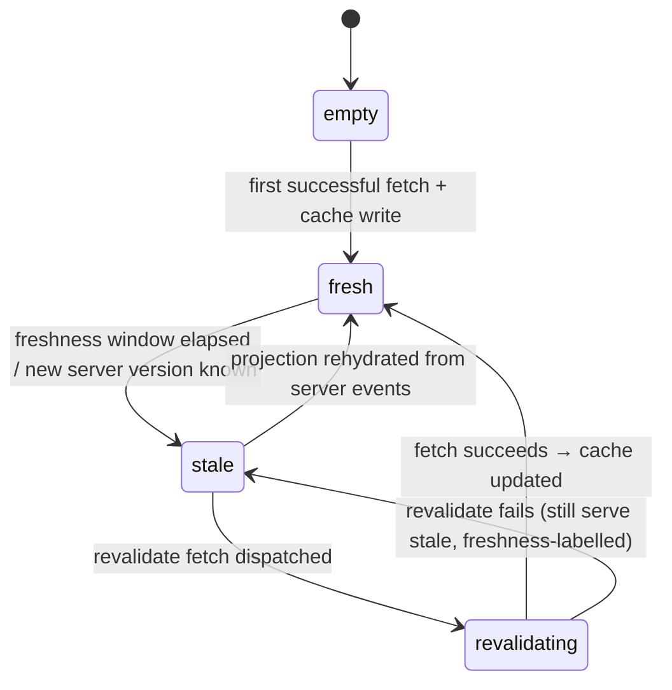

# State Machine - Offline Sync

> **Draft transcription.** This note records only the FSM surface that
> [[../09-Decisions/ADR-0090-offline-sync-scope-and-conflict-strategy]] and the
> ADRs it references ([[../09-Decisions/ADR-0008-mobile-first-ui]] client-state
> contract, [[../09-Decisions/ADR-0020-hybrid-online-mvp-offline-ready]] offline
> posture, [[../09-Decisions/ADR-0119-command-reception-dedup-seam]] reception
> seam) actually define. ADR-0090 is `accepted` / `binding: false`. It mandates
> the **seam** now (MVP sends synchronously) and defers the **durable command
> outbox + flush/backoff/rebase engine to post-MVP** ("phase 2"). Where the ADRs
> name a concept but do not pin a state label, trigger, guard threshold, timer or
> retry constant, it is listed under [§ Open decisions](#open-decisions) and **not**
> invented here.

Offline Sync owns (per ADR-0090 Decision): cache-freshness + draft-status metadata
(MVP); and **post-MVP** the durable command outbox (IndexedDB), background-sync
flush + exponential backoff, client-side retry state, `expectedVersion` conflict
presentation / rebase, and the offline UX states. It does **not** own domain
validation (each owning context re-validates), the canonical event store / outbox
([[../09-Decisions/ADR-0028-postgres-transactional-outbox]]), or server-side
replay/dedup acceptance (owned by Audit & Security via Command Reception,
[[../09-Decisions/ADR-0119-command-reception-dedup-seam]]).

Two FSMs are defined plus one presentation-mode enum:

1. `DraftCommand` — the durable per-command lifecycle (the client queue entry).
   At MVP this is the Dexie draft lifecycle from ADR-0008; post-MVP the same
   entry becomes a durable outbox record with flush/retry/rebase. **The two are
   the same FSM, presented here in its full post-MVP form with the MVP subset
   marked.**
2. `CacheFreshness` — per read-model staleness lifecycle (stale-while-revalidate).
3. `OfflineUxMode` — the four product/UI offline meanings (ADR-0020) — a
   presentation enum, recorded for completeness, not a transition graph.

---

## 1. `DraftCommand` states (client command-queue entry)

This FSM unifies the ADR-0008 MVP draft lifecycle (`draft → staged → submitting
→ confirmed | rejected`) with the post-MVP outbox/flush/rebase concepts named in
ADR-0090 and ADR-0119. **State labels for the MVP subset are verbatim from
ADR-0008.** The post-MVP `queued`/flush/`rebasing` labels are **not** verbatim in
any ADR — see [§ Open decisions](#open-decisions). The diagram below uses the
ADR-0008 labels as the spine and shows the post-MVP additions as annotated paths.

```mermaid
stateDiagram-v2
    [*] --> draft
    draft --> staged: user commits draft (command-id + expectedVersion attached)
    staged --> submitting: dispatch to transport (MVP: immediate; post-MVP: background-sync flush)
    submitting --> confirmed: server emits canonical events (ack)
    submitting --> rejected: domain rejection / replay-duplicate / illegal
    submitting --> conflict: stale expectedVersion (concurrency result)
    conflict --> staged: rebase still-valid command on new server version
    conflict --> rejected: command no longer valid after rebase
    submitting --> staged: transient transport failure → retry w/ backoff (post-MVP)
    confirmed --> [*]
    rejected --> [*]
```

### State definitions

| State | Meaning | Phase |
|---|---|---|
| `draft` | Durable working copy in Dexie/IndexedDB; not yet committed by the user; editable (ADR-0008 draft lifecycle) | MVP |
| `staged` | User committed the draft; `command-id` (idempotency key) + `expectedVersion` attached; awaiting dispatch (ADR-0008; ADR-0090 seam point 2; ADR-0115) | MVP |
| `submitting` | Dispatched to the command-oriented transport (`POST .../commands/{type}`). MVP sends immediately; post-MVP this is the background-sync flush of a durable outbox record (ADR-0090 Decision) | MVP send / post-MVP flush |
| `confirmed` | Server re-validated and emitted canonical events via the outbox; client treats server events as truth (ADR-0090 D2=A; ADR-0119 idempotent-ack) | MVP |
| `rejected` | Server returned a domain rejection, a replay/dedup rejection, or the command was illegal/late; surfaced to UI/Notification (ADR-0008 `rejected`/needs-review; ADR-0119 rejected facts) | MVP |
| `conflict` | Server returned a stale-`expectedVersion` concurrency result (different command-id, stale version) — a rebase/concurrency result, **not** a replay-duplicate (ADR-0119 §concurrency) | post-MVP rebase surface |

> **Terminal states:** `confirmed`, `rejected`.

### Transitions

| From | To | Trigger | Guard / note |
|---|---|---|---|
| `draft` | `staged` | User commits the draft | `command-id` + `expectedVersion` precondition attached (ADR-0008 U4; ADR-0115) |
| `staged` | `submitting` | Dispatch to transport | MVP: immediate. Post-MVP: background-sync flush of durable outbox record (ADR-0090) |
| `submitting` | `confirmed` | Server emits canonical events (ack) | Idempotent: a retry with the same `command-id` receives the same result (ADR-0119) |
| `submitting` | `rejected` | Domain rejection, replay/dedup rejection, or illegal/late command | Server is sole authority (ADR-0090 D2=A; ADR-0119) |
| `submitting` | `conflict` | Stale `expectedVersion` concurrency result | Different command-id + stale version → concurrency result, not a duplicate (ADR-0119) |
| `conflict` | `staged` | Rebase still-valid queued command onto new server version | "client rebases still-valid queued commands on conflict" (ADR-0090 D2=A) |
| `conflict` | `rejected` | Command no longer valid after rebase | Re-validation against current aggregate state fails (ADR-0090 D2=A) |
| `submitting` | `staged` | Transient transport/network failure → retry | Post-MVP: client-side retry state + exponential backoff (ADR-0090; ADR-0119 "retry safely after offline/network loss"). **Backoff constants / retry caps undefined — see Open decisions** |

---

## 2. `CacheFreshness` states (read-model staleness)

Per ADR-0090 D1=A, the Service Worker uses **stale-while-revalidate** for read
models (fixtures, tables); ADR-0020 §2 permits showing last-confirmed read models
"with stale/freshness labels". The exact label/state names below are **not** pinned
by the ADRs (ADR-0020 gives the four UX *meanings*, §3 below, not a per-cache FSM)
— see [§ Open decisions](#open-decisions).



| State | Meaning |
|---|---|
| `empty` | No cached copy of the read model yet |
| `fresh` | Last successful fetch is current; served without a stale label |
| `stale` | Cached copy served while-revalidate; freshness-labelled per ADR-0020 §2/§3 |
| `revalidating` | Background revalidate fetch in flight (stale-while-revalidate) |

> Clients can always **rehydrate projections from server events** (ADR-0090 seam
> point 4), so `stale`/`empty` is always recoverable to `fresh`.

---

## 3. `OfflineUxMode` (presentation enum — ADR-0020 §3)

Not a transition FSM — the four distinct product/UI meanings the shell binds
(ADR-0008 §client-state; ADR-0020 §3). Mode is a function of network availability,
cache state and draft presence.

| Mode | Meaning (verbatim, ADR-0020) |
|---|---|
| `available-offline` | Can be used without network |
| `cached-stale` | Last confirmed data, possibly stale (freshness-labelled) |
| `draft-on-device` | Local only, not authoritative |
| `requires-connection` | Cannot be finalised offline |

---

## 4. Trigger sources

| Trigger | Source |
|---|---|
| User commits draft (`draft → staged`) | Player command via optimistic-UI screen (ADR-0008 `useMutation` `onMutate`) |
| Dispatch / flush (`staged → submitting`) | MVP: synchronous send. Post-MVP: Background Sync API flush event (ADR-0090). **Flush scheduling undefined — see Open decisions** |
| Ack (`submitting → confirmed`) | Server-emitted canonical events via the ADR-0028 outbox; reception ack per ADR-0119 |
| Rejection (`submitting → rejected`) | Server domain rejection / Command Reception replay-dedup rejection (ADR-0119) |
| Concurrency (`submitting → conflict`) | Server stale-`expectedVersion` result (ADR-0119) |
| Retry (`submitting → staged`) | Transient transport failure; client backoff timer (post-MVP, ADR-0090). **Timer values undefined** |

---

## 5. Determinism & ownership contract

- **Server is the single authority** (ADR-0090 D2=A): server re-validates each
  command against current aggregate state + rules and emits canonical events;
  the client treats server events as truth and rebases still-valid queued
  commands on conflict. CRDTs are **excluded** from core game state (confined to
  watch-party collaborative overlays as a separate module/channel);
  last-write-wins is allowed **only** for cosmetic local preferences.
- **Idempotency** (ADR-0115, ADR-0119): every command carries `command-id` +
  `expectedVersion`; the same hash/binding retry receives the same result, so
  retries after offline/network loss are replay-safe.
- **Boundary** (ADR-0119): the replay/dedup *gate* and processed-command state
  are owned by Audit & Security (Command Reception), **before** domain
  validation; Offline Sync owns only the client queue, retry/backoff, offline UX
  and the `expectedVersion` rebase **presentation**.

## 6. Persistence model

Per ADR-0008 the durable client-side state (drafts, status, last-known server
version, conflict metadata, offline queue) lives in **Dexie/IndexedDB**, never
`localStorage` (ADR-0020 §3). Post-MVP the queue entry becomes a durable IndexedDB
outbox record (ADR-0090). Server-side persistence (canonical event store /
transactional outbox, processed-command state) is **not** owned here — see
[[../09-Decisions/ADR-0028-postgres-transactional-outbox]] /
[[../09-Decisions/ADR-0027-postgres-data-model]] (Audit & Security via ADR-0119).
The exact IndexedDB schema for the durable outbox record is **not** specified by
the ADRs — see [§ Open decisions](#open-decisions).

## 7. Failure / recovery cases

| Failure | Recovery (as defined by source) |
|---|---|
| Network loss while `submitting` | Retry safely after offline/network loss; same `command-id` is replay-safe (ADR-0119). **Retry/backoff policy undefined** |
| Duplicate command reaches server | Idempotent ack — same hash/binding retry receives the same result; no duplicate domain execution (ADR-0119) |
| Stale `expectedVersion` (concurrency) | Server returns concurrency result; Offline Sync presents/rebases (`conflict → staged`/`rejected`, ADR-0090 D2=A / ADR-0119) |
| Cache stale / missing | Serve freshness-labelled stale data, or rehydrate projection from server events (ADR-0090 seam point 4; ADR-0020 §2) |
| Offline notification delivery | Per [[../09-Decisions/ADR-0102-notification-platform-re-ratification-offline-delivery-clause]] (offline-delivery clause) |

---

## Open decisions

The following are concepts the ADRs name but **do not** pin down. They are flagged
here, not invented, per the decision gate. They become concrete when the post-MVP
durable-outbox engine is designed (ADR-0090 "phase 2").

1. **Post-MVP queue state labels.** ADR-0090/0119 describe a durable outbox with
   flush/retry/rebase but never name the post-MVP states. The names used here
   (`conflict`, plus the retry self-loop) extend the verbatim ADR-0008 spine
   (`draft → staged → submitting → confirmed | rejected`); the task-suggested
   `queued / sent / acked / rebased` vocabulary is **not** in any ADR. The
   authoritative post-MVP state set + names are undecided.
2. **Exponential-backoff constants.** ADR-0090 mandates "exponential backoff" but
   gives no base interval, multiplier, jitter, max-interval or max-retry cap.
3. **Retry cap / dead-letter terminal state.** Whether a command that exhausts
   retries enters a terminal `failed`/dead-letter state (distinct from `rejected`)
   is not defined.
4. **Background-sync flush scheduling.** Whether flush is driven by the Background
   Sync API, online events, or a periodic timer, and its ordering guarantees
   (FIFO per aggregate? global?) are not specified.
5. **`CacheFreshness` freshness window.** ADR-0090 says stale-while-revalidate and
   ADR-0020 says "freshness-labelled", but no TTL / freshness-window value or
   per-read-model labelling rule is pinned. The `CacheFreshness` state names here
   are descriptive, not ADR-verbatim.
6. **Durable outbox IndexedDB schema.** Table/record shape, indexes and the
   per-save scoping for the post-MVP IndexedDB outbox are unspecified.
7. **Rebase semantics detail.** ADR-0090 says still-valid queued commands rebase
   on conflict, but the rebase algorithm (which queued commands are re-checked,
   ordering, batch vs per-command, user-facing resolution for "rare high-value
   clashes" which the ADR explicitly marks post-MVP) is undefined.
8. **`DraftCommand` ↔ `OfflineUxMode` mapping.** The exact function from
   (network, cache, draft) state to the four ADR-0020 UX modes is not pinned.
