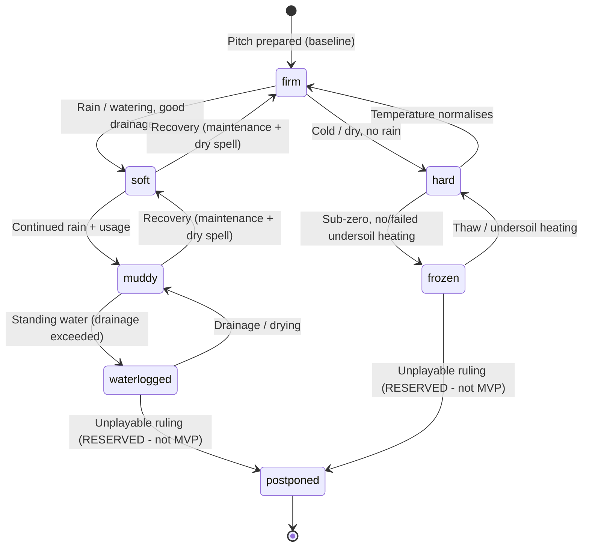

# State Machine - Pitch Condition

Models the **playability/condition** of a stadium pitch as it responds to weather
and usage. Pitch **facility/usage state** (drainage, undersoil heating,
maintenance, minutes-played) is owned by **Stadium Operations**
([[../09-Decisions/ADR-0061-club-management-sub-aggregate-audit]]); the
**weather input + derivation rules** are owned by the proposed **Environment &
Climate** context ([[../09-Decisions/ADR-0077-environment-and-climate-context-weather-and-pitch]],
D1 = new context). Stadium Operations remains the `PitchConditionChanged` emitter;
**Match** consumes the condition as a frozen snapshot at `lineup_locked`. The
exact state-vs-rules split is the open ratification item in ADR-0077.

> `draft` / `binding: false`. MVP exposes condition as **in-match modifiers only**
> (ADR-0077 D4); the `postponed` / `abandoned` ruling is a **reserved**
> future-scope transition (named hook `PitchPlayabilityRuling`).

## 1. States

Wet axis (`firm → soft → muddy → waterlogged`) and cold axis
(`firm → hard → frozen`) share the `firm` baseline; a pitch is on at most one
non-baseline axis at a time per match window.

## 2. State definitions

| State | Meaning |
|---|---|
| `firm` | Baseline prepared surface; ball rolls/bounces normally. |
| `soft` | Wet but playable; ball skids slightly faster; mild traction penalty. |
| `muddy` | Heavily wet/cut-up; ↓ short-passing reliability, ↑ deflections, slower. |
| `waterlogged` | Standing water; ball plugs/splashes; high slip/injury risk. (MVP: strong modifier; ruling reserved.) |
| `hard` | Cold/dry firm ground; faster, less predictable bounce. |
| `frozen` | Rock-hard / rutted; ↑ muscle-injury risk; dangerous footing. (MVP: strong modifier; ruling reserved.) |
| `postponed` | **RESERVED (not MVP):** unplayable ruling → League re-fixturing. |

## 3. Transitions

| From | To | Trigger |
|---|---|---|
| `firm` | `soft` | Rain / pre-match watering with adequate drainage |
| `soft` | `muddy` | Continued rain + accumulated usage |
| `muddy` | `waterlogged` | Rainfall exceeds drainage capacity (standing water) |
| `waterlogged` | `muddy` | Drainage / drying between matches |
| `muddy`/`soft` | `soft`/`firm` | Maintenance + dry spell (recovery) |
| `firm` | `hard` | Cold + dry, no rain |
| `hard` | `frozen` | Sub-zero with no/failed undersoil heating |
| `frozen` | `hard` | Thaw or undersoil heating |
| `hard` | `firm` | Temperature normalises |
| `waterlogged`/`frozen` | `postponed` | **RESERVED:** `PitchPlayabilityRuling` (inspection: state + forecast + remediation time) — not MVP |

## 4. Inputs

- **Weather** (Environment & Climate `MatchWeatherResolved` / forecast): precip
  type+intensity, temperature, WBGT, wind, visibility.
- **Facility state** (Stadium Operations): drainage quality, undersoil heating
  on/off + effectiveness, pitch maintenance level.
- **Usage** (Stadium Operations): accumulated minutes / matches since recovery.

## 5. Persistence

Pitch condition is **accumulated state + a pre-match snapshot** (ADR-0077 EC7):
the dynamic fields (moisture, compaction, grass-cover, roughness, residual
damage) update after each match via a pure function
`G(state_t, weather_t, usage_t)` and persist; a **pre-match snapshot** is stored
with the match so single-match replay reconstructs the condition independent of
the global sequence of earlier matches. No `WeatherRng` draw happens here — the
condition is a deterministic derivation of weather + facility + usage inputs.

## 6. Events emitted

- `PitchConditionChanged` (Stadium Operations — existing in the map): self-contained
  condition fact consumed by Match at `lineup_locked`, by Audience & Atmosphere
  and Matchday-Event-Engine, and by CommercialPortfolio matchday-cost risk.

## 7. Future-scope notes

- **`postponed` / `abandoned`** and the `PitchPlayabilityRuling` inspection
  (state + forecast + remediation-time decision) → League re-fixturing + refund
  paths. Reserved for a later E2/League issue (ADR-0077 D4 = modifiers only at
  MVP).
- Dynamic in-match condition change (deteriorating during play) — reserved; MVP
  freezes the condition at `lineup_locked`.
- All decay/recovery rates and band thresholds → **FMX-52** calibration behind
  `weatherModelVersion`.
