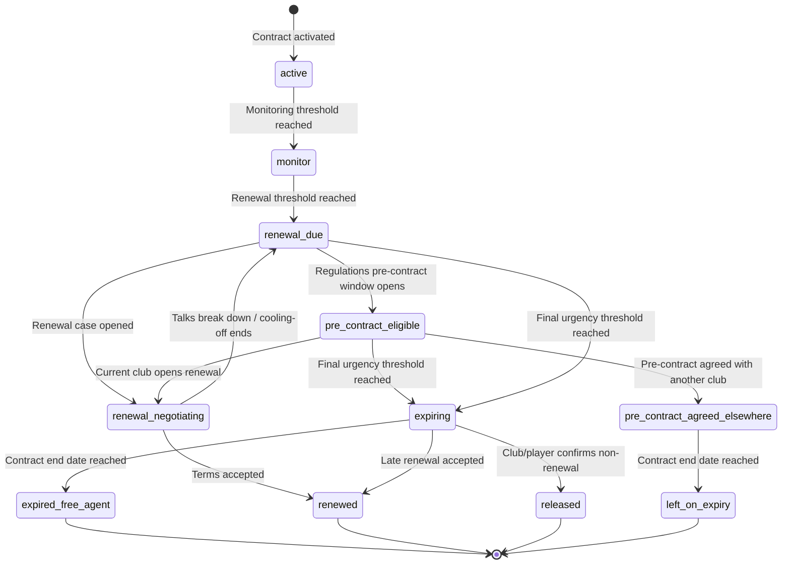
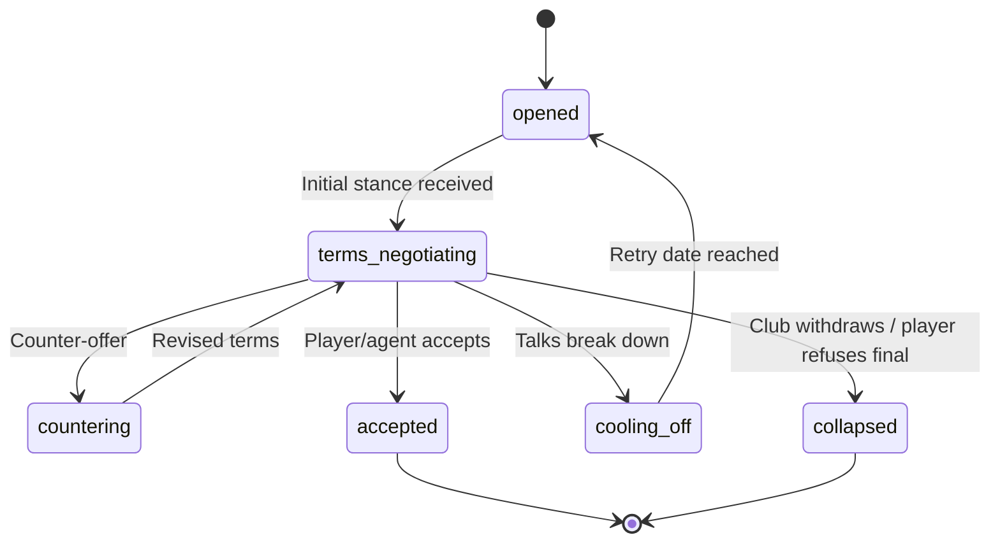
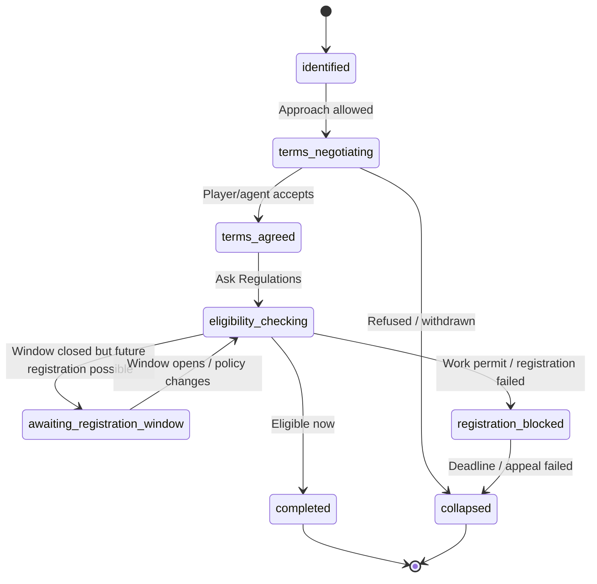

# State Machine - Player Contract Lifecycle

Owns the lifecycle of a player-club contract version. Owning context:
**Squad & Player** (ADR-0073 proposed). Transfer owns renewal, pre-contract and
free-agent signing cases that can command lifecycle changes; Regulations owns
policy verdicts; Notification owns warning delivery.

## 1. Squad-owned lifecycle



## 2. State definitions

| State | Meaning |
|---|---|
| `active` | Contract is in force and not in a warning band. |
| `monitor` | Contract is approaching planning range, usually 18-24 months. |
| `renewal_due` | Club should decide to renew, sell, release or defer. |
| `renewal_negotiating` | Transfer-owned renewal case is active. |
| `pre_contract_eligible` | Regulations says external clubs may approach under the active policy profile. |
| `pre_contract_agreed_elsewhere` | Future-club terms are agreed; current contract remains in force until expiry. |
| `expiring` | Final urgency band. Player can leave on expiry if unresolved. |
| `expired_free_agent` | Contract ended; player is unattached. |
| `renewed` | Old contract version closed and a new version starts. |
| `released` | Non-renewal was confirmed before the end date. |
| `left_on_expiry` | Player exits current club at end date, usually because of pre-contract elsewhere. |

## 3. Transfer-owned process cases

### RenewalNegotiationCase



### PreContractCase / FreeAgentSigningCase



## 4. Transition triggers

| From | To | Trigger source |
|---|---|---|
| `active` | `monitor` | Deterministic save-date tick reaches `monitorThreshold`. |
| `monitor` | `renewal_due` | Deterministic save-date tick reaches `renewalDueThreshold`. |
| `renewal_due` | `renewal_negotiating` | Transfer opens `RenewalNegotiationCase`. |
| `renewal_negotiating` | `renewed` | Transfer emits accepted renewal terms; Squad validates and versions contract. |
| `renewal_due` / `pre_contract_eligible` | `expiring` | Deterministic final urgency threshold. |
| `renewal_due` | `pre_contract_eligible` | Regulations `ContractPermissionPolicy` window opens. |
| `pre_contract_eligible` | `pre_contract_agreed_elsewhere` | Transfer emits `PreContractAgreed`. |
| `expiring` | `released` | Club/player confirms non-renewal before end date. |
| `expiring` | `expired_free_agent` | Contract end date reached with no renewal/pre-contract elsewhere. |
| `pre_contract_agreed_elsewhere` | `left_on_expiry` | Contract end date reached; future contract activates through target club path. |

## 5. Events emitted

Squad & Player emits:

- `ContractMonitorWindowOpened`
- `ContractRenewalDue`
- `ContractExpiring`
- `ContractRenewed`
- `PlayerReleasedOnExpiry`
- `PlayerBecameFreeAgent`
- `PlayerContractLifecycleAdvanced`

Transfer emits:

- `RenewalNegotiationOpened`
- `PreContractWindowOpened` (opportunity projection, sourced from Regulations)
- `PreContractAgreed`
- `FreeAgentTermsAgreed`
- `FreeTransferEligibilityCheckRequested`
- `FreeTransferRegistrationBlocked`
- `FreeTransferCompleted`

Notification consumes:

- `ContractMonitorWindowOpened`
- `ContractRenewalDue`
- `ContractExpiring`
- `PlayerBecameFreeAgent`
- `PreContractAgreed`

Club Management consumes financial intents from renewal/free-agent/pre-contract
completion and posts ledger entries through its ACL.

## 6. Persistence

Per ADR-0027, the future implementation stores strongly typed tables in the
per-save schema. Cross-context references are opaque branded UUIDv7 columns.

```text
player_contract {
  id: uuid,
  player_id: uuid,
  club_id: uuid,
  version: integer,
  state: text,
  start_date: date,
  end_date: date,
  policy_profile_id: text,
  rule_set_version: text,
  wage_minor: bigint,
  term_summary: jsonb,
  history: jsonb
}

contract_lifecycle_schedule {
  contract_id: uuid,
  monitor_at: date,
  renewal_due_at: date,
  pre_contract_eligible_at: date?,
  expiring_at: date,
  expires_at: date
}
```

The Transfer-owned case persistence stays in Transfer and references
`player_contract.id` only as an opaque ID.

## 7. Failure / recovery cases

- Missed scheduler tick: recompute lifecycle state from save date, contract end
  date and rule-set snapshot; emit idempotent catch-up events.
- Duplicate renewal acceptance: contract version is monotonic; stale version
  commands reject deterministically.
- Pre-contract then late current-club renewal: default reject unless a future
  Regulations profile explicitly supports cancellation; this is a legal/profile
  gate, not Transfer discretion.
- Free-agent terms agreed but registration blocked: case stays
  `registration_blocked` or `awaiting_registration_window`; player is not match
  eligible.
- Work-permit criteria update mid-save: use the save's `ruleSetVersion`, not a
  mutable live catalog.

## 8. Test strategy

- Property-based: every lifecycle state has a terminal path; no orphan state.
- Determinism: same save date + contract dates + rule-set version yields the same
  warning and expiry transitions.
- Boundary: Transfer cannot create `FreeAgentSigningCase` by nulling
  `seller_club_id` in the club-to-club FSM.
- Notification: expiry-warning payload contains all display facts.
- Regulations: profile switches change verdicts only through versioned rule-set
  snapshots.
- Finance: signing bonus / agent fee / wage consequences produce Club Management
  intents only, never ledger writes outside Club Management.

## 9. Future-scope notes

- Dedicated Contracts bounded context if contract lifecycle outgrows Squad &
  Player after loans/staff/commercial contract work.
- Protected-period breach / just-cause disputes and sanctions.
- Club/player unilateral option clauses.
- Rich agent personality and dialogue beyond process tags.

## Related

- [[../09-Decisions/ADR-0073-player-contract-lifecycle-fsm]]
- [[transfer]]
- [[../../50-Game-Design/transfer-market-and-contracts]]
- [[../../60-Research/player-contract-lifecycle-fsm-2026-06-03]]
