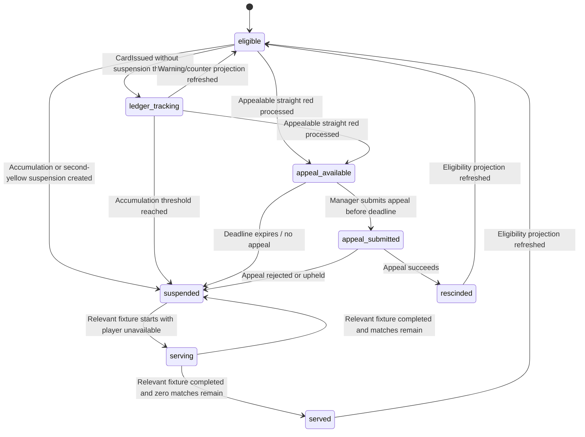

# State Machine - Player Discipline

Owns the player discipline availability lifecycle. Owning context:
**Squad & Player** via the FMX-80 sub-aggregate proposed in
[[../09-Decisions/ADR-0078-player-discipline-suspension-contracts]]. Match owns
card facts; Regulations owns profiles; Narrative/Notification consume emitted
facts.

## 1. Squad-owned discipline lifecycle



## 2. State definitions

| State | Meaning |
|---|---|
| `eligible` | No active in-scope suspension blocks the player. |
| `ledger_tracking` | A card was recorded and counters/warning bands changed, but no ban is active. This is a transient processing state. |
| `appeal_available` | A straight-red suspension candidate exists and the profile allows an appeal before the next relevant fixture. |
| `appeal_submitted` | Manager submitted an appeal; eligibility remains unresolved until the pre-fixture decision. |
| `suspended` | Player has an active suspension window and is ineligible for in-scope fixtures. |
| `serving` | A relevant fixture is consuming one match from the suspension. This is transient during fixture resolution. |
| `served` | Suspension reached zero remaining matches; a served event can be emitted. |
| `rescinded` | Appeal succeeded; the suspension is voided or reduced to zero before service. |

## 3. Transition triggers

| From | To | Trigger source |
|---|---|---|
| `eligible` / `ledger_tracking` | `ledger_tracking` | Match emits `CardIssuedV1`; no profile threshold creates a ban. |
| `eligible` / `ledger_tracking` | `suspended` | `CardIssuedV1` plus `DisciplineProfileV1` creates a non-appealable accumulation or second-yellow suspension. |
| `eligible` / `ledger_tracking` | `appeal_available` | Straight-red card is appealable under the active Regulations profile. |
| `appeal_available` | `appeal_submitted` | Manager submits `SubmitDisciplineAppeal`. |
| `appeal_available` | `suspended` | Appeal deadline expires or manager declines appeal. |
| `appeal_submitted` | `suspended` | Appeal outcome upholds or rejects the suspension. |
| `appeal_submitted` | `rescinded` | Appeal outcome rescinds the suspension. |
| `suspended` | `serving` | Match line-up lock / fixture start confirms an in-scope fixture. |
| `serving` | `suspended` | Fixture completed; `matchesRemaining > 0`. |
| `serving` | `served` | Fixture completed; `matchesRemaining = 0`. |
| `served` / `rescinded` | `eligible` | `PlayerEligibilitySnapshot` refreshed. |

## 4. Commands and inputs

Squad & Player handles:

- `RecordCardForDiscipline(cardIssuedRef)`
- `CreateSuspensionWindow(playerRef, profileRef, sourceCardRefs)`
- `SubmitDisciplineAppeal(suspensionRef)`
- `ResolveDisciplineAppeal(appealRef, outcome)`
- `ConsumeSuspensionFixture(suspensionRef, fixtureRef)`
- `RefreshPlayerEligibilitySnapshot(playerRef)`

External inputs:

- Match `CardIssuedV1`
- Match / League fixture-completed facts for relevant fixture service
- Regulations `DisciplineProfileV1`
- Manager command to submit appeal

## 5. Events emitted

Squad & Player emits:

- `PlayerDisciplineLedgerUpdated`
- `PlayerDisciplineWarningChanged`
- `PlayerSuspendedV1`
- `DisciplineAppealSubmittedV1`
- `DisciplineAppealResolvedV1`
- `SuspensionServedV1`
- `PlayerEligibilitySnapshotUpdated`

Match emits:

- `CardIssuedV1`

Regulations exposes:

- `DisciplineProfileV1`

Narrative and Notification consume:

- `PlayerSuspendedV1`
- `DisciplineAppealSubmittedV1`
- `DisciplineAppealResolvedV1`
- `SuspensionServedV1`

## 6. Persistence

Per ADR-0027, future implementation stores Squad & Player discipline state in
the per-save schema. Cross-context references are opaque branded UUIDv7 columns.

```text
player_discipline_ledger {
  player_ref,
  club_ref,
  season_ref,
  competition_group_ref,
  profile_id,
  profile_version,
  yellow_accumulation_count,
  warning_band,
  updated_at
}

suspension_window {
  suspension_ref,
  player_ref,
  club_ref,
  trigger_type,
  reason_band,
  severity_band,
  scope,
  matches_total,
  matches_remaining,
  status,
  appeal_status,
  source_card_refs,
  source_match_ref,
  profile_id,
  profile_version
}

discipline_appeal_case {
  appeal_ref,
  suspension_ref,
  status,
  submitted_at,
  deadline_at,
  resolved_at,
  outcome,
  rationale_band
}
```

## 7. Failure and recovery

- Duplicate `CardIssuedV1`: ignore by idempotency key/source card ref.
- Missing `DisciplineProfileV1`: keep player in `ledger_tracking`, mark
  projection stale, and block completion of post-match discipline processing.
- Postponed fixture: do not decrement `matchesRemaining`; service is tied to
  completed relevant fixtures, not calendar dates.
- Appeal unresolved before the next relevant fixture: policy error. The
  pre-fixture processor must resolve or expire it before line-up lock.
- Rescinded card after publication: emit `DisciplineAppealResolvedV1` with
  `rescinded` and supersede the earlier `PlayerSuspendedV1` story thread.

## 8. Test strategy

Future implementation should cover:

- yellow accumulation reaches profile threshold and creates one suspension;
- second-yellow red creates non-appealable suspension;
- straight-red appeal available -> submitted -> rejected path;
- straight-red appeal submitted -> rescinded path;
- scope filtering for `competition`, `domestic` and `all`;
- postponed fixture does not decrement remaining matches;
- line-up lock rejects active in-scope suspension;
- Narrative projection consumes `PlayerSuspendedV1` without querying Squad,
  Match or Regulations.

## Related

- [[../09-Decisions/ADR-0078-player-discipline-suspension-contracts]]
- [[match]]
- [[../09-Decisions/ADR-0052-people-persona-and-skills-context]]
- [[../09-Decisions/ADR-0056-regulations-compliance-context]]
- [[../09-Decisions/ADR-0076-narrative-newsworthiness-event-contracts]]
- [[../../60-Research/player-discipline-sub-aggregate-2026-06-05]]
