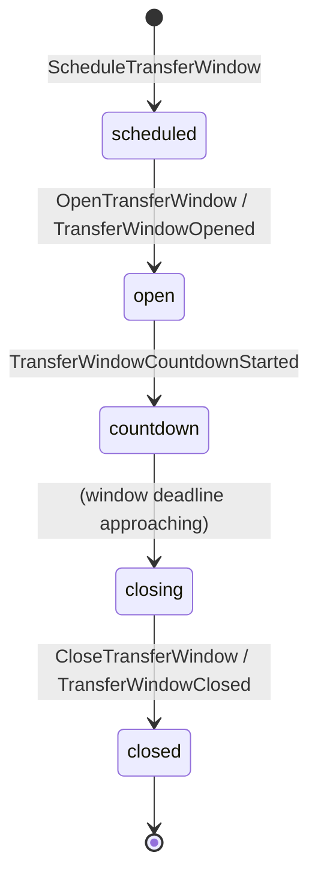
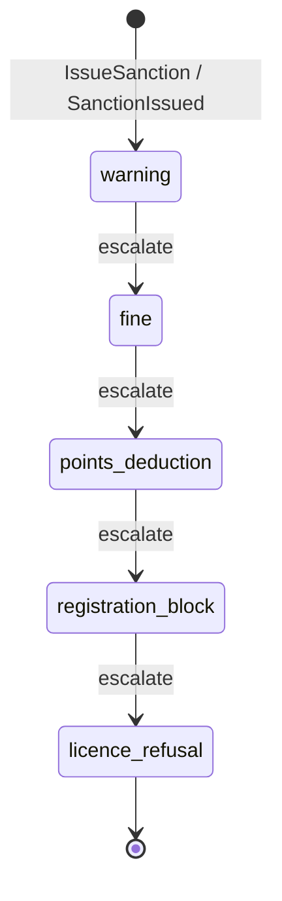

# State Machine - Regulations & Compliance (draft)

> **Source of truth:** [[../09-Decisions/ADR-0056-regulations-compliance-context]]
> (FMX-30 / FMX-39; accepted 2026-05-28, Option B). This note **transcribes**
> the two stateful lifecycles the ADR names — it does not add states,
> guards, or timers the ADR leaves open. Everything the ADR does not pin
> down is collected under [§ Open decisions](#open-decisions); the ADR
> itself flags transfer-window curve tuning and sanction tuning as
> "GDDR territory". This note is `draft` / `binding: false` per the current
> research/architecture phase.

Most of the Regulations & Compliance context is **catalog editorial +
query computation**, not a runtime FSM: `RegulatoryProfile`, `Rule`,
`WorkPermitCatalog`, `LicenceTierRequirement` and the read models
(`EligibilityForTransfer`, `WorkPermitScore`, `HomeGrownStatus`,
`SquadRegistrationCheck`, `LicenceTierCompliance`, `FfpRatioCheck`,
`EffectiveRuleSet`) are versioned-catalog lookups and composite verdicts,
not lifecycles. ADR-0056 names exactly **two** aggregates with their own
state machine:

1. `TransferWindow` — per competition × season window lifecycle
   (ADR-0056 §Decision: "FSM: scheduled → open → countdown → closing →
   closed").
2. `SanctionCatalog` escalation chain — the per-rule sanction ladder
   (ADR-0056 §Decision: "warning → fine → points deduction →
   registration block → licence refusal escalation chain").

Eligibility / registration / promotion orchestration is **not** owned
here — those run as Process Manager / Saga inside the consuming BC
(Transfer, Squad & Player, League Orchestration) per ADR-0056 §Decision
and the handoff contract in
[[../09-Decisions/ADR-0069-league-regulations-eligibility-handoff]].
Regulations is queried; it owns the rule, not the chain.

## 1. `TransferWindow` states

Transcribed verbatim from ADR-0056 §Decision (the `TransferWindow`
aggregate FSM) and §Public contract direction (commands / events /
`CurrentTransferWindow` read model). Per competition × season.

### State definitions

| State | Meaning |
|---|---|
| `scheduled` | Window registered for a competition × season but not yet open; created by `ScheduleTransferWindow`. Pre-authored at save creation per the ADR-0056 determinism rule (no live catalog reads mid-save) |
| `open` | Window active; `CurrentTransferWindow(competition, date)` returns **open**; registrations / completions permitted by consumers querying this state |
| `countdown` | Window still open but in its run-out phase; `CurrentTransferWindow` returns **countdown** (deadline-day surface). Entered via `TransferWindowCountdownStarted` |
| `closing` | Terminal-approach phase named in the ADR's FSM line (`… countdown → closing → closed`). See [§ Open decisions](#open-decisions) — the ADR names this state but the read model `CurrentTransferWindow` exposes only open / countdown / closed, so `closing` has no separately specified observable verdict |
| `closed` | Window shut; `CurrentTransferWindow` returns **closed**; `TransferWindowClosed` emitted; terminal for this season's instance |

### Transition triggers

| From | To | Trigger | Source |
|---|---|---|---|
| `[*]` | `scheduled` | `ScheduleTransferWindow` command | ADR-0056 §Public contract — Draft commands |
| `scheduled` | `open` | `OpenTransferWindow` command → `TransferWindowOpened` event | ADR-0056 §Public contract |
| `open` | `countdown` | `TransferWindowCountdownStarted` event | ADR-0056 §Public contract (event named; **trigger condition not specified** — see Open decisions) |
| `countdown` | `closing` | Window deadline approach | ADR-0056 §Decision FSM line only; **no explicit command/event/timer named** — see Open decisions |
| `closing` | `closed` | `CloseTransferWindow` command → `TransferWindowClosed` event | ADR-0056 §Public contract |
| `closed` | `[*]` | Season instance terminal | ADR-0056 (per competition × season) |

Window state activation is driven by season boundaries: ADR-0056
§Public contract — Draft consumed facts names `SeasonAdvanced` /
`RogueliteRunStarted` / `RogueliteRunEnded` from League Orchestration as
"season boundaries trigger rule-set activation + window state machine".

## 2. `SanctionCatalog` escalation chain

Transcribed verbatim from ADR-0056 §Decision (`SanctionCatalog`
aggregate: "warning → fine → points deduction → registration block →
licence refusal escalation chain"). The `SanctionsForBreach(rule, breach)`
read model returns this escalation chain; `IssueSanction` command and
`SanctionIssued` event apply a step.

### State definitions (escalation tiers)

| Tier | Meaning |
|---|---|
| `warning` | First / lowest sanction tier for a rule breach |
| `fine` | Financial sanction tier |
| `points_deduction` | Sporting sanction — league points removed |
| `registration_block` | Blocked registration (cannot register / sign) |
| `licence_refusal` | Highest tier — licence refusal; terminal end of the per-rule ladder |

### Transition triggers

| From | To | Trigger | Source |
|---|---|---|---|
| `[*]` | `warning` | `IssueSanction` command → `SanctionIssued` event | ADR-0056 §Public contract |
| `warning` | `fine` | Escalation step | ADR-0056 §Decision (chain ordering only — **escalation guard/trigger not specified**, see Open decisions) |
| `fine` | `points_deduction` | Escalation step | ADR-0056 §Decision (chain ordering only) |
| `points_deduction` | `registration_block` | Escalation step | ADR-0056 §Decision (chain ordering only) |
| `registration_block` | `licence_refusal` | Escalation step | ADR-0056 §Decision (chain ordering only) |

> The ADR defines the **ordering** of the escalation ladder, not the
> guard conditions, repeat-breach counts, time windows, or rule-specific
> tier subsets that move a breach from one tier to the next. ADR-0056
> §Context notes "Sanction frameworks per regulator differ (points
> deductions, financial sanctions, blocked registration, licence
> refusal)" and §Named risks defers curve tuning to GDDR — so per-regulator
> chains may skip tiers. See [§ Open decisions](#open-decisions).

## 3. Trigger sources

| Trigger | Source | ADR-0056 reference |
|---|---|---|
| `ScheduleTransferWindow` / `OpenTransferWindow` / `CloseTransferWindow` | World tick aligned to season boundaries (`SeasonAdvanced` / `RogueliteRunStarted` / `RogueliteRunEnded` from League Orchestration) | §Public contract — consumed facts |
| `IssueSanction` | Breach detection by the consuming BC's enforcement (each BC enforces against its own aggregate; Regulations owns the rule + sanction catalog) | §Determinism and storage rules; §Decision |
| `TransferOfferAccepted` (consumed) | Transfer — triggers the eligibility-check Process Manager that **Transfer** runs (not a Regulations FSM transition) | §Public contract — consumed facts |
| `MatchLineupLocking` (consumed) | Match — last-gate eligibility verification (query, not a Regulations FSM transition) | §Public contract — consumed facts |
| `CommunityRulePackImported` (consumed) | Community Overlay Pipeline — triggers `CommunityRuleOverrideValidation` policy (validation, not a window/sanction FSM transition) | §Public contract — consumed facts; [[../09-Decisions/ADR-0016-community-dataset-overrides]] |

## 4. Determinism and storage

Per ADR-0056 §Determinism and storage rules and
[[../09-Decisions/ADR-0027-postgres-data-model]] /
[[../09-Decisions/ADR-0051-manager-and-legacy-context]]:

- Stock rule catalogs live in `packages/game-data` (per country ×
  competition × tier × effective date). The **active rule set is copied
  into the per-save snapshot at save creation**; a running save reads
  only its own snapshot + pre-authored future-changes. **No live reading
  of the mutable global catalog mid-save.**
- Per-save storage holds: active rule set + applied community overrides +
  **sanction history** + **window state history**, in `save_<uuidv7hex>`
  schema per ADR-0027.
- After save creation the rule set is immutable except for pre-authored
  future-changes that activate at predetermined dates — so transfer-window
  schedules and sanction-catalog ladders are deterministic for a given
  save snapshot.
- Events are delivered via the transactional outbox per
  [[../09-Decisions/ADR-0028-postgres-transactional-outbox]].

## 5. Effect on other contexts

ADR-0056 §Public contract — Draft events. (Regulations exposes verdicts
via query; the events below are the window / sanction lifecycle facts.)

| Event | Consumer (ADR-named) | Effect |
|---|---|---|
| `TransferWindowOpened` / `TransferWindowCountdownStarted` / `TransferWindowClosed` | Transfer, Squad & Player, League Orchestration, Youth Academy | Window status; gates registration / completion / promotion via `CurrentTransferWindow` query |
| `SanctionIssued` | Club Management ([[../09-Decisions/ADR-0050-club-economy-accounting-ledger]]), League Orchestration | Apply sanction effect against the consumer's own aggregate (points / registration / licence) |
| `RuleSetPublished` / `RuleSetSuperseded` | All rule consumers | `EffectiveRuleSet` snapshot changes (catalog editorial, not a window/sanction FSM transition) |
| `LicenceTierRequirementsUpdated` | League Orchestration (promotion compliance), Club Management | Licence-tier thresholds changed (catalog, not FSM) |
| `RuleOverrideValidated` / `RuleOverrideRejected` | Community Overlay Pipeline | Override validation result per [[../09-Decisions/ADR-0016-community-dataset-overrides]] (policy, not FSM) |

The eligibility / FFP-ratio / handoff coupling to Transfer, Squad &
Player and League Orchestration is governed by
[[../09-Decisions/ADR-0069-league-regulations-eligibility-handoff]];
those are Process Managers owned by the **consuming** BC, not states of
this machine.

## 6. Open decisions

The ADR names the two FSMs but leaves the following undefined. These are
**not invented here** — they are flagged for Nico / GDDR resolution
(ADR-0056 §Named risks: "Curve tuning is GDDR territory"). None are
assumed in the diagrams above.

**TransferWindow FSM:**

- **`open → countdown` trigger condition.** `TransferWindowCountdownStarted`
  is named as an event but the ADR does not state *when* it fires
  (deadline-day threshold, hours/days before close, etc.).
- **`countdown → closing` mechanism.** The §Decision FSM line lists
  `closing` as a distinct state, but no command, event, or timer for the
  `countdown → closing` transition is named (the only window commands are
  Schedule / Open / Close; the only events Opened / CountdownStarted /
  Closed).
- **The `closing` state's observable semantics.** `CurrentTransferWindow`
  exposes only **open / countdown / closed** — `closing` has no separately
  specified read-model verdict. Whether `closing` is an internal sub-phase
  of `countdown` or a true distinct externally-visible state is undecided.
- **Window durations / deadline timing.** No timer values, deadline-day
  rules, or per-competition window calendars are pinned (these are
  per-competition catalog data + GDDR tuning).
- **Re-open / emergency / loan-window variants.** No transition out of
  `closed` back to `open`, and no separate emergency / loan / free-agent
  window FSM, is defined by the ADR.

**SanctionCatalog escalation chain:**

- **Escalation guards / triggers.** The ladder order (warning → fine →
  points deduction → registration block → licence refusal) is defined; the
  *conditions* that escalate one tier to the next (repeat-breach counts,
  severity thresholds, time windows, appeals) are not.
- **Per-regulator tier subsets / skips.** ADR-0056 §Context states
  sanction frameworks differ per regulator; which regulators use which
  tiers, and whether a breach can enter above `warning` or skip tiers, is
  undecided.
- **De-escalation / expiry / appeal / spent-sanction.** No transition that
  reverses, expires, or clears a sanction tier is defined; the chain as
  written is one-directional and terminal at `licence_refusal`.
- **Whether the chain is per-(rule × club × season) or cumulative across
  seasons.** Sanction history is stored per save (§Determinism), but the
  escalation scope/reset boundary is not specified.

**Cross-cutting:**

- **`CommunityRuleOverrideValidation`** — modelled as a *policy* (schema +
  semantic validation) in the ADR, not a lifecycle FSM. If it needs a
  pending → validated/rejected machine, the ADR does not define one; left
  open pending FMX-33 Community Overlay Pipeline detail.
