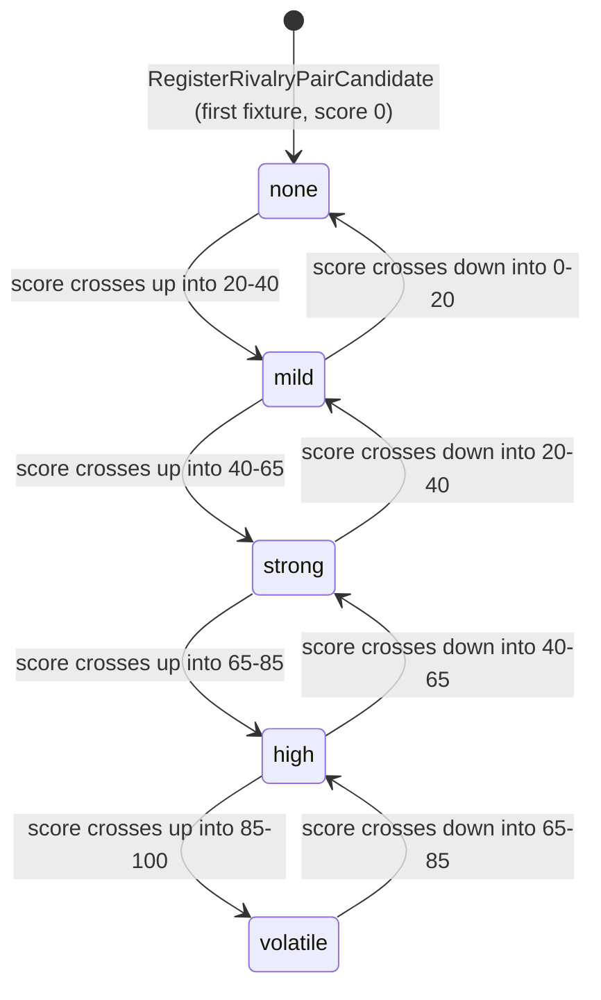
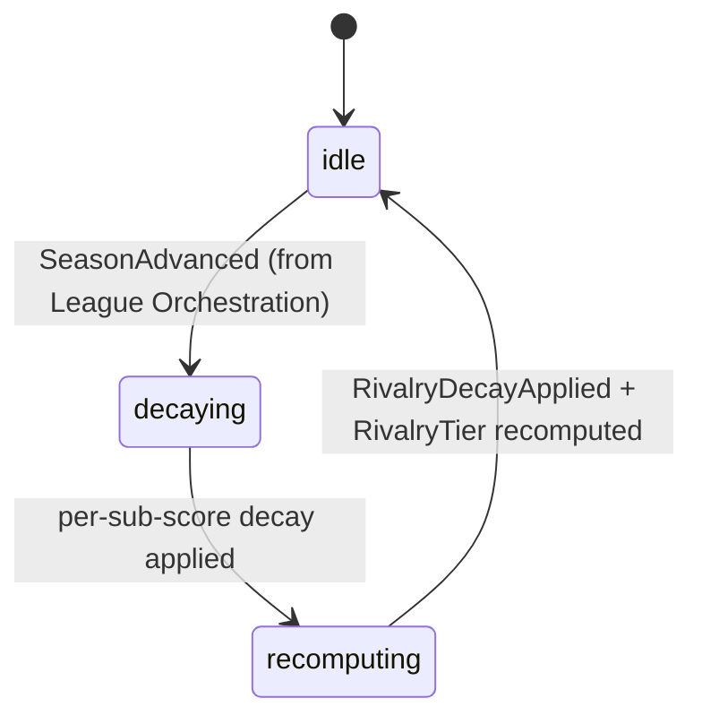

# State Machine - Rivalry System (draft)

> **Draft, transcribed from [[../09-Decisions/ADR-0057-rivalry-system-context]]**
> (FMX-40; accepted 2026-05-28, Option C). This note transcribes only what
> ADR-0057 and its referenced GDDR [[../../50-Game-Design/rivalry-system]]
> actually define. Items the source leaves open are listed in
> [§ Open decisions](#open-decisions); they are **not** invented here. The
> note becomes binding for implementation when the project enters the
> development phase (`binding: true`).

Rivalry System owns one per-club-pair aggregate, `RivalryEdge`, carrying a
five-sub-score graph plus history. The lifecycle has two coupled parts that
ADR-0057 defines:

1. `RivalryTier` — the threshold-tier classification FSM (5 tiers None /
   Mild / Strong / High / Volatile), **derived** from the current
   `rivalry_score`, not stored independently (ADR-0057 §Determinism and
   storage rules).
2. `RivalrySeasonDecay` — the deterministic per-season decay batch applied
   to the sub-scores, triggered by `SeasonAdvanced` from League
   Orchestration.

A process manager `RivalryEventAggregator` inside the Rivalry context
consumes upstream domain events (`MatchResolved`, `TransferCompleted`,
`FanIncidentLogged`, club founding/relocation, `SeasonAdvanced`) and updates
the `RivalryEdge` aggregate; the domain service `RivalryScoringService`
owns the score formula (ADR-0057 §Determinism and storage rules,
§Recommendation). Neither the aggregator nor the scoring service is itself a
stateful FSM in the ADR; the FSM surface is the tier classification + the
per-season decay batch.

## 1. `RivalryTier` states (derived from `rivalry_score`)

The tier is a **pure function of the current aggregated `rivalry_score`**
(0-100). It is recomputed when a sub-score update or a decay batch changes
the score, and a `RivalryTierTransitioned` event is emitted when the score
crosses a tier boundary in **either** direction (ADR-0057 §Determinism and
storage rules, §Public contract direction).

### Tier definitions (ADR-0057 §Context; GDDR §3 thresholds)

| Tier | `rivalry_score` band | Defined mechanical effect (from source) |
|---|---|---|
| `none` | 0-20 | Just a fixture; no rivalry uplift |
| `mild` | 20-40 | Slight atmosphere boost |
| `strong` | 40-65 | Derby badge in UI; atmosphere ×1.15; watch-party auto-proposal (`Strong+`); higher security event probability + higher catering per fan |
| `high` | 65-85 | Risk-match candidate; alcohol-policy / away-allocation review |
| `volatile` | 85-100 | Auto-classified high-security; visiting-fan cap; watch-party suggestion |

> Effects are listed as transcription of the source's documented downstream
> consequences; the **owning** policy lives in each consumer context (Fan
> Ecology atmosphere formula, Matchday-Event-Engine Pyro trigger,
> Regulations sanction chain, Watch Party), not in Rivalry. See ADR-0057
> §Decision "does **not** own". Commercial-signal mediation is reconciled in
> [[../09-Decisions/ADR-0111-rivalry-commercial-signal-contract-reconciliation]].

### Boundary mapping note

ADR-0057 §Context and GDDR §3 give the bands as `None (0-20) / Mild
(20-40) / Strong (40-65) / High (65-85) / Volatile (85-100)`. The exact
open/closed convention at each shared boundary value (e.g. whether a score
of exactly `20` is `none` or `mild`) and any debounce / hysteresis to damp
oscillation around a boundary are **not** specified by the source — see
[§ Open decisions](#open-decisions).

## 2. Tier transitions

Transitions are not commanded directly; they are emitted whenever a score
change moves `rivalry_score` across a band boundary. The ADR names the event
`RivalryTierTransitioned` with the canonical progression
`None → Mild → Strong → High → Volatile` "with deterministic cause"
(ADR-0057 §Public contract direction). The score can move **down** as well
(decay, or upstream-signal reversal), so reverse transitions are equally
valid; the ADR states transition events are emitted "when score crosses tier
boundary in either direction".

| From | To | Trigger (cause that moved the score across the boundary) |
|---|---|---|
| `none` | `mild` | Sub-score update raising `rivalry_score` above 20 |
| `mild` | `strong` | Sub-score update raising `rivalry_score` above 40 |
| `strong` | `high` | Sub-score update raising `rivalry_score` above 65 |
| `high` | `volatile` | Sub-score update raising `rivalry_score` above 85 |
| `volatile` | `high` | Decay / signal reversal lowering `rivalry_score` below 85 |
| `high` | `strong` | Decay / signal reversal lowering `rivalry_score` below 65 |
| `strong` | `mild` | Decay / signal reversal lowering `rivalry_score` below 40 |
| `mild` | `none` | Decay / signal reversal lowering `rivalry_score` below 20 |

Whether a single score change may **skip** a tier (e.g. a large
`+15` "icon leaving to rival" transfer-tension jump crossing two boundaries
at once) and, if so, whether that emits one multi-step or several stepwise
`RivalryTierTransitioned` events is **not** defined by the source — see
[§ Open decisions](#open-decisions).

### Terminal states

`RivalryTier` has **no terminal state**. A `RivalryEdge` persists for the
life of the save; its tier can move up or down indefinitely as signals
arrive and decay applies. (ADR-0057 §Determinism and storage rules:
per-save tables; the edge is not retired.) Whether an edge that decays back
to a sustained `none`/score-0 is ever archived or pruned is **not**
specified — see [§ Open decisions](#open-decisions).

## 3. `RivalrySeasonDecay` — deterministic per-season decay batch

ADR-0057 §Determinism and storage rules defines decay as a deterministic
batch triggered by `SeasonAdvanced` from League Orchestration, applied
per sub-score, emitting `RivalryDecayApplied`. Regional sub-score has **no**
decay (stable geographic base).

### Per-sub-score decay rates (ADR-0057 §Determinism and storage rules; GDDR §2)

| Sub-score | Weight (GDDR) | Per-season decay rate (source) |
|---|---|---|
| Regional | 0.25 | none (stable geographic base) |
| Historical | 0.20 | -1 per 10 seasons of no contact |
| Sporting | 0.25 | -2 per season |
| Fan-incident | 0.15 | -3 per season |
| Transfer-tension | 0.15 | -2 per season |

After a decay batch lowers sub-scores, the aggregated `rivalry_score` is
recomputed and `RivalryTier` re-derived; any boundary crossing emits
`RivalryTierTransitioned` (§2). Decay floors (whether a sub-score can go
below 0) and the exact aggregation/weighting arithmetic that maps the five
weighted sub-scores onto the 0-100 `rivalry_score` are **not** fully
specified by the ADR — see [§ Open decisions](#open-decisions).

## 4. Trigger sources

| Trigger / consumed fact | Source context | Effect on Rivalry FSM |
|---|---|---|
| `RegisterRivalryPairCandidate` | Internal (lazy on first fixture between two clubs) | Creates `RivalryEdge` at score 0, tier `none` |
| `MatchResolved` | Match | Sporting sub-score update (+ recompute tier) |
| `TransferCompleted` | Transfer | Transfer-tension sub-score update (+ recompute tier) |
| `FanIncidentLogged` | Fan Ecology | Fan-incident sub-score update (+ recompute tier) |
| `ClubFoundedInLocation`, `ClubRelocatedToLocation` | Club Management | Regional sub-score base |
| `SeasonAdvanced` | League Orchestration | Triggers `RivalrySeasonDecay` batch (§3) |
| `RecordIncidentSignal`, `RecordTransferTensionSignal` | Internal commands | Sub-score updates |
| `ApplyEndOfSeasonDecay` | Internal command (driven by `SeasonAdvanced`) | Decay batch |
| `ReclassifyTierBoundary` | Admin / community-overlay override | Tier-boundary override |
| `ImportRivalrySeedFromOverlay` | Community Overlay Pipeline (ADR-0016) | Pre-populates edge sub-scores at save creation |

Per-save legacy / community-overlay rivalry seeds are copied into the save
snapshot at creation and never re-read during a running save (ADR-0057
§Determinism and storage rules).

## 5. Events emitted

Transcribed from ADR-0057 §Public contract direction:

- `RivalrySubScoreUpdated` — fired through the ADR-0028 transactional outbox
  on every sub-score change.
- `RivalryTierTransitioned` — None → Mild → Strong → High → Volatile (and
  reverse), with deterministic cause, on tier-boundary crossing.
- `RivalrySnapshotTakenForFixture` — derby-classification snapshot for a
  fixture.
- `RivalryDecayApplied` — emitted by the per-season decay batch (§3).
- `RivalryOverrideValidated` / `RivalryOverrideRejected` — outcome of
  `ReclassifyTierBoundary` / overlay-seed validation.

Read models exposed via Open Host Service (ADR-0057 §Public contract
direction): `RivalryScore`, `IsDerbyFixture`, `TopRivalsForClub`,
`RivalryIncidentTimeline`, `RivalryGraphSnapshot`, `DerbyContext`.

## 6. Determinism contract

Per ADR-0057 §Determinism and storage rules and the portfolio
seeded-variance principle ([[../09-Decisions/ADR-0113-portfolio-determinism-seeded-variance-principle]]):

- The tier FSM is a pure function of `rivalry_score`; recomputation is
  deterministic given the sub-score state.
- Per-season decay is a deterministic batch — no wall-clock, replays from the
  same save snapshot + same world ticks reproduce identical sub-scores,
  scores, tiers and emitted transitions.
- Cross-context inputs arrive only through public events / queries; Rivalry
  does not join across context tables.
- ADR-0057 does not specify any RNG (`*Rng`) inside the Rivalry scoring or
  decay path; scoring is presented as deterministic formula. Whether any
  bounded seeded variance is desired (per ADR-0113) is **not** decided —
  see [§ Open decisions](#open-decisions).

## 7. Persistence model

Per-save schema (`save_<uuidv7hex>`) per
[[../09-Decisions/ADR-0027-postgres-data-model]]. ADR-0057 §Decision names
the aggregates / projections; concrete table shapes (column lists, indexes)
are **not** specified by the ADR and are left to the data-model design step
— see [§ Open decisions](#open-decisions). Aggregates named by the ADR:

- `RivalryEdge` (per club pair: ClubA × ClubB → five-sub-score graph +
  history; the derived tier classification).
- `RivalrySubScoreHistory` (per edge: timeline of sub-score updates with
  source-event references).
- `RivalryGraphSlice` projection (per club: top-N rivals snapshot for UI +
  read-model queries).

The threshold-tier FSM state is **derived, not stored independently**
(ADR-0057 §Determinism and storage rules); persistence holds the sub-scores
and history, from which the tier is computed.

## 8. Open decisions

The following are required to make the FSM implementable but are **not**
defined by ADR-0057 or its referenced GDDR. They must be resolved before
this note can go `binding: true`; none are invented here.

1. **Boundary open/closed convention.** Tier bands share endpoint values
   (20, 40, 65, 85). The ADR/GDDR do not state whether each boundary value
   belongs to the lower or upper tier.
2. **Hysteresis / debounce.** No rule for damping rapid tier oscillation
   when `rivalry_score` sits on a boundary across successive recomputes;
   the ADR only says transitions emit "in either direction".
3. **Multi-tier skips.** Whether one score change may cross more than one
   boundary at once, and whether that emits a single multi-step or several
   stepwise `RivalryTierTransitioned` events.
4. **Aggregation arithmetic.** The exact formula mapping the five weighted
   sub-scores (weights 0.25/0.20/0.25/0.15/0.15) onto the 0-100
   `rivalry_score`, including clamping/normalisation, is not pinned in the
   ADR (the GDDR gives weights + per-rule increments but not the closed-form
   aggregation).
5. **Sub-score floors/caps.** Whether decay can drive a sub-score below 0,
   and any per-sub-score upper cap, are unspecified.
6. **Decay "no contact" definition for Historical.** Historical decay is
   "-1 per 10 seasons of **no contact**"; what constitutes "contact"
   (any fixture? competitive only?) is not defined.
7. **Edge retirement/pruning.** Whether a `RivalryEdge` that decays back to
   a sustained `none`/score-0 is ever archived or pruned, or persists
   indefinitely.
8. **`ReclassifyTierBoundary` semantics.** Whether an admin / overlay
   override pins a tier, shifts the band thresholds, or sets a floor, and
   how it interacts with subsequent organic score movement and decay.
9. **RNG / seeded variance.** Whether any bounded seeded variance is applied
   to scoring or decay (per ADR-0113) or scoring stays purely deterministic.
10. **Process-manager internal states.** ADR-0057 names the
    `RivalryEventAggregator` process manager but does not define its own
    lifecycle states (in-flight aggregation, retry/compensation on a failed
    sub-score write); whether it warrants a documented FSM of its own is
    open.
11. **Concrete persistence shapes.** Column lists and indexes for the
    `RivalryEdge` / `RivalrySubScoreHistory` / `RivalryGraphSlice` tables
    are not specified by the ADR.
