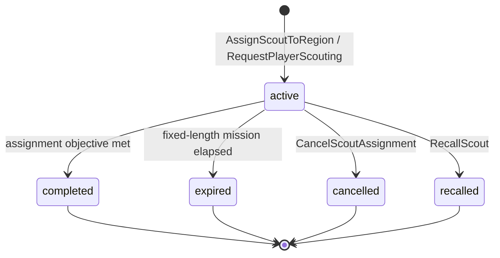
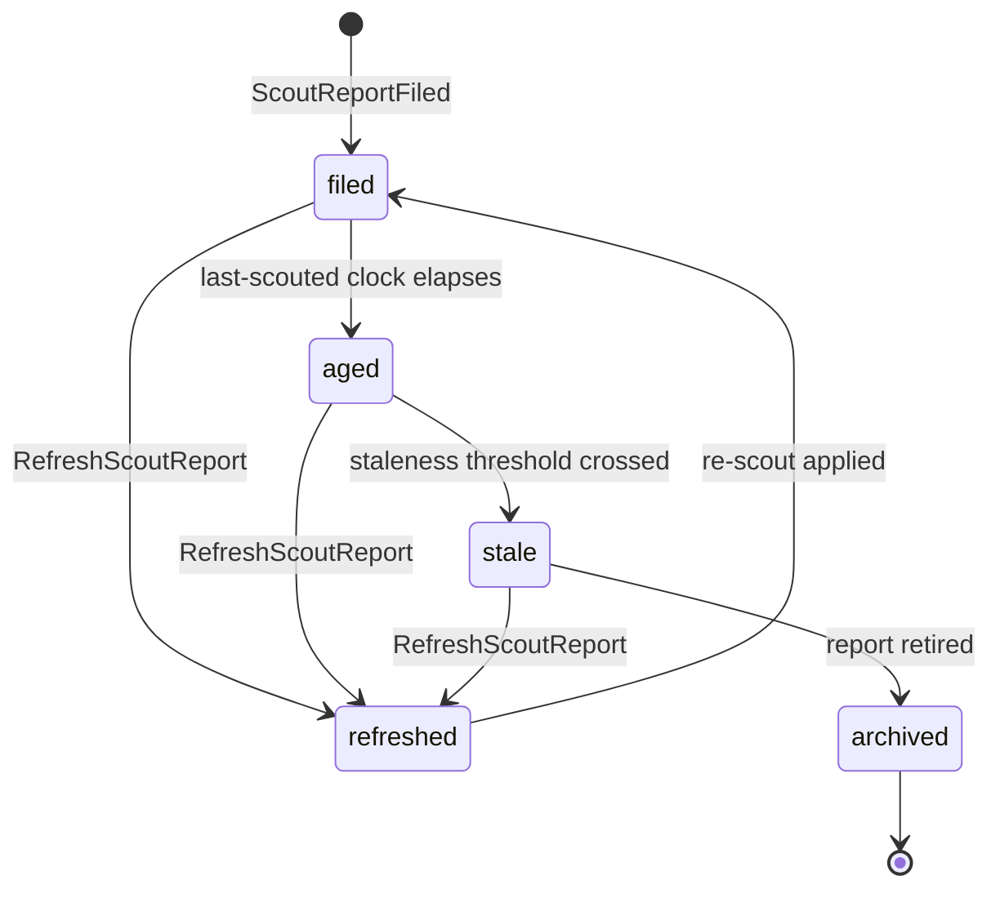
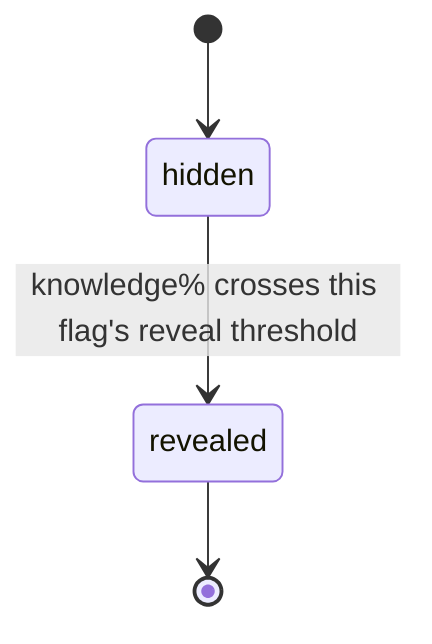

# State Machine - Scouting (draft)

> **Source of truth:** [[../09-Decisions/ADR-0064-scouting-activity-context]]
> (FMX-27; accepted/ratified 2026-06-19). This note **transcribes only the FSMs
> that ADR-0064 actually names** — it does not invent guard thresholds, aging
> constants or reveal cut-offs. Everything the ADR leaves open is collected under
> [§ Open decisions](#open-decisions). The note stays `binding: false` until the
> project enters the development phase.

ADR-0064 names two deterministic state machines that the Scouting bounded
context owns:

1. `ScoutAssignment` — per-save, per-scout routing/mission lifecycle
   (`active → completed | expired | cancelled | recalled`).
2. `ScoutingReport` — per-save, per-club-per-player scouted-view lifecycle
   (`filed → refreshed → aged → stale → archived`).

Plus a reveal-latch ledger that is *state-bearing but not a transition-rich FSM*:

3. `HiddenFlagRevealLedger` — per-save, per-club-per-player-per-flag reveal
   latch (`hidden → revealed`, keyed to a knowledge% threshold).

A **Process Manager / Saga** drives the weekly scouting loop (assignment
progress tick → report knowledge accumulation → report aging/staleness
evaluation → coverage recompute → list refresh → hidden-flag reveal evaluation
→ discovery of new candidates). The loop is anchored to the weekly tick
(`SeasonAdvanced` from League Orchestration) and the dedicated RNG sub-label
`ScoutingRng(saveId, clubId, week)` of `WorldRng` per ADR-0018 §3.

`CoveragePlan` and `CandidateList` are also Scouting-owned aggregates per
ADR-0064, but the ADR frames them as value/collection aggregates (coverage
tiers, list persistence policies) **without an explicit transition matrix**, so
they are not transcribed as FSMs here — see [§ Open decisions](#open-decisions).

## 1. `ScoutAssignment` states

### State definitions

| State | Meaning |
|---|---|
| `active` | Scout routed to a scope (region / nation / competition / club / specific player) with type filters + purpose + mode (ongoing vs fixed-length); progress accumulating; cost accruing |
| `completed` | Assignment objective reached (terminal) |
| `expired` | Fixed-length mission ran out (terminal) |
| `cancelled` | Ended early by player command before objective (terminal) |
| `recalled` | Scout pulled off the assignment (terminal) |

### Transition triggers

| From | To | Trigger |
|---|---|---|
| (initial) | `active` | `AssignScoutToRegion` (route + type filters + purpose + mode) or `RequestPlayerScouting` (fully scout a specific player) |
| `active` | `completed` | Assignment objective met — **exact guard undefined by ADR** (see Open decisions) |
| `active` | `expired` | Fixed-length mission duration elapsed — **duration undefined by ADR** (see Open decisions) |
| `active` | `cancelled` | `CancelScoutAssignment` (player command) |
| `active` | `recalled` | `RecallScout` (player command) |

Scout identity is referenced as a People `ActorRef` (ADR-0052) — never owned
here. `completed` / `expired` / `cancelled` / `recalled` are all terminal.

## 2. `ScoutingReport` states

### State definitions

| State | Meaning |
|---|---|
| `filed` | Report created from a viewing; `knowledge%` confidence + opacity-layered (banded vs numeric) attribute estimates + recommendation + role/tactic-fit + valuation-band-confidence inputs; "last scouted on" clock set |
| `refreshed` | Re-scout applied using existing knowledge as baseline (`RefreshScoutReport`); knowledge%/freshness updated |
| `aged` | Report freshness has decayed off the "last scouted on" clock; estimates no longer current |
| `stale` | Report has crossed the staleness threshold; flagged for re-scout |
| `archived` | Report retired from the active scouted view (terminal) |

### Transition triggers

| From | To | Trigger |
|---|---|---|
| (initial) | `filed` | `ScoutReportFiled` (first viewing produces the report) |
| `filed` | `aged` | "Last scouted on" clock elapses — **aging interval undefined by ADR** (see Open decisions) |
| `aged` | `stale` | Staleness threshold crossed — **interval undefined by ADR** (see Open decisions); emits `ScoutReportBecameStale` |
| `filed` / `aged` / `stale` | `refreshed` | `RefreshScoutReport` (re-scout; uses existing knowledge as baseline); emits `ScoutReportRefreshed` |
| `refreshed` | `filed` | Re-scout applied; report returns to fresh `filed` state with updated knowledge% / clock — **whether `refreshed` is a transient pass-through or a durable state is undefined by ADR** (see Open decisions) |
| `stale` | `archived` | Report retired — **archive guard undefined by ADR** (see Open decisions) |

The report uses the deterministic clock per ADR-0027 for aging (no
`Date.now` in simulation paths). `archived` is terminal.

## 3. `HiddenFlagRevealLedger` (per-flag reveal latch)

Per ADR-0064, the ledger stores **reveal-state only** — never the flag truth.
For each of the five hidden flags (injury-proneness, big-match temperament,
professionalism, adaptability, ambition) per club-player, the ledger tracks
whether that flag's **knowledge% reveal threshold** has been crossed. The flag
*truth* is read from People / Squad & Player at query time.

### State definitions

| State | Meaning |
|---|---|
| `hidden` | This flag's knowledge% reveal threshold not yet crossed for this club-player; flag truth not surfaced |
| `revealed` | Threshold crossed; `HiddenFlagSurfaced` emitted; consumers (Squad & Player / Transfer / Notification) may display the flag (truth read from owner, not from Scouting) |

The per-flag reveal threshold value and whether reveal can ever revert (if
knowledge% decays) are **not specified by the ADR** — see
[§ Open decisions](#open-decisions).

## 4. Trigger sources

| Trigger | Source |
|---|---|
| `AssignScoutToRegion` / `RequestPlayerScouting` | Player command (assignment routing) |
| `CancelScoutAssignment` / `RecallScout` | Player command (end assignment early) |
| `RefreshScoutReport` | Player command (re-scout a stale report) |
| `ScoutReportFiled` | Process Manager — report produced from an assignment viewing on the weekly tick |
| Report aging / staleness evaluation | World tick (`SeasonAdvanced` from League Orchestration) against the deterministic clock per ADR-0027 |
| Hidden-flag reveal evaluation | Process Manager — knowledge% threshold check on the weekly loop |
| Weekly scouting loop | `SeasonAdvanced` (League Orchestration) + `ScoutingRng(saveId, clubId, week)` per ADR-0018 §3 |

## 5. Determinism contract

Per ADR-0064 § Determinism and storage rules:

- The weekly scouting loop uses the dedicated RNG sub-label
  `ScoutingRng(saveId, clubId, week)` of `WorldRng` per ADR-0018 §3 (discovery
  draws, knowledge-gain variance, report-error sampling). No cross-RNG draws.
- No `Math.random` / `Date.now` in simulation paths; report aging uses the
  deterministic clock per ADR-0027.
- The scouted *view* (`ScoutingReport`) is strictly separate from the player's
  true profile (Squad & Player); truth is masked / banded by knowledge%
  **inside** Scouting's read view, populated via published events / queries —
  Scouting never joins across context tables (§3.1 + ADR-0019).
- Hidden-flag *truth* is never copied into Scouting; only the **reveal state**
  (threshold crossed yes/no per club-player-flag) is stored.
- `ScoutAssignment` and `ScoutingReport` FSMs are deterministic. The concrete
  FSM library (XState v5 vs a lightweight in-house deterministic FSM) is an
  **implementation-phase** selection per ADR-0064 and must re-verify currency
  at that time.

## 6. Events emitted

Per ADR-0064 § Public contract direction (draft events):

- `ScoutAssigned` / `ScoutAssignmentCompleted` / `ScoutAssignmentExpired`
- `ScoutReportFiled` *(consumed by Transfer for valuation-band confidence; by
  Squad & Player as an Impact-Lens scouting input per §3.1; by Notification for
  inbox copy)*
- `ScoutReportRefreshed` / `ScoutReportBecameStale`
- `LongListUpdated` / `ShortListUpdated`
- `HiddenFlagSurfaced` *(reveal-state only; consumed by Squad & Player +
  Transfer + Notification for risk-hint display)*
- `CandidateIdentifiedForRecruitment` *(consumed by Transfer — opens a target /
  opportunity when a short-list entry crosses a rating threshold)*
- `ExternalYouthProspectIdentified` *(consumed by Youth Academy per ADR-0060 —
  hands a discovered youth prospect to the academy intake gate)*
- `CoverageTierChanged` *(internal projection event)*
- `ScoutingBudgetAllocated` *(consumed by Club Management ledger via ACL per
  ADR-0050)*

Domain events are emitted through the ADR-0028 transactional outbox; Transfer,
Squad & Player, Youth Academy (ADR-0060), Notification (ADR-0043) and Club
Management (ADR-0050) consume via ACL.

## 7. Persistence model

Per-save schema (`save_<uuidv7hex>`) per ADR-0027; per-save tables only, no
platform-scope cross-save state. ADR-0064 names the owned aggregates whose state
columns back these FSMs:

- `ScoutAssignment` (per-save, per-scout): scope + type filters + purpose +
  mode + progress + cost + FSM state (`active | completed | expired | cancelled
  | recalled`); scout identity as a People `ActorRef`.
- `ScoutingReport` (per-save, per-club-per-player): knowledge% + opacity-layered
  estimates + recommendation + confidence inputs + "last scouted on" clock + FSM
  state (`filed | refreshed | aged | stale | archived`).
- `HiddenFlagRevealLedger` (per-save, per-club-per-player): per-flag reveal
  latch state only (`hidden | revealed`); flag truth read from People / Squad &
  Player.
- `CoveragePlan` (per-save, per-club) and `CandidateList` (per-save, per-club)
  are Scouting-owned aggregates per ADR-0064 (concrete columns/indexes are an
  implementation-phase concern).

> Concrete Drizzle table/column/index shapes are **not** specified by ADR-0064
> at this granularity and are deferred to the implementation phase, consistent
> with sibling context ADRs.

## 8. Open decisions

The ADR names the FSM *shapes* but leaves the following undefined. None of these
are invented here; each must be pinned (HITL / a follow-up ADR or GDDR) before
implementation:

- **`ScoutAssignment` → `completed` guard.** The ADR states the transition but
  not the objective condition (progress = 100%? knowledge threshold reached on
  the scoped player set?).
- **`ScoutAssignment` → `expired` rule.** No fixed-length mission duration or
  ongoing-mission expiry condition is given.
- **`ScoutingReport` aging clock constants.** No intervals for `filed → aged`,
  `aged → stale`, or `stale → archived` are stated (only that a "last scouted
  on" clock + deterministic clock per ADR-0027 drive them).
- **`refreshed` durability.** Whether `refreshed` is a transient pass-through
  back to `filed` or a durable state, and which prior states it is reachable
  from, is not pinned (transcribed here as reachable from `filed` / `aged` /
  `stale`).
- **Hidden-flag reveal thresholds.** The per-flag knowledge% reveal cut-offs for
  each of the five flags, any ordering between them, and whether reveal is
  monotonic (can it revert if knowledge% decays) are unspecified.
- **`CoveragePlan` / `CandidateList` transition matrices.** ADR-0064 frames
  these as value/collection aggregates (coverage tiers fully/partially/
  uncovered; list persistence policies keep-N-months / indefinitely / until
  window) but defines no explicit FSM transitions, so they are not transcribed
  as state machines here.
- **Process Manager cadence & compensation.** The saga step *sequence* is given,
  but per-step guards, exact tick cadence values, and failure/retry/compensation
  rules are not specified (cadence is anchored to the weekly `SeasonAdvanced`
  tick + `ScoutingRng` sub-label only).
- **FSM library selection.** XState v5 vs an in-house deterministic FSM is an
  explicit implementation-phase decision per ADR-0064 (re-verify currency at
  that time).
