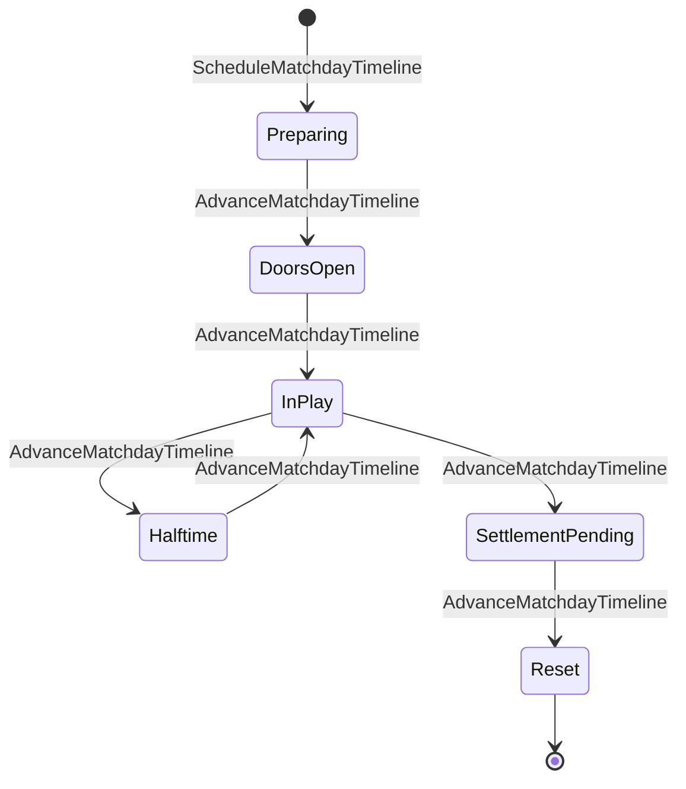
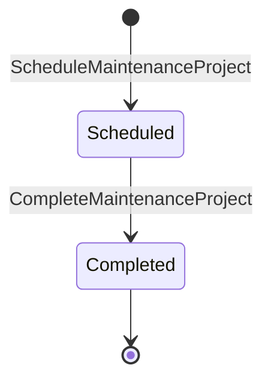
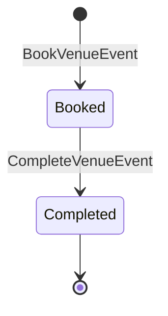

# State Machine - Stadium Operations (draft)

> **Draft transcription.** This note transcribes the FSM surface that
> [[../09-Decisions/ADR-0061-club-management-sub-aggregate-audit]] (FMX-32)
> defines for the **Stadium Operations** bounded context. Per the ADR
> §Ratification note (2026-05-28) Nico chose **Option C** — Stadium / Venue
> Operations is its **own bounded context** `Stadium Operations` — departing
> from the audit body's working recommendation (Option B, named Aggregate
> inside Club Management). The ADR body, §Public contract direction and
> §Determinism and storage rules still describe the surface under the Option B
> wording (`StadiumOperations` named Aggregate "inside Club Management"); read
> those through the ratified Option C lens (own per-save schema; promotion is a
> deployment change per ADR-0019 §5). The slug `stadium-operations` already
> appears as a canonical context tag in [[pitch-condition]].
>
> The current phase is research / analysis / architecture; this note is
> `status: draft`, `binding: false` and becomes binding only when the project
> enters the development phase. It **transcribes** what the ADR states and does
> **not** invent guard thresholds, timer values, decay constants or transition
> rules the ADR leaves open — every such gap is listed under
> [§ Open decisions](#open-decisions).

Stadium Operations owns the physical-venue operational surface. The ADR names
the following stateful sub-aggregates / lifecycles:

1. `MatchdayTimeline` (per-fixture) — the **matchday FSM** (the one
   state machine the ADR enumerates by state name).
2. `FacilityCondition` (per-facility) — age + decay + **maintenance-project
   lifecycle** (named; internal states not enumerated by the ADR).
3. `VenueEventCalendar` (per-club) — non-matchday event bookings
   (`Booked` → `Completed` implied by the commands/events; no further states
   enumerated).
4. `SeatClassInventory` (per-club) and `HospitalityInventory` (per-club) —
   capacity / physical inventory state; the ADR names a `Rebalanced`
   operation but no lifecycle state machine.

Pitch facility/usage condition is a separate, already-ratified state machine
owned by this context — see [[pitch-condition]] (ADR-0077). Stadium Operations
remains the `PitchConditionChanged` emitter.

## 1. `MatchdayTimeline` (matchday FSM)

Per-fixture FSM. The ADR (§Decision — Stadium / Venue Operations, and §Map
patch) enumerates the **states**:

> The ADR writes the ordered chain literally as
> `Preparing → DoorsOpen → InPlay / Kickoff → Halftime → SettlementPending →
> Reset`. `InPlay / Kickoff` is given as a single labelled stage (Kickoff is the
> entry into in-play); it is transcribed here as the `InPlay` state. The
> `Halftime → InPlay` return edge and the exact entry/exit triggers for each
> stage are **not** spelled out by the ADR and are flagged under
> [§ Open decisions](#open-decisions).

### State definitions (transcribed; ADR gives names only)

| State | Meaning (as named by the ADR) |
|---|---|
| `Preparing` | Matchday timeline opened for a fixture; pre-doors. |
| `DoorsOpen` | Doors open / ingress stage. |
| `InPlay` (`Kickoff`) | In-play stage; entered at kickoff. |
| `Halftime` | Halftime stage. |
| `SettlementPending` | Post-match settlement stage (matchday-cost / commercial settlement pending). |
| `Reset` | Timeline reset; terminal for the fixture. |

`Reset` is the terminal state for a fixture's timeline.

### Commands and events (transcribed from §Public contract direction)

| Command | Effect |
|---|---|
| `ScheduleMatchdayTimeline` | Opens the matchday FSM for a fixture (enters `Preparing`). |
| `AdvanceMatchdayTimeline` | Transitions the matchday FSM state. |
| `TriggerMatchdayEvent` | Publishes a matchday event (e.g. pyro, evacuation) per [[../../50-Game-Design/matchday-event-engine]] §4. |

| Event | Note |
|---|---|
| `MatchdayTimelineScheduled` | Timeline opened for a fixture. |
| `MatchdayTimelineAdvanced` | Matchday FSM transitioned (published contract; consumed by Match, Matchday-Event-Engine, CommercialPortfolio, Regulations). |
| `MatchdayEventTriggered` | A matchday event fired. |

> The ADR provides a single `AdvanceMatchdayTimeline` command and a single
> `MatchdayTimelineAdvanced` event for **all** stage transitions; it does not
> bind a distinct trigger or guard to each edge. Which actor/clock fires each
> advance, and any per-edge guard, are **open** (see [§ Open decisions](#open-decisions)).

### Coupling note

The matchday FSM's coupling to **Match** is the explicit reason Stadium scored
5/6 on the FMX-32 DDD rubric (criterion 6, low co-change, did not fire). The
ADR resolves this via published contract + ACL: Match consumes the timeline via
Reference; the timeline consumes `MatchResolved` from Match (final attendance +
pitch-wear inputs). Matchday FSM transitions use **deterministic clocks; no
`Date.now`** (ADR §Determinism and storage rules).

## 2. `FacilityCondition` — maintenance-project lifecycle (named, not enumerated)

The ADR names a **facility-decay sub-FSM** and a **maintenance-project
lifecycle** but does **not** enumerate their internal states. Only the
boundary commands/events are given:

| Command | Effect |
|---|---|
| `ScheduleMaintenanceProject` | Opens the facility-maintenance lifecycle. |
| `CompleteMaintenanceProject` | Closes the maintenance project. |
| `RecordPitchCondition` | Updates the pitch quality index (see [[pitch-condition]]). |
| `RegisterFacilityComplianceCheck` | Captures a Regulations evaluation outcome. |

| Event | Note |
|---|---|
| `MaintenanceProjectScheduled` | A maintenance project opened. |
| `MaintenanceProjectCompleted` | A maintenance project closed. |
| `PitchConditionChanged` | Pitch-condition fact (state machine in [[pitch-condition]]). |
| `FacilityComplianceChecked` | Regulations evaluation outcome recorded. |

A minimal, ADR-faithful maintenance-project lifecycle (the only states the
commands/events imply — **Scheduled → Completed**; no intermediate states are
defined by the ADR):

> The weekly **facility-decay tick** uses `StadiumRng(saveId, clubId, week)`,
> a sub-label of `WorldRng` per ADR-0018 §3 (ADR §Determinism and storage
> rules), and is triggered by `SeasonAdvanced` / `EconomyWeekAdvanced` consumed
> facts. The decay model's own states, thresholds and constants are **not**
> defined by the ADR (calibration is deferred) — see
> [§ Open decisions](#open-decisions). Coordination of the weekly facility-decay
> + maintenance lifecycle is a **Process Manager / Saga** per the
> bounded-context map row.

## 3. `VenueEventCalendar` — non-matchday event bookings

The ADR gives only the two boundary commands/events; a faithful two-state
booking lifecycle (`Booked → Completed`) is the most the source supports:

| Command | Effect |
|---|---|
| `BookVenueEvent` | Books a non-matchday venue event. |
| `CompleteVenueEvent` | Closes a venue event. |

| Event | Note |
|---|---|
| `VenueEventBooked` | Non-matchday event booked. |
| `VenueEventCompleted` | Venue event closed. |

> No cancellation / clash / overlap-resolution states are defined by the ADR.
> See [§ Open decisions](#open-decisions).

## 4. `SeatClassInventory` / `HospitalityInventory` (not state machines per ADR)

The ADR models these as **inventory** (capacity by class: standing, seating,
family, premium, suites, accessibility, away allocation; suite + box physical
inventory), not as enumerated lifecycles. The only operation named is a
rebalance:

| Command / Event | Note |
|---|---|
| `RebalanceSeatClassInventory` / `SeatClassInventoryRebalanced` | Updates capacity allocation. |

Hospitality **revenue accounting** is **not** owned here — it belongs to
CommercialPortfolio; ticketing settlement belongs to CommercialPortfolio
(Option D). This context owns only the **physical** capacity / inventory
reality, consumed by CommercialPortfolio via Reference.

## 5. Trigger sources

| Trigger | Source |
|---|---|
| `ScheduleMatchdayTimeline` | Stadium Operations command (per-fixture; deterministic clock) |
| `AdvanceMatchdayTimeline` | Stadium Operations command (deterministic clock; **per-edge actor/clock open**) |
| `TriggerMatchdayEvent` | Stadium Operations command (matchday-event-engine) |
| `BookVenueEvent` / `CompleteVenueEvent` | Stadium Operations command |
| `ScheduleMaintenanceProject` / `CompleteMaintenanceProject` | Stadium Operations command |
| `RebalanceSeatClassInventory` | Stadium Operations command |
| `RecordPitchCondition` | Stadium Operations command (see [[pitch-condition]]) |
| `RegisterFacilityComplianceCheck` | Stadium Operations command (captures Regulations outcome) |
| Weekly facility decay | `SeasonAdvanced` (League Orchestration) / `EconomyWeekAdvanced` (Club Management) consumed facts |

## 6. Consumed facts (ACL)

Per ADR §Public contract direction (Draft consumed facts):

| Fact | Source | Use |
|---|---|---|
| `MatchResolved` | Match | Final attendance + pitch-wear inputs |
| `SeasonAdvanced` | League Orchestration | Facility-decay weekly trigger |
| `EffectiveRuleSet` | Regulations & Compliance | UEFA Cat 4 + DFL Lizenzhandbuch + SGSA Green Guide compliance |
| `RivalryTierTransitioned` | Rivalry System | Atmosphere + security-risk inputs (ADR-0057) |
| `EconomyWeekAdvanced` | Club Management | Facility-cost calculation |

## 7. Published read models

`StadiumCommercialSnapshot`, `StadiumCapacitySnapshot`, `MatchdayTimelineBoard`,
`FacilityComplianceSnapshot`, `VenueEventCalendarBoard`, `PitchQualitySnapshot`,
`HospitalityInventorySnapshot` (ADR §Public contract direction).
`StadiumCommercialSnapshotPublished` is consumed by CommercialPortfolio +
Club Management ledger via ACL per ADR-0050.

## 8. Persistence / determinism

Per ADR §Determinism and storage rules (read through the ratified Option C lens):

- Stadium Operations state lives in a **per-save schema** (`save_<uuidv7hex>`)
  per ADR-0027.
- Matchday FSM transitions use **deterministic clocks; no `Date.now`**.
- The weekly facility-decay tick uses `StadiumRng(saveId, clubId, week)`, a
  sub-label of `WorldRng` per ADR-0018 §3.
- Domain events are emitted through the ADR-0028 transactional outbox; Match,
  Matchday-Event-Engine, Regulations and CommercialPortfolio consume via the
  published contract.

> The ADR does **not** give the concrete Drizzle table layout for the matchday
> timeline / facility / venue-event / inventory tables (unlike, e.g.,
> youth-academy). Table schema is **open** — see
> [§ Open decisions](#open-decisions).

## Open decisions

The following are **not defined** by ADR-0061 (or its referenced research) and
must not be invented here. They are transcription gaps to resolve before this
FSM becomes binding:

- **Per-edge matchday triggers/guards.** The ADR gives one
  `AdvanceMatchdayTimeline` command for all transitions. The actor/clock that
  fires each advance (`Preparing→DoorsOpen`, `DoorsOpen→InPlay`,
  `InPlay→Halftime`, `Halftime→InPlay`, `InPlay→SettlementPending`,
  `SettlementPending→Reset`) and any guard per edge are undefined.
- **`Halftime → InPlay` return edge.** The ADR lists the stages as a linear
  chain and does not state the resumption transition explicitly; it is inferred
  here from the Match halftime/resume semantics. Confirm.
- **`Kickoff` vs `InPlay`.** The ADR labels the stage `InPlay / Kickoff`.
  Whether `Kickoff` is a distinct state or the entry transition into `InPlay`
  is not pinned down.
- **Matchday timer values / clock offsets.** No T-minus offsets, doors-open
  lead time, halftime duration or settlement window are given (cf. Match's
  `T - 60 min`). All timing is undefined.
- **Coupling to Match's own FSM.** The exact mapping between `MatchdayTimeline`
  stages and the Match FSM states (`simulating`, `halftime`, `completed`,
  `reported` in [[match]]) — who advances whom, and whether `MatchResolved`
  drives `InPlay→SettlementPending` — is not specified.
- **`SettlementPending` semantics.** What "settlement" the stage waits on
  (matchday operating-cost settlement per Club Management / ADR-0050;
  matchday commercial settlement per CommercialPortfolio Option D) and the
  exit condition into `Reset` are not defined.
- **Facility-decay sub-FSM states + constants.** The ADR names a
  "facility-decay sub-FSM" but enumerates no states, no age/condition bands,
  and no decay constants. Calibration is deferred (no calibration ticket is
  cited in the ADR for facility decay; cf. FMX-52 for pitch/weather).
- **Maintenance-project intermediate states.** Only `Scheduled` and `Completed`
  are implied by the commands/events; whether in-progress, blocked, overrunning
  or cancelled states exist is undefined.
- **VenueEvent lifecycle beyond `Booked → Completed`.** No cancellation, clash,
  overlap-with-matchday or rescheduling states/guards are defined.
- **SeatClass / Hospitality inventory lifecycle.** Whether inventory has a
  lifecycle FSM at all (beyond a `Rebalanced` operation) is not stated.
- **Persistence schema.** No Drizzle table layout, PK/FK shape or indexes are
  given for the Stadium Operations aggregates.
- **Failure / recovery cases.** The ADR does not enumerate failure/recovery
  cases for the matchday or maintenance FSMs (unlike youth-academy §8).
- **ADR ordinal / filename.** ADR-0061's file is
  `ADR-0061-club-management-sub-aggregate-audit`; there is **no**
  `ADR-0061-stadium-operations-context` file in the vault. If a standalone
  Stadium Operations context ADR is desired (matching the ratified Option C
  decision), it does not yet exist and would carry a new ordinal.
