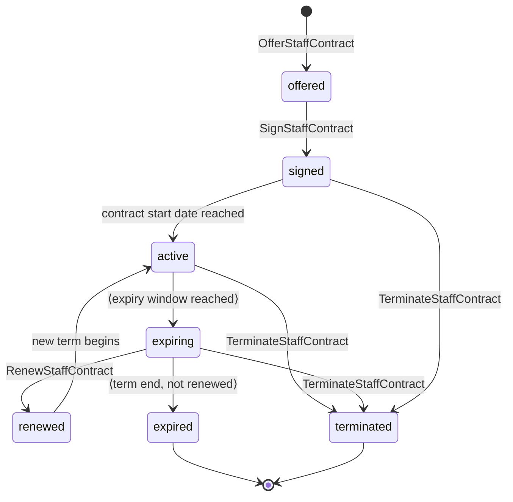
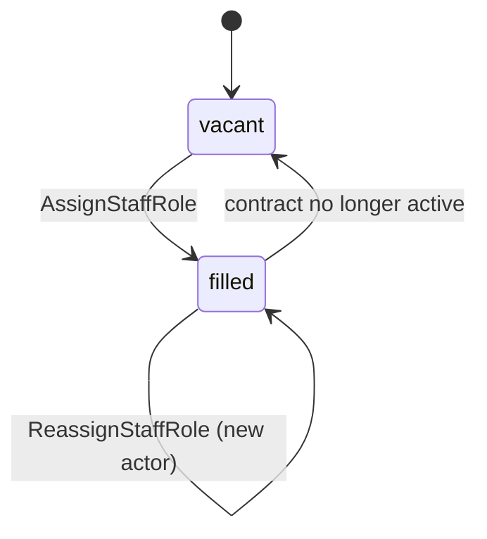

# State Machine - Staff Operations (draft)

> **Draft transcription.** This note transcribes only the FSM surface that
> [[../09-Decisions/ADR-0053-staff-operations-context]] (accepted/binding) actually
> defines. Where the ADR names an event or command but does not pin a guard,
> timer or transition rule, the gap is flagged in [[#Open decisions]] rather than
> invented. The note is `binding: false` and follows the standing rule that
> per-context state machines become binding for implementation only when the
> project enters the development phase.

Staff Operations owns the operational layer on top of People (ADR-0052) actor
identity. Per ADR-0053 §Decision it owns two stateful aggregates:

1. `StaffContract` - per actor-per-club contract lifecycle (the FSM the ADR
   names explicitly: `Offered → Signed → Active → Expiring → Expired /
   Terminated / Renewed`).
2. `StaffRoleAssignment` - slot model for sporting roles (Sport Director,
   Chief Scout, Set-Piece Coach, Head of Youth, etc.; free-role overflow for
   ad-hoc specialists). The ADR defines this as a **slot model** with
   assign/reassign commands and events, but does not enumerate slot-occupancy
   states or guards - see [[#Open decisions]].

Pipeline-coverage and the weekly wage schedule are read models / side-effects
of an `Active` contract (ADR-0053 §Decision, §Public contract direction), not
separate state machines, and are not modelled as FSMs here.

## 1. `StaffContract` states

> The `⟨…⟩`-marked transitions (`active → expiring`, `expiring → expired`) are
> driven by guards/timers that ADR-0053 does **not** quantify. They are shown
> for structural completeness; their thresholds are listed in
> [[#Open decisions]]. The `terminated`-from-`signed`/`expiring` edges are a
> best-effort reading of `TerminateStaffContract` (which the ADR lists without a
> source-state guard) and are likewise flagged.

### State definitions

| State | Meaning | Source |
|---|---|---|
| `offered` | Contract terms offered to a staff actor; not yet accepted. Emits `StaffContractOffered` | ADR-0053 §Decision (`Offered`), §Public contract direction |
| `signed` | Offer accepted; contract executed but term not yet started. Emits `StaffContractSigned` | ADR-0053 (`Signed`) |
| `active` | Contract in force; wage schedule posts weekly; specialisation effects available to consumer contexts. Emits `StaffWagePosted` (aggregated as `StaffWageBlockPosted` per ADR-0105) | ADR-0053 (`Active`), §Determinism and storage rules |
| `expiring` | Contract approaching term end; renew-or-let-expire decision in flight. Emits `StaffContractExpiring` | ADR-0053 (`Expiring`) |
| `renewed` | Renewal agreed; a new term begins (re-enters `active`). Emits `StaffContractRenewed` | ADR-0053 (`Renewed`) |
| `expired` | Term ended without renewal; contract closed (terminal). Emits `StaffContractExpired` | ADR-0053 (`Expired`) |
| `terminated` | Contract ended early by command (terminal). Emits `StaffContractTerminated` | ADR-0053 (`Terminated`) |

### Transition triggers

| From | To | Trigger / command | Source |
|---|---|---|---|
| `offered` | `signed` | `SignStaffContract` | ADR-0053 §Public contract direction |
| `signed` | `active` | Contract start date reached (timer; threshold undefined - see [[#Open decisions]]) | ADR-0053 (lifecycle order) |
| `active` | `expiring` | Expiry window reached (timer; window undefined - see [[#Open decisions]]) | ADR-0053 (`StaffContractExpiring`) |
| `expiring` | `renewed` | `RenewStaffContract` | ADR-0053 §Public contract direction |
| `renewed` | `active` | New term begins (re-entry; exact contract undefined - see [[#Open decisions]]) | ADR-0053 (lifecycle `… / Renewed`) |
| `expiring` | `expired` | Term end reached, not renewed (deadline guard undefined - see [[#Open decisions]]) | ADR-0053 (`StaffContractExpired`) |
| `active` | `terminated` | `TerminateStaffContract` | ADR-0053 §Public contract direction |
| `signed` / `expiring` | `terminated` | `TerminateStaffContract` (source-state guard undefined - see [[#Open decisions]]) | ADR-0053 (`Terminated`) |

### Terminal states

`expired`, `terminated`. ADR-0053 does **not** define a negative path for an
unsuccessful `offered` (no reject/lapse event); see [[#Open decisions]].

## 2. `StaffRoleAssignment` (slot model)

ADR-0053 §Decision defines role assignment as a **slot model** (Sport Director,
Chief Scout, Set-Piece Coach, Head of Youth, etc., plus free-role overflow for
ad-hoc specialists) with commands `AssignStaffRole` / `ReassignStaffRole` and
events `StaffRoleAssigned` / `StaffRoleReassigned`. It does **not** enumerate
slot-occupancy states or transition guards. The minimal occupancy machine below
is transcribed at the granularity the ADR provides; its exact states and guards
are an open decision.

| State | Meaning | Source |
|---|---|---|
| `vacant` | Configured slot with no assigned actor (free slot) | ADR-0053 (slot model + `RoleAssignmentBoard` read model: "free slots") |
| `filled` | Slot occupied by an actor with an active `StaffContract`; emits `StaffRoleAssigned` | ADR-0053 (`AssignStaffRole` / `StaffRoleAssigned`) |

| From | To | Trigger | Source |
|---|---|---|---|
| `vacant` | `filled` | `AssignStaffRole` → `StaffRoleAssigned` | ADR-0053 §Public contract direction |
| `filled` | `filled` | `ReassignStaffRole` → `StaffRoleReassigned` (occupant changes) | ADR-0053 §Public contract direction |
| `filled` | `vacant` | Underlying `StaffContract` leaves `active` (`expired` / `terminated`) - **inferred**; the ADR does not state slot release on contract end (see [[#Open decisions]]) | ADR-0053 (slot model; inference flagged) |

ADR-0053 references Trainer-Cap = 5 and the six default pipelines (Recruitment,
Development, Training, Medical, Tactics, Match-Day) as scarcity / coverage
levers, but states no guard on `AssignStaffRole` enforcing the cap or per-slot
eligibility. These guards are listed in [[#Open decisions]].

## 3. Trigger sources

| Trigger | Source |
|---|---|
| `OfferStaffContract` / `SignStaffContract` / `RenewStaffContract` / `TerminateStaffContract` | Player (or AI club) command per ADR-0053 §Public contract direction |
| `AssignStaffRole` / `ReassignStaffRole` | Player (or AI club) command per ADR-0053 §Public contract direction |
| `active → expiring`, `expiring → expired`, `signed → active` timers | World tick - `EconomyWeekAdvanced` (weekly) from Club Management is the ADR's named weekly clock input; the exact expiry/start thresholds are undefined ([[#Open decisions]]) |
| Weekly wage posting (side-effect of `active`) | `EconomyWeekAdvanced` weekly tick per ADR-0053 §Draft consumed facts |

## 4. Events emitted

Per ADR-0053 §Public contract direction (draft events):

- `StaffContractOffered`
- `StaffContractSigned`
- `StaffContractRenewed`
- `StaffContractExpiring`
- `StaffContractExpired`
- `StaffContractTerminated`
- `StaffRoleAssigned`
- `StaffRoleReassigned`
- `StaffWagePosted` (consumed by Club Management ledger; posted weekly as the
  aggregated `StaffWageBlockPosted` counterpart per
  [[../09-Decisions/ADR-0105-wage-and-transfer-fee-posting-contracts]])
- `PipelineCoverageRecalculated`
- `StaffSpecialisationUpdated`

## 5. Effect on other contexts

Per ADR-0053 §Context and §Determinism and storage rules:

| Event | Consumer | Effect |
|---|---|---|
| `StaffWagePosted` / `StaffWageBlockPosted` | Club Management | Wage ledger entries (Customer-Supplier + ACL, eventually consistent; ledger owned by ADR-0050; ADR-0053 emits, Club Management posts) |
| `StaffRoleAssigned` / `StaffRoleReassigned` | Training, Transfer, Squad & Player, Match | Coach / chief-scout-data-analyst / medical / set-piece-coach effect readiness (concrete formulas owned by the consuming contexts) |
| `StaffSpecialisationUpdated` | Training, Squad & Player, Transfer, Match | Specialisation effect-modifier metadata (coach Attacking vs Defensive; medical/fitness); effects applied by consumers |
| `PipelineCoverageRecalculated` | Notification (UI bottleneck visualiser) / Staff Operations read model | Six-pipeline coverage view + quality multipliers |
| contract lifecycle events | Notification | Staff-related inbox events |

Cross-context inputs arrive through public events / queries only; Staff
Operations does not join across context tables (ADR-0053 §Determinism and
storage rules). Wage facts are delivered via the ADR-0028 transactional outbox.

## 6. Persistence model

Per ADR-0053 §Determinism and storage rules and
[[../09-Decisions/ADR-0027-postgres-data-model]]:

- Per-save schema only (`save_<uuidv7hex>`); no platform-scope cross-save
  state. Staff is save-local.
- A legacy-configured staff seed (ADR-0051 Manager & Legacy) may be supplied as
  an explicit generation parameter at **save creation only**, copied into the
  save snapshot and never re-read during a running save (post-MVP).
- Storage covers staff contracts and role assignments; persona traits and skill
  profiles are **not** stored here (owned by ADR-0052 People; referenced by
  `ActorId`).

> Concrete table/column DDL is not enumerated by ADR-0053 and is not invented
> here.

## 7. Determinism contract

- Cross-save legacy seeds flow through ADR-0051 on save creation only; a running
  save derives staff state from its own snapshot plus published events.
- ADR-0053 does not declare a dedicated `*Rng` stream for Staff Operations. If a
  seeded-variance lever is wanted for any staff outcome it must be introduced via
  a separate decision (flagged in [[#Open decisions]]); it is not assumed here.

## Open decisions

The following are named but **not quantified / not fully specified** by
ADR-0053. They are transcription gaps, not design choices made in this note:

1. **`active → expiring` window** - ADR names `StaffContractExpiring` but not how
   far before term end (weeks/months remaining) the transition fires.
2. **`expiring → expired` vs `expiring → renewed` branch guard** - both events
   are listed; the deadline / negotiation-window rule that selects the path is
   undefined.
3. **`renewed` re-entry semantics** - whether `renewed` re-enters `active` as a
   continuation or starts a fresh `active` term is not pinned (modelled here as
   re-entry to `active` per the lifecycle list).
4. **`TerminateStaffContract` source-state guard** - the ADR lists the command
   without stating which states it is legal from; `signed`/`expiring` edges are a
   best-effort reading.
5. **Negative offer path** - no `StaffContractRejected` / offer-expiry event is
   defined, so an unsuccessful `offered` contract has no defined terminal.
6. **Role-assignment FSM granularity** - ADR-0053 defines role assignment only as
   a slot model (commands/events), not as an enumerated state machine. The
   `vacant`/`filled` occupancy machine and the `filled → vacant` release edge are
   inferred; exact slot states, guards and release rules are undecided.
7. **Trainer-Cap = 5 and six-pipeline eligibility guards** - referenced as
   scarcity/coverage levers but with no guard on `AssignStaffRole` enforcing the
   cap or per-slot eligibility specified.
8. **Wage-schedule sub-FSM** - weekly posting is modelled here as a side-effect of
   `active`, not a separate machine. Confirm whether a dedicated wage-schedule FSM
   is wanted.
9. **Seeded `*Rng` stream** - no Staff Operations RNG stream is declared by the
   ADR; whether any staff outcome should carry bounded seeded variance is an open
   decision requiring its own packet.
