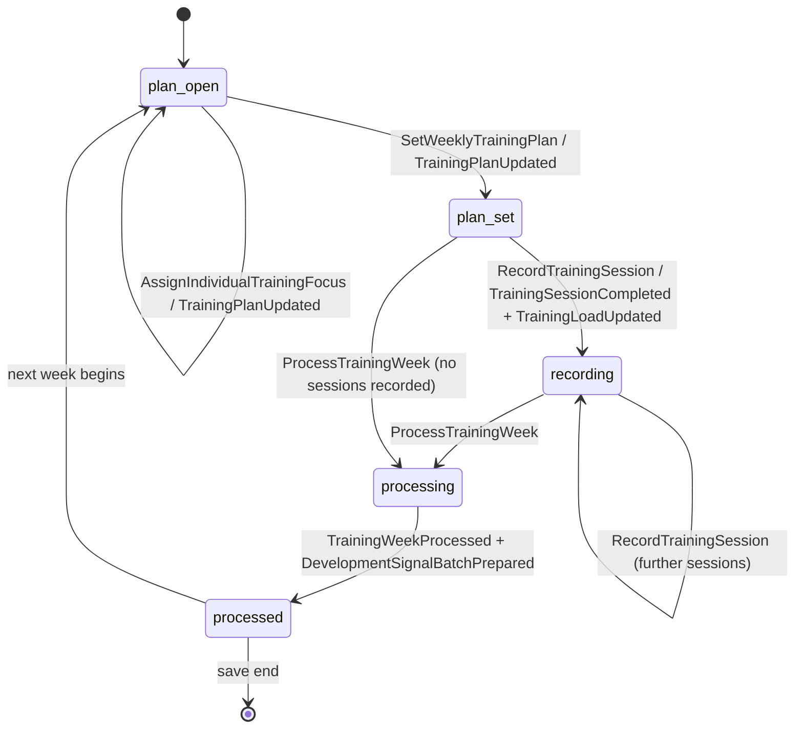
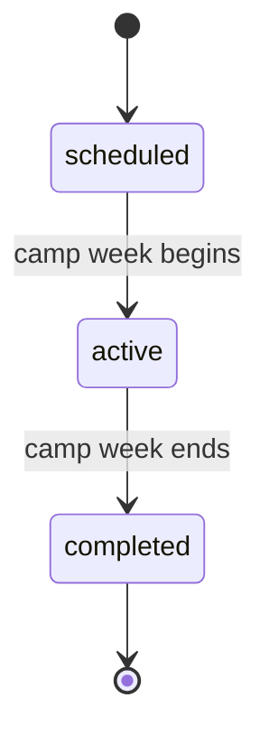

# State Machine - Training (draft)

> **Scope of this note.** This is a faithful transcription of the lifecycle
> that [[../09-Decisions/ADR-0130-training-context-definition]] (FMX-132,
> accepted/binding 2026-06-19) makes explicit through its published language —
> the `TrainingPlan` weekly cycle and the named training-camp command. ADR-0130
> is a **context-definition** ADR: it fixes Training's scope, aggregate
> inventory, commands, events, queries and ACLs, but it does **not** enumerate
> FSM states, guards, timer values or transition rules. Where the diagrams below
> introduce a state name, it is derived directly from an ADR-0130 command/event
> pair; every guard, threshold, cadence and decay constant the ADR leaves
> unspecified is collected under [§Open decisions](#open-decisions) rather than
> invented here. This note stays `draft` / `binding: false` until those gates
> are closed and Nico ratifies it as the Training FSM surface.

Training owns the calculation/signal side of player development; durable player
state (development, injury, availability) is **not** owned here — ADR-0130 §1
and §5 keep that in Squad & Player. Accordingly this note models the **planning
and weekly-processing lifecycle** that Training does own, and deliberately does
**not** model a "return-from-injury" state machine: ADR-0130 places durable
injury and return-to-availability truth in Squad & Player, and
`PlayerReturnedFromInjury` lives in
[[../../50-Game-Design/training-load-and-medicine]], not in ADR-0130's published
language. See [§Open decisions](#open-decisions) for why no return-from-injury
FSM is transcribed.

Per ADR-0130 §2 the candidate aggregates / consistency boundaries are
`TrainingPlan`, `TrainingSession`, `PlayerLoadWindow`, `DevelopmentSignalBatch`,
`InjuryRiskSignal`, `SetPieceReadinessProjection` and `RoleFamiliarityProjection`
(draft future-code names, not tables). Two of these carry an explicit lifecycle
in the published language and are modelled below:

1. `TrainingPlan` / weekly training cycle — the per-club weekly
   plan → record-sessions → process-week → development-signal-batch loop.
2. `TrainingCamp` — the `ScheduleTrainingCamp` special week-block named in
   ADR-0130 §1 and GD-0005.

## 1. `TrainingPlan` — weekly training cycle

Derived from ADR-0130 §3 commands (`SetWeeklyTrainingPlan`,
`AssignIndividualTrainingFocus`, `RecordTrainingSession`, `ProcessTrainingWeek`)
and events (`TrainingPlanUpdated`, `TrainingSessionCompleted`,
`TrainingLoadUpdated`, `TrainingWeekProcessed`, `DevelopmentSignalBatchPrepared`,
`InjuryRiskUpdated`, `TrainingInjuryOccurred`).

### State definitions

| State | Meaning | Source |
|---|---|---|
| `plan_open` | New training week; weekly plan and individual focus are editable. | `SetWeeklyTrainingPlan`, `AssignIndividualTrainingFocus` (ADR-0130 §3) |
| `plan_set` | Weekly plan committed for the week; `TrainingPlanUpdated` emitted. | `SetWeeklyTrainingPlan` → `TrainingPlanUpdated` (ADR-0130 §3) |
| `recording` | Session-level load/focus/attendance facts being captured for the week. | `RecordTrainingSession`, `TrainingSession` aggregate (ADR-0130 §2/§3) |
| `processing` | Weekly processing in flight; load windows, readiness and development deltas being computed. | `ProcessTrainingWeek` (ADR-0130 §3) |
| `processed` | Week processed; `TrainingWeekProcessed` + `DevelopmentSignalBatchPrepared` emitted; `DevelopmentSignalBatch` handed to Squad & Player. | ADR-0130 §3/§5 |

### Transition triggers

| From | To | Trigger | Emitted |
|---|---|---|---|
| `plan_open` | `plan_open` | `AssignIndividualTrainingFocus` | `TrainingPlanUpdated` |
| `plan_open` | `plan_set` | `SetWeeklyTrainingPlan` | `TrainingPlanUpdated` |
| `plan_set` | `recording` | `RecordTrainingSession` | `TrainingSessionCompleted`, `TrainingLoadUpdated` |
| `recording` | `recording` | `RecordTrainingSession` (further session) | `TrainingSessionCompleted`, `TrainingLoadUpdated` |
| `recording` | `processing` | `ProcessTrainingWeek` | — |
| `plan_set` | `processing` | `ProcessTrainingWeek` (no sessions recorded) | — |
| `processing` | `processed` | weekly computation completes | `TrainingWeekProcessed`, `DevelopmentSignalBatchPrepared`, and where applicable `InjuryRiskUpdated`, `TrainingInjuryOccurred`, `RoleFamiliarityUpdated`, `SetPieceCoachReadinessUpdated` |
| `processed` | `plan_open` | next training week begins | — |

> ADR-0130 does **not** state what advances the week (world tick vs. explicit
> command), how many session slots a week holds, the cadence Tue/Wed/Sun baked
> into GD-0005, or any guard on plan validity. Those are flagged in
> [§Open decisions](#open-decisions).

## 2. `TrainingCamp`

ADR-0130 §1 lists "training-camp and training-facility effects where existing
GDDR scope allows" inside Training's scope, and §3 names the
`ScheduleTrainingCamp` command. GD-0005 describes a camp as a special
pre-season / winter-break week-block. ADR-0130 defines **no** camp-specific
events or states, so only the command-driven shell is transcribed; everything
inside is an open decision.

### State definitions

| State | Meaning | Source |
|---|---|---|
| `scheduled` | Camp booked for a future week-block via `ScheduleTrainingCamp`. | `ScheduleTrainingCamp` (ADR-0130 §3) |
| `active` | Camp week-block in effect; replaces the ordinary weekly plan for its duration. | GD-0005 (camp as special week-block) |
| `completed` | Camp finished; control returns to the ordinary `TrainingPlan` cycle. | derived |

> ADR-0130 names no `TrainingCampScheduled` / `TrainingCampStarted` /
> `TrainingCampCompleted` events, no location-effect mechanics, and no
> interaction rule with the weekly cycle. All of that is in
> [§Open decisions](#open-decisions).

## 3. Trigger sources

| Trigger | Kind | Source |
|---|---|---|
| `SetWeeklyTrainingPlan` | Player command | ADR-0130 §3 |
| `AssignIndividualTrainingFocus` | Player command | ADR-0130 §3 (GD-0005 "individual training of one player per week") |
| `RecordTrainingSession` | Command (player or world tick — **undecided**, see §Open decisions) | ADR-0130 §3 |
| `ProcessTrainingWeek` | Command (likely world tick — **undecided**) | ADR-0130 §3 |
| `ScheduleTrainingCamp` | Player command | ADR-0130 §3 |

## 4. Consumed facts (read-only, via ACL)

Per ADR-0130 §4 Training reads, never mutates, the following — all as
projections/snapshots:

| Upstream | Training consumes | Handling |
|---|---|---|
| Squad & Player | roster, availability/injury/fitness baseline, player development profile snapshot | Downstream ACL; read projection only |
| Tactics | `RoleProfileForPosition`, set-piece routine metadata | Customer/Supplier published query (ADR-0055) |
| Staff Operations / People | trainer capacity, staff skill/profile projections | Self-contained projections |
| Calendar / Competition / Match | schedule density, recent/next match workload | Consumed as workload inputs |

## 5. Effect on other contexts

Per ADR-0130 §5 (events from §3):

| Event | Consumer | Effect |
|---|---|---|
| `TrainingWeekProcessed` | Squad & Player | Trigger durable development/availability update from this week |
| `DevelopmentSignalBatchPrepared` | Squad & Player | Deterministic batch of training-derived growth deltas (`DevelopmentSignalBatch`) applied to durable player state |
| `InjuryRiskUpdated` | Squad & Player | Training-computed risk/readiness warning (`InjuryRiskSignal`); not durable injury state |
| `TrainingInjuryOccurred` | Squad & Player | Training-origin injury fact; Squad & Player owns the durable injury record |
| `SetPieceCoachReadinessUpdated` | Tactics | Per-module/variant readiness (`SetPieceReadinessProjection`), per GD-0026 |
| `RoleFamiliarityUpdated` | Tactics | Proposed role/tactical-familiarity projection (`RoleFamiliarityProjection`) consuming Tactics role profiles |
| readiness/load/fatigue snapshot | Match | Readiness/load/fatigue snapshot **if** ADR-0130 D2/D5 snapshot contract applies; Match owns lineup lock + simulation |
| training summaries / readiness projections | Impact Lens / UI | Presentation/projection only |

## 6. Determinism

ADR-0130 §6 / Consequences require Training's signal payloads (notably
`DevelopmentSignalBatch`) to be **deterministic** before implementation, and the
ADR amends [[../09-Decisions/ADR-0067-set-piece-variant-selection-determinism]]
and [[../09-Decisions/ADR-0018-systemic-events-and-player-lifecycle]]. ADR-0130
does **not** specify whether weekly development uses pure-deterministic
computation or a seeded `*Rng` sub-stream (cf. ADR-0018 §3 RNG-sub-label
pattern). The RNG/determinism axis for training development is an
[§Open decision](#open-decisions).

## 7. Persistence model

ADR-0130 §2 declares its aggregate names are "draft future-code names and not
database tables", and ADR-0130 does not specify a Drizzle schema. Persistence
follows [[../09-Decisions/ADR-0027-postgres-data-model]] (per-save schema, typed
columns, intra-context FKs, `jsonb` for read-together objects) and event
publication follows the transactional outbox in
[[../09-Decisions/ADR-0028-postgres-transactional-outbox]]. Concrete table
shapes are deferred to the development phase and are **not** invented here.

## 8. Open decisions

Everything below is **undefined by ADR-0130** (and not pinned by the GDs it
references). It is listed here rather than guessed in the diagrams/tables above;
each needs Nico's decision before this note can move from `draft` to a binding
FSM surface.

1. **Weekly-cycle states are derived, not ADR-stated.** ADR-0130 names commands
   and events but not states (`plan_open`, `plan_set`, `recording`,
   `processing`, `processed`). Confirm the state set and names.
2. **Week-advance trigger.** Is `ProcessTrainingWeek` (and the
   `processed → plan_open` step) driven by a world tick / `SeasonAdvanced`-style
   clock, or an explicit player command? Undefined.
3. **Session cadence / slot model.** GD-0005 bakes in Tue light + Wed tactical +
   Sun regen and "daily slots"; ADR-0130 does not state how many
   `RecordTrainingSession` slots a week has, their order, or whether sessions
   are mandatory before `ProcessTrainingWeek`. Undefined.
4. **Guards on plan validity.** No guard is defined for `SetWeeklyTrainingPlan`
   (e.g. mandatory regeneration to avoid injury per GD-0005, intensity caps,
   individual-focus = one player/week). Thresholds and validity rules undefined.
5. **Load/readiness constants.** Acute/chronic load, fatigue decay, monotony,
   readiness thresholds (sketched in
   [[../../50-Game-Design/training-load-and-medicine]]) are **not** fixed by
   ADR-0130; §1 explicitly leaves numeric calibration to GD-0043 / gameplay
   calibration. No decay constant, ACWR window, or readiness cut-off is
   transcribed.
6. **Injury-risk → injury transition.** When `InjuryRiskUpdated` becomes
   `TrainingInjuryOccurred` (the risk→occurrence rule) is undefined — threshold,
   probability and whether seeded RNG is involved.
7. **Determinism vs. seeded variance.** Whether weekly development /
   injury-occurrence is pure-deterministic or uses a seeded `*Rng` sub-label per
   ADR-0018 §3. Undefined (ADR-0130 only requires the payload be deterministic,
   not the mechanism).
8. **Training-camp internals.** No camp events, no location-effect mechanics, no
   duration, no interaction rule with the weekly `TrainingPlan` cycle, no
   cancellation/abort path are defined by ADR-0130. The §2 diagram is a
   command-shell only.
9. **No return-from-injury FSM transcribed (intentional).** ADR-0130 keeps
   durable injury/availability and `PlayerReturnedFromInjury` in Squad & Player
   (§1, §5; the event lives in
   [[../../50-Game-Design/training-load-and-medicine]]). If a Training-side
   reintegration/graded-return sub-FSM is wanted, it is a new decision and a new
   ADR/amendment — it is **not** authored from ADR-0130.
10. **Match readiness snapshot contract.** ADR-0130 §5 makes the
    readiness/load/fatigue snapshot to Match conditional ("if D2/D5 are
    accepted"); the exact snapshot contract/state at which it is emitted is
    undefined.
11. **Status/binding of this note.** Whether this FSM note should track ADR-0130
    as `current`/binding (like youth-academy.md does for ADR-0060) once states
    are confirmed, or remain `draft`. Pending Nico.
