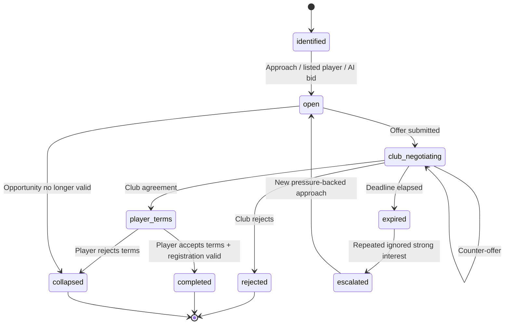

# State Machine - Transfer Negotiation

Owns the lifecycle of a transfer negotiation case: AI<->AI, human<->AI or
human<->human. A case can contain multiple offers and counter-offers, plus a
separate player / agent terms gate. Detailed architecture lives in
[[../transfer-market-architecture]].

## 1. States



## 2. State definitions

| State | Meaning |
|---|---|
| `identified` | Opportunity exists: listing, scout target, contract risk, player pressure or AI need |
| `open` | A buyer / seller can approach, but no live offer is awaiting response |
| `club_negotiating` | At least one club offer is live; counters can occur |
| `player_terms` | Clubs agreed a package; player / agent terms are being resolved |
| `completed` | Club package, player terms and registration checks passed |
| `rejected` | Receiver explicitly declined; sender notified |
| `expired` | Current live offer deadline elapsed |
| `escalated` | Pattern of ignored strong interest accumulating consequences |
| `collapsed` | Opportunity ended without transfer: player refused, window closed, budget gone, buyer withdrew |

## 3. Transition triggers

| From | To | Trigger |
|---|---|---|
| `identified` | `open` | Opportunity materialised for this simulation tier |
| `open` | `club_negotiating` | Offer submitted |
| `club_negotiating` | `club_negotiating` | Counter-offer submitted within round limit |
| `club_negotiating` | `player_terms` | Clubs agree package |
| `player_terms` | `completed` | Player accepts and League validates registration |
| `player_terms` | `collapsed` | Player / agent rejects final terms |
| `club_negotiating` | `rejected` | Club rejects |
| `club_negotiating` | `expired` | Response deadline elapsed |
| `expired` | `escalated` | Repeat-ignored strong-interest threshold reached |
| `escalated` | `open` | New pressure-backed approach can be made |
| `open` | `collapsed` | Window closes or opportunity preconditions disappear |

## 4. Escalation

`escalated` is a special state aggregating prior ignores. It triggers
when:

- N consecutive expired offers for the same target player from the same bidder
  and seller.
- AND the bidder's offer cash-equivalent is inside or above the player's fair
  valuation band.
- AND the player-side plausibility check says the move is at least credible.

Effects (in order, applied per follow-on event):

1. Agent registers interest publicly.
2. Player's `unrest` ticks up.
3. Player issues transfer request via media.
4. Training-mood slip in target's club.
5. Media leak / supporter unrest in target's club.

Detail in [[../../50-Game-Design/transfer-market-and-contracts]] and
[[../../50-Game-Design/transfer-negotiations-p2p]] §3.

## 5. Persistence

```text
transfer_negotiation_case {
  id: record(transfer_negotiation_case),
  player: record(player),
  seller_club: record(club),
  buyer_club: record(club)?,
  state: enum(state_names),
  opportunity_reason: string,
  seller_reservation_cash_equivalent: number,
  buyer_max_cash_equivalent: number?,
  player_terms_state: string?,
  response_deadline: datetime?,
  competing_bid_count: number,
  relationship_temperature: number,
  media_leak_risk: number,
  history: array<event>
}

transfer_offer {
  id: record(transfer_offer),
  case: record(transfer_negotiation_case),
  from_club: record(club),
  to_club: record(club),
  base_fee: number,
  installments: array<object>,
  bonuses: array<object>,
  clauses: array<record(transfer_clause)>,
  cash_equivalent: number,
  response_deadline: datetime,
  state: enum(offer_state),
  parent_offer: record(transfer_offer)?
}
```

## 6. Events emitted

- `TransferOfferSubmitted`
- `TransferOfferCountered`
- `TransferOfferAcceptedByClub`
- `TransferPlayerTermsAccepted`
- `TransferPlayerTermsRejected`
- `TransferOfferRejected`
- `TransferOfferExpired`
- `TransferNegotiationEscalated`
- `TransferCompleted` (post-acceptance, after league-window check)
- `TransferCollapsed`

## 7. Anti-griefing

A bidder accumulates `griefingScore` per league based on:

- Number of lowball offers.
- Spam pattern (many offers in 24 h).
- Counter-offer abuse (very small changes to extend the chain).
- Offer packages below 30 % of the fair valuation band, unless the seller is in
  forced-sale state.

When threshold exceeded, league admin sees a flag and can sanction.

## 8. Test strategy

- Property-based: state machine never reaches undefined state.
- Concurrency: two simultaneous counter-offers race; resolve
  deterministically by `received_at`.
- Time: deadlines fire reliably under timezone changes.
- Escalation: golden traces for ignore-pattern detection.
- Player terms: club-agreed package can still collapse when player / agent
  rejects terms.

## 9. Open questions

- Counter-offer infinite loop prevention - tentative: maximum 3
  counter-rounds per chain.
- Player acceptance is modelled as `player_terms`, a separate state. This is
  required by [[../../60-Research/transfer-market-simulation]] because club
  agreement and player / agent agency are separate gates.
- AI-club counter-party - same state machine; trigger source is the AI,
  not a human.
