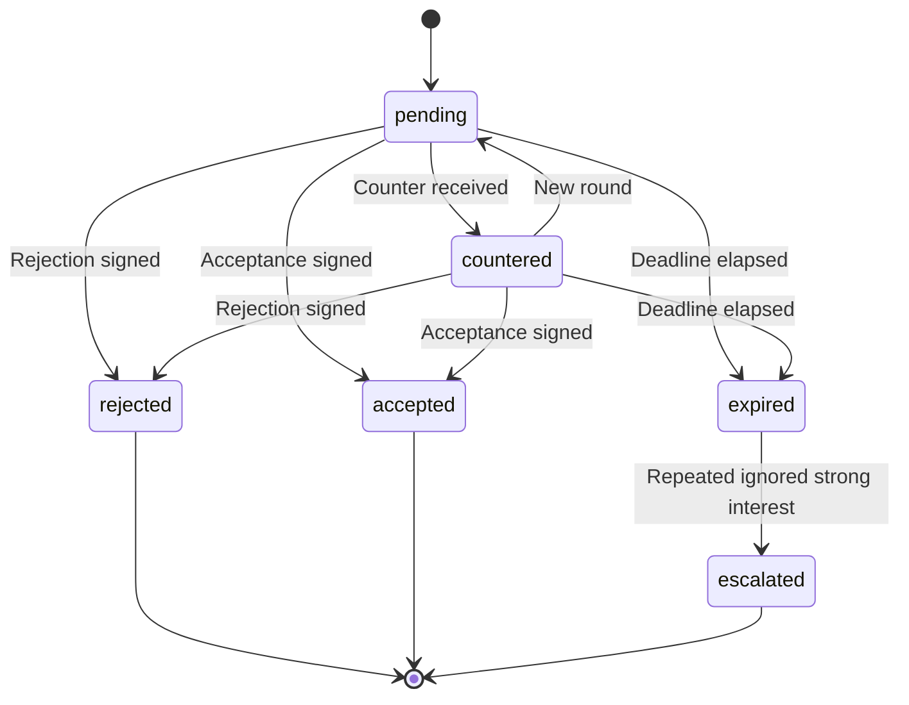

# State Machine - Transfer

Owns the lifecycle of a single transfer offer (human↔AI or human↔human).
Drives the escalation rules from [[../../50-Game-Design/transfer-negotiations-p2p]].

## 1. States



## 2. State definitions

| State | Meaning |
|---|---|
| `pending` | Offer with sender waiting on receiver |
| `countered` | Receiver responded with counter; sender now responds |
| `accepted` | All parties (clubs + player) accepted; transfer is realised |
| `rejected` | Receiver explicitly declined; sender notified |
| `expired` | Deadline reached without response |
| `escalated` | Pattern of ignored strong interest accumulating consequences |

## 3. Transition triggers

| From | To | Trigger |
|---|---|---|
| `pending` | `countered` | Receiver submits counter-offer |
| `countered` | `pending` | Sender submits counter-counter-offer |
| `pending` | `accepted` | Receiver accepts AND player accepts terms |
| `countered` | `accepted` | Sender accepts counter AND player accepts terms |
| `pending` | `rejected` | Receiver explicitly rejects |
| `pending` | `expired` | Response deadline elapsed |
| `expired` | `escalated` | Repeat-ignored strong-interest threshold reached |

## 4. Escalation

`escalated` is a special state aggregating prior ignores. It triggers
when:

- N consecutive expired offers for the same target player from the same
  bidder (where target club is the same).
- AND the bidder's offer fair-value is at or above the player's market
  estimate.

Effects (in order, applied per follow-on event):

1. Agent registers interest publicly.
2. Player's `unrest` ticks up.
3. Player issues transfer request via media.
4. Training-mood slip in target's club.
5. Media leak / supporter unrest in target's club.

Detail in [[../../50-Game-Design/transfer-negotiations-p2p]] §3.

## 5. Persistence

```text
transfer_offer {
  id: record(transfer_offer),
  league: record(league),
  initiator: record(member),
  target_club: record(club),
  target_player: record(player),
  state: enum(state_names),
  fee_structure: object,
  clauses: array<clause>,
  response_deadline: datetime,
  history: array<event>,
  parent: record(transfer_offer)?    # counter chain
}
```

## 6. Events emitted

- `TransferOfferSubmitted`
- `TransferOfferCountered`
- `TransferOfferAccepted`
- `TransferOfferRejected`
- `TransferOfferExpired`
- `TransferOfferEscalated`
- `TransferRealised` (post-acceptance, after league-window check)

## 7. Anti-griefing

A bidder accumulates `griefingScore` per league based on:

- Number of lowball offers.
- Spam pattern (many offers in 24 h).
- Counter-offer abuse (very small changes to extend the chain).

When threshold exceeded, league admin sees a flag and can sanction.

## 8. Test strategy

- Property-based: state machine never reaches undefined state.
- Concurrency: two simultaneous counter-offers race; resolve
  deterministically by `received_at`.
- Time: deadlines fire reliably under timezone changes.
- Escalation: golden traces for ignore-pattern detection.

## 9. Open questions

- Counter-offer infinite loop prevention - tentative: maximum 3
  counter-rounds per chain.
- Player acceptance modelled inline or as a separate state? Inline event,
  not a separate state - the offer state captures the transition.
- AI-club counter-party - same state machine; trigger source is the AI,
  not a human.
