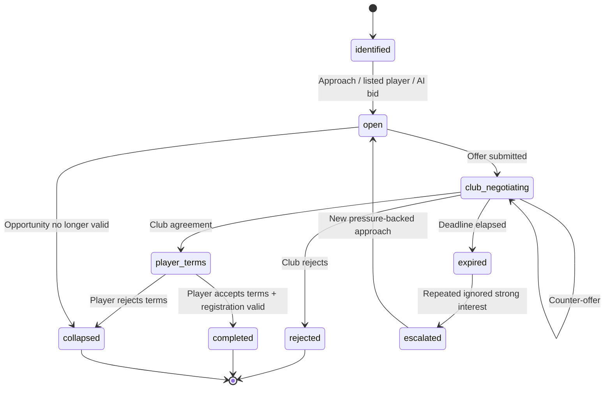

# State Machine - Transfer Negotiation

Owns the lifecycle of a transfer negotiation case: AI<->AI, human<->AI or
human<->human. A case can contain multiple offers and counter-offers, plus a
separate player / agent terms gate. Detailed architecture lives in
[[../transfer-market-architecture]].

## 1. States



## 2. State definitions

| State | Meaning |
|---|---|
| `identified` | Opportunity exists: listing, scout target, contract risk, player pressure or AI need |
| `open` | A buyer / seller can approach, but no live offer is awaiting response |
| `club_negotiating` | At least one club offer is live; counters can occur |
| `player_terms` | Clubs agreed a package; player / agent terms are being resolved |
| `completed` | Club package, player terms and registration checks passed |
| `rejected` | Receiver explicitly declined; sender notified |
| `expired` | Current live offer deadline elapsed |
| `escalated` | Pattern of ignored strong interest accumulating consequences |
| `collapsed` | Opportunity ended without transfer: player refused, window closed, budget gone, buyer withdrew |

## 3. Transition triggers

| From | To | Trigger |
|---|---|---|
| `identified` | `open` | Opportunity materialised for this simulation tier |
| `open` | `club_negotiating` | Offer submitted |
| `club_negotiating` | `club_negotiating` | Counter-offer submitted within round limit |
| `club_negotiating` | `player_terms` | Clubs agree package |
| `player_terms` | `completed` | Player accepts and League validates registration |
| `player_terms` | `collapsed` | Player / agent rejects final terms |
| `club_negotiating` | `rejected` | Club rejects |
| `club_negotiating` | `expired` | Response deadline elapsed |
| `expired` | `escalated` | Repeat-ignored strong-interest threshold reached |
| `escalated` | `open` | New pressure-backed approach can be made |
| `open` | `collapsed` | Window closes or opportunity preconditions disappear |

## 4. Escalation

`escalated` is a special state aggregating prior ignores. It triggers
when:

- N consecutive expired offers for the same target player from the same bidder
  and seller.
- AND the bidder's offer cash-equivalent is inside or above the player's fair
  valuation band.
- AND the player-side plausibility check says the move is at least credible.

Effects (in order, applied per follow-on event):

1. Agent registers interest publicly.
2. Player's `unrest` ticks up.
3. Player issues transfer request via media.
4. Training-mood slip in target's club.
5. Media leak / supporter unrest in target's club.

Detail in [[../../50-Game-Design/transfer-market-and-contracts]] and
[[../../50-Game-Design/transfer-negotiations-p2p]] §3.

## 4.1 Staged escalation FSM (draft — FMX-102)

> **Draft amendment (FMX-102 / proposed [[../09-Decisions/ADR-0088-async-escalation-fsm-and-watch-party-deadline-source-of-truth]]).**
> Replaces the single `escalated` lump above with an explicit **5-stage** sub-FSM (gap G25). Not
> binding until ratified; on ratify this supersedes the prose effects list in §4 and the
> single-state `escalated` modelling. Magnitudes → FMX-52 behind `escalationModelVersion`.
> Game-design companion: [[../../50-Game-Design/GD-0036-transfer-escalation-and-inactivity-pressure]].

Escalation is a **Transfer-owned value object** (`EscalationPressure`) keyed by
`(playerId, sellerClubId, bidderClubId)`. A single integer **`pressure` accumulator** (D2) rises by a
weighted increment on each relevant committed fact (`TransferOfferExpired`, ignored strong interest,
inactivity tick) and **decays** by a per-stage rate on event boundaries (D3 — leaky bucket). `stage`
is a pure function of `pressure` via **hysteresis** thresholds (`θ_up > θ_down`). The macro-state
`escalated` in §1 now means `stage ≥ S1`.

| Stage | Meaning | Stage-entry consequence event |
|---|---|---|
| `none` | No accumulated pressure | — |
| `expired_ignored` (S1) | Pattern of ignored expiries begins | (internal) |
| `registered_interest` (S2) | Agent/club registers interest publicly | `TransferInterestRegistered` |
| `unrest_requested` (S3) | Player unrest + formal transfer request | `PlayerTransferRequestSubmitted` |
| `media_strike_threat` (S4) | Media leak / strike-threat **signal** (never a strike itself; ADR-0030) | `TransferStandoffEscalated` |
| `public_unrest` (S5) | Supporter/public unrest at the club | `SupporterUnrestTriggered` |

**Decay & de-escalation:** in calm, `pressure` is monotone non-increasing and the stage steps **down**;
later stages decay slower (stickiness). Resolving facts (new contract, reconciliation, agreed sale,
window close) emit `TransferEscalationDeescalated{fromStage, toStage, cause}`.

**Invariants (ADR-0088 ES1–ES5):** at-most-**one-stage-up per event**; `media_strike_threat` (S4) is
reachable only from S3 **and** only with `pressureSinceStageEntry ≥ MIN` → **"no strike from one
ignored offer" is a structural gate, not prose**. Determinism (**D4 = B**): escalation is replay-safe;
borderline tips/dwell carry **bounded seeded variance from the existing `TransferRng` (stream #7)** with
**seed + draw indices persisted in provenance** (no new `*Rng`); the variance lives *inside* the gates
and can never skip a rung.

## 5. Persistence

Per [[../09-Decisions/ADR-0027-postgres-data-model]]: strongly-typed tables in
the per-save schema; cross-context references (`player`, `*_club`) as opaque
branded UUIDv7 columns (no cross-context `references()`); intra-context refs
(`case`, `parent_offer`) as `uuid` columns with intra-context FKs; integer-only
money in cents; embedded lists as `jsonb`.

```text
transfer_negotiation_case {                  # strongly-typed (typed cols + CHECK)
  id: uuid (UUIDv7, app-generated, PK),
  player_id: uuid (PlayerId, opaque branded ref),
  seller_club_id: uuid (ClubId, opaque branded ref),
  buyer_club_id: uuid (ClubId, opaque branded ref)?,
  state: text + CHECK IN (state_names),
  opportunity_reason: text,
  seller_reservation_cash_equivalent: bigint (cents),
  buyer_max_cash_equivalent: bigint (cents)?,
  player_terms_state: text?,
  response_deadline: timestamptz?,
  competing_bid_count: integer,
  relationship_temperature: integer,
  media_leak_risk: integer,
  history: jsonb (array of events)
}

transfer_offer {                             # strongly-typed (typed cols + CHECK)
  id: uuid (UUIDv7, app-generated, PK),
  case_id: uuid (intra-context FK to transfer_negotiation_case),
  from_club_id: uuid (ClubId, opaque branded ref),
  to_club_id: uuid (ClubId, opaque branded ref),
  base_fee: bigint (cents),
  installments: jsonb (array),
  bonuses: jsonb (array),
  clause_ids: uuid[] (intra-context refs to transfer_clause),
  cash_equivalent: bigint (cents),
  response_deadline: timestamptz,
  state: text + CHECK IN (offer_state),
  parent_offer_id: uuid (intra-context FK to transfer_offer)?
}
```

## 6. Events emitted

- `TransferOfferSubmitted`
- `TransferOfferCountered`
- `TransferOfferAcceptedByClub`
- `TransferPlayerTermsAccepted`
- `TransferPlayerTermsRejected`
- `TransferOfferRejected`
- `TransferOfferExpired`
- `TransferNegotiationEscalated` *(retained; now carries `stage` — draft FMX-102/ADR-0088)*
- `TransferCompleted` (post-acceptance, after league-window check)
- `TransferCollapsed`

Staged-escalation events *(draft — FMX-102/ADR-0088; §4.1)* — each self-contained, routed via the
ADR-0028 outbox, consumed without cross-context joins:

- `TransferEscalationStageChanged` (canonical derived projection)
- `TransferInterestRegistered` (S2) / `PlayerTransferRequestSubmitted` (S3) /
  `TransferStandoffEscalated` (S4, signal-only — Narrative renders, ADR-0030) /
  `SupporterUnrestTriggered` (S5)
- `TransferEscalationDeescalated`

## 7. FMX-81 contract-lifecycle seam

FMX-81 keeps this state machine strictly **club-to-club**. The persisted
`seller_club_id` remains non-null; do not model free agents by setting it to
`null`.

Player contract lifecycle truth is owned by Squad & Player in
[[player-contract-lifecycle]] and proposed [[../09-Decisions/ADR-0073-player-contract-lifecycle-fsm]].
Transfer owns only the process cases that can change that lifecycle:

- `RenewalNegotiationCase` for current-club extension talks;
- `PreContractCase` for approach-to-sign / Bosman-style future contracts;
- `FreeAgentSigningCase` for no-selling-club signings.

Those cases may reuse the player-terms language from this transfer FSM, but their
registration/work-permit gates are Regulations verdicts and their contract-state
effects are commands/events consumed by Squad & Player.

## 8. Anti-griefing

A bidder accumulates `griefingScore` per league based on:

- Number of lowball offers.
- Spam pattern (many offers in 24 h).
- Counter-offer abuse (very small changes to extend the chain).
- Offer packages below 30 % of the fair valuation band, unless the seller is in
  forced-sale state.

When threshold exceeded, league admin sees a flag and can sanction.

## 9. Test strategy

- Property-based: state machine never reaches undefined state.
- Concurrency: two simultaneous counter-offers race; resolve
  deterministically by `received_at`.
- Time: deadlines fire reliably under timezone changes.
- Escalation: golden traces for ignore-pattern detection. *(draft — FMX-102/ADR-0088)* Stage-by-stage
  traces over the `EscalationPressure` accumulator: assert exact `pressure`/`stage` at each event
  boundary; **no `media_strike_threat` (S4) from a single event** (the structural gate); per-stage
  decay/cool-off steps the stage back down; identical `worldSeed` + facts + persisted `TransferRng`
  draws → byte-identical trajectory (D4 = B).
- Player terms: club-agreed package can still collapse when player / agent
  rejects terms.
- Boundary: free-agent and pre-contract paths cannot be persisted as
  club-to-club transfer cases with a missing seller.

## 10. Future-scope notes (classified future-scope)

- Counter-offer infinite loop prevention - tentative: maximum 3
  counter-rounds per chain.
- Player acceptance is modelled as `player_terms`, a separate state. This is
  required by [[../../60-Research/transfer-market-simulation]] because club
  agreement and player / agent agency are separate gates.
- AI-club counter-party - same state machine; trigger source is the AI,
  not a human.
