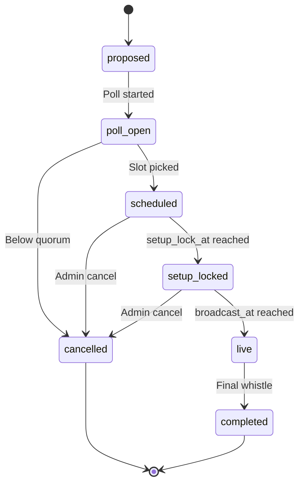

# State Machine - Watch Party

Owns the lifecycle of a watch party from proposal through broadcast to
completion. Drives backward deadline propagation for the underlying
match.

## 1. States



## 2. State definitions

| State | Meaning |
|---|---|
| `proposed` | System or admin has suggested a watch-party candidate |
| `poll_open` | Slot poll is open; members vote |
| `scheduled` | Slot chosen; broadcast time set |
| `setup_locked` | Within `setup_lock_at` of broadcast time; line-ups and tactics locked |
| `live` | Match is being broadcast to spectators |
| `completed` | Match finished and reports produced |
| `cancelled` | Admin cancellation or quorum failure |

## 3. Backward deadlines

Once `scheduled`:

```text
broadcast_at    = T
tactic_lock_at  = T - 30 min
line-up_lock_at = T - 30 min
transfer_lock_at= T - 60 min
setup_lock_at   = T - 5 min
```

These deadlines are written into the underlying match record so the
league-week state machine respects them.

## 4. Transition triggers

| From | To | Trigger |
|---|---|---|
| `proposed` | `poll_open` | Admin opens poll OR system auto-proposes |
| `poll_open` | `scheduled` | Quorum vote successful, slot picked |
| `poll_open` | `cancelled` | Quorum failure or poll deadline elapsed |
| `scheduled` | `setup_locked` | Timer reaches `setup_lock_at` |
| `setup_locked` | `live` | Timer reaches `broadcast_at` |
| `live` | `completed` | Match worker reports full-time |
| `scheduled` / `setup_locked` | `cancelled` | Admin cancel command |

## 5. Spectator stream

When `live`, the watch-party service consumes the match service's
snapshot / event stream. Configurable spectator delay (15-60 s) per group
rule.

Architecture detail:
[[../09-Decisions/ADR-0015-spectator-snapshot-streaming]].

## 6. Conference variant

A conference watch-party subscribes to multiple match feeds
simultaneously. State machine is identical; the `target_matches` field
holds an array instead of a single match record.

## 7. Persistence

```text
watch_party {
  id: record(watch_party),
  league: record(league),
  state: enum(state_names),
  target_matches: array<record(match)>,
  proposed_at: datetime,
  poll_slots: array<datetime>?,
  poll_deadline: datetime?,
  scheduled_at: datetime?,
  broadcast_at: datetime?,
  setup_lock_at: datetime?,
  participants: array<record(member)>,
  spectator_delay_s: int,
  chat_enabled: bool
}
```

## 8. Events emitted

- `WatchPartyProposed`
- `WatchPartyPollOpened`
- `WatchPartyScheduled`
- `WatchPartySetupLocked`
- `WatchPartyLive`
- `WatchPartyCompleted`
- `WatchPartyCancelled`

## 9. Failure / recovery

| Failure | Recovery |
|---|---|
| Match worker crash mid-broadcast | Watch party stays `live`; spectator stream pauses; reconnect once match resumes |
| Spectator delay queue overflow | Drop oldest frames; spectators see jump (logged) |
| Poll deadline never reached (no votes) | Auto-cancel |

## 10. Test strategy

- Backward deadlines compute correctly across timezones.
- Poll quorum logic deterministic.
- State machine never enters undefined state.
- Spectator delay math holds under variable network conditions.

## 11. Open questions

- Should conference watch-parties have their own state record per match
  or one record per conference? Recommendation: one per conference, with
  `target_matches` array.
- Recording / replay availability post-completion - replay always
  available; spectator delay does not apply on replay.
