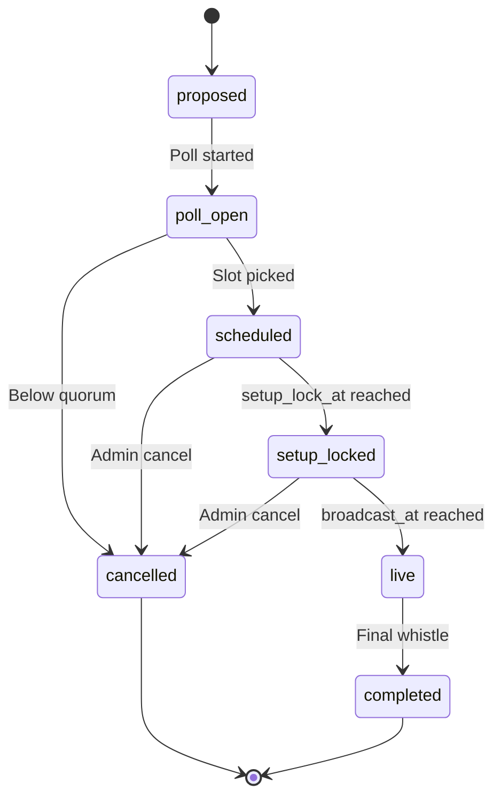

# State Machine - Watch Party

Owns the lifecycle of a watch party from proposal through broadcast to
completion. Drives backward deadline propagation for the underlying
match.

## 1. States



## 2. State definitions

| State | Meaning |
|---|---|
| `proposed` | System or admin has suggested a watch-party candidate |
| `poll_open` | Slot poll is open; members vote |
| `scheduled` | Slot chosen; broadcast time set |
| `setup_locked` | Within `setup_lock_at` of broadcast time; line-ups and tactics locked |
| `live` | Match is being broadcast to spectators |
| `completed` | Match finished and reports produced |
| `cancelled` | Admin cancellation or quorum failure |

## 3. Backward deadlines

Once `scheduled`:

```text
broadcast_at    = T
tactic_lock_at  = T - 30 min
line-up_lock_at = T - 30 min
transfer_lock_at= T - 60 min
setup_lock_at   = T - 5 min
```

These deadlines are written into the underlying match record so the
league-week state machine respects them.

## 4. Transition triggers

| From | To | Trigger |
|---|---|---|
| `proposed` | `poll_open` | Admin opens poll OR system auto-proposes |
| `poll_open` | `scheduled` | Quorum vote successful, slot picked |
| `poll_open` | `cancelled` | Quorum failure or poll deadline elapsed |
| `scheduled` | `setup_locked` | Timer reaches `setup_lock_at` |
| `setup_locked` | `live` | Timer reaches `broadcast_at` |
| `live` | `completed` | Match worker reports full-time |
| `scheduled` / `setup_locked` | `cancelled` | Admin cancel command |

## 5. Spectator stream

When `live`, the watch-party service consumes the match service's
snapshot / event stream. Configurable spectator delay (15-60 s) per group
rule.

Architecture detail:
[[../09-Decisions/ADR-0015-spectator-snapshot-streaming]].

## 5.1 Disconnect pause rule

Watch-party pause behavior is a group-level setting, not hard-coded per match.

```text
disconnectPauseMode = off | activeManagers | allManagers
disconnectPauseWindowSeconds = 30..300, default 180
disconnectPauseBudgetPerHalf = integer, default 1
```

Default: `activeManagers`.

- Passive spectators never pause the underlying match.
- Active managers may pause the shared broadcast only when the group rule allows
  it and the pause budget is still available.
- On reconnect, the service resumes from the current event cursor and reconciles
  missed frames.
- On timeout, the match continues using the last valid intervention state.
- Abuse protection belongs here: pause budgets, cooldowns and audit events are
  watch-party orchestration concerns, not match-engine logic.

## 6. Conference variant

A conference watch-party subscribes to multiple match feeds
simultaneously. State machine is identical; the `target_matches` field
holds an array instead of a single match record.

## 7. Persistence

Per [[../09-Decisions/ADR-0027-postgres-data-model]]: a strongly-typed
`watch_party` table in the per-save schema; cross-context references as opaque
branded UUIDv7 columns (no cross-context `references()`). Participants are a
RELATE-style edge with lifecycle, modelled as a junction table with a surrogate
UUIDv7 PK (`watch_party_participant`); embedded scalar lists stay `jsonb`.

```text
watch_party {                            # strongly-typed (typed cols + CHECK)
  id: uuid (UUIDv7, app-generated, PK),
  league_id: uuid (LeagueId, opaque branded ref),
  state: text + CHECK IN (state_names),
  target_match_ids: uuid[] (MatchId, opaque branded refs),
  proposed_at: timestamptz,
  poll_slots: jsonb (array of timestamptz)?,
  poll_deadline: timestamptz?,
  scheduled_at: timestamptz?,
  broadcast_at: timestamptz?,
  setup_lock_at: timestamptz?,
  spectator_delay_s: integer,
  disconnect_pause_mode: text + CHECK IN (off | active_managers | all_managers),
  disconnect_pause_window_s: integer,
  disconnect_pause_budget_per_half: integer,
  chat_enabled: boolean
}

watch_party_participant {                # junction table (surrogate PK)
  id: uuid (UUIDv7, app-generated, PK),
  watch_party_id: uuid (intra-context FK to watch_party),
  member_id: uuid (MemberId, opaque branded ref),
  joined_at: timestamptz,
  left_at: timestamptz?
}
```

## 8. Events emitted

- `WatchPartyProposed`
- `WatchPartyPollOpened`
- `WatchPartyScheduled`
- `WatchPartySetupLocked`
- `WatchPartyLive`
- `WatchPartyCompleted`
- `WatchPartyCancelled`

## 9. Failure / recovery

| Failure | Recovery |
|---|---|
| Match worker crash mid-broadcast | Watch party stays `live`; spectator stream pauses; reconnect once match resumes |
| Active manager disconnects | Apply group disconnect pause rule; auto-continue on timeout |
| Passive spectator disconnects | No pause; reconnect to current cursor or replay |
| Spectator delay queue overflow | Drop oldest frames; spectators see jump (logged) |
| Poll deadline never reached (no votes) | Auto-cancel |

## 10. Test strategy

- Backward deadlines compute correctly across timezones.
- Poll quorum logic deterministic.
- State machine never enters undefined state.
- Spectator delay math holds under variable network conditions.
- Disconnect pause mode respects passive-vs-active participants, timeout and
  pause budget.

## 11. Future-scope notes (classified future-scope)

- Should conference watch-parties have their own state record per match
  or one record per conference? Recommendation: one per conference, with
  `target_matches` array.
- Recording / replay availability post-completion - replay always
  available; spectator delay does not apply on replay.
