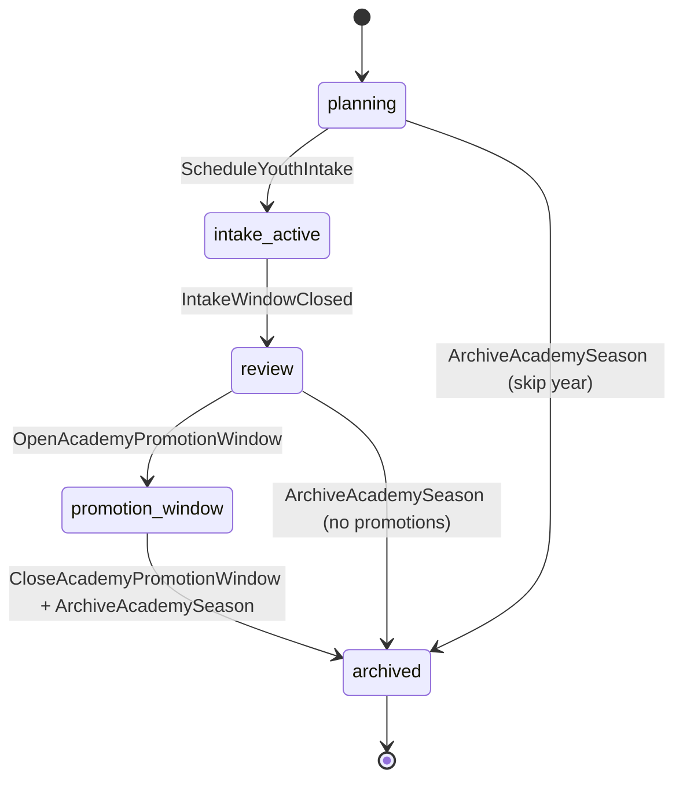
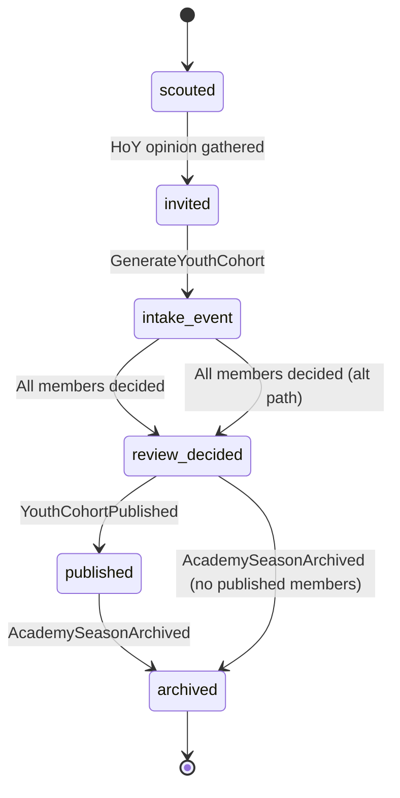
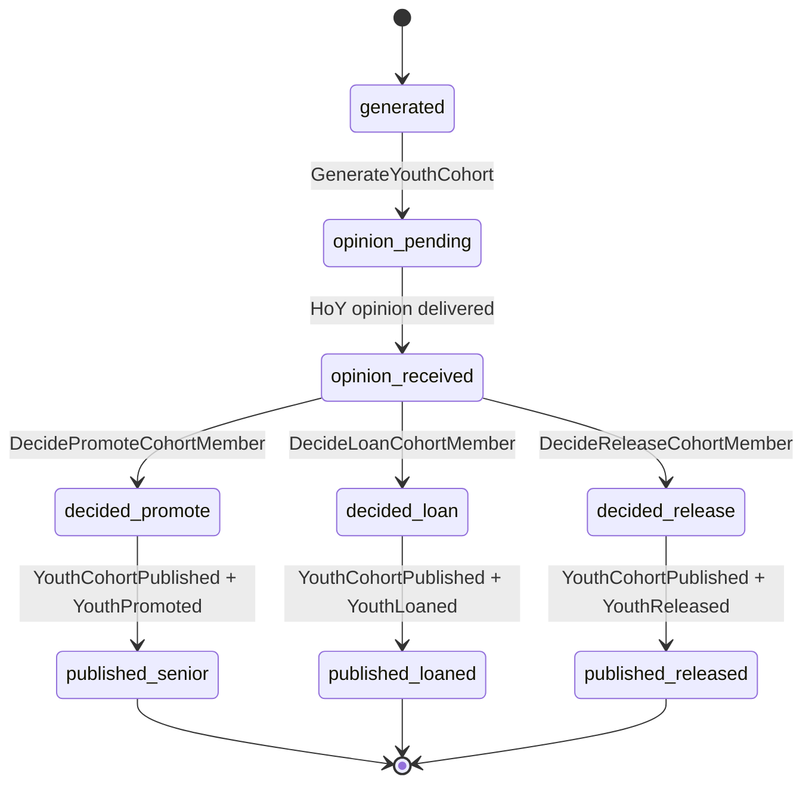
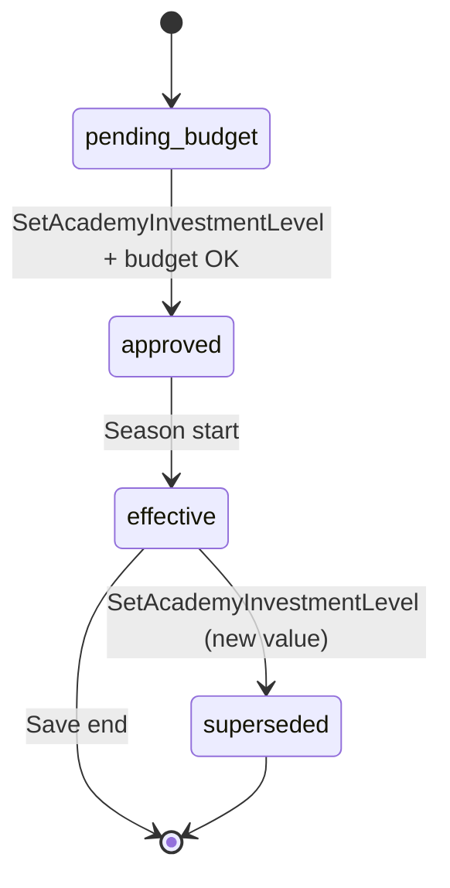

# State Machine - Youth Academy (proposed)

> **Ratified** alongside [[../09-Decisions/ADR-0060-youth-academy-context]]
> (FMX-29; accepted 2026-06-08). This note is the **current** FSM surface that the Youth
> Academy bounded context owns. It becomes binding for implementation when the
> project enters the development phase (`binding: true`).

Youth Academy owns three coordinated state machines per ADR-0060:

1. `AcademySeason` - per-club per-year season cycle.
2. `YouthCohort` - per-club per-intake-year cohort lifecycle.
3. `CohortMember` - per-prospect within a cohort.

Plus a slider-management FSM:

4. `AcademyInvestmentLevel` - per-club per-season slider change-control.

A per-cohort Process Manager / Saga (Vernon canonical long-running-
process pattern, per
[[../../60-Research/youth-academy-bounded-context-2026-05-28]] §F3)
coordinates `AcademySeason` ↔ `YouthCohort` ↔ `CohortMember` and
cross-context interactions with Staff Operations, Squad & Player,
Club Management, Regulations and Manager & Legacy.

## 1. `AcademySeason` states

### State definitions

| State | Meaning |
|---|---|
| `planning` | Season open; investment-slider editable; pre-intake-window |
| `intake_active` | Intake window open per nation; `GenerateYouthCohort` may be issued; intake event UI live |
| `review` | Intake window closed; cohort generated; HoY opinion delivered; promote/loan/release decisions in flight |
| `promotion_window` | Post-season transfer window open per Regulations; eligible cohort members can be promoted; gated by `CurrentTransferWindow` from ADR-0056 |
| `archived` | Season complete; cohort history retained; counters frozen |

### Transition triggers

| From | To | Trigger |
|---|---|---|
| `planning` | `intake_active` | `ScheduleYouthIntake` (per-nation date per GD-0007 §Decided / strong; March in most European nations) |
| `intake_active` | `review` | Intake-window close per `IntakeWindowClosed` (deterministic clock + per-nation editor parameter) |
| `review` | `promotion_window` | `OpenAcademyPromotionWindow` gated by `CurrentTransferWindow` post-season per ADR-0056 |
| `promotion_window` | `archived` | `CloseAcademyPromotionWindow` + `ArchiveAcademySeason` at season-end |
| `review` | `archived` | `ArchiveAcademySeason` if no promotions scheduled |
| `planning` | `archived` | `ArchiveAcademySeason` if year is skipped |

## 2. `YouthCohort` states

### State definitions

| State | Meaning |
|---|---|
| `scouted` | Prospects identified by scout regional coverage; not yet drawn for cohort |
| `invited` | Prospects drawn for cohort via `IntakeRng`; HoY opinion gathered per member |
| `intake_event` | Intake event UI shown; player makes promote / loan / release decision per `CohortMember` |
| `review_decided` | All cohort-member decisions recorded; pending Snapshot publication |
| `published` | `YouthCohortPublished` Snapshot emitted; Squad & Player materialised player records |
| `archived` | Cohort retained in history; AcademySeason archived |

### Cohort-level transitions are deterministic per `IntakeRng(saveId, clubId, year)` sub-label of `WorldRng` per ADR-0018 §3.

## 3. `CohortMember` states

### State definitions

| State | Meaning |
|---|---|
| `generated` | Member generated within cohort via `IntakeRng`; attribute ranges + archetype label drawn |
| `opinion_pending` | HoY opinion query in flight per ADR-0053 Staff Operations effect readiness |
| `opinion_received` | HoY opinion attached: "one to watch" / "long-term project" / etc. per GD-0007 §5 |
| `decided_promote` | Player chose to promote to U-21 / U-19 senior path |
| `decided_loan` | Player chose to loan out (entry to future-scope loan Process Manager) |
| `decided_release` | Player chose to release |
| `published_senior` | Squad & Player materialised senior record from Snapshot |
| `published_loaned` | Squad & Player materialised player record + Transfer queued loan |
| `published_released` | Member released; no Squad & Player record created |

## 4. `AcademyInvestmentLevel` states

### State definitions

| State | Meaning |
|---|---|
| `pending_budget` | Slider change requested; Club Management budget check pending |
| `approved` | Budget approved; will take effect at next season boundary |
| `effective` | Active slider value for current `AcademySeason`; cost posted weekly via `AcademyInvestmentExpensePosted` per ADR-0050 |
| `superseded` | Replaced by new slider value at season boundary |

## 5. Trigger sources

| Trigger | Source |
|---|---|
| `ScheduleYouthIntake` | World tick (League Orchestration `SeasonAdvanced` + per-nation intake-date parameter from save snapshot) |
| `GenerateYouthCohort` | World tick (intake-window date reached) |
| `OpenAcademyPromotionWindow` | World tick (post-season transfer-window open per `CurrentTransferWindow` query against ADR-0056 Regulations) |
| `CloseAcademyPromotionWindow` | World tick (post-season transfer-window close per ADR-0056) |
| `DecidePromoteCohortMember` / `DecideLoanCohortMember` / `DecideReleaseCohortMember` | Player command (intake-event UI in `AcademyCohortBoard` read model) |
| `SetAcademyInvestmentLevel` | Player command + Club Management budget validation |
| `ArchiveAcademySeason` | World tick (season-end) |
| `YouthCohortPublished` | Internal Process Manager Saga transition after all `CohortMember` decisions reached `review_decided` |

## 6. Effect on other contexts

| Event | Consumer | Effect |
|---|---|---|
| `YouthIntakeScheduled` | Notification | Per ADR-0043: queued reminder per club |
| `YouthCohortGenerated` | Notification | Intake event reminder |
| `YouthIntakeEventTriggered` | Notification | Per ADR-0043: high-priority intake-event inbox card |
| `YouthCohortPublished` | Squad & Player | **Snapshot**: materialise player records from cohort composition; attribute ranges + archetype labels copied (canonical Reference + Snapshot pattern from ADR-0055) |
| `YouthCohortPublished` | Training | New player IDs for weekly dev calc per ADR-0018 §1 |
| `YouthPromoted` | Manager & Legacy | Pipeline-quality signal aggregation per GD-0019 archetype hook |
| `YouthLoaned` | Transfer | Loan-orchestration Process Manager entry point: materialises a `proposed` `LoanAgreement` per proposed [[../09-Decisions/ADR-0075-loan-orchestration-process-manager]] / [[loan-orchestration]] (FMX-85) |
| `YouthReleased` | Notification | Released-prospect inbox card |
| `AcademyInvestmentChanged` | Club Management | Budget envelope update |
| `AcademyInvestmentExpensePosted` | Club Management | Ledger entry per ADR-0050 (Customer-Supplier + ACL pattern) |
| `HomeGrownShareRecalculated` | Regulations & Compliance | `SquadRegistrationCheck` Anticorruption Layer per ADR-0056 Tax-catalog pattern |
| `HomeGrownShareRecalculated` | Manager & Legacy | Optional archetype hook signal |
| `YouthPipelineQualityUpdated` | Manager & Legacy | GD-0019 archetype hook signal aggregation |
| `YouthPipelineQualityUpdated` | Fan Ecology | Fan-attachment signal (academy pride + local-talent identity) |
| `AcademySeasonArchived` | Notification | Season-summary inbox card |

## 7. Persistence model

Per-save schema (`save_<uuidv7hex>`) per ADR-0027. Drizzle tables:

- `youth_academy_season` (academy_season_id PK, club_id, year, state, intake_date, post_season_window_start, post_season_window_end, investment_level_id_fk, created_at, updated_at).
- `youth_cohort` (cohort_id PK, academy_season_id_fk, club_id, state, generated_at, published_at, archived_at).
- `youth_cohort_member` (cohort_member_id PK, cohort_id_fk, prospect_id, state, archetype_label, attribute_ranges_jsonb, hoy_opinion, decision, decided_at, published_at).
- `academy_investment_level` (investment_level_id PK, club_id, season_year, junior_coaching_tier, youth_recruitment_tier, facilities_tier, state, weekly_cost_amount, created_at, updated_at).
- `academy_productivity_counter` (club_id PK, audit_window_year PK, productivity_score, last_recomputed_at).
- `academy_home_grown_share_counter` (club_id PK, save_scope_competition_id PK, share_value, last_recomputed_at).

Indexes per ADR-0027: `(club_id, year)` on academy_season; `(cohort_id, state)` on cohort_member; `(club_id, audit_window_year)` on productivity counter.

## 8. Failure / recovery cases

| Failure | Recovery |
|---|---|
| HoY opinion request times out (Staff Operations slow) | Process Manager retries; falls back to default opinion ("no comment") after N retries; logged for analyst review |
| Budget rejection on `SetAcademyInvestmentLevel` | Slider stays at previous value; `pending_budget` aborts; Notification surfaces rejection |
| `YouthCohortPublished` Snapshot write fails | Process Manager rolls back per-member `published_*` states; retry via outbox per ADR-0028 |
| Promotion window opens but cohort `intake_event` not yet `review_decided` | Process Manager blocks promotion until all members decided; intake-event UI surfaces "X members pending" |
| Save snapshot missing seed data on save creation | Per ADR-0051: skipped; cohort generation runs from default per-nation parameters |
| RNG sub-label collision | Forbidden by ADR-0018 §3; deterministic golden test fails at CI |

## 9. Test strategy

- **Deterministic golden tests**: for `IntakeRng(saveId, clubId, year)` cohort generation given fixed seed + HoY skill + scout coverage → known cohort composition.
- **Statistical envelope tests**: over N seasons + N clubs, the distribution of cohort PA / archetype / position spread matches design ranges per GD-0007.
- **FSM property tests**: every reachable state has at least one path back to `archived`; no orphan states; no transitions outside the defined matrix.
- **Process Manager retry / compensation tests**: HoY timeout, budget rejection, Snapshot publication failure.
- **Cross-context contract tests**: `YouthCohortPublished` Snapshot consumed by Squad & Player matches schema; `AcademyInvestmentExpensePosted` consumed by Club Management ledger matches ADR-0050 contract; `HomeGrownShareRecalculated` consumed by Regulations matches ADR-0056 contract.
- **Determinism tests**: replaying same save snapshot + same world ticks produces identical cohort + member + promotion state.
