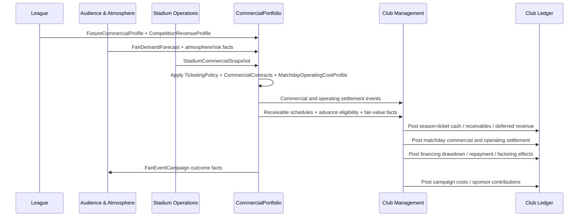

# Club Economy Commercial Contracts - Draft Contracts

## Purpose

Define the contract surface implied by FMX-41 before code exists. This note
extends [[club-economy-accounting-ledger]] with ticketing, fan-demand
elasticity, season-ticket lifecycle accounting, commercial contracts, cup
settlement, fan-event campaigns and Investor entitlement inputs. FMX-44 adds
the shared commercial contract lifecycle, obligation, exclusivity and breach
surface for sponsorship, catering, merchandise, hospitality, suppliers and
venue activations. FMX-45 refines `CompetitionRevenueProfile` and cup
settlement so domestic and continental fixtures can produce hard cash,
receivables, future EV and elimination shock without copying real-world
licensed competitions. FMX-46 adds `MatchdayOperatingCostProfile` and
risk-cost settlement for stewarding, security, policing-style contribution,
medical, cleaning, energy, temporary staff, pitch recovery, insurance,
restrictions and sanctions.

FMX-78 / ADR-0070 ratifies the League -> CommercialPortfolio published language for
`FixtureCommercialProfile` and `CompetitionRevenueProfile`: League publishes
stable fixture/competition commercial rule facts; CommercialPortfolio stores
consumer-owned projections and composes them with Rivalry, Audience & Atmosphere,
Stadium Operations, Regulations and Match/Calendar facts.

FMX-48 turns fan-service campaigns into an explicit `FanEventCampaign`
lifecycle and campaign catalog with travel, family/community, choreo/dialogue,
beverage reward and digital activation variants.

FMX-49 adds commercial financing facts for sponsor/media advances and
receivable factoring. CommercialPortfolio owns the contract amendment,
cash-versus-recognition schedule, receivable schedule, contract-liability and
fair-value evidence; Club Management owns the actual financing facility,
drawdown, covenant, insolvency and ledger-posting decisions.

FMX-187 / ADR-0128 adds the receiver-security gate before future
payment/control webhooks can influence this contract surface: provider proof
verification, raw-body preservation, delivery/event dedupe, business-object
idempotency, reconciliation and pentest evidence are required before
`InvestorEntitlementGrant` can be driven by webhook input.

This is draft planning only. It becomes implementation authority only after the
relevant GDDR/ADR path is approved.

## Ownership rule

Per accepted ADR-0058 and ADR-0061, CommercialPortfolio owns:

- ticketing policies and season-ticket campaigns;
- commercial contract portfolio for sponsorship, catering, merchandise,
  hospitality, supplier and venue-activation contracts;
- fan-event campaign choices and budgets;
- commercial forecasts and per-fixture commercial/operating settlement;
- commercial receivable schedules, advance eligibility, contract-liability and
  fair-value facts;
- Investor entitlement grant policy in singleplayer.

Club Management owns:

- finance ledger posting for all commercial outcomes;
- budget envelopes, board pressure and insolvency state;
- in-world financing facilities and liquidity actions.

Other domains provide facts through contracts. They do not write commercial
state or ledger entries directly.

## Contract sketches

### `FanDemandForecast`

Owned by Audience & Atmosphere, consumed by CommercialPortfolio.

| Field | Meaning |
|---|---|
| `clubId` | Club receiving demand. |
| `fixtureId` | Optional fixture scope; absent for season forecast. |
| `forecastHorizon` | Match, week, campaign or season. |
| `segmentDemand` | Per-segment latent demand, actual forecast and confidence band. |
| `attendanceFloorBySegment` | Minimum expected attendance share before severe trust/identity shocks. |
| `priceSensitivityBySegment` | Low/medium/high/very-high response shape by segment. |
| `referencePriceBySeatClass` | Country/club/seat-class baseline for fairness comparisons. |
| `ticketingTrustState` | Supporter trust in pricing policy and recent price-change memory. |
| `fixtureAttractiveness` | Opponent, rivalry, stakes, form, stars, novelty, kickoff and weather profile. |
| `capacityPressure` | Underfilled, balanced, constrained or sold-out latent-demand state. |
| `seasonTicketRenewalProbability` | Renewal probability by segment and seat class. |
| `seasonTicketUtilisationProbability` | Aggregate attendance / release probability for season-ticket cohorts. |
| `waitlistPressure` | Scarcity and conversion pressure by segment and seat class. |
| `cateringPropensity` | Per-segment spend propensity band. |
| `merchandisePropensity` | Per-segment spend propensity band. |
| `hospitalityDemand` | Corporate/premium demand band. |
| `sponsorCategoryFit` | Fit/risk by sponsor category. |
| `boycottRisk` | Segment-driven demand shock risk. |
| `provenance` | Source facts and freshness. |

Calculation contract:

- price response is applied to latent demand before stadium capacity is
  allocated;
- if latent demand exceeds capacity, price changes may affect segment mix,
  revenue and trust even when attendance stays full;
- season-ticket demand and single-ticket demand are separate curves;
- ticketing trust primarily affects future renewal, boycott risk, atmosphere
  and sponsor fit rather than only the current fixture;
- country profile, club DNA and fan-segment mix provide ranges, never final
  balance constants.

### `FixtureCommercialProfile`

Produced by League Orchestration from immutable fixture state and the active
competition revenue profile. It carries stable fixture/competition commercial
rule facts only. CommercialPortfolio composes it with separate Rivalry, Audience
& Atmosphere, Stadium Operations, Regulations and weather/calendar facts before
settlement.

| Field | Meaning |
|---|---|
| `fixtureId` | Fixture identity. |
| `fixtureCommercialProfileVersion` | Immutable profile version used for settlement evidence. |
| `competitionSeasonId` | Competition-season edition that owns the fixture. |
| `competitionRevenueProfileVersion` | Active competition-revenue profile version used to derive rule slices. |
| `fixtureKind` | League, cup, playoff, friendly, continental or final. |
| `homeClubId` / `awayClubId` | Participating clubs. |
| `round` / `matchday` / `scheduledDate` | Calendar placement copied from `FixturesPublished`. |
| `stageBand` / `roundBand` | League-owned competition stage and round classification. |
| `tieShape` | Single tie, two-leg tie, replay, league phase or neutral final. |
| `legNumber` / `aggregateTieId` | Two-leg and aggregate-tie linkage. |
| `isReplay` / `isNeutralVenue` / `isFinal` | Fixture-shape flags that change settlement rules. |
| `organizerKind` | Home club, league, association or confederation analogue. |
| `hostClubId` | Host club when a club is responsible for the event; null for central neutral events. |
| `venueResponsibilityKind` | Club-hosted, central-hosted, leased-neutral or shared. |
| `ticketingOperatorKind` | Who operates ticketing for this fixture. |
| `commercialInventoryPolicy` | Local versus central commercial inventory ownership. |
| `gateSharingRuleSnapshot` | Fixture-specific gate-share rule copied from the competition profile. |
| `netReceiptsDefinitionSnapshot` | Deductions and net-receipts basis for this fixture. |
| `ticketAllocationRuleSnapshot` | Home/away/neutral/final allocation rule for this fixture. |
| `fixturePrizeTrigger` | Whether this fixture can trigger participation, result or progression prizes. |
| `facilityFeeTrigger` | Live-selection or facility-fee trigger class. |
| `broadcastSelectionBand` | Competition-owned broadcast/commercial selection class. |
| `paymentTrigger` | Match played, round completed, season completed or final audit. |
| `recognitionTrigger` | Accrual trigger used by CommercialPortfolio. |
| `settlementDueRule` | Profile-level settlement timing for fixture-derived payments. |
| `postponementHandling` / `abandonmentHandling` | Commercial treatment of postponed or abandoned fixtures. |
| `commercialSettlementAttachmentKey` | CommercialPortfolio key for the per-fixture settlement projection. |
| `operatingCostAttachmentKey` | CommercialPortfolio key where `MatchdayOperatingCostSummary` attaches for background-fast simulation. |
| `qualityProfileClass` | Background-fast, standard or expert settlement envelope class. |
| `provenance` | Source facts, profile version and freshness. |

Excluded from the League-owned profile: `rivalryTier`, `opponentDrawPower`,
`starPullBand`, `homeFormBand`, `weatherBand`, `awayDemandBand`,
`atmosphereMultiplier`, `boycottRisk` and final demand/cost figures. Those are
separate consumer facts owned by their contexts.

### `StadiumCommercialSnapshot`

Owned by Stadium Operations, read by commercial and operating settlement.

| Field | Meaning |
|---|---|
| `stadiumId` | Venue identity. |
| `capacityBySeatClass` | Standing, seated, family, premium, suites, accessibility and away. |
| `availableCapacityBySeatClass` | After construction, sanctions, accessibility rules and away allocations. |
| `seasonTicketEligibleCapacityBySeatClass` | Home inventory that may be sold as season tickets after protected allocations. |
| `cateringThroughput` | Service capacity and queue quality. |
| `merchThroughput` | Shop and fulfilment capacity. |
| `hospitalityQuality` | Premium service band. |
| `fanZoneQuality` | Dwell-time and activation band. |
| `ownershipModel` | Owned, leased, municipal, ground-share. |
| `fixedOperatingCost` | Weekly venue cost range. |
| `matchdayVariableCostBands` | Venue operating cost bands for routine through high-risk fixtures. |
| `stewardingDensityBand` | Baseline and risk-tier staffing density. |
| `securityCapabilityBand` | Search, segregation, surveillance and control capability. |
| `medicalEmergencyCapacity` | First-aid, ambulance, doctor and heat/water readiness band. |
| `cleaningWasteCostBand` | Cleaning, waste and sanitation cost band. |
| `energyUtilityCostBand` | Floodlight, heating/cooling, water and technical-system cost band. |
| `pitchCondition` | Pitch health and recovery-cost risk. |
| `awaySeparationConstraints` | Segregation, ingress/egress and away-sector constraints. |
| `eventEligibility` | Concert, conference, community/fan event tags. |

### `TicketingPolicy`

Owned by CommercialPortfolio.

| Field | Meaning |
|---|---|
| `policyId` | Policy identity. |
| `seasonTicketShareTarget` | Target share by seat class. |
| `seasonTicketDiscountBand` | Discount versus comparable single-ticket basket. |
| `seasonTicketLifecyclePolicy` | Campaign states and windows: renewal, relocation, presale, waitlist, public sale and closed. |
| `seasonTicketAccountingPolicy` | Accrual recognition mode and match-allocation basis. |
| `singleTicketPriceBands` | Price ranges by seat class. |
| `topMatchSurchargePolicy` | Off, cautious, market, premium. |
| `dynamicPricingMode` | Disabled, categories-only, bounded-dynamic or experimental. |
| `pricingTransparencyPolicy` | How clearly price changes and categories are communicated. |
| `seasonTicketProtectionRule` | Rules preserving season-ticket value versus single-ticket promotions. |
| `seatRelocationPolicy` | Eligibility and priority for moving seats between renewal and new sale. |
| `memberPresalePolicy` | Member, fan-group and loyalty-tier access before public sale. |
| `waitlistPolicy` | Waitlist eligibility, offer order, offer expiry and pressure output. |
| `paymentPlanPolicy` | Upfront, internal instalment, finance partner and account-credit handling. |
| `useItOrReleasePolicy` | Aggregate utilisation target, no-show consequences and seat-release incentive. |
| `officialExchangePolicy` | Club-controlled release/exchange rules and credit treatment; not a free secondary marketplace. |
| `groupCompensationPolicy` | Credit/refund/discount treatment for cancelled or inaccessible included matches. |
| `concessionPolicy` | Youth/family/senior/community rules. |
| `awayAllocationPolicy` | Allocation and pricing rules. |
| `fanTrustGuardrail` | Max tolerated price shock by segment. |
| `effectiveFromWeekId` | Deterministic activation. |

### `SeasonTicketCampaign`

Owned by CommercialPortfolio. Operates on fan-group cohorts, not individual
supporters.

| Field | Meaning |
|---|---|
| `campaignId` | UUIDv7 identity. |
| `clubId` | Club running the campaign. |
| `seasonId` | Season scope. |
| `policyId` | Linked `TicketingPolicy`. |
| `campaignState` | planning, renewalWindow, seatRelocation, memberPresale, waitlistAllocation, publicSale, closed, inSeasonAdjustment or renewalReview. |
| `includedFixturePolicy` | League-only, league-plus-defined-cup, premium package or profile-specific product. |
| `seatClassQuotas` | Standing, seating, family, premium, suites/hospitality and accessibility. Away inventory is excluded. |
| `targetShareBySeatClass` | Target season-ticket share by seat class. |
| `discountVsSingleTicketBasketBand` | Discount against a comparable single-ticket basket. |
| `renewalWindow` | Start/end week and communication policy. |
| `earlyBirdWindow` | Optional early-bird or loyalty-protection period. |
| `seatRelocationWindow` | Relocation eligibility and priority. |
| `memberPresaleWindow` | Member, loyalty-tier or fan-group sale period. |
| `waitlistPolicy` | Ordering, eligibility, expiry and waitlist-pressure output. |
| `paymentPlanPolicy` | Upfront, internal instalment, finance partner and account-credit handling. |
| `loyaltyTierPolicy` | Renewal rights, attendance minimums, priority windows and benefit bands. |
| `fanGroupEligibilityPolicy` | Protected group-level access rules without single-fan modelling. |
| `useItOrReleasePolicy` | Aggregate no-show threshold, release incentives and renewal consequence band. |
| `groupCompensationPolicy` | Credit/refund/discount treatment for group-level access failures. |
| `allocationOutcome` | Sold seats and unmet demand by segment, package and seat class. |
| `accountingScheduleId` | Linked `SeasonTicketAccountingSchedule`. |
| `trustGuardrail` | Price-shock and fairness limits from Audience & Atmosphere / country profile. |
| `provenance` | Forecasts, stadium snapshot, fixture set and policy versions used. |

### `SeasonTicketAccountingSchedule`

Owned by CommercialPortfolio as an accrual/recognition schedule; Club
Management posts the resulting ledger entries. It distinguishes cash receipt,
receivables, deferred revenue and match-by-match recognition.

| Field | Meaning |
|---|---|
| `scheduleId` | UUIDv7 identity. |
| `campaignId` | Linked season-ticket campaign. |
| `cashReceiptPlan` | Expected and actual receipts by week/payment method. |
| `instalmentReceivableMinor` | Club-owned instalment receivables. |
| `financePartnerFeeMinor` | Fee/cost where a finance partner funds the supporter. |
| `grossConsiderationMinor` | Total ticket consideration before credits and fees. |
| `accountCreditAppliedMinor` | Existing credits applied against renewal. |
| `deferredRevenueMinor` | Remaining contract liability for future included matches. |
| `recognizedRevenueByMatch` | Revenue released as each included match is played. |
| `remainingPerformanceObligations` | Included matches / access benefits still owed. |
| `creditLiabilityMinor` | Exchange, compensation or carried credit pool. |
| `refundLiabilityMinor` | Cash refund pool where policy/profile requires it. |
| `materialRightLiabilityMinor` | Optional hook for cup priority rights or renewal discounts. |
| `recognitionPolicy` | Equal per included match, seat-class weighted, package weighted or profile-specific. |
| `adjustmentEvents` | Cancellations, relocations, sanctions, cup opt-ins and package amendments. |

### `CommercialContract`

Owned by CommercialPortfolio.

| Field | Meaning |
|---|---|
| `contractId` | UUIDv7 identity. |
| `contractVersion` | Version number; amendments and renewals create new versions and keep the old version in history. |
| `contractKind` | sponsorship, catering, merchandise, hospitality, supplier or venue-activation. |
| `lifecycleState` | draft, offered, negotiating, active, renewalDue, breached, suspended, terminated or expired. |
| `counterpartyProfileId` | Fictional generated partner profile. |
| `assetPackage` | Rights granted: shirt, sleeve, stand, shop, pouring rights, hospitality area, digital inventory, fan-zone slot, etc. |
| `term` | Start/end week, renewal window, option periods and break clauses. |
| `cashSchedule` | Upfront, monthly, seasonal, matchday, milestone or arrears payments. |
| `recognitionSchedule` | Revenue/cost recognition period and performance-obligation basis. |
| `commercialModel` | Fixed fee, revenue share, royalty, minimum guarantee, management fee, lease/rent, supplier rebate or hybrid. |
| `fixedGuaranteeMinor` | Guaranteed amount, if any. |
| `minimumGuaranteeMinor` | Minimum annual / seasonal guarantee to true up against share/royalty. |
| `revenueShareBps` | Share rate in basis points, if any. |
| `costShareBps` | COGS/staffing split, if any. |
| `royaltyBps` | Merchandise/licence royalty, if any. |
| `exclusivityScope` | Category, territory, asset scope and carve-outs. |
| `obligationSchedule` | Club and counterparty obligations, due windows and fulfilment state. |
| `serviceLevelPolicy` | Queue, stockout, open-stand, fulfilment, hospitality or quality thresholds. |
| `performanceBonuses` | Promotion, cup, table, reach or attendance triggers. |
| `penaltyPolicy` | Fee reduction, make-good, cash penalty, suspension or termination rule. |
| `breachPolicy` | Severity, cure window, repeat threshold and termination rights. |
| `renewalPolicy` | First negotiation, first refusal, auto-renew, matching right or open-market policy. |
| `fanFitRisk` | IP-clean category risk and segment reaction band. |
| `reputationRisk` | Counterparty, club and regulatory scandal hooks. |
| `portfolioDependencies` | Conflicts or dependencies with other active contracts. |
| `aiDecisionHints` | Read-only factors for FMX-51 AI club behaviour; not AI behaviour itself. |
| `auditTrail` | Event log with actor, event type, week and summary payload. |
| `provenance` | Source forecasts, snapshots and policy versions used. |

Shared lifecycle:

```text
draft -> offered -> negotiating -> active -> renewalDue -> expired
                                   active -> breached -> active
                                   breached -> suspended -> terminated
                                   active -> terminated
```

`renewed` is an event, not a long-lived state: it creates a successor
`contractVersion` and returns the contract to `active`.

Shared breach severities:

| Severity | Meaning | Default game consequence |
|---|---|---|
| `curable` | Minor missed obligation, late report, one missed activation, small stockout. | Cure timer, make-good option, small fan/service hit. |
| `material` | Repeated SLA failure, missed guarantee payment, exclusivity conflict, serious fulfilment miss. | Penalty, fee reduction, suspended rights, renegotiation and trust impact. |
| `critical` | Fraud, regulatory ban, severe safety/health incident, major scandal or persistent uncured material breach. | Termination for cause, damages/repayment, reputation shock and category cooldown. |

Family schedules:

| Family | Family-specific schedule |
|---|---|
| Sponsorship | Asset inventory, category exclusivity, activation obligations, appearance/digital deliverables, morals/reputation hooks. |
| Catering | POS/opening rules, queue/stockout/waste/service SLAs, supplier mandates, alcohol/food policy. |
| Merchandise | Royalty/MAG, channel scope, stock/returns risk, campaign drops, fulfilment SLA. |
| Hospitality | Seat/package inventory, service level, minimum spend/headcount, premium quality, sponsor overlap. |
| Supplier | Mandatory supplier, rebates, volume targets, equipment support, exclusivity carve-outs. |
| Venue activation | Event rights, staffing, safety, sponsor contribution, fulfilment model, cancellation policy. |

### Commercial financing facts (FMX-49)

CommercialPortfolio publishes financing-relevant facts; it does not open debt,
draw facilities, restructure obligations or decide insolvency actions. Club
Management consumes these facts when the player or board accepts a financing
tool.

| Fact | Fields | Consumer rule |
|---|---|---|
| `CommercialReceivableSchedulePublished` | `contractId`, `receivableId`, `counterpartyProfileId`, `dueWeekId`, `grossAmountMinor`, `recognitionState`, `cashCollectionRisk`, `assignableFlag`, `recourseRestriction`, `provenance`. | Club Management can offer factoring only against assignable receivables and must model derecognition vs retained-risk accounting explicitly. |
| `CommercialAdvanceEligibilityPublished` | `contractId`, `contractKind`, `counterpartyKind`, `maxAdvanceMinor`, `discountOrFeeBandBps`, `remainingPerformanceObligations`, `cashScheduleImpact`, `recognitionScheduleImpact`, `regulatoryFlags`, `fairValueRequired`, `provenance`. | Club Management can show sponsor/media advance options without mutating commercial ownership. |
| `CommercialContractLiabilityPublished` | `contractId`, `contractVersion`, `deferredRevenueMinor`, `remainingPerformanceObligations`, `refundOrMakeGoodExposureMinor`, `advanceRelatedFlag`, `recognitionPolicy`. | Club Management can explain why upfront cash improves runway but does not become earned revenue immediately. |
| `CommercialFairValueAssessed` | `contractId`, `relatedPartyFlag`, `marketComparableBand`, `aboveMarketAmountMinor`, `regulatoryTreatment`, `auditConfidence`, `sourceProfile`. | Regulations and Club Management can apply UEFA/league-style controls to advances or owner-related commercial deals. |

Rules:

- sponsor and media advances are commercial contract amendments first, then
  Club-owned financing actions;
- factoring a commercial receivable consumes the receivable schedule and posts
  cash/fee/accounting treatment through Club Management;
- fair-value and related-party flags are facts for compliance; they do not imply
  the singleplayer Investor entitlement path;
- media advances remain hook-only until Nico explicitly promotes them beyond
  `CommercialAdvanceEligibilityPublished`.

### Catering and merchandise operations (FMX-47)

FMX-47 deepens the catering and merchandise families beyond a flat
`revenueShareBps`/`costShareBps` into an explicit operations + inventory side.
CommercialPortfolio settles each fixture/period; Club Management posts the ledger
entry (ADR-0050 single-writer; ADR-0061 ownership). Numbers are calibration
ranges, not constants. Source: [[../60-Research/catering-and-merchandise-operations-2026-06-01]].

`operatingModel` (per catering/merch contract) decides risk allocation:

| Family | `operatingModel` values | Who bears stock/inventory + fulfilment risk |
|---|---|---|
| Catering | `inHouse`, `concessionLease`, `managementFee`, `revenueShare`, `magPlusShare` | Club (`inHouse`, `managementFee`) vs operator (others) |
| Merchandise | `ownStoreEcom`, `licensedPartner`, `kitSupplierGuarantee`, `pureLicensing` | Club (`ownStoreEcom`) vs partner/manufacturer/licensee (others) |

Operations fields added to the catering/merch schedules:

| Field | Meaning |
|---|---|
| `operatingModel` | Risk-allocation model above; drives which cost/inventory lines apply. |
| `cogsBps` | Cost of goods sold band (catering blended ~23-32%; merch kit 35-45%). |
| `labourOpexBps` | Catering staffing + other opex band (in-house/management-fee only). |
| `wasteRateBps` | Catering spoilage band (~3-5% of food COGS normal, higher on shock). |
| `perCapitaBand` | Catering spend-per-attendee band before capacity/stockout cap. |
| `serviceCapacity` | Throughput cap (`transactions_per_min × window × basket`) from Stadium snapshot. |
| `stockPlan` | Merch planned stock buy vs demand forecast; lead-time + size/SKU split. |
| `demandMultipliers` | Merch spike factors: kit launch (~3-5×), icon signing (~1.3-1.5×), cup-final (~1.1-1.3×), promotion/trophy. |
| `markdownPolicy` | Merch season-end markdown (30-70%) + write-down-to-NRV rule (IAS 2). |
| `returnsRateBps` | E-commerce apparel returns band (~15-25%) + net return cost. |
| `fulfilmentSla` | Merch dispatch/delivery SLA + per-order fulfilment cost. |
| `alcoholPolicy` | Catering `inBowl` / `concourseOnly` / `nearBan` dial (revenue↔safety; links FMX-53 country profile). |
| `supplierMandate` | Pouring-rights / must-buy / ranging constraints + category exclusivity carve-outs (reuses `exclusivityScope`). |

Settlement separates the ledger lines (named in ADR-0050): revenue, COGS,
labour/opex, royalty/MAG true-up, guarantee shortfall, waste/spoilage and stock
write-down — never a single net number. Cash-vs-recognition follows IFRS 15 per
`operatingModel` (POS at sale; concession rent straight-line; revenue-share as
concessionaire sales occur; royalty under the sales-based royalty exception; MAG
straight-line with overage true-up only above the floor).

Additional operations events that must be representable:

- `MatchdayCateringSettled` (revenue + COGS + labour + waste lines)
- `CateringStockoutRecorded` (lost demand + satisfaction penalty to Audience & Atmosphere)
- `CateringWastePosted`
- `MerchandiseStockPlanCommitted`
- `MerchandiseSalesSettled` (full-price + spike lines)
- `MerchandiseMarkdownApplied`
- `MerchandiseStockWrittenDown`
- `MerchandiseReturnsSettled`
- `CommercialRoyaltyTrueUpRecognised`
- `CommercialGuaranteeShortfallRecognised`

Contract events that must be representable before implementation:

- `CommercialOfferCreated`
- `CommercialOfferIssued`
- `CommercialContractActivated`
- `CommercialContractAmended`
- `CommercialRenewalWindowOpened`
- `CommercialContractRenewed`
- `CommercialContractExpired`
- `CommercialObligationMissed`
- `CommercialExclusivityConflictDetected`
- `CommercialBreachOpened`
- `CommercialBreachCured`
- `CommercialMakeGoodGranted`
- `CommercialPenaltyApplied`
- `CommercialContractSuspended`
- `CommercialContractTerminated`
- `CommercialContractSuperseded`

### `CompetitionRevenueProfile`

Published by League Orchestration for a competition-season edition and consumed
through CommercialPortfolio's ACL. CommercialPortfolio owns accrual, settlement,
forecast interpretation and ledger-facing event emission; League owns the
competition rule/cadence facts.

| Field | Meaning |
|---|---|
| `competitionRevenueProfileId` | Profile identity. |
| `competitionRevenueProfileVersion` | Immutable profile version used for audit and settlement evidence. |
| `competitionId` | Fictional competition identity. |
| `competitionSeasonId` | Season edition the profile applies to. |
| `seasonId` | Calendar season identity. |
| `countryProfileId` | Country/profile scope. |
| `competitionKind` | domesticLeague, domesticCup, leagueCup, superCup, playoff, continentalCup, friendly or finalSeries. |
| `organizerKind` | Club-hosted, league-hosted, association-hosted or confederation-hosted analogue. |
| `commercialRightsModel` | Club-local, centralized or hybrid commercial rights. |
| `mediaRightsModel` | None, central pool, facility fee or hybrid. |
| `prestigeBand` | local, national, major, continentalLower, continentalMajor or global. |
| `prizeSchedule` | Participation, win/progression, finalist/winner, league-phase, ranking and solidarity bands. |
| `participationRules` | Entry/appearance rules and guaranteed participation payment hooks. |
| `performanceBonusRules` | Win/draw/performance bonus rule family. |
| `progressionBonusRules` | Round reached, qualification or advancement rule family. |
| `winnerRunnerUpRules` | Finalist/winner payout rule family. |
| `defaultGateSharingByStage` | Stage-specific gross/net basis, deductions, home/away/organizer shares, levy/pool and expense caps. |
| `netReceiptsDefinition` | Deductions that define net receipts for shared-gate fixtures. |
| `ticketAllocationByStage` | Away quota, finalist allocation, neutral venue split, sponsor/partner allocation and protected supporter quotas. |
| `mediaDistributionRule` | Central pool, value/legacy, merit/performance and equal-share rule family. |
| `facilityFeeRule` | Live-selection or broadcast-facility payment rule family. |
| `paymentCadence` | Payment triggers and instalment cadence. |
| `settlementDelay` | Cash timing and receivable risk by revenue family. |
| `recognitionPolicy` | When revenue is receivable, cash, accrued or forecast-only. |
| `neutralVenueRule` | Host body, allocation split, central hospitality, club share and final travel. |
| `replayOrTwoLegRule` | Replay, extra-time, penalties and two-leg rules by round. |
| `sponsorBonusTriggerRules` | Round reached, televised tie, final, upset, trophy or continental qualification. |
| `fixtureCongestionRule` | Rest-day pressure, travel load, training opportunity cost, fatigue/injury hooks. |
| `forecastPolicy` | Expected future-round value, progression probability source, confidence band and elimination shock. |
| `solidarityRule` | Amateur/lower-tier, qualifying, non-participant or parachute-style support. |
| `communityOverridePolicy` | Which fields community packs may override and required provenance. |
| `ipCleanSourceProfile` | Fictional template family used as inspiration, never a licensed clone. |
| `provenance` | Source facts, research note, profile version and effective season. |

Draft IP-clean preset families:

| Family | Use |
|---|---|
| `central-round-domestic-cup` | DFB-like central round payments, no replay, neutral final and home-tie windfalls. |
| `shared-gate-underdog-cup` | FA-like prize ladder, net-gate sharing, live facility fees and replay/neutral rules. |
| `federation-hosting-cup` | RFEF-like lower-tier hosting, federation aid and late two-leg option. |
| `seeded-elite-entry-cup` | Lega-like elite later entry, central media and compact late-round value. |
| `solidarity-amateur-cup` | FFF-like amateur aid, travel/referee support and grassroots cup identity. |
| `continental-value-pillar-cup` | UEFA-like equal share, performance, ranking/progression, value/legacy and solidarity pools. |

Settlement events that must be representable:

- `CompetitionPrizeReceivableRecorded`
- `CompetitionPrizeCashReceived`
- `CupGateShareSettled`
- `CupMediaFacilityFeeSettled`
- `CupTravelCostPosted`
- `CupSecurityCostPosted`
- `CupSponsorBonusTriggered`
- `CupMerchandiseSpikePosted`
- `CupNeutralVenueAllocationSettled`
- `CupForecastUpdated`
- `CupEliminationForecastShockRecorded`

### `MatchdayOperatingCostProfile`

Owned by CommercialPortfolio as the per-fixture operating settlement profile.
It consumes facts from Stadium Operations, Audience & Atmosphere, Rivalry
System, Regulations & Compliance, League/Competition and Matchday Event Engine.
Club Management posts ledger entries only after settlement events are emitted.

| Field | Meaning |
|---|---|
| `profileId` | Profile identity and version. |
| `fixtureId` | Fixture scope. |
| `venueId` | Stadium Operations venue identity. |
| `competitionId` | League/Competition profile reference. |
| `countryProfileId` | Country or abstract fallback profile. |
| `riskTier` | routine, guarded, elevated, highRisk, restricted or closedDoor. |
| `riskDrivers` | Rivalry, away support, kickoff, weather, stakes, incident memory, sanctions and venue state. |
| `attendanceBand` | Expected attendance / open-sector band used for variable costs. |
| `awayFanBand` | Away allocation, travel pressure and segregation pressure. |
| `openSectorPlan` | Which home/away/premium/family/accessibility sectors are open or closed. |
| `stewardingRule` | Stewarding baseline and risk multiplier. |
| `securityRule` | Search, segregation, private-security and surveillance rule. |
| `policingContributionRule` | None, footprint-limited, shared, high-risk contribution or competition-hosted. |
| `medicalEmergencyRule` | First-aid, ambulance, doctor, heat/water and emergency-service profile. |
| `cleaningWasteRule` | Cleaning, waste and sanitation cost rule. |
| `energyUtilityRule` | Floodlight, heating, cooling, water and technical-system cost rule. |
| `temporaryStaffRule` | Turnstile, retail, catering, hospitality, fan-zone and contractor staffing rule. |
| `officialsRule` | Match official, VAR/technical and competition-operations cost/levy rule. |
| `pitchRecoveryRule` | Weather, pitch condition, turf quality and event-density recovery rule. |
| `insuranceComplianceRule` | Seasonal overhead allocation and inspection/risk-history modifier. |
| `damageReserveRule` | Property, transport, cleanup and supporter-incident reserve rule. |
| `restrictionRule` | Alcohol, away-fan, sector, ghost-match and public-order constraints. |
| `mitigationOptions` | Security upgrade, fan dialogue, alcohol restriction, away cap, water/medical upgrade, pitch prep. |
| `forecastCostBand` | Quick/Standard visible expected operating-cost range. |
| `settlementDelay` | Matchday, post-match disciplinary delay or monthly allocation. |
| `provenance` | Source facts, profile version, confidence and research/source note. |

Risk tiers:

| Tier | Meaning |
|---|---|
| `routine` | Normal fixture, no special public-order signal. |
| `guarded` | Attendance, away demand, kickoff or weather needs visible planning. |
| `elevated` | Rivalry, cup stakes, incident memory or away-travel pressure. |
| `highRisk` | High/volatile rivalry or regulator/police high-risk classification. |
| `restricted` | Alcohol ban, away cap/ban, sector closure or special entry controls. |
| `closedDoor` | Ghost match / behind-closed-doors sanction. |

Settlement events that must be representable:

- `MatchdayOperatingCostForecasted`
- `MatchdayStewardingCostPosted`
- `MatchdaySecurityCostPosted`
- `MatchdayPoliceContributionPosted`
- `MatchdayMedicalEmergencyCostPosted`
- `MatchdayCleaningWasteCostPosted`
- `MatchdayEnergyCostPosted`
- `MatchdayTemporaryStaffCostPosted`
- `MatchdayOfficialsCostPosted`
- `PitchRecoveryCostPosted`
- `MatchdayInsuranceComplianceCostAllocated`
- `MatchdayDamageReserveAdjusted`
- `MatchdaySanctionFinePosted`
- `SectorClosureRevenueImpactRecorded`
- `GhostMatchSettlementRecorded`
- `AwayFanRestrictionApplied`
- `AlcoholRestrictionApplied`
- `RiskTierReclassified`
- `MitigationActionSettled`

### `FanEventCampaign`

Owned by CommercialPortfolio; causal effects apply through Audience &
Atmosphere and settle through the ledger.

Lifecycle:

```text
draft -> scheduled -> active -> settled -> reviewed
                 scheduled -> cancelled
                 active -> cancelled
                 active -> breached -> settled
```

| Field | Meaning |
|---|---|
| `campaignId` | Campaign identity. |
| `campaignKind` | `away-train`, `bus-subsidy`, `flight-subsidy`, `family-day`, `summer-party`, `fan-festival`, `community-ticket-day`, `choreo-support`, `supporter-dialogue`, `beer-per-goal`, `beverage-reward` or `digital-fan-challenge`. |
| `lifecycleState` | draft, scheduled, active, settled, reviewed, cancelled or breached. |
| `targetSegments` | Fan segments affected and weighting. |
| `fixtureId` / `seasonId` | Fixture-scoped or season/campaign scoped. |
| `budgetMinor` | Planned club spend. |
| `sponsorContribution` | Cash, prize, transport support, media, staff, community grant or digital tooling. |
| `capacity` | Participant/fan limit. |
| `fulfilmentModel` | Club-run, sponsor-run, partner-run or supporter-group-coordinated. |
| `eligibilityPolicy` | Segment, age, member, away allocation, community-partner or consent/UGC rules. |
| `expectedEffects` | Mood, loyalty, trust, atmosphere, attendance, catering/merch/hospitality and sponsor-fit bands. |
| `riskFlags` | Travel, weather, safety, alcohol, child/family, digital/UGC, low uptake and incident risk. |
| `regulatoryProfile` | Country/profile constraints and required approvals. |
| `kpiTargets` | Participation, attendance, impressions, sentiment, sponsor leads or uptake. |
| `cooldownPolicy` | Minimum gap before repeating by kind, segment and sponsor category. |
| `makeGoodPolicy` | Sponsor/fan compensation after low uptake, cancellation or breach. |
| `settlementPolicy` | When costs, sponsor contributions, refunds and make-goods post. |
| `provenance` | Fixture, venue, sponsor, fan and rule facts used. |

Catalog effects:

| Campaign group | Commercial effect | Fan/risk effect |
|---|---|---|
| Away travel (`away-train`, `bus-subsidy`, `flight-subsidy`) | Travel subsidy, partner/sponsor support, damage reserve and disruption/refund handling. | Better away atmosphere and ultras/core trust; higher logistics, policing and cancellation risk. |
| Family/community (`family-day`, `community-ticket-day`) | Lower immediate ticket yield, sponsor/community contribution and possible merch/catering lift. | Family/local loyalty and future demand; safeguarding, no-show and weather risk. |
| Fan festival / summer party | Event cost, sponsor impressions, catering/merch opportunity and weather fallback. | Casual/family/core brand lift; crowd-flow and temporary-structure risk. |
| Choreo/dialogue | Material/support cost and SLO/staff time. | Ultras/core atmosphere and trust; prohibited-material, autonomy and broken-promise risk. |
| Beverage reward | Sponsor reward pool, POS/catering coordination and make-good rules. | Adult/core/casual buzz; country-profile alcohol, public-order and family-fit risk. |
| Digital challenge | Sponsor tech/prizes/media spend and data/UGC rules. | Casual/remote reach; privacy, moderation and spam-fatigue risk. |

Fan-service settlement events that must be representable:

- `FanEventCampaignScheduled`
- `FanEventCampaignCostCommitted`
- `FanEventSponsorContributionRecognised`
- `FanEventCampaignCancelled`
- `FanEventMakeGoodGranted`
- `FanEventCampaignSettled`
- `FanEventLowUptakeRecorded`
- `FanEventSegmentEffectPublished`
- `AwayTravelSubsidySettled`
- `ChoreoSupportSettled`
- `BeverageRewardCampaignSettled`
- `CommunityTicketBlockSettled`
- `FanEventCooldownApplied`

The segment-effect event is not a ledger entry. It is a public outcome fact for
Audience & Atmosphere; Club Management only posts the financial settlement
events emitted by CommercialPortfolio.

### `InvestorEntitlementGrant`

Produced by platform/payment boundary, consumed by CommercialPortfolio for
entitlement policy and by Club Management for the final ledger posting.

| Field | Meaning |
|---|---|
| `entitlementId` | Platform entitlement identity. |
| `saveId` | Singleplayer save scope. |
| `userId` | Owning account. |
| `skuId` | Store SKU. |
| `cashGrantMinor` | Exact in-game cash amount. |
| `currencyProfile` | In-game currency profile. |
| `modeScope` | `singleplayer_only`; economic payload cannot be applied outside SP. |
| `mpEffectPolicy` | `none`; no multiplayer offer, grant, ledger, read-model or setup effect. |
| `sharedStateEligible` | `false`; grant cannot seed shared saves, rankings, leaderboards or MP sessions. |
| `platform` | Web, iOS, Android, desktop, etc. |
| `storeTransactionRef` | Opaque transaction reference. |
| `grantedAt` | Grant timestamp. |
| `disclosureVersion` | Disclosure text/version accepted (versioned, audited). |
| `refundOrRevocationPolicy` | Platform/legal handling hook. |
| `provider` | Payment path behind `PaymentProviderPort`: `apple-iap`, `google-iap` or `web-psp` (FMX-50). |
| `lifecycleState` | `created`, `paid`, `entitled`, `refunded`, `revoked` or `failed` (FMX-50 state machine). |
| `accountBinding` | Entitlement binds to the account, not the save; re-derived on import (FMX-50). |
| `auditTrail` | `userId`, `platform`, `skuId`, `storeTransactionRef`, `disclosureVersion`, `grantedAt`, `cashGrantMinor`, `ledgerEntryId`, `status` (FMX-50). |

Rules (FMX-50 refines; FMX-189 hardens MP separation):

- only accepted in singleplayer saves; multiplayer/leaderboard/shared-state
  surfaces are hard-denied; offline grants are deferred until server-confirmed
  SP application (no offline self-grant);
- singleplayer, hotseat, portable-import and local saves are never
  multiplayer-eligible, so an Investor-affected save has no MP transition path;
- provider webhooks are accepted only after ADR-0128 receiver verification,
  replay rejection and delivery/event dedupe;
- **server-authoritative + two-layer idempotent**: the receiver dedupes provider
  delivery/event ids, while CommercialPortfolio dedupes the entitlement by
  `storeTransactionRef` or provider transaction/purchase-token equivalent;
  `paid -> entitled` may fire only once; webhooks (Apple ASSN / Google RTDN)
  require reconciliation jobs for misses/refunds;
- posts one `investor_entitlement_cash_grant` ledger entry (ADR-0050 single writer);
- entitlement is **account-bound, not save-bound** for audit/history and
  SP-eligible application. Imported saves may re-bind only inside singleplayer;
  imported/local/hotseat payloads are never accepted as multiplayer seed data;
- refund/void/chargeback flips to `refunded`/`revoked` and reverses/flags the cash
  per policy in SP, **without changing simulation rules or multiplayer state**;
- does not mutate ownership, board, fan, sponsor, debt or compliance state.

Compliance + payment boundary (SKU catalog, billing paths, refund/revocation,
age-rating, EU/DE/UK/US consumer-law disclosure, abuse prevention and audit) is
specified in proposed
[[../10-Architecture/09-Decisions/ADR-0063-investor-entitlement-and-payment-boundary]]
and researched in
[[../60-Research/investor-compliance-and-entitlement-boundary-2026-06-01]]. Final
vendor, refund-of-spent-cash policy and activation timing remain HITL/legal gates.
Webhook receiver verification, replay/idempotency and pentest evidence are
specified in accepted
[[../10-Architecture/09-Decisions/ADR-0128-webhook-receiver-security-contract]].

## Settlement flow



## Read models

| Read model | Purpose |
|---|---|
| `CommercialForecastSnapshot` | Quick/Standard finance dashboard and forecast. |
| `TicketingPolicySnapshot` | Ticketing UI and explainability. |
| `SeasonTicketCampaignSnapshot` | Lifecycle state, renewal, allocation, waitlist, utilisation, cash, discount and opportunity-cost view. |
| `SeasonTicketAccountingSchedule` | Deferred revenue, receivables, credits and match-by-match recognition. |
| `CommercialContractPortfolio` | Sponsor/catering/merchandise/hospitality/supplier/activation contract board. |
| `CommercialContractRegister` | Lifecycle state, contract version, renewal window, breach case and obligation status. |
| `CommercialExclusivityGraph` | Category/territory/asset overlaps and blocked/narrowed offers. |
| `MatchdayCommercialSettlement` | Per-fixture revenue/cost breakdown. |
| `MatchdayOperatingCostSettlement` | Per-fixture operating cost, risk-tier and restriction breakdown. |
| `FanEventCampaignBoard` | Fan-service event choices and results. |
| `CupRunRevenueForecast` | Secured cup cash, earned receivables, future-round EV, payment timing and elimination shock. |
| `CommercialReceivableSchedule` | Assignable receivables, due weeks, collection risk and recourse restrictions. |
| `CommercialAdvanceEligibilityBoard` | Sponsor/media advance options with cash, recognition, liability and fair-value impact. |
| `CommercialFairValueAssessmentRegister` | Related-party and above-market commercial assessments for compliance consumers. |
| `InvestorGrantAudit` | Entitlement and ledger provenance for SP cash grants. |

## Test scenarios before implementation

- Season-ticket share changes early cash and top-match upside.
- Season-ticket sale posts cash or receivable plus deferred revenue, then
  recognises match revenue only when included fixtures are played.
- Instalment plans change cash timing without changing the included-match
  performance obligation.
- Finance-partner plans post earlier net cash and a partner fee rather than
  club-owned receivable risk.
- Seat-release / no-show policies change aggregate utilisation and credit
  liabilities without creating individual supporter records.
- Cancelled or inaccessible included matches post group-level credit/refund
  liability according to policy.
- Loyal fan segments stabilise bad-year attendance.
- Fair-weather segments create high upside and high volatility.
- Rivalry/top-match surcharge changes single-ticket revenue and fan-trust risk.
- High latent demand can keep attendance full while changing segment mix and
  future renewal risk.
- Opaque price jumps reduce ticketing trust and future renewal even if current
  revenue rises.
- Home cup tie posts ticket, catering, merchandise, security, prize/media and
  sponsor effects separately.
- Matchday operating-cost profile posts stewarding, security,
  policing-style, medical, cleaning, energy, temporary staff, officials, pitch,
  insurance and sanction effects separately.
- High-risk rivalry fixture shows mitigation before operating settlement.
- Alcohol restriction reduces catering upside and security/sanction exposure.
- Sector closure reduces capacity while fixed required operating costs remain.
- Ghost match removes attendance income while required stadium, security,
  medical, energy and competition-operation costs still post.
- Away cup tie posts travel/accommodation plus profile-defined gate share or
  facility fee.
- Neutral final uses allocation, central prize/media, travel and sponsor rules
  instead of normal home-gate assumptions.
- Cup progression adds actual next-fixture settlement and recalculates future
  round EV.
- Early cup exit removes future EV and records a forecast shock without posting
  a cash loss unless an earned receivable is reversed.
- Continental league-phase settlement separates equal share, performance,
  ranking/progression, value/legacy and solidarity pools.
- Fixture congestion creates forecast risk hooks without moving fatigue/injury
  ownership out of sporting systems.
- Own catering has higher upside and cost risk than concession.
- Merch campaign can profit or fail through inventory/fulfilment assumptions.
- A sponsor exclusivity conflict is blocked, narrowed by carve-out or value
  reduced before signature.
- A curable missed activation creates a make-good instead of immediate
  termination.
- Repeated catering SLA failures escalate into material breach, ledger penalty
  and fan-service impact.
- Critical counterparty or safety breach can terminate a deal and post exit
  cash separately from normal revenue.
- Renewal windows enforce incumbent rights before a competing offer can be
  accepted.
- Upfront sponsor cash improves runway while recognition follows the delivery
  schedule.
- AI club hints are exposed as read-only factors, but FMX-44 does not implement
  final AI behaviour.
- Beer-per-goal campaign posts sponsor contribution and alcohol-policy risk.
- Away-train subsidy improves loyalty/away atmosphere and posts real cost.
- Family day can reduce immediate yield while improving family mood, future
  demand and sponsor community fit.
- Choreo support requires SLO/material approval before it can improve
  atmosphere and trust.
- Low-uptake fan festival records sponsor make-good and fan communication
  outcome separately from normal settlement.
- Repeated sponsor-heavy campaigns apply cooldown/fatigue effects before
  projected impressions are trusted.
- Sponsor advance requires a commercial contract amendment and advance
  eligibility fact before Club Management posts the financing facility.
- Commercial receivable factoring consumes an assignable receivable schedule and
  posts cash, fee and derecognition/retained-risk treatment through Club
  Management.
- A media advance is visible as a future hook but cannot be accepted until Nico
  promotes it beyond eligibility publication.
- Investor grant is idempotent, SP-only and posts clean cash without side effects.

## Related

- [[../60-Research/club-economy-impact-map-and-commercial-contracts-2026-05-28]]
- [[../60-Research/fan-demand-price-elasticity-2026-05-28]]
- [[../60-Research/season-ticket-lifecycle-and-accounting-2026-05-28]]
- [[../60-Research/commercial-contract-lifecycle-and-breach-model-2026-05-28]]
- [[../60-Research/cup-and-competition-revenue-profiles-2026-05-28]]
- [[../60-Research/matchday-operating-costs-and-risk-cost-settlement-2026-05-29]]
- [[../60-Research/catering-and-merchandise-operations-2026-06-01]]
- [[../60-Research/fan-service-campaign-catalog-and-effects-2026-06-01]]
- [[../60-Research/club-financing-tools-2026-06-01]]
- [[../50-Game-Design/GD-0022-economy-commercial-impact-and-contracts]]
- [[../10-Architecture/09-Decisions/ADR-0058-club-economy-commercial-impact-boundary]]
- [[club-economy-accounting-ledger]]
