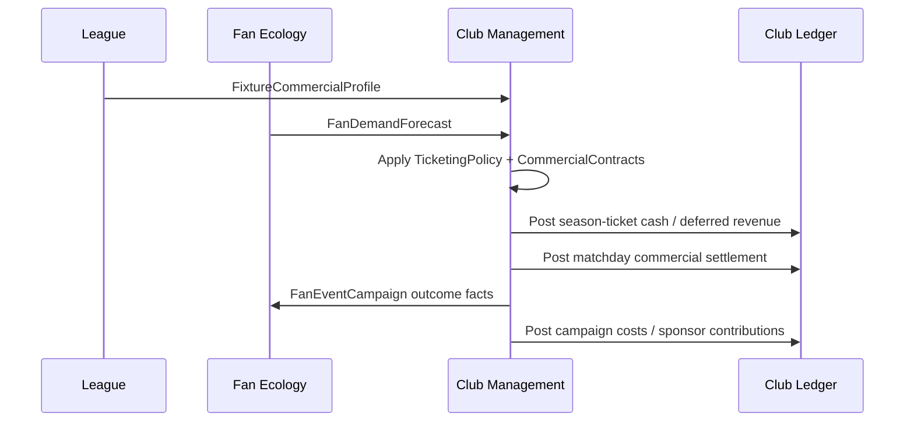

# Club Economy Commercial Contracts - Draft Contracts

## Purpose

Define the contract surface implied by FMX-41 before code exists. This note
extends [[club-economy-accounting-ledger]] with ticketing, fan-demand
elasticity, commercial contracts, cup settlement, fan-event campaigns and
Investor entitlement inputs.

This is draft planning only. It becomes implementation authority only after the
relevant GDDR/ADR path is approved.

## Ownership rule

Club Management owns:

- ticketing policies and season-ticket campaigns;
- commercial contract portfolio for sponsorship, catering, merchandise and
  venue activations;
- fan-event campaign choices and budgets;
- commercial forecasts and settlement;
- ledger posting for all commercial outcomes;
- Investor entitlement cash grant posting in singleplayer.

Other domains provide facts through contracts. They do not write commercial
state or ledger entries directly.

## Contract sketches

### `FanDemandForecast`

Owned by Fan Ecology, consumed by Club Management.

| Field | Meaning |
|---|---|
| `clubId` | Club receiving demand. |
| `fixtureId` | Optional fixture scope; absent for season forecast. |
| `forecastHorizon` | Match, week, campaign or season. |
| `segmentDemand` | Per-segment latent demand, actual forecast and confidence band. |
| `attendanceFloorBySegment` | Minimum expected attendance share before severe trust/identity shocks. |
| `priceSensitivityBySegment` | Low/medium/high/very-high response shape by segment. |
| `referencePriceBySeatClass` | Country/club/seat-class baseline for fairness comparisons. |
| `ticketingTrustState` | Supporter trust in pricing policy and recent price-change memory. |
| `fixtureAttractiveness` | Opponent, rivalry, stakes, form, stars, novelty, kickoff and weather profile. |
| `capacityPressure` | Underfilled, balanced, constrained or sold-out latent-demand state. |
| `seasonTicketRenewalProbability` | Renewal probability by segment and seat class. |
| `cateringPropensity` | Per-segment spend propensity band. |
| `merchandisePropensity` | Per-segment spend propensity band. |
| `hospitalityDemand` | Corporate/premium demand band. |
| `sponsorCategoryFit` | Fit/risk by sponsor category. |
| `boycottRisk` | Segment-driven demand shock risk. |
| `provenance` | Source facts and freshness. |

Calculation contract:

- price response is applied to latent demand before stadium capacity is
  allocated;
- if latent demand exceeds capacity, price changes may affect segment mix,
  revenue and trust even when attendance stays full;
- season-ticket demand and single-ticket demand are separate curves;
- ticketing trust primarily affects future renewal, boycott risk, atmosphere
  and sponsor fit rather than only the current fixture;
- country profile, club DNA and fan-segment mix provide ranges, never final
  balance constants.

### `FixtureCommercialProfile`

Produced from League/Competition fixture state plus Rivalry and Match context.

| Field | Meaning |
|---|---|
| `fixtureId` | Fixture identity. |
| `fixtureKind` | League, cup, playoff, friendly, continental, final. |
| `homeClubId` / `awayClubId` | Participating clubs. |
| `importanceTier` | Routine, high, top, season-decider. |
| `fixtureStakes` | Routine, promotion, relegation, title, qualification, elimination or final. |
| `rivalryTier` | None, mild, strong, high, volatile. |
| `opponentDrawPower` | Generated reputation/star pull band. |
| `starPullBand` | Notable player/manager attraction without using real-world names. |
| `noveltyBand` | First promotion season, rare opponent, new-stadium effect or farewell/icon event. |
| `homeFormBand` | Recent form and long-term performance trend. |
| `kickoffConvenience` | Weekend afternoon, evening, late, midweek or holiday. |
| `awayDemandBand` | Away-following pressure. |
| `riskBand` | Security and sanction risk. |
| `weatherBand` | Forecast/weather effect band. |
| `campaignTriggers` | Goal, derby, cup-final or star-player campaign flags. |

### `StadiumCommercialSnapshot`

Owned by Stadium/Campus inside Club Management or the stadium subsystem, read
by commercial settlement.

| Field | Meaning |
|---|---|
| `stadiumId` | Venue identity. |
| `capacityBySeatClass` | Standing, seated, family, premium, suites, away. |
| `availableCapacityBySeatClass` | After construction, sanctions and allocations. |
| `cateringThroughput` | Service capacity and queue quality. |
| `merchThroughput` | Shop and fulfilment capacity. |
| `hospitalityQuality` | Premium service band. |
| `fanZoneQuality` | Dwell-time and activation band. |
| `ownershipModel` | Owned, leased, municipal, ground-share. |
| `fixedOperatingCost` | Weekly venue cost range. |
| `eventEligibility` | Concert, conference, community/fan event tags. |

### `TicketingPolicy`

Owned by Club Management.

| Field | Meaning |
|---|---|
| `policyId` | Policy identity. |
| `seasonTicketShareTarget` | Target share by seat class. |
| `seasonTicketDiscountBand` | Discount versus comparable single-ticket basket. |
| `singleTicketPriceBands` | Price ranges by seat class. |
| `topMatchSurchargePolicy` | Off, cautious, market, premium. |
| `dynamicPricingMode` | Disabled, categories-only, bounded-dynamic or experimental. |
| `pricingTransparencyPolicy` | How clearly price changes and categories are communicated. |
| `seasonTicketProtectionRule` | Rules preserving season-ticket value versus single-ticket promotions. |
| `concessionPolicy` | Youth/family/senior/community rules. |
| `awayAllocationPolicy` | Allocation and pricing rules. |
| `fanTrustGuardrail` | Max tolerated price shock by segment. |
| `effectiveFromWeekId` | Deterministic activation. |

### `CommercialContract`

Owned by Club Management.

| Field | Meaning |
|---|---|
| `contractId` | UUIDv7 identity. |
| `contractKind` | sponsorship, catering, merchandise, hospitality, venue-event, supplier. |
| `counterpartyProfileId` | Fictional generated partner profile. |
| `assetIds` | Sold assets: shirt front, beer rights, fan shop, LED board, etc. |
| `term` | Start/end week, renewal window, break options. |
| `cashCadence` | Upfront, monthly, seasonal, matchday, milestone. |
| `recognitionSchedule` | Accounting period for revenue/cost recognition. |
| `fixedGuaranteeMinor` | Guaranteed amount, if any. |
| `revenueShareBps` | Share rate in basis points, if any. |
| `costShareBps` | COGS/staffing split, if any. |
| `royaltyBps` | Merchandise/licence royalty, if any. |
| `exclusivityCategory` | Beer, betting, kit, food, energy, banking, etc. |
| `sideConditions` | Family image, fan activation, minimum attendance, premium capacity. |
| `performanceBonuses` | Promotion, cup, table, reach or attendance triggers. |
| `penalties` | Breach, low reach, incident, early termination. |
| `riskFlags` | Fan mismatch, legal restriction, inventory risk, service-quality risk. |

### `CompetitionRevenueProfile`

Owned by League/Competition data, consumed by Club Management.

| Field | Meaning |
|---|---|
| `competitionId` | Competition identity. |
| `countryProfileId` | Country/profile scope. |
| `fixtureKind` | League, cup, playoff, final. |
| `prizeSchedule` | Round/table/progression prize bands. |
| `gateSharingRule` | Home keeps, split, neutral venue, profile-specific. |
| `mediaPaymentCadence` | Lump, periodic, merit/facility style. |
| `solidarityOrParachuteRule` | Profile-defined support. |
| `travelObligationRule` | Away/neutral travel expectations. |
| `settlementDelay` | Cash timing and receivable risk. |

### `FanEventCampaign`

Owned by Club Management; causal effects applied through Fan Ecology and
settled through the ledger.

| Field | Meaning |
|---|---|
| `campaignId` | Campaign identity. |
| `campaignKind` | away-train, bus-subsidy, flight-subsidy, summer-party, family-day, beer-per-goal, choreo-support, community-ticket-day. |
| `targetSegments` | Fan segments affected. |
| `fixtureId` | Optional linked fixture. |
| `budgetMinor` | Planned club spend. |
| `sponsorContributionMinor` | Sponsor support, if any. |
| `capacity` | Participant/fan limit. |
| `fulfilmentModel` | Club-run, sponsor-run, partner-run. |
| `expectedEffects` | Mood, loyalty, attendance, catering/merch/hospitality bands. |
| `riskFlags` | Weather, security, alcohol policy, low uptake, incident risk. |
| `settlementPolicy` | When costs and sponsor contributions post. |

### `InvestorEntitlementGrant`

Produced by platform/payment boundary, consumed by Club Management.

| Field | Meaning |
|---|---|
| `entitlementId` | Platform entitlement identity. |
| `saveId` | Singleplayer save scope. |
| `userId` | Owning account. |
| `skuId` | Store SKU. |
| `cashGrantMinor` | Exact in-game cash amount. |
| `currencyProfile` | In-game currency profile. |
| `platform` | Web, iOS, Android, desktop, etc. |
| `storeTransactionRef` | Opaque transaction reference. |
| `grantedAt` | Grant timestamp. |
| `disclosureVersion` | Disclosure text/version accepted. |
| `refundOrRevocationPolicy` | Platform/legal handling hook. |

Rules:

- only accepted in singleplayer saves;
- idempotent by `entitlementId`;
- posts one `investor_entitlement_cash_grant` ledger entry;
- does not mutate ownership, board, fan, sponsor, debt or compliance state.

## Settlement flow

## Read models

| Read model | Purpose |
|---|---|
| `CommercialForecastSnapshot` | Quick/Standard finance dashboard and forecast. |
| `TicketingPolicySnapshot` | Ticketing UI and explainability. |
| `SeasonTicketCampaignSnapshot` | Renewal, cash, discount and opportunity-cost view. |
| `CommercialContractPortfolio` | Sponsor/catering/merchandise contract board. |
| `MatchdayCommercialSettlement` | Per-fixture revenue/cost breakdown. |
| `FanEventCampaignBoard` | Fan-service event choices and results. |
| `CupRunRevenueForecast` | Expected cup cash/prize/travel and elimination shock. |
| `InvestorGrantAudit` | Entitlement and ledger provenance for SP cash grants. |

## Test scenarios before implementation

- Season-ticket share changes early cash and top-match upside.
- Loyal fan segments stabilise bad-year attendance.
- Fair-weather segments create high upside and high volatility.
- Rivalry/top-match surcharge changes single-ticket revenue and fan-trust risk.
- High latent demand can keep attendance full while changing segment mix and
  future renewal risk.
- Opaque price jumps reduce ticketing trust and future renewal even if current
  revenue rises.
- Cup progression adds expected fixture/prize/sponsor revenue and cost.
- Own catering has higher upside and cost risk than concession.
- Merch campaign can profit or fail through inventory/fulfilment assumptions.
- Beer-per-goal campaign posts sponsor contribution and alcohol-policy risk.
- Away-train subsidy improves loyalty/away atmosphere and posts real cost.
- Investor grant is idempotent, SP-only and posts clean cash without side effects.

## Related

- [[../60-Research/club-economy-impact-map-and-commercial-contracts-2026-05-28]]
- [[../60-Research/fan-demand-price-elasticity-2026-05-28]]
- [[../50-Game-Design/GD-0022-economy-commercial-impact-and-contracts]]
- [[../10-Architecture/09-Decisions/ADR-0058-club-economy-commercial-impact-boundary]]
- [[club-economy-accounting-ledger]]
