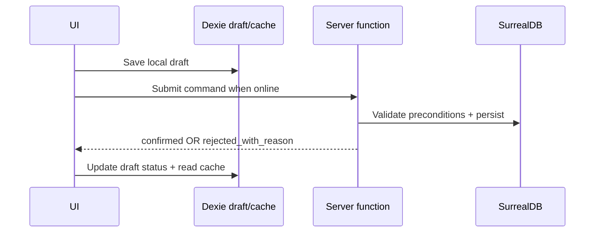

# Hybrid-online PWA Strategy

This note implements [[../10-Architecture/09-Decisions/ADR-0020-hybrid-online-mvp-offline-ready]]
for the MVP. It replaces the old full offline-first MVP implementation stance
in [[pwa-offline-strategy]].

## MVP responsibilities

| Layer | MVP implementation |
|---|---|
| Service worker | Cache app shell, static assets, icons, manifest and safe offline fallback. |
| Read cache | Store last confirmed read models in Dexie with freshness metadata. |
| Drafts | Store tactics/training/lineup/setup drafts in Dexie with explicit status. |
| Commands | Submit online to server functions; final only after confirmation. |
| UX | Label stale data, local drafts and connection-required effects distinctly. |
| Export/import | Not active, but save envelope/version assumptions remain visible. |

## Dexie object stores

MVP stores should be narrow and future-ready:

| Store | Purpose | Required metadata |
|---|---|---|
| `read_model_cache` | last confirmed dashboard/squad/run projections | `key`, `version`, `fetchedAt`, `isStale` |
| `drafts` | local tactic/training/lineup/setup drafts | `draftId`, `kind`, `status`, `createdAt`, `updatedAt`, `lastSubmitError` |
| `onboarding_state` | FTUE, assistance, "comes later" acknowledgement | `saveId` / profile key, timestamps |
| `pwa_state` | install prompt, storage estimate, SW/update flags | `key`, `updatedAt` |
| `export_staging` | reserved for future export/import | versioned placeholder only until feature ships |

Do not store authoritative game progression in Dexie during MVP.

## Command flow

Every command that may later become a queued intent already needs:

- request/idempotency key;
- expected aggregate version or precondition;
- serialisable payload;
- typed rejection reason; and
- safe retry semantics.

## Offline copy rules

Use consistent copy:

- "Draft saved on this device" — local-only.
- "Last updated X ago" — cached confirmed read model.
- "Reconnect to submit" — final action blocked.
- "Situation changed" — server rejection after submit.

Do not say "saved", "synced" or "done" for local-only drafts.

## Phase 2 enablement checklist

Before enabling local-authoritative singleplayer or export/import:

- [ ] Implement the [[../10-Architecture/09-Decisions/ADR-0005-save-format]]
      envelope in a save-format package.
- [ ] Add golden fixtures for saveVersion migrations.
- [ ] Add local repository adapter tests against the same command/query
      contracts used by the server.
- [ ] Define conflict/replay policy per command family.
- [ ] Add export/import UI with "forgot passphrase = lost" copy if portable
      exports use passphrases.
- [ ] Add Playwright offline E2E for app shell, draft survival and later
      local-authoritative flows.
## Related

- [[../00-Index/MVP-Scope]]
- [[../10-Architecture/09-Decisions/ADR-0020-hybrid-online-mvp-offline-ready]]
- [[../60-Research/offline-mvp-scope-and-sync-strategy]]
- [[pwa-offline-strategy]]
