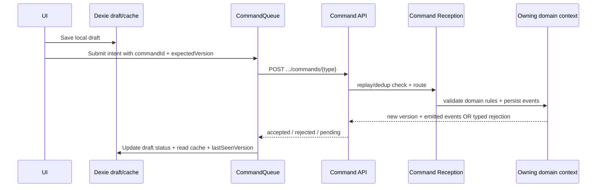

# Hybrid-online PWA Strategy

This note implements [[../10-Architecture/09-Decisions/ADR-0020-hybrid-online-mvp-offline-ready]]
for the MVP. It replaces the old full offline-first MVP implementation stance
in [[pwa-offline-strategy]].

FMX-10 confirms the path as **A -> C**: hybrid-online MVP now, command-shaped
offline manager-week later. Local match simulation is not authoritative in MVP.

[[../10-Architecture/09-Decisions/ADR-0090-offline-sync-scope-and-conflict-strategy]]
adds the mandatory migration seam for that later manager-week: PWA writes go
through `CommandQueue` now, even while the MVP implementation submits
synchronously. [[../10-Architecture/09-Decisions/ADR-0119-command-reception-dedup-seam]]
keeps Offline Sync on the client queue/retry/rebase side and keeps
authoritative replay/dedup in Audit & Security's Command Reception capability.

## MVP responsibilities

| Layer | MVP implementation |
|---|---|
| Service worker | Cache app shell, static assets, icons, manifest and safe offline fallback. |
| Read cache | Store last confirmed read models in Dexie with freshness metadata and `lastSeenVersion`. |
| Drafts | Store tactics/training/lineup/setup drafts in Dexie with explicit status. |
| Commands | Route all game-state writes through `CommandQueue`; MVP submits synchronously and treats final state as confirmed only after server response. |
| UX | Label stale data, local drafts and connection-required effects distinctly. |
| Export/import | Not active, but save envelope/version assumptions remain visible. |

## Dexie object stores

MVP stores should be narrow and future-ready:

| Store | Purpose | Required metadata |
|---|---|---|
| `read_model_cache` | last confirmed dashboard/squad/run projections | `key`, `version`, `lastSeenVersion`, `fetchedAt`, `isStale` |
| `drafts` | local tactic/training/lineup/setup drafts | `draftId`, `kind`, `status`, `createdAt`, `updatedAt`, `lastSubmitError` |
| `onboarding_state` | FTUE, assistance, "comes later" acknowledgement | `saveId` / profile key, timestamps |
| `pwa_state` | install prompt, storage estimate, SW/update flags | `key`, `updatedAt` |
| `export_staging` | reserved for future export/import | versioned placeholder only until feature ships |

Do not store authoritative game progression in Dexie during MVP.

## Command flow

Every command that may later become a queued intent already needs:

- `commandId` as the request/idempotency key;
- `expectedVersion` as the aggregate/save precondition;
- serialisable payload;
- typed rejection reason; and
- safe retry semantics.

## ADR-0090 command-queue seam

All PWA game-state writes route through `CommandQueue`. Direct UI-to-transport
submissions are not allowed, because the durable outbox must be additive later.
The MVP `CommandQueue` implementation sends immediately when online; future
work can persist the same command envelope in IndexedDB with retry/backoff.

Confirmed client projections store `lastSeenVersion`. Command responses return
the accepted new version plus emitted events, or a typed rejection/pending state.
On open, resume or reconnect, the client rehydrates from server events after
`lastSeenVersion` before replaying or revalidating pending intents. Future
snapshot-plus-events optimization is allowed, but server events remain the
authoritative source.

Conflict UX follows ADR-0090:

- rehydrate the client projection from server truth;
- revalidate the pending intent against the updated projection;
- rebase with a fresh `expectedVersion` only if still legal; and
- otherwise show an inspectable typed rejection such as "Situation changed".

CRDTs are reserved for future Watch Party collaborative overlays. Last-write-wins
is allowed only for cosmetic local preferences such as theme or notification
toggles, never for game progression.

The future offline manager-week outbox must use these command contracts rather
than browser Background Sync as the domain source of truth. Background Sync can
be a best-effort wake/retry helper only; foreground app-open, app-resume,
online-transition and explicit retry paths are required for correctness.

Match-resolution commands are server-confirmed in MVP. Any local engine run is
a preview/what-if and must be labelled as non-binding until a future ADR/GDDR
approves selective offline match authority.

## Offline copy rules

Use consistent copy:

- "Draft saved on this device" — local-only.
- "Last updated X ago" — cached confirmed read model.
- "Reconnect to submit" — final action blocked.
- "Situation changed" — server rejection after submit.

Do not say "saved", "synced" or "done" for local-only drafts.

## Phase 2 enablement checklist

Before enabling local-authoritative singleplayer or export/import:

- [ ] Implement the [[../10-Architecture/09-Decisions/ADR-0005-save-format]]
      envelope in a save-format package.
- [ ] Add golden fixtures for saveVersion migrations.
- [ ] Add local repository adapter tests against the same command/query
      contracts used by the server.
- [ ] Define command-family conflict copy and auto-rebase eligibility under the
      ADR-0090 server-authoritative strategy.
- [ ] Define the offline manager-week durable `CommandQueue` store, queue caps,
      retry/backoff, replay order and quota behavior.
- [ ] Decide whether any local-authoritative match flow is allowed; if yes,
      reuse ADR-0049's engine port and replay contracts.
- [ ] Add export/import UI with "forgot passphrase = lost" copy if portable
      exports use passphrases.
- [ ] Add Playwright offline E2E for app shell, draft survival and later
      local-authoritative flows.

## Related

- [[../00-Index/MVP-Scope]]
- [[../10-Architecture/09-Decisions/ADR-0020-hybrid-online-mvp-offline-ready]]
- [[../10-Architecture/09-Decisions/ADR-0090-offline-sync-scope-and-conflict-strategy]]
- [[../10-Architecture/09-Decisions/ADR-0119-command-reception-dedup-seam]]
- [[../60-Research/offline-mvp-scope-and-sync-strategy]]
- [[../60-Research/offline-sync-scope-and-conflict-strategy-2026-06-07]]
- [[../60-Research/adr-0090-command-queue-seam-propagation-2026-06-18]]
- [[pwa-offline-strategy]] — superseded full offline-first implementation note
