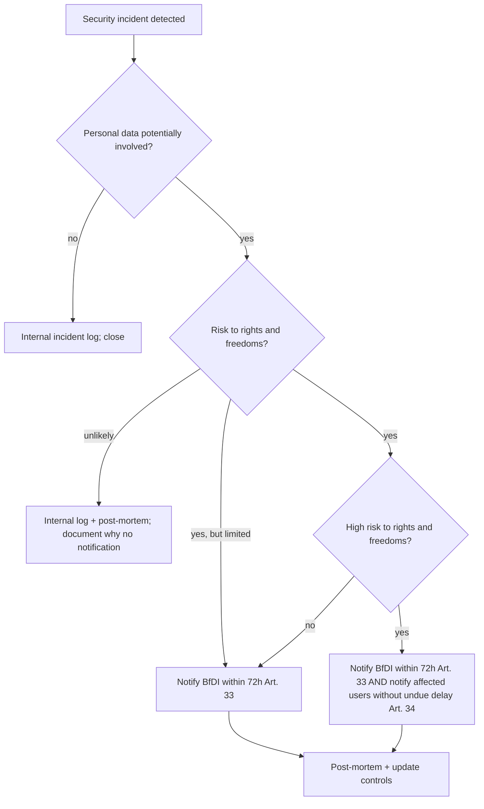

# Privacy and Consent — implementation surface

This note resolves the **implementation side** of Wave 3 gap **F6**
(Privacy & GDPR compliance, **P0**). The companion note
[[../60-Research/gdpr-compliance]] locks the **legal-foundation
decisions** (RoPA, lawful basis, retention, DPIA, DPO,
third-country transfer posture, children's data, processor DPA
checklist).

This note specifies the **runtime surface** that ships in the
PWA: the privacy notice content, the signup consent moment, the
cookie inventory, the Settings → Privacy Center UX, the
user-rights API endpoints (DSAR / rectification / erasure /
portability / restriction / objection), the DSAR ZIP layout,
the 30-day-grace account-deletion flow, the 16+ age gate, the
Art. 33 / 34 breach-notification runbook, and the vendor DPA
checklist.

Together with [[../60-Research/gdpr-compliance]] this PR
**closes F6 P0** and discharges the following downstream
follow-ups:

- **F2 FU-6** — DSAR export including `auth_events`
- **F2 FU-7** — DPIA on `accountSecret` + WebAuthn credential storage
- **F3 FU-8** — DSAR including `device` + `auth.*` events
- **F5 FU-8** — DSAR of envelope metadata + recovery-code metadata
- **F5 FU-9** — DPIA on `K` + `Env_user` + recovery-code storage

## 1. Scope and stance

### 1.1 What F6-impl locks

- The **privacy notice** content structure + cookie inventory
  table (§2).
- The **signup consent moment** copy in DE + EN (§3).
- The **16+ self-declaration age gate** + refusal flow (§3.2).
- The **"no cookie banner"** stance — passive footer link to
  the Privacy Notice is sufficient (§4).
- The **Settings → Privacy Center** UX with the per-right
  controls (§5).
- The **user-rights API endpoints** (Art. 15 / 16 / 17 / 18 /
  20 / 21 / 22) — endpoint paths, request shapes, response
  shapes, authentication requirements, time-bound SLA (§6).
- The **DSAR ZIP file layout** (§7).
- The **30-day-grace account-deletion flow** with cryptographic
  erasure on grace expiry (§8).
- The **Art. 33 / 34 breach-notification runbook** with decision
  tree + DE / EN user-notification copy template (§9).
- The **vendor DPA checklist** + onboarding routine (§10).

### 1.2 What F6-impl defers

- The behavioural-analytics consent layer → **H7 / G3** when
  analytics actually ship.
- The payments-related consent + receipt-retention layer →
  future ADR when payments enter scope.
- The OAuth IdP linking privacy UX → **F2 §3.6** post-MVP
  deferred surface.
- Hosted community-pack / UGC distribution privacy handling →
  future Community Overlay legal gate. MVP supports local file
  import/P2P only; hosted pack discovery, moderation, uploader
  identity retention and UGC DSAR/deletion flows are not unlocked
  by FMX-54.
- The detailed admin-side incident-response runbook beyond the
  breach notification core → [[incident-response]] +
  [[secrets-rotation]] + **F11 secrets-management** (P1).
- Edge WAF / DDoS posture → **F12 Rate limiting** (P1).

### 1.3 Privacy Lead designation

[[../60-Research/gdpr-compliance]] §9 confirms DPO not
required. The **founder is designated as Privacy Lead**
(`privacy-lead@<canonical-domain>`). This address surfaces in
the Privacy Notice + the in-app Privacy Center as the
controller contact for all rights-exercise requests + breach
inquiries.

### 1.4 Fictional game-world personas

FMX-54 clarifies that generated fan groups, fan reps, journalists,
media outlets, sponsors, venues and other social-world actors are
fictional save/world state when they are generated under
[[../10-Architecture/09-Decisions/ADR-0007-naming-schema]] and not
linked to real people or user accounts.

Implementation guardrails:

- Do not store individual supporter records for generated fan
  groups.
- Do not derive fan reps from real fans, social handles, photos,
  community membership lists or private-person imports.
- Do not encode real-world special-category labels for real persons
  or users in fan-persona fields.
- Do not join fan-rep traits, supporter identity labels or
  special-category-like game themes to account analytics.
- Generated fan-persona records live in save/world state and follow
  save/account deletion semantics.

## 2. Privacy Notice (Datenschutzerklärung)

The Privacy Notice lives at `/privacy` (publicly accessible,
no auth required), is also linked from:

- The signup consent checkbox (§3.1).
- The footer of every page.
- The Settings → Privacy & Data screen.
- The transactional-email footer (verification + reset + security
  notices).
- The "About" / "Imprint" page (alongside the German
  Impressum requirement under § 5 TMG).

### 2.1 Required sections (Art. 13 + EDPB transparency guidelines)

The notice is structured in **tiered form** — a short summary
at the top + detailed sections below, all on a single page with
in-page anchors. This matches the CNIL 2024 readability stance
(short summary first; long form available; no separate
"detailed for legal team" version that the consumer never reads).

| Section          | Content (summary)                                                                                                            |
| ---              | ---                                                                                                                          |
| 0. Summary       | Three-paragraph plain-language summary: who we are, what data we collect, what rights you have. ≤ 200 words DE / ≤ 250 EN.  |
| 1. Controller    | Legal entity name, registered address (German UG / GmbH Impressum format), Privacy Lead email.                              |
| 2. Lawful basis + purpose | Per-activity table: registration / auth / saves / multiplayer / security / observability / email. Cross-ref §4 below. |
| 3. Categories of personal data | Per RoPA category A-F; uses plain language not legal jargon.                                                          |
| 4. Recipients    | Self (controller). Processors: Hetzner (DE), transactional email vendor (per §11). Nobody else.                              |
| 5. Third-country transfers | Explicit: **"We do not transfer your personal data to countries outside the EU/EEA."** Plus the GitHub edge-case  |
|                  | disclosure ("no user data flows through our source-code host"). Cross-ref [[../60-Research/gdpr-compliance]] §10.            |
| 6. Retention     | The per-category retention table from [[../60-Research/gdpr-compliance]] §7, simplified for consumers.                       |
| 7. Your rights   | List of Art. 15-22 rights with link to Settings → Privacy & Data + Privacy Lead email contact.                              |
| 8. Right to complain | Right to lodge a complaint with the supervisory authority (BfDI primary; user can also approach their national DPA).    |
| 9. Source of data | "Provided directly by you." Plus: derived data (anomaly signals from your auth activity).                                  |
| 10. Automated decision-making | "We do not make automated decisions with legal or similarly significant effects."                                   |
| 11. Children     | "We do not knowingly offer this service to users under 16 and do not knowingly process children's data."                    |
| 12. Cookies      | The cookie inventory table from §2.2 below.                                                                                 |
| 13. Security     | Brief paragraph on encryption posture (passwords Argon2id, saves AES-GCM, F5 envelope, TLS 1.3 / HSTS, EU residency).        |
| 14. Updates      | "We may update this notice; the changelog is in our public repository at <link>. Material changes are announced in-app."    |
| 15. Effective date | Last updated YYYY-MM-DD                                                                                                    |

The notice MUST be available in **DE + EN**, locale-aware
served from `Accept-Language` with a manual override.

Reading level target: **DE B1-B2 / EN 8th-grade**. WCAG 2.2 AA
on the page (semantic headings, ≥ 4.5:1 contrast, keyboard
navigable, no time-limited dismissals).

### 2.2 Cookie inventory table (in the Privacy Notice)

All cookies are strictly necessary; no consent banner is
required (§4). The inventory satisfies the Art. 13 transparency
obligation.

| Cookie name       | Purpose                                            | Lifetime              | Strictly necessary? | Set by                      |
| ---               | ---                                                | ---                   | ---                 | ---                         |
| `session_id`      | Authenticated session reference (F2 §5.1)          | 30 min sliding / 12 h absolute | yes        | our server                  |
| `refresh_token`   | Rotating refresh token (F2 §5.1)                   | 30 d absolute         | yes                 | our server                  |
| `csrf_token`      | CSRF defence double-submit echo (F2 §5.4)           | ≤ 12 h                | yes                 | our server                  |
| `theme`           | UI preference (light / dark / system)              | ≤ 1 year              | functional          | our server                  |

The cookie inventory ALSO lists IndexedDB-resident persistent
storage, classified as "Local storage" rather than "Cookie":

| Local-storage item       | Purpose                                                  | Lifetime                                       | Strictly necessary? |
| ---                      | ---                                                      | ---                                            | ---                 |
| `account_keystore`       | Wrapped master key for offline save decryption (F5 §4.6) | account life on this device                    | yes                 |
| `device_id`              | Per-device random identifier for bootstrap (F2 §5.3)     | account life on this device                    | yes                 |
| `save_data` (per save)    | Encrypted IndexedDB save rows (ADR-0005)                 | until user deletes the save (+ 30 d grace)     | yes                 |
| `onboarding_state`       | Tutorial progress + assistant intensity (D5)             | account life on this device                    | yes                 |
| Workbox SW caches        | PWA shell + assets for offline (ADR-0002)               | until SW update                                | yes                 |
| BroadcastChannel sentinel `session-sync` | Cross-tab logout sync (F3 §7.1)         | per session                                    | yes                 |

## 3. Signup consent moment + age gate

### 3.1 Consent checkbox (signup form)

Single unchecked-by-default mandatory checkbox at the bottom of
the signup form (after email + display name + locale + tz). No
bundled consent for marketing or analytics — those don't exist
at MVP. Layout:

```
[ ] Ich akzeptiere die [Nutzungsbedingungen] und die [Datenschutzerklärung].
[ ] I accept the [Terms] and the [Privacy Policy].
```

Both link to the respective pages (Terms at `/terms`, Privacy at
`/privacy`; both open in the same tab; back-navigation
preserves the partially-filled form per the EDPB 03/2022 dark-
pattern guidance).

The checkbox is **mandatory**; submit disabled until checked.
No "Accept all" / "Reject all" buttons (we have nothing optional
to consent to at MVP).

### 3.2 16+ age gate

Per [[../60-Research/gdpr-compliance]] §6 and FMX-185 research
[[../60-Research/age-assurance-and-iarc-rating-2026-06-14]], a
**mandatory single radio question** appears at the top of the
signup form before any account field or optional telemetry surface:

```
Bist du 16 Jahre alt oder älter? *
( ) Ja, ich bin 16 oder älter.
( ) Nein, ich bin unter 16.

Are you 16 or older? *
( ) Yes, I am 16 or older.
( ) No, I am under 16.
```

Both radios are unchecked by default. On submit:

- If **Yes** → proceed to the rest of the form.
- If **No** → show a non-modal block:
  - **DE**: "Wir können leider noch keine Konten für Nutzer
    unter 16 erstellen. Du kannst das Spiel ohne Konto im
    Offline-Modus ausprobieren."
  - **EN**: "We can't create accounts for users under 16 yet.
    You can try the game without an account in offline mode."
  - With a button "Im Offline-Modus weitermachen" / "Continue
    in offline mode" that returns the user to the landing page's
    "Try offline" entry.
- The user's "No" response is **not stored anywhere**. We do
  not want a record of someone declaring under-16 because that
  would itself create a children's-data processing record.
- The "No" path does **not** initialise analytics/marketing SDKs,
  does not enqueue optional telemetry and does not create a pending
  account. Strictly necessary security/technical logs remain allowed
  only if minimised and disclosed per [[client-telemetry]].

The signup endpoint persists only `user.attested_age_band =
'16+'` (a boolean-equivalent field, no date of birth) on
successful account creation. The attestation is part of the
contract record per Art. 6(1)(b); no explicit consent layer
needed.

FMX deliberately does **not** collect date of birth at MVP. A
DOB-derived age-band model, parental-consent path or external
age-verification system is a future HITL/legal decision and is
triggered by the re-check list in
[[../40-Compliance/age-assurance-and-rating-evidence]].

### 3.3 Privacy Notice link freshness

If the Privacy Notice changes materially between signup and
the next user session, the in-app banner pattern (per F2 §3.4
Sync/Activity surface) shows: "Wir haben unsere
Datenschutzerklärung aktualisiert. [Anzeigen]" / "We've updated
our Privacy Policy. [Show]". The notice changelog lives in the
public repo + an in-app changelog page.

## 4. Cookie banner — none required at MVP

Per [[../60-Research/gdpr-compliance]] §2.1, all cookies and
all IndexedDB / Service Worker storage fall under "strictly
necessary" for the user-requested service. The ePrivacy
Art. 5(3) consent obligation does **not** apply.

A passive **footer link** to the Privacy Notice + the
in-Settings Privacy Center surfaces the Art. 13 transparency
content. No modal banner, no "Accept all / Reject all" buttons,
no consent layer is required at MVP.

**When this changes**: H7 / G3 introduces optional behavioural
analytics. At that point a granular consent layer **must**
ship before any analytics SDK is loaded:

- Default: rejected.
- Explicit opt-in checkbox in Settings → Privacy → "Help
  improve the app" (unchecked by default; describes what's
  collected; revocable any time).
- Until enabled, no analytics code is loaded, no IDs minted.

That future surface is **out of scope for F6-impl**; this note
locks the MVP "no banner" stance + the future-proof hook.

## 5. Settings → Privacy & Data screen

The Privacy Center is the in-app surface for all rights
exercise. Located at `/settings/privacy` (authenticated route).

### 5.1 Layout

```
Settings
 ├─ Account
 ├─ Security        ─→ password / passkeys / TOTP / recovery codes / devices / "log out everywhere" (F2 + F3 + F5)
 ├─ Privacy & Data  ─→ this screen
 ├─ Assistance      ─→ tutorial verbosity (D5)
 ├─ Theme / UI      ─→ light / dark / system
 └─ About           ─→ version + changelog + Imprint
```

Privacy & Data screen sections:

1. **Privacy Notice** — link out to `/privacy`.
2. **Your data summary** — a non-modal expandable list of the
   per-category data we hold about you (§5.2 below).
3. **Export your data** — Art. 15 / 20 button → `POST /api/me/data-export` (§6.1).
4. **Delete your account** — Art. 17 button → `POST /api/me/delete-account` with the 30-day-grace modal (§8).
5. **Pause account** — Art. 18 button → `POST /api/me/restrict` toggle (§6.4).
6. **Object to security anomaly detection** — Art. 21 button → opens an explainer modal (§6.6).
7. **Make a complaint** — link to BfDI complaint form + your local DPA list.
8. **Privacy Lead contact** — `privacy-lead@<domain>` mailto with auto-filled subject.

All buttons:

- Require fresh interactive auth + step-up MFA per F2 §7.1
  (for any data-mutating action).
- Open a confirmation modal before firing.
- Emit an `auth.gdpr_request_*` outbox event per
  [[audit-trail]] for the audit trail.

### 5.2 "Your data summary" expandable list

Default-collapsed list with one row per RoPA category:

```
▸ Account & profile (email, display name, locale, time zone, …)        ╳ 5 items
▸ Sign-in credentials (passkeys, password hash, TOTP, recovery codes)  ╳ 4 items
▸ Sessions & devices (active sessions, devices, last sign-in events)   ╳ N items
▸ Game saves (1 active, 0 archived)                                     ╳ 1 item
▸ Multiplayer (1 group: "Friends 2026")                                 ╳ 1 group
▸ Security events (last 30 days)                                       ╳ 12 events
▸ Operational telemetry summary (crash reports about your account)      ╳ 0
▸ Transactional email history (last 90 days)                            ╳ 4 emails
```

On expand, each row shows a brief description + the retention
period + a "Show details" link that triggers a per-category
DSAR-equivalent inline view. This satisfies the EDPB 2024-2026
guidance on "transparent data summary in the user's account"
without requiring the user to go through the full DSAR flow.

The "Show details" data is **not** persisted in any other
storage; it's a view-time query against the same data the DSAR
endpoint exports.

## 6. User-rights API endpoints

All endpoints live under `/api/me/*` and are gated by F2 §7.1
step-up MFA per the sensitive-op catalogue.

### 6.1 Art. 15 right of access (DSAR) — `POST /api/me/data-export`

- **Auth**: `last_mfa_at ≤ 15 min` per F2 §7.1.
- **Rate-limit**: 1 request per 24 h per user (per Art. 12(5)
  "manifestly excessive" defence). Subsequent requests within
  24 h return `429 Too Many Requests`.
- **Request body**: `{ scope: 'full' | 'minimal' }` —
  default `full`.
- **Response (synchronous, ≤ 5 s)**:
  - **If data fits in ≤ 20 MB**: `200 OK` with
    `Content-Type: application/zip` streaming. ZIP layout in §7.
  - **If data is larger or generation takes longer**: `202
    Accepted` with `Location: /api/me/data-export/<request_id>`;
    background job builds the ZIP and emails the user a
    download link (single-use, 7-day TTL).
- **Authentication on the download link**: server validates the
  `request_id` is single-use + within TTL + matches the
  original user via their current session. No anonymous
  downloads.
- **Time-bound**: Art. 12(3) ≤ 1 month from request; our SLA is
  ≤ 24 h for the automated path.
- **Logging**: emits `auth.gdpr_request_access` outbox event.

### 6.2 Art. 16 rectification — `PATCH /api/me/profile`

- **Auth**: standard authed session per F2 §7; **step-up MFA
  required only for email change** (per F2 §7.1).
- **Editable fields**:
  - `display_name` (1-64 chars NFKC) — no MFA required.
  - `locale` (BCP-47) — no MFA required.
  - `timezone` (IANA) — no MFA required.
  - `email` — step-up MFA + new-address verification + dual
    confirmation link to BOTH old and new addresses + 24 h
    cool-down before the change takes effect (F2 §7.1).
- **Immutable fields** (user can't rectify):
  - `user_id`, `created_at`.
  - `attested_age_band` — once set to `16+` it cannot be
    reset to `<16` (would force account deletion).
  - Audit / outbox events (history is what it is; Art. 16 only
    grants rectification of inaccurate data, and historical
    events are by definition accurate).
- **Response**: `200 OK` with the updated `user` row shape.
- **Logging**: emits `auth.profile_changed` outbox event per
  [[audit-trail]].

### 6.3 Art. 17 erasure — `POST /api/me/delete-account`

See §8 for the full 30-day-grace flow.

### 6.4 Art. 18 restriction — `POST /api/me/restrict`

- **Auth**: step-up MFA per F2 §7.1.
- **Effect**: server sets `user.restricted_at = now`. The
  request handler refuses all state-mutating endpoints for this
  user while restricted; read-only access continues. Sessions
  stay active.
- **Lift restriction**: same endpoint with `{ unrestrict: true }`
  + step-up MFA.
- **Use cases**: user is disputing the accuracy of their data
  + processing should pause while we investigate. Rarely-used in
  practice for an indie game; provided for completeness.
- **Logging**: emits `auth.account_restricted` /
  `auth.account_unrestricted` outbox events.

### 6.5 Art. 20 portability — covered by `/api/me/data-export`

The same DSAR ZIP (§7) serves both Art. 15 and Art. 20. Format
is machine-readable JSON (Art. 20(1) requires
"structured, commonly used and machine-readable format"). We
do **not** support Art. 20(2) direct controller-to-controller
transfer ("where technically feasible") because no industry
standard exists for football-manager save data. The Privacy
Notice §7 explicitly states this scope decision.

### 6.6 Art. 21 objection — explainer + close-account path

The Settings button "Object to security anomaly detection"
opens an explainer modal:

> **EN**: We use limited security signals (IP-prefix, hashed
> user-agent, country, sign-in patterns) to detect account
> takeover attempts and alert you. This processing relies on
> our legitimate interest in keeping accounts secure
> (GDPR Art. 6(1)(f)).
>
> Disabling this processing would significantly reduce our
> ability to protect your account. If you want to object, you
> can:
>
> 1. Close your account (Art. 17 erasure) — the safest path.
> 2. Contact us at privacy-lead@<domain> to discuss a partial
>    restriction. We will respond within 14 days.

We deliberately do **not** ship a per-signal opt-out toggle at
MVP — the override of the user's objection is documented in
the Privacy Notice + this implementation note + the F6 LIA-1
(legitimate-interest assessment in
[[../60-Research/gdpr-compliance]] §4.2). EDPB position: the
controller may override the objection where it can demonstrate
"compelling legitimate grounds … which override the interests,
rights and freedoms of the data subject" (Art. 21(1)). Account
security is the documented compelling ground.

Email objections are handled manually by the Privacy Lead within
14 days; the response either documents the override or proceeds
to account closure if the user prefers.

### 6.7 Art. 22 automated decision-making — N/A

The Privacy Notice §10 states explicitly: **"We do not make
automated decisions with legal or similarly significant
effects."** Anomaly signals trigger user notification + email,
never an automated lockout (F2 §8.5 + F3 §8.1 — no auto-lockout
disposition at MVP).

If we ever add automated lockout in the future, the Art. 22
controls (human review on request, ability to contest) must
ship in the same release.

### 6.8 Identity verification before fulfilment

Art. 12(6) allows the controller to "request the provision of
additional information necessary to confirm the identity" of
the data subject before fulfilling a rights request.

For our endpoints, the **authenticated session + step-up MFA**
already satisfies this. We do **not** require additional
identity verification (e.g. ID-document upload) at MVP — the
proportionality test from EDPB favours light-touch verification
for low-risk consumer services.

### 6.9 Refusal grounds (Art. 12(5))

The endpoints may refuse a request as "manifestly unfounded or
excessive" with documented reason. Concrete triggers:

- DSAR requests > 1 per 24 h per user → `429 Too Many Requests`
  with `Retry-After: 86400`. Logged.
- Delete-account requested by someone in 30-day-grace state
  who hasn't restored → `409 Conflict {"error":
  "deletion_already_pending"}`.
- Patch profile with values that violate validation (e.g.
  display_name > 64 chars) → `400 Bad Request`.

Genuine refusals (rare) are logged + the user is informed in
writing within 1 month per Art. 12(4).

## 7. DSAR ZIP file layout

The export ZIP contains JSON files (machine-readable per
Art. 20) + a human-readable `README.html` summary. Layout:

```
klubhaus-elf-data-export-<user_id>-<YYYY-MM-DD>.zip
├── README.html                # human-readable summary; opens locally
├── README.md                  # same content, markdown
├── metadata.json              # export request timestamp, scope, signed by server
├── account/
│   ├── profile.json           # email, display_name, locale, timezone, attested_age_band, created_at, email_verified_at
│   └── credentials.json       # passkey credentialIds + AAGUIDs + last_used_at;
│                              # TOTP enrolled_at + last_used_at;
│                              # recovery_code_count + last_regenerated_at;
│                              # NO plaintext secrets
├── sessions/
│   ├── sessions.json          # last 90 days of sessions: id, device_id, last_seen_at, ip_prefix, country, ua_summary, mfa timestamps
│   ├── refresh-token-families.json  # last 30 days of refresh families: id, status, created_at, last_rotated_at
│   └── devices.json           # full `device` rows + nicknames + trust_level + anomaly_flags
├── auth-events/
│   ├── auth_events.json       # `auth.*` outbox events for this user_id from last 12 months
│   │                          # (selected per Art. 15(1)(a)+(g) — see §5)
│   └── anomaly_events.json    # auth.anomaly.* events specifically — security signals
├── game/
│   ├── save_registry.json     # save_id, name, lifecycle state, mode, season number, created_at
│   ├── multiplayer.json       # MP group memberships + my submitted commands
│   └── notes.txt              # "Your encrypted save data lives in the IndexedDB on each of your
│                              #  devices. To export the actual save bytes, use the
│                              #  Settings → Save → Export portable save flow on the relevant device."
├── consent/
│   ├── consent_log.json       # Terms + Privacy acceptance timestamps + version
│   └── privacy-notice-snapshot.html  # the version of the Privacy Notice as displayed when this user signed up
├── observability/
│   └── notes.txt              # "Operational logs about your activity are retained for 14-30 days and are PII-redacted.
│                              #  Crash reports are aggregated and do not contain identifying information.
│                              #  This DSAR exports only what we hold under your account; aggregated metrics
│                              #  are not user-identifiable and are not exportable per Art. 11."
└── transactional-email/
    └── delivery_log.json      # last 90 days of transactional emails sent to you:
                               # timestamp, subject template id, vendor message_id
                               # NO email body content (we don't retain it; vendor retains the delivery log only)
```

The `metadata.json` includes the server's SHA-256 signature of
the ZIP root manifest, so the user can verify the ZIP wasn't
tampered between server and download.

**Encoding**: UTF-8 JSON with 2-space indent. Timestamps ISO-8601
UTC. Sizes per file capped at 10 MB; if any category exceeds,
the file becomes `auth_events-part-1.json` + `auth_events-part-2.json`.

Implementation owner: package `apps/web/src/server/gdpr/dsar.ts`
+ corresponding background-job runner. Schema validation via
Zod per ADR-0004 §generator.

## 8. Account deletion — 30-day-grace flow

### 8.1 Flow

```mermaid
sequenceDiagram
  autonumber
  participant U as User
  participant B as PWA client
  participant S as Server
  participant DB as PostgreSQL
  participant J as Background job
  participant E as Email vendor

  U->>B: Settings → Privacy → Delete account
  B->>U: confirmation modal (DE/EN copy in §8.3)
  U->>B: confirm + provide step-up MFA
  B->>S: POST /api/me/delete-account
  S->>S: verify step-up MFA per F2 §7.1
  S->>DB: BEGIN; UPDATE user SET deleted_at = now, deletion_status = 'pending'; bump token_version; revoke all sessions; family-revoke all refresh families; emit auth.account_deleted outbox event; COMMIT
  S->>E: send "Your account is scheduled for deletion on YYYY-MM-DD" email with "Cancel deletion" link
  S-->>B: 200 OK
  B->>U: confirmation + sign-out
  Note over U,J: 30-day grace begins
  alt User cancels (logs in within 30 d, clicks "Restore account")
    U->>B: Login flow
    B->>S: standard auth
    S->>S: detects deletion_status = 'pending'; offers "Restore account" CTA
    U->>B: click Restore
    B->>S: POST /api/me/restore-account (step-up MFA)
    S->>DB: UPDATE user SET deleted_at = NULL, deletion_status = NULL; emit auth.account_restored outbox event
    S-->>B: 200 OK; new session
  else 30 days elapse
    J->>DB: scheduled task scans for user.deletion_status = 'pending' AND deleted_at + 30d ≤ now
    J->>DB: BEGIN; burn user.env_user + user_credential(recovery_code).payload.env_recovery × 10 + user.accountSecret + user.user_salt + password hash + TOTP secret + passkey credentials + device records; mark user as soft-deleted; pseudonymise outbox audit per gdpr-compliance §7.2 (HMAC user_id, drop ip_prefix/ua_hash/country); for per-save DB: drop entirely; emit auth.account_purged outbox event; COMMIT
    J->>E: send Art. 17 cascade deletion request to transactional email vendor
    J->>DB: log scheduled backup invalidation note (backups will rotate within 30/90 d)
  end
```

### 8.2 Cryptographic erasure guarantee

The deletion is **cryptographically permanent** after grace
expiry because:

1. `Env_user` is burned → the only path from `accountSecret` to
   `K` is gone.
2. All 10 `Env_recovery_i` are burned → no recovery-code path
   either.
3. `accountSecret` itself is burned → KEK can't be re-derived.
4. The IndexedDB ciphertext on user's devices is unaffected,
   but per F3 §9.5 the user's "Sign out everywhere AND rotate
   security key" path or device-clear-storage achieves the
   on-device wipe; we cannot remotely wipe it but we have made
   it cryptographically unrecoverable.
5. Production DB blob retention is ≤ 90 d (Hetzner snapshot
   rotation per F11 backup policy); the encrypted ciphertext
   blocks rotate out within that window.

The Privacy Notice §13 + the deletion confirmation modal both
disclose this.

### 8.3 Confirmation modal copy

**EN**:

> **Delete your account?**
>
> This will:
>
> - Sign you out everywhere immediately.
> - Schedule full deletion in 30 days.
> - Permanently destroy the keys that decrypt your saves
>   (cryptographic erasure).
> - Cascade a deletion request to our transactional email
>   vendor.
>
> If you change your mind within 30 days, sign in again and
> click "Restore account".
>
> After 30 days, your data cannot be restored — we don't keep
> the keys to decrypt it.
>
> Historical backups will be unrecoverable within 30-90 days as
> they rotate out.
>
> [Cancel] [Delete my account]

**DE**:

> **Konto löschen?**
>
> Dies wird:
>
> - Dich sofort auf allen Geräten abmelden.
> - Die vollständige Löschung in 30 Tagen einplanen.
> - Die Schlüssel zur Entschlüsselung deiner Spielstände
>   dauerhaft zerstören (kryptographische Löschung).
> - Eine Löschanfrage an unseren E-Mail-Anbieter weiterleiten.
>
> Wenn du es dir innerhalb von 30 Tagen anders überlegst, melde
> dich erneut an und klicke auf "Konto wiederherstellen".
>
> Nach 30 Tagen können deine Daten nicht mehr wiederhergestellt
> werden — wir behalten die Schlüssel nicht, um sie zu
> entschlüsseln.
>
> Historische Backups sind innerhalb von 30 bis 90 Tagen
> nicht mehr wiederherstellbar, sobald sie rotiert werden.
>
> [Abbrechen] [Konto löschen]

### 8.4 Outbox events emitted

| When                                  | Event                          | Aggregate                                                    |
| ---                                   | ---                            | ---                                                          |
| User initiates deletion               | `auth.account_deleted`         | `user_id` (still natural-person at this point)              |
| User restores within grace            | `auth.account_restored`        | `user_id`                                                    |
| Grace expires → purge runs            | `auth.account_purged`          | `user_id` (LAST event with natural-person identifier)        |
| Pseudonymisation pass on audit archive| `audit.user_pseudonymised`     | `pseudo:<hmac>` — the final event referencing the user      |

The two terminal events satisfy Art. 5(2) accountability +
[[../60-Research/gdpr-compliance]] §7.2.

## 9. Breach notification (Art. 33 + 34) runbook

### 9.1 Decision tree



### 9.2 Trigger examples (per [[../60-Research/gdpr-compliance]] §11)

| Scenario                                                          | Treatment                                                    |
| ---                                                               | ---                                                          |
| DB credentials leaked in a repo push                              | Personal data breach (confidentiality). Notify BfDI within 72h; assess Art. 34 (likely yes for thousands of accounts) |
| Stolen encrypted backup with keys NOT compromised                 | Likely no notification (strong encryption preserves confidentiality); document rationale |
| Stolen encrypted backup with keys POSSIBLY compromised            | Notify BfDI; Art. 34 likely yes                              |
| Single-account refresh-token reuse detected                       | Security incident, not a personal-data breach for us as controller (it's the user's credential at risk). Notify the user (already in F2 §8.5). Document. |
| Mass refresh-token reuse / family revocation across many accounts | Likely personal-data breach. Notify BfDI; Art. 34 likely yes |
| GlitchTip crash report containing PII (redaction bug)             | Personal data breach if confirmed. Notify BfDI; assess Art. 34 by severity / volume |
| Server compromise (root access)                                   | Personal data breach (confidentiality + integrity). Notify BfDI within 72h; Art. 34 yes |

### 9.3 72h clock — operational

- **Trigger**: clock starts when Privacy Lead (founder) becomes
  reasonably aware that a personal-data breach has occurred.
- **First notification can be partial**: per WP250 §71-72,
  submitting an initial Art. 33 notification with the
  available facts and updating later is explicitly allowed.
- **Where to file (BfDI online form)**: bookmarked in
  [[incident-response]] + the Privacy Lead's internal note.
- **Contents** (Art. 33(3)): nature of the breach, categories
  of data subjects + records affected (approx.), Privacy Lead
  contact, likely consequences, measures taken / proposed.

### 9.4 User notification template (Art. 34)

If we decide Art. 34 applies, send the affected users an
out-of-band email (DE / EN per their stored locale) with the
following template:

**EN subject**: "Important security notice about your account"

**EN body**:

> Hi {display_name},
>
> We're writing to inform you of a security incident that may
> affect your account.
>
> **What happened**: {one-paragraph plain-language description}
>
> **What data was potentially exposed**: {specific list}
>
> **What we've done**: {specific list — e.g. revoked all
> sessions, rotated keys, …}
>
> **What you should do**:
>
> 1. Change your password right now: {link}
> 2. Review your active devices and sign out from any you don't
>    recognise: {link}
> 3. If you reused this password elsewhere, change those too.
>
> We have notified the Bundesbeauftragte für den Datenschutz und
> die Informationsfreiheit (BfDI), Germany's data protection
> authority, as required by GDPR Art. 33.
>
> If you have questions, please reply to this email or contact
> our Privacy Lead at privacy-lead@<domain>.
>
> — The Klubhaus Elf team

**DE subject**: "Wichtiger Sicherheitshinweis zu deinem Konto"

**DE body**: parallel content, plain register (no jargon, no
dark-pattern framing), same five action steps.

### 9.5 Incident-response link

The detailed step-by-step runbook (containment, triage, key
rotation, communication, post-mortem, lessons learned) lives
in [[incident-response]] + the F11 secrets-management runbook.
This F6 note locks the **GDPR-side decision tree + user
template**; [[incident-response]] owns the operational drill.

## 10. Vendor DPA checklist (Art. 28)

When onboarding a new processor that touches personal data:

| #  | Check                                                            | Required field on vendor DPA    |
| -- | ---                                                              | ---                             |
| 1  | DPA is publicly available or pre-signed                          | yes                             |
| 2  | Subject matter + duration of processing specified                | Art. 28(3) header               |
| 3  | Nature + purpose specified                                       | Art. 28(3) header               |
| 4  | Type of personal data specified                                  | Art. 28(3) header               |
| 5  | Categories of data subjects specified                            | Art. 28(3) header               |
| 6  | Processor processes only on documented instructions              | Art. 28(3)(a)                   |
| 7  | Confidentiality commitment for personnel                         | Art. 28(3)(b)                   |
| 8  | Technical + organisational measures Art. 32                      | Art. 28(3)(c)                   |
| 9  | Prior authorisation for sub-processors                           | Art. 28(3)(d) — get list        |
| 10 | List of sub-processors disclosed                                 | yes; verify all are EU         |
| 11 | Assistance with data-subject rights                              | Art. 28(3)(e)                   |
| 12 | Assistance with security, breach notification, DPIA              | Art. 28(3)(f)                   |
| 13 | Deletion or return of data at end of provision                   | Art. 28(3)(g)                   |
| 14 | Audit + inspection rights                                        | Art. 28(3)(h)                   |
| 15 | No transfers outside EU/EEA (or SCCs + TIA if any)               | yes — confirm                  |
| 16 | Vendor's own breach-notification SLA                              | should be ≤ 24-48 h            |
| 17 | Liability + indemnification clauses                              | review                          |

### 10.1 Required DPAs on file pre-launch

- **Hetzner Online GmbH** — Auftragsverarbeitungsvertrag (AVV)
  via Hetzner's standard terms; signed at account signup.
- **Transactional email vendor** (Brevo / Mailjet / IONOS per
  [[../60-Research/gdpr-compliance]] §11.4) — sign their
  published Art. 28 DPA; verify the EU-subprocessor list.

ADR-0043 narrows the initial notification vendor stance:

- **Brevo** is the default transactional email processor.
- **Mailjet** is the prepared fallback.
- **IONOS** remains an emergency/basic SMTP fallback, not the preferred
  transactional implementation.
- **Novu/Knock/Courier** are not processors at MVP because they are not start
  dependencies. If a later spike adopts one, this note, the RoPA and the
  Privacy Notice must be updated before any personal data is sent.
- **Web Push** subscriptions are personal data. Push payloads must carry only
  an opaque `notification_id`; details are fetched from the app after open.
- **Discord/webhook user integrations** are post-MVP and opt-in only. Internal
  ops Discord webhooks are operational alerting, not user notification
  delivery.

### 10.2 Not required

| Vendor       | Why                                                       |
| ---          | ---                                                       |
| Dokploy      | Self-hosted on our VM, not a third-party processor       |
| GitHub       | No user personal data flows (§10.3 gdpr-compliance)       |
| Sentry       | Not used; we self-host GlitchTip                         |
| Cloudflare   | Explicitly rejected per F2 §3.6                          |

### 10.3 Onboarding routine

When considering a new vendor:

1. **Triage**: does it touch personal data? If no, no DPA
   needed; document the reason.
2. **EU residency check**: if yes, verify EU-only data path
   + EU subprocessor list before any onboarding work.
3. **DPA review**: use the §10 checklist + score the vendor.
4. **Founder sign-off**: Privacy Lead signs.
5. **Add to RoPA**: append to
   [[../60-Research/gdpr-compliance]] §3 RoPA table.
6. **Add to Privacy Notice**: update §4 Recipients.
7. **Annual review reminder**: per §11.

## 11. Maintenance + review cadence

| Cadence       | Activity                                                                         | Owner          |
| ---           | ---                                                                              | ---            |
| Per request   | DSAR fulfilment, rectification, deletion handling                                 | automated; PL fallback |
| Per release   | Privacy Notice update if material change                                         | Privacy Lead   |
| Quarterly     | RoPA review (verify processors, retention, categories still match production)    | Privacy Lead   |
| Quarterly     | EDPB + national DPA guidance scan for material updates                           | Privacy Lead   |
| Annually      | DPIA review ([[../60-Research/gdpr-compliance]] §8)                              | Privacy Lead   |
| Annually      | Breach-notification drill (incident-response runbook)                            | Privacy Lead + tech |
| Per incident  | Breach assessment + Art. 33/34 decision + post-mortem                            | Privacy Lead   |
| Per new vendor| Art. 28 DPA review + RoPA update                                                  | Privacy Lead   |

Changelog of material updates to this note (and to
[[../60-Research/gdpr-compliance]]) lives in the public
repository at the file's git history. Material changes are
also announced in-app via the §3.3 banner pattern.

## 12. Open decisions for Nico (Q&A)

Per the workflow rule, F6-impl surfaces only the minimal set of
remaining product-owner decisions. Per the user instruction
"use defaults and clear best practices", all sensible defaults
are folded into the spec; the open items below are the genuine
one-way-door product-side decisions.

### Q1. Privacy Lead email address

Default: **`privacy-lead@<canonical-domain>`** (catchall
forwarded to founder's primary inbox during MVP). Alternative:
`privacy@`, `datenschutz@`, `gdpr@`. Default suggests
`privacy-lead@` because it doesn't leak language preference +
matches the internal role naming used in
[[../60-Research/gdpr-compliance]] §9.

Default: **`privacy-lead@<canonical-domain>`**.

### Q2. Canonical domain

The F1-F5 + F6 docs reference `<canonical-domain>` throughout
as a placeholder. The 2026-06-09 rebrand settled the production
canonical domain as **`klubhaus-elf.de`**. Decision
unblocks: Privacy Notice publication, Imprint address, Brevo
sender-domain DKIM/SPF, Hetzner DNS config.

Default: **`klubhaus-elf.de`** (set by the 2026-06-09 rebrand).

### Q3. Imprint address (Impressum)

§ 5 TMG requires the controller's registered legal entity
address on the Imprint page. For an indie 1-founder UG / GmbH
this is the registered business address. Defer until LLC
formation (F6 FU-6).

Default: **placeholder** — flagged for resolution at LLC
formation.

### Q4. Children's age gate language

Confirm the §3.2 16+ self-declaration radio question + refusal
flow. This is the EDPB-acceptable indie-default; alternative
would be a heavy parental-consent flow that we are not
shipping.

Default: **confirmed**.

### Q5. DSAR ZIP file scope

§7 layout — 12-month auth-events window, 90-day session
window, 90-day transactional-email window. These are the
defaults; ALL retained data could be exported instead but the
ZIP would balloon. The 90-day / 12-month windows match what
similarly-scoped EU consumer SaaS export by default in 2026.

Default: **confirmed**.

### Q6. Backup non-scrubbing disclosure

Confirm §8.2 + Privacy Notice §6 retention paragraph: "We do
not retroactively scrub backups on Art. 17 erasure; backups
rotate within 30-90 days." This is industry standard and
EDPB-acceptable provided we disclose it.

Default: **confirmed**.

## 13. F6-impl follow-up tasks (deferred, not blocking)

| #     | Task                                                                | Owner    |
| ---   | ---                                                                 | ---      |
| FU-1  | Build `POST /api/me/data-export` endpoint + ZIP layout in `apps/web/src/server/gdpr/dsar.ts` | E10 + E11 |
| FU-2  | Build `POST /api/me/delete-account` + 30-day-grace background job   | E10 + E11 |
| FU-3  | Build `PATCH /api/me/profile` + email change confirmation flow      | E10 + E11 |
| FU-4  | Build Settings → Privacy & Data screen + per-category expandable view | F2 + design-system primitives |
| FU-5  | Write the Privacy Notice content (DE + EN) using §2.1 structure     | Privacy Lead |
| FU-6  | Write the Terms of Service draft (links from Privacy Notice)         | F8 (P2)  |
| FU-7  | Wire BfDI breach-notification link into incident-response runbook    | [[incident-response]] |
| FU-8  | Implement audit-archive pseudonymisation pass on Art. 17 grace expiry | E10 (Identity & Access context) |
| FU-9  | Implement per-locale Privacy Notice rendering + Accept-Language fallback | F2 + i18n |
| FU-10 | Annual DPIA + RoPA review automation reminder                       | F11 / calendar |

## 14. Sources

### Standards + regulation

- GDPR (Regulation (EU) 2016/679) — Art. 12-22 (rights), Art. 28
  (processors), Art. 30 (RoPA), Art. 33-34 (breach
  notification), Art. 35 (DPIA), Art. 37 (DPO), Art. 82 (liability).
- ePrivacy Directive 2002/58/EC + Cookie Directive 2009/136/EC —
  Art. 5(3) terminal-equipment storage.
- BDSG § 12 (children's threshold 16), § 38 (DPO threshold 20).
- TMG § 5 (Impressum requirement, DE).
- § 257 HGB (10-year retention for commercial records, future
  payments only).

### EDPB + national-DPA guidance

- EDPB Guidelines 03/2022 on Deceptive Design Patterns.
- EDPB Guidelines 2/2019 on Article 6(1)(b) contract necessity.
- EDPB Guidelines 3/2019 on processing for security purposes.
- EDPB Guidelines 05/2020 on consent.
- WP248 rev. 01 (DPIA) endorsed by EDPB.
- WP250 rev. 01 (breach notification) endorsed by EDPB.
- EDPB Opinion 5/2014 on anonymisation techniques (+ 2020-2024 updates).
- BfDI Muss-Liste (mandatory DPIA list, DE).
- BfDI online breach-notification form
  ([Meldung von Datenschutzverletzungen](https://www.bfdi.bund.de/EN/Buerger/Inhalte/AlltagsThemen/Datenpannen.html))
- CNIL RoPA + Privacy Notice templates.

### Project-internal anchors

- [[../60-Research/gdpr-compliance]] — full RoPA + lawful basis
  + retention + DPIA + DPO determination.
- [[../60-Research/telemetry-privacy]] (D11) — observability +
  consent input.
- [[../60-Research/threat-model]] (F1) §3 trust boundaries;
  §4.4 information disclosure.
- [[auth-flows]] (F2) §3 signup; §7 step-up sensitive-op
  catalogue; §10 libraries.
- [[session-management]] (F3) §8 revocation matrix; §9.2
  device schema.
- [[account-recovery]] (F5) §2 master-key envelope; §11.5
  GDPR cross-references.
- [[audit-trail]] outbox is the audit trail; `auth.*` +
  `auth.gdpr_request_*` event catalogue.
- [[incident-response]] operational runbook for security
  incidents.
- [[../10-Architecture/09-Decisions/ADR-0013-transactional-outbox]]
  tiered retention.
- [[../10-Architecture/09-Decisions/ADR-0017-observability-logging]]
  retention per observability tier.
