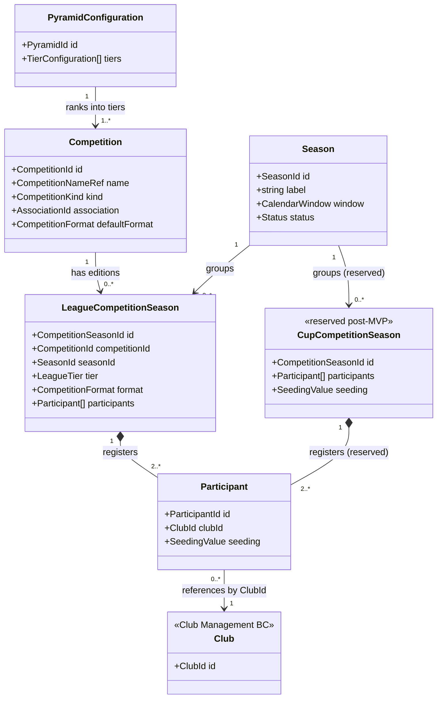

# GD-0009: League & Competition Structure

## Status

approved

> **Approved** — the **Decided / strong** section is ratified design
> direction; an ADR or implementation must not contradict it. The
> **Open (Wave 2)** items are NOT approved and not implementable until
> Wave 2 research closes.

## Date

2026-05-17

## Player experience goal

Familiar football pyramid (promotion, relegation, cups, continental nights)
with entirely fictional branding.

## Decided / strong

- **Real-world league *structures* are mirrored; real names are not** — pyramid
  topology, round-robin schedules, knock-out brackets, continental slots,
  Aug–May calendar are uncopyrightable formats (ip-and-licensing §3; ADR-0007
  accepted).
- Competition names are fictional patterns; **default sandbox = `Aurelia
  Premier`** in a fictional country (ip-and-licensing §5.3/5.4; ADR-0010).
- Hybrid: **real country names + ISO codes** for nationality; **fictional
  country names for league branding** (ip-and-licensing §8/§9).
- Promotion/relegation pyramid + **multiple parallel cups**
  (club-boss-analysis "League structure"; competitor-matrix).
- Offline-friendly cups incl. midweek rotation pressure are **post-MVP**
  (anstoss-series-deep-dive §7 post-MVP 15).
- Avoid the protected combination: a real league's exact roster + exact
  promotion history (ip-and-licensing §3).

## Open (Wave 2)

- **R2-06 (high)** — continental/federation cup design without UEFA IP.
- **R2-13 (medium)** — women's calendar offset; model must not preclude it.
- **R2-14 (critical)** — `league`/`competition`/`fixture` schema patterns.
  *SurrealDB **storage** patterns resolved (historical
  [[../60-Research/surrealdb-schema-patterns]], now superseded by
  [[../10-Architecture/09-Decisions/ADR-0027-postgres-data-model]]). The
  **domain** competition/season registry schema is **accepted** (ratified Nico
  2026-06-02) in
  [[../10-Architecture/09-Decisions/ADR-0066-competition-registry-sub-aggregate]]
  (FMX-79) — see the appendix below; D1–D4 resolved on the recommended options.
  R2-06/R2-13 remain open and are reserved seams there, not designed.*

## Rationale

Formats are facts (safe + familiar); names are the IP risk, so they are
generated (ip-and-licensing §3; GD-0015).

## Consequences

Positive:

- Familiar competitive structure with zero licensing exposure.

Negative / constraints:

- Schema patterns (R2-14) and continental design (R2-06) still open.

## Supersedes

None

## Feeds ADRs

- [[../10-Architecture/09-Decisions/ADR-0007-naming-schema]] (fictional competition names)
- [[../10-Architecture/09-Decisions/ADR-0004-data-model]] (league/competition/fixture schema)
- [[../10-Architecture/09-Decisions/ADR-0066-competition-registry-sub-aggregate]] (accepted — Competition & Season registry domain schema, R2-14 / gap G1)

## Appendix A — Competition & Season registry (architecture, FMX-79)

> **Status: accepted** (ratified Nico 2026-06-02; not part of the original binding
> *Decided / strong* block but now binding via ADR-0066).
> Canonical aggregate diagram for the Competition & Season registry sub-aggregate
> cluster inside **League Orchestration**. The typed domain model and invariant
> catalogue (I1–I9) are owned by
> [[../10-Architecture/09-Decisions/ADR-0066-competition-registry-sub-aggregate]];
> this appendix owns the diagram. Drawn under the ratified options (D1 = inside
> League Orchestration; D2 = shared `CompetitionSeason` concept + distinct roots).
> Cup + continental are reserved post-MVP seams (R2-06); women's calendar offset
> (R2-13) is per-`Season` data, not a schema change.

The arrow from `Participant` to `Club` is a **cross-context reference by
`ClubId`** (Club Management owns the Club aggregate); the registry never owns or
mutates clubs, which is what lets one club appear in a league edition + N cup
editions in the same season without ownership conflict (invariant I3).

## Related

- Research: [[../60-Research/ip-and-licensing]] · [[../60-Research/club-boss-analysis]]
- [[README]] — hub · siblings: [[GD-0015-ip-clean-data]] · [[GD-0010-ai-world]] · [[GD-0011-career-progression]]
